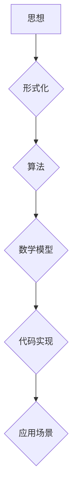

## 思想生而自由，却又无处不在形式化之中

> 关键词：人工智能、形式化、算法、数学模型、代码实现、应用场景、未来趋势

### 1. 背景介绍

在信息爆炸的时代，人工智能（AI）正以惊人的速度发展，其应用领域不断拓展，深刻地改变着我们的生活。从自动驾驶汽车到智能语音助手，从医疗诊断到金融预测，AI无处不在。然而，在AI的蓬勃发展背后，隐藏着深刻的哲学问题：思想是自由的吗？它是否可以被形式化、量化、编码？

人类的思想是复杂的、抽象的、充满创造力的。它不受物理世界的限制，可以自由地驰骋于想象的空间。然而，当我们试图将思想转化为计算机程序时，就面临着巨大的挑战。计算机程序本质上是形式化的指令集，它只能处理确定的数据和执行预先定义的逻辑操作。如何将人类的思维方式，即其非结构化、模糊、充满主观性的特点，转化为计算机能够理解的形式化语言，是AI领域面临的重大难题。

### 2. 核心概念与联系

**2.1 形式化与思想的本质**

形式化是指将抽象概念用精确的符号和规则表达出来，使其成为计算机能够理解的形式。形式化思维是科学和数学发展的基石，它使得我们能够对复杂问题进行系统化、逻辑化的分析和解决。

然而，人类的思想并非完全形式化。我们的思维方式往往是启发式的、经验主义的，充满了情感、直觉和创造力。这些非形式化的因素是人类思想的丰富性和灵活性所在，也是AI难以完全模拟的关键所在。

**2.2 算法与思想的实现**

算法是解决特定问题的步骤序列，它可以被看作是思想的具体化实现。通过设计和实现算法，我们可以将人类的思维过程转化为计算机能够执行的指令。

然而，并非所有思想都可以被直接转化为算法。一些高度抽象、创造性的思想，例如艺术、音乐、文学等，难以用形式化的规则和步骤来描述。

**2.3 数学模型与思想的抽象**

数学模型是用来描述和分析现实世界现象的抽象工具。通过建立数学模型，我们可以将复杂的问题简化，并用数学语言进行分析和推导。

数学模型可以帮助我们理解思想的本质，并将其抽象化。例如，我们可以用数学模型来描述逻辑推理、决策过程、学习机制等思想活动。

**Mermaid 流程图**



### 3. 核心算法原理 & 具体操作步骤

**3.1 算法原理概述**

深度学习算法是目前人工智能领域最成功的算法之一，它能够学习复杂的模式和关系，并进行精准的预测和分类。深度学习算法的核心是多层神经网络，它模仿了人类大脑的结构和功能。

**3.2 算法步骤详解**

1. **数据预处理:** 将原始数据进行清洗、转换和特征提取，使其适合深度学习算法的训练。
2. **网络结构设计:** 根据具体任务选择合适的网络结构，例如卷积神经网络（CNN）、循环神经网络（RNN）等。
3. **参数初始化:** 为网络中的参数赋予初始值。
4. **前向传播:** 将输入数据通过网络层层传递，最终得到输出结果。
5. **损失函数计算:** 计算模型输出与真实值的差异，即损失值。
6. **反向传播:** 根据损失值，调整网络参数，使其能够更好地拟合数据。
7. **优化算法:** 使用优化算法，例如梯度下降法，更新网络参数。
8. **模型评估:** 使用测试数据评估模型的性能，并进行调整和优化。

**3.3 算法优缺点**

**优点:**

* 能够学习复杂的模式和关系。
* 性能优异，在图像识别、自然语言处理等领域取得了突破性进展。
* 可泛化性强，能够应用于不同的任务和领域。

**缺点:**

* 训练数据量大，需要大量的计算资源和时间。
* 模型解释性差，难以理解模型的决策过程。
* 对数据噪声敏感，容易过拟合。

**3.4 算法应用领域**

深度学习算法广泛应用于以下领域：

* **计算机视觉:** 图像识别、物体检测、图像分割、人脸识别等。
* **自然语言处理:** 文本分类、情感分析、机器翻译、对话系统等。
* **语音识别:** 语音转文本、语音合成等。
* **推荐系统:** 商品推荐、内容推荐等。
* **医疗诊断:** 病情预测、疾病诊断等。

### 4. 数学模型和公式 & 详细讲解 & 举例说明

**4.1 数学模型构建**

深度学习算法的核心是多层神经网络，它可以看作是一个复杂的数学模型。神经网络由多个节点（神经元）组成，这些节点通过连接和权重相互连接。每个节点接收来自其他节点的输入信号，并对其进行处理，最终输出一个信号。

**4.2 公式推导过程**

深度学习算法的训练过程本质上是一个优化问题，目标是找到网络参数，使得模型的输出与真实值之间的差异最小。

损失函数用来衡量模型的预测误差，常用的损失函数包括均方误差（MSE）、交叉熵损失（Cross-Entropy Loss）等。

优化算法用来更新网络参数，使其能够最小化损失函数。常用的优化算法包括梯度下降法（Gradient Descent）、动量法（Momentum）、Adam优化器等。

**4.3 案例分析与讲解**

**举例说明：**

假设我们有一个简单的线性回归问题，目标是预测房价。我们可以使用一个单层神经网络来解决这个问题。

网络结构：

* 输入层：一个节点，接收房屋面积作为输入。
* 输出层：一个节点，输出预测的房价。

损失函数：均方误差

优化算法：梯度下降法

训练过程：

1. 初始化网络参数。
2. 将训练数据输入网络，计算输出结果和真实房价之间的误差。
3. 根据误差计算梯度，更新网络参数。
4. 重复步骤2和3，直到模型性能达到预期的水平。

### 5. 项目实践：代码实例和详细解释说明

**5.1 开发环境搭建**

* Python 3.x
* TensorFlow 或 PyTorch 深度学习框架
* Jupyter Notebook 或 VS Code 开发环境

**5.2 源代码详细实现**

```python
import tensorflow as tf

# 定义模型
model = tf.keras.models.Sequential([
  tf.keras.layers.Dense(units=1, input_shape=[1])
])

# 编译模型
model.compile(optimizer='sgd', loss='mean_squared_error')

# 训练模型
model.fit(x_train, y_train, epochs=100)

# 评估模型
loss = model.evaluate(x_test, y_test)
print('Loss:', loss)
```

**5.3 代码解读与分析**

* 使用 TensorFlow 框架定义一个简单的线性回归模型。
* 模型只有一个隐藏层，包含一个神经元。
* 使用随机梯度下降（SGD）优化器和均方误差损失函数进行训练。
* 训练模型100个 epochs。
* 使用测试数据评估模型的性能。

**5.4 运行结果展示**

运行代码后，会输出模型的训练损失和测试损失。

### 6. 实际应用场景

深度学习算法在各个领域都有广泛的应用，例如：

* **医疗诊断:** 利用深度学习算法分析医学图像，辅助医生诊断疾病。
* **金融预测:** 利用深度学习算法分析市场数据，预测股票价格、风险评估等。
* **自动驾驶:** 利用深度学习算法识别道路场景、预测车辆运动轨迹，实现自动驾驶功能。

**6.4 未来应用展望**

随着人工智能技术的不断发展，深度学习算法的应用场景将更加广泛，例如：

* **个性化教育:** 根据学生的学习情况，提供个性化的学习方案。
* **智能客服:** 利用深度学习算法构建智能客服系统，提供更加人性化的服务。
* **科学研究:** 利用深度学习算法加速科学研究，例如药物研发、材料科学等。

### 7. 工具和资源推荐

**7.1 学习资源推荐**

* **书籍:**
    * 深度学习 (Deep Learning) - Ian Goodfellow, Yoshua Bengio, Aaron Courville
    * 深度学习实战 (Hands-On Machine Learning with Scikit-Learn, Keras & TensorFlow) - Aurélien Géron
* **在线课程:**
    * Coursera: 深度学习 Specialization
    * Udacity: 深度学习 Nanodegree
    * fast.ai: 深度学习课程

**7.2 开发工具推荐**

* **TensorFlow:** Google 开发的开源深度学习框架。
* **PyTorch:** Facebook 开发的开源深度学习框架。
* **Keras:** TensorFlow 的高层API，易于使用。

**7.3 相关论文推荐**

* AlexNet: ImageNet Classification with Deep Convolutional Neural Networks
* VGGNet: Very Deep Convolutional Networks for Large-Scale Image Recognition
* ResNet: Deep Residual Learning for Image Recognition

### 8. 总结：未来发展趋势与挑战

**8.1 研究成果总结**

近年来，深度学习算法取得了令人瞩目的成果，在计算机视觉、自然语言处理等领域取得了突破性进展。

**8.2 未来发展趋势**

* **模型更深、更复杂:** 研究更深层次、更复杂的网络结构，提高模型的表达能力和泛化能力。
* **数据更丰富、更多样:** 探索新的数据来源，例如文本、音频、视频等，并开发新的数据增强技术。
* **算法更高效、更鲁棒:** 研究更有效的训练算法和正则化技术，提高模型的训练效率和鲁棒性。
* **解释性更强:** 研究更有效的模型解释技术，提高对模型决策过程的理解。

**8.3 面临的挑战**

* **数据隐私和安全:** 深度学习算法需要大量的训练数据，如何保护数据隐私和安全是一个重要的挑战。
* **算法偏见:** 深度学习算法容易受到训练数据中的偏见影响，如何解决算法偏见是一个重要的研究方向。
* **可解释性:** 深度学习模型的决策过程往往难以理解，如何提高模型的可解释性是一个重要的挑战。

**8.4 研究展望**

未来，深度学习算法将继续发展，并在更多领域发挥重要作用。我们需要不断探索新的算法、新的数据、新的应用场景，并解决算法面临的挑战，推动人工智能技术向更安全、更可靠、更智能的方向发展。

### 9. 附录：常见问题与解答

**常见问题:**

* 深度学习算法需要多少数据才能训练？
* 深度学习算法的训练时间有多长？
* 如何评估深度学习模型的性能？

**解答:**

* 深度学习算法需要大量的训练数据，具体数量取决于任务的复杂度和模型的规模。
* 深度学习算法的训练时间取决于模型的规模、数据量和硬件资源。
* 深度学习模型的性能可以通过准确率、召回率、F1-score等指标进行评估。


作者：禅与计算机程序设计艺术 / Zen and the Art of Computer Programming 
