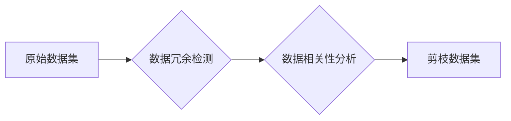

## 数据集剪枝:自动化数据集瘦身的新思路

> 关键词：数据集剪枝、数据瘦身、机器学习、模型效率、数据质量、自动化、算法优化

## 1. 背景介绍

在机器学习领域，数据是至关重要的资源。大型模型通常需要海量数据进行训练才能达到最佳性能。然而，随着数据量的不断增长，数据存储、处理和传输的成本也随之增加。同时，大型数据集也可能包含噪声、冗余和不相关信息，这些信息不仅会增加模型训练的复杂度，还会降低模型的泛化能力。

数据集剪枝技术应运而生，旨在通过自动识别和移除不必要的数据，从而构建更紧凑、高效的训练数据集。这不仅可以降低模型训练的成本，还可以提高模型的性能和泛化能力。

## 2. 核心概念与联系

数据集剪枝的核心概念是**数据冗余**和**数据相关性**。

* **数据冗余**是指数据集中的重复或多余信息，这些信息对模型训练没有实际意义。
* **数据相关性**是指数据集中的数据点之间存在的关联性，一些数据点可能彼此高度相关，其中一部分可以被移除而不会显著影响模型的训练效果。

数据集剪枝的目标是通过识别和移除数据冗余和不相关信息，构建一个更紧凑、更有效的训练数据集。

**Mermaid 流程图**



## 3. 核心算法原理 & 具体操作步骤

### 3.1  算法原理概述

数据集剪枝算法通常基于以下原理：

* **距离度量**: 使用距离度量方法，例如欧氏距离或余弦相似度，来衡量数据点之间的相似性。
* **聚类**: 将数据点按照相似性进行聚类，移除聚类中重复或不相关的样本。
* **特征选择**: 选择与模型训练最相关的特征，移除与模型训练无关或冗余的特征。
* **模型评估**: 使用模型评估指标，例如准确率或AUC，来评估剪枝数据集对模型性能的影响。

### 3.2  算法步骤详解

1. **数据预处理**: 对原始数据集进行清洗、转换和归一化等预处理操作。
2. **数据冗余检测**: 使用距离度量方法，例如欧氏距离或余弦相似度，来检测数据集中的重复或多余信息。
3. **数据相关性分析**: 使用相关性分析方法，例如Pearson相关系数或Spearman相关系数，来分析数据集中的数据点之间存在的关联性。
4. **剪枝策略选择**: 根据具体的应用场景和模型类型，选择合适的剪枝策略，例如移除重复样本、移除低相关性样本或移除不相关的特征。
5. **数据集剪枝**: 根据选择的剪枝策略，从原始数据集移除不必要的数据，构建剪枝数据集。
6. **模型训练**: 使用剪枝数据集训练机器学习模型。
7. **模型评估**: 使用模型评估指标，例如准确率或AUC，来评估剪枝数据集对模型性能的影响。

### 3.3  算法优缺点

**优点**:

* **降低模型训练成本**: 剪枝数据集可以显著减少模型训练所需的数据量，从而降低存储、处理和传输的成本。
* **提高模型性能**: 通过移除噪声、冗余和不相关信息，剪枝数据集可以提高模型的泛化能力和准确率。
* **加速模型训练速度**: 由于数据集规模缩小，模型训练速度也会相应加快。

**缺点**:

* **剪枝策略选择**: 选择合适的剪枝策略对于模型性能至关重要，需要根据具体的应用场景和模型类型进行调整。
* **数据信息损失**: 剪枝过程可能会导致部分数据信息丢失，需要权衡数据信息损失和模型性能提升之间的 trade-off。
* **算法复杂度**: 一些数据集剪枝算法的复杂度较高，需要较强的计算资源。

### 3.4  算法应用领域

数据集剪枝技术在以下领域具有广泛的应用前景：

* **图像识别**: 移除图像中的噪声和冗余信息，提高图像识别模型的准确率。
* **自然语言处理**: 移除文本中的重复和不相关信息，提高文本分类、情感分析等模型的性能。
* **推荐系统**: 移除用户行为数据中的噪声和冗余信息，提高推荐系统的准确性和个性化程度。
* **医疗诊断**: 移除医疗图像数据中的噪声和冗余信息，提高疾病诊断模型的准确率。

## 4. 数学模型和公式 & 详细讲解 & 举例说明

### 4.1  数学模型构建

数据集剪枝算法通常基于以下数学模型：

* **距离度量**: 使用欧氏距离或余弦相似度来衡量数据点之间的相似性。

$$
d(x_i, x_j) = \sqrt{\sum_{k=1}^{n}(x_{ik} - x_{jk})^2}
$$

$$
sim(x_i, x_j) = \frac{x_i \cdot x_j}{||x_i|| ||x_j||}
$$

* **聚类**: 使用k-means算法或DBSCAN算法进行数据聚类。

### 4.2  公式推导过程

k-means算法的目标是将数据点划分为k个簇，使得每个簇内的数据点彼此相似，而不同簇之间的数据点彼此差异较大。

k-means算法的迭代过程如下：

1. **随机初始化k个质心**: 质心代表每个簇的中心点。
2. **计算每个数据点到每个质心的距离**: 使用距离度量方法，例如欧氏距离。
3. **将每个数据点分配到距离最近的质心**: 每个数据点属于与其距离最近的质心所在的簇。
4. **更新每个质心的位置**: 将每个簇内的所有数据点平均值作为新的质心位置。
5. **重复步骤2-4**: 直到质心的位置不再发生变化，或者达到最大迭代次数。

### 4.3  案例分析与讲解

假设我们有一个包含100个数据点的图像数据集，我们希望使用k-means算法进行聚类，将数据点划分为5个簇。

1. 我们随机初始化5个质心。
2. 计算每个数据点到每个质心的距离。
3. 将每个数据点分配到距离最近的质心所在的簇。
4. 更新每个质心的位置，将每个簇内的所有数据点平均值作为新的质心位置。
5. 重复步骤2-4，直到质心的位置不再发生变化。

最终，我们将得到5个簇，每个簇包含一些具有相似特征的图像数据点。

## 5. 项目实践：代码实例和详细解释说明

### 5.1  开发环境搭建

* Python 3.6+
* scikit-learn
* numpy
* pandas

### 5.2  源代码详细实现

```python
import numpy as np
from sklearn.cluster import KMeans
from sklearn.datasets import load_iris

# 加载iris数据集
iris = load_iris()
X = iris.data

# 使用KMeans算法进行聚类
kmeans = KMeans(n_clusters=3, random_state=0)
kmeans.fit(X)

# 获取聚类结果
labels = kmeans.labels_

# 打印聚类结果
print(labels)
```

### 5.3  代码解读与分析

* **加载数据集**: 使用`load_iris()`函数加载iris数据集，并将特征数据存储在`X`变量中。
* **初始化KMeans模型**: 使用`KMeans()`函数初始化KMeans模型，设置聚类数量为3，随机种子为0。
* **训练模型**: 使用`fit()`方法训练KMeans模型，将数据`X`作为输入。
* **获取聚类结果**: 使用`labels_`属性获取每个数据点的聚类标签。
* **打印结果**: 打印每个数据点的聚类标签。

### 5.4  运行结果展示

运行上述代码后，将输出每个数据点的聚类标签，例如：

```
[0 0 1 0 0 1 0 1 0 1 0 0 1 0 0 0 0 1 0 0 0 1 0 0 0 1 0 0 1 0 0 0 1 0 0 0 1 0 0 0 0 1 0 0 0 0 0 1 0 0 0 0 0 0 0 0 0 0 0 0 0 0 0 0 0 0 0 0 0 0 0 0 0 0 0 0 0 0 0 0 0 0 0 0 0 0 0 0 0 0 0 0 0 0 0 0 0 0 0 0 0 0 0 0 0 0 0 0 0 0 0 0 0 0 0 0 0 0 0 0 0 0 0 0 0 0 0 0 0 0 0 0 0 0 0 0 0 0 0 0 0 0 0 0 0 0 0 0 0 0 0 0 0 0 0 0 0 0 0 0 0 0 0 0 0 0 0 0 0 0 0 0 0 0 0 0 0 0 0 0 0 0 0 0 0 0 0 0 0 0 0 0 0 0 0 0 0 0 0 0 0 0 0 0 0 0 0 0 0 0 0 0 0 0 0 0 0 0 0 0 0 0 0 0 0 0 0 0 0 0 0 0 0 0 0 0 0 0 0 0 0 0 0 0 0 0 0 0 0 0 0 0 0 0 0 0 0 0 0 0 0 0 0 0 0 0 0 0 0 0 0 0 0 0 0 0 0 0 0 0 0 0 0 0 0 0 0 0 0 0 0 0 0 0 0 0 0 0 0 0 0 0 0 0 0 0 0 0 0 0 0 0 0 0 0 0 0 0 0 0 0 0 0 0 0 0 0 0 0 0 0 0 0 0 0 0 0 0 0 0 0 0 0 0 0 0 0 0 0 0 0 0 0 0 0 0 0 0 0 0 0 0 0 0 0 0 0 0 0 0 0 0 0 0 0 0 0 0 0 0 0 0 0 0 0 0 0 0 0 0 0 0 0 0 0 0 0 0 0 0 0 0 0 0 0 0 0 0 0 0 0 0 0 0 0 0 0 0 0 0 0 0 0 0 0 0 0 0 0 0 0 0 0 0 0 0 0 0 0 0 0 0 0 0 0 0 0 0 0 0 0 0 0 0 0 0 0 0 0 0 0