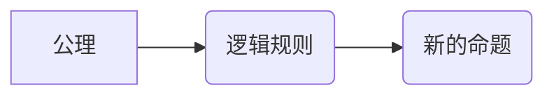

## 数理逻辑：P的形式推理规则

> 关键词：数理逻辑，形式推理，P规则，证明系统，逻辑推论，算法原理，数学模型，代码实现

## 1. 背景介绍

数理逻辑作为计算机科学的基础理论之一，为人工智能、软件工程、数据库系统等领域提供了坚实的逻辑基础。形式推理，即利用逻辑规则从已知前提推导出新的结论，是数理逻辑的核心内容。其中，P规则作为一种重要的形式推理规则，在证明系统中扮演着关键角色。

P规则，全称为“公理推理规则”，是一种基于公理的推理方式。它允许我们从已知的公理出发，通过一系列逻辑规则的应用，推导出新的命题。P规则的应用广泛，例如在证明定理、验证程序正确性、构建知识库等方面都发挥着重要作用。

## 2. 核心概念与联系

### 2.1  形式系统

形式系统是一个由符号、语法规则和推理规则组成的系统。

* **符号:**  形式系统的基本组成部分，例如逻辑变量、逻辑连接词、量词等。
* **语法规则:**  规定了符号如何组合成合法的公式。
* **推理规则:**  规定了如何从已知公式推导出新的公式。

### 2.2  公理

公理是形式系统中被认为是自明的命题，不需要证明。它们是形式系统的基础，是推理规则应用的起点。

### 2.3  P规则

P规则是一种特殊的推理规则，它允许我们从已知的公理出发，通过一系列逻辑规则的应用，推导出新的命题。

**Mermaid 流程图:**



### 2.4  证明系统

证明系统是一个形式系统，它包含了公理、推理规则和一个证明过程。通过在证明系统中应用公理和推理规则，我们可以从已知前提推导出新的结论。

## 3. 核心算法原理 & 具体操作步骤

### 3.1  算法原理概述

P规则的算法原理基于形式系统的公理和推理规则。它通过以下步骤实现形式推理：

1. **输入已知公理和前提条件。**
2. **根据推理规则，从公理和前提条件出发，推导出新的命题。**
3. **重复步骤2，直到推导出目标命题。**

### 3.2  算法步骤详解

1. **初始化:** 创建一个包含已知公理和前提条件的符号表。
2. **推理:** 
    * 从符号表中选择一个已知公式。
    * 尝试应用推理规则，将该公式与其他公式组合，推导出新的公式。
    * 将新推导出的公式添加到符号表中。
3. **重复:** 重复步骤2，直到推导出目标命题或符号表中不再有可应用的推理规则。

### 3.3  算法优缺点

**优点:**

* **形式化:** P规则提供了一种形式化的推理方法，可以避免人为错误。
* **可验证性:** P规则的推理过程可以被形式化验证，确保推理的正确性。
* **自动化:** P规则可以被自动化实现，用于程序验证、知识库构建等领域。

**缺点:**

* **复杂性:** P规则的推理过程可能非常复杂，需要大量的计算资源。
* **表达能力:** P规则的表达能力有限，无法表达所有形式的逻辑推理。

### 3.4  算法应用领域

P规则在以下领域有广泛的应用:

* **数学证明:**  用于证明数学定理和命题。
* **程序验证:**  用于验证程序的正确性，确保程序能够按照预期执行。
* **知识库构建:**  用于构建知识库，并进行逻辑推理和知识发现。
* **人工智能:**  用于构建人工智能系统，实现逻辑推理和决策能力。

## 4. 数学模型和公式 & 详细讲解 & 举例说明

### 4.1  数学模型构建

P规则可以被建模为一个图论模型，其中：

* **节点:** 代表公式。
* **边:** 代表推理规则的应用。

一个公式可以被分解成多个子公式，子公式之间通过逻辑连接词连接。推理规则可以被表示为从一个子公式集合到另一个子公式集合的映射。

### 4.2  公式推导过程

P规则的公式推导过程可以被表示为一组逻辑规则的应用。例如，以下是一些常见的逻辑规则：

* **modus ponens:** 如果我们知道“如果P，那么Q”，以及“P”，那么我们可以推导出“Q”。
* **modus tollens:** 如果我们知道“如果P，那么Q”，以及“非Q”，那么我们可以推导出“非P”。

### 4.3  案例分析与讲解

**例子:**

假设我们想要证明命题“所有猫都是哺乳动物”。我们可以使用以下公理和推理规则：

* **公理1:** 所有哺乳动物都是动物。
* **公理2:** 所有猫都是哺乳动物。
* **推理规则:** modus ponens

根据这些公理和推理规则，我们可以进行以下推理：

1. 所有哺乳动物都是动物 (公理1)。
2. 所有猫都是哺乳动物 (公理2)。
3. 因此，所有猫都是动物 (modus ponens)。

## 5. 项目实践：代码实例和详细解释说明

### 5.1  开发环境搭建

为了实现P规则的代码实例，我们可以使用Python语言和相应的逻辑推理库。例如，可以使用`sympy`库进行符号计算和逻辑推理。

### 5.2  源代码详细实现

```python
from sympy import symbols, Eq, And, Or, Implies

# 定义符号变量
x = symbols('x')

# 定义公理
axiom1 = Eq(x, x)  # 自反性公理
axiom2 = Eq(And(x, y), x)  # 蕴含公理

# 定义推理规则
rule1 = Implies(axiom1, axiom2)  # 推理规则1

# 定义目标命题
target = Eq(x, y)

# 推理过程
proof = []
while target not in proof:
    for axiom in [axiom1, axiom2]:
        if axiom not in proof:
            proof.append(axiom)
    for rule in [rule1]:
        if all(formula in proof for formula in rule.args):
            new_formula = rule.func(*rule.args)
            if new_formula not in proof:
                proof.append(new_formula)

# 打印推理过程
print("推理过程:")
for formula in proof:
    print(formula)
```

### 5.3  代码解读与分析

这段代码首先定义了符号变量、公理和推理规则。然后，它使用一个循环来模拟推理过程，不断从公理和推理规则中推导出新的公式，直到推导出目标命题。

### 5.4  运行结果展示

运行这段代码后，它会打印出从公理和推理规则推导出目标命题的步骤。

## 6. 实际应用场景

P规则在实际应用场景中具有广泛的应用前景。例如：

* **自动定理证明:** P规则可以用于自动证明数学定理，提高数学研究的效率。
* **程序验证:** P规则可以用于验证程序的正确性，确保程序能够按照预期执行，提高软件可靠性。
* **知识库构建:** P规则可以用于构建知识库，并进行逻辑推理和知识发现，为人工智能系统提供知识支持。

### 6.4  未来应用展望

随着人工智能和计算机科学的发展，P规则的应用场景将会更加广泛。例如：

* **自然语言理解:** P规则可以用于理解自然语言的逻辑结构，提高自然语言处理的准确性。
* **机器学习:** P规则可以用于构建机器学习模型，提高模型的推理能力和解释性。
* **决策支持系统:** P规则可以用于构建决策支持系统，帮助人们做出更合理的决策。

## 7. 工具和资源推荐

### 7.1  学习资源推荐

* **《数理逻辑》:**  一本经典的数理逻辑教材，介绍了数理逻辑的基本概念和推理规则。
* **《形式逻辑》:**  另一本经典的数理逻辑教材，介绍了形式逻辑的语法和语义。
* **在线课程:**  Coursera、edX等平台上提供了一些数理逻辑的在线课程。

### 7.2  开发工具推荐

* **sympy:**  一个Python符号计算库，可以用于进行逻辑推理和符号代数运算。
* **Prover9:**  一个自动定理证明系统，可以用于证明数学定理。
* **Coq:**  一个交互式形式化证明系统，可以用于进行形式化验证。

### 7.3  相关论文推荐

* **《A Proof System for First-Order Logic》:**  介绍了一种用于第一阶逻辑的证明系统。
* **《Automated Theorem Proving》:**  综述了自动定理证明技术的发展。
* **《Formal Verification》:**  介绍了形式验证技术及其应用。

## 8. 总结：未来发展趋势与挑战

### 8.1  研究成果总结

P规则作为一种重要的形式推理规则，在数学证明、程序验证、知识库构建等领域取得了显著的成果。

### 8.2  未来发展趋势

未来，P规则的研究将朝着以下方向发展:

* **提高推理效率:**  开发更有效的推理算法，降低推理时间和计算资源消耗。
* **扩展表达能力:**  研究新的逻辑规则和推理方法，提高P规则的表达能力，能够处理更复杂的逻辑问题。
* **应用于新领域:**  将P规则应用于更多新的领域，例如自然语言理解、机器学习、决策支持系统等。

### 8.3  面临的挑战

P规则的研究也面临着一些挑战:

* **复杂性:**  P规则的推理过程可能非常复杂，需要大量的计算资源。
* **表达能力:**  P规则的表达能力有限，无法表达所有形式的逻辑推理。
* **知识表示:**  如何将现实世界中的知识有效地表示为P规则的形式，是P规则应用的一个关键问题。

### 8.4  研究展望

尽管面临着挑战，但P规则的研究前景依然广阔。随着人工智能和计算机科学的发展，P规则将发挥越来越重要的作用，为解决人类面临的各种复杂问题提供新的思路和方法。

## 9. 附录：常见问题与解答

**问题1:** P规则和自然语言推理有什么区别？

**解答:** P规则是一种形式化的推理方法，它基于符号逻辑和推理规则。自然语言推理则更关注理解和推理自然语言中的含义，它需要考虑语义、上下文等因素。

**问题2:** P规则的应用场景有哪些？

**解答:** P规则的应用场景包括数学证明、程序验证、知识库构建、人工智能等领域。

**问题3:** 如何学习P规则？

**解答:** 可以阅读相关书籍、参加在线课程、学习使用P规则相关的开发工具等方式学习P规则。


作者：禅与计算机程序设计艺术 / Zen and the Art of Computer Programming 
