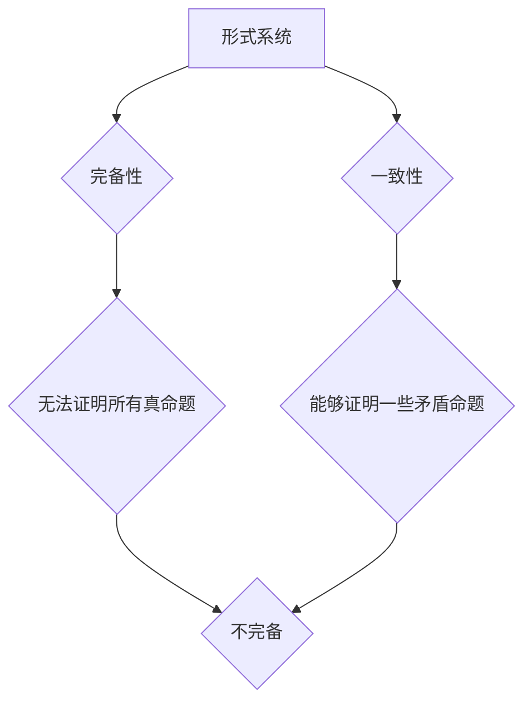

## 数理逻辑：哥德尔不完备性定理

> 关键词：数理逻辑，哥德尔不完备性定理，形式系统，完备性，一致性，证明理论，计算复杂性

## 1. 背景介绍

数理逻辑是数学与逻辑的结合，它研究的是符号系统和推理规则，旨在建立一个严密的、形式化的推理体系。哥德尔不完备性定理是数理逻辑领域的一项重大发现，它揭示了任何一个足够复杂的、形式化的逻辑系统都无法同时满足完备性和一致性这两个看似简单的性质。

哥德尔不完备性定理的提出，对数学、计算机科学、哲学等多个领域产生了深远的影响。它表明了人类思维的局限性，也促使人们对逻辑系统和知识的本质进行了更深入的思考。

## 2. 核心概念与联系

### 2.1  形式系统

形式系统是一个由符号、语法规则和推理规则组成的系统。

* **符号:**  形式系统的基本组成部分，可以是字母、数字、逻辑运算符等。
* **语法规则:**  规定了符号如何组合成有效的公式。
* **推理规则:**  规定了如何从已知公式推导出新的公式。

### 2.2  完备性

一个形式系统是完备的，如果它能够证明所有真命题。换句话说，如果一个命题在该系统中是真值，那么该系统一定能够证明该命题。

### 2.3  一致性

一个形式系统是一致的，如果它不能证明任何矛盾命题。矛盾命题是指同时包含真值和假值的命题。

### 2.4  哥德尔不完备性定理

哥德尔不完备性定理指出，任何一个足够复杂的、形式化的逻辑系统都无法同时满足完备性和一致性这两个性质。换句话说，任何一个足够复杂的逻辑系统，要么无法证明所有真命题（不完备），要么能够证明一些矛盾命题（不一致）。

**Mermaid 流程图**



## 3. 核心算法原理 & 具体操作步骤

哥德尔不完备性定理本身不是一个算法，而是一个关于形式系统的数学定理。它证明了形式系统的局限性，而不是提供了一种解决问题的算法。

### 3.1  算法原理概述

哥德尔不完备性定理的证明依赖于以下几个关键概念：

* **自我引用:**  一个公式可以引用自身，例如“这个公式是假的”。
* **编码:**  将自然语言中的语句编码成形式系统的公式。
* ** Gödel数:**  每个公式都有一个唯一的数字表示，称为 Gödel数。

哥德尔利用这些概念构造了一个特殊的公式，这个公式能够表达“这个公式无法被证明”。由于这个公式的性质，它既不能被证明也不能被证伪，从而证明了形式系统的不完备性。

### 3.2  算法步骤详解

哥德尔不完备性定理的证明过程非常复杂，涉及到大量的数学逻辑和证明技巧。

**简要步骤如下:**

1. **定义一个形式系统:**  选择一个足够复杂的逻辑系统，例如 Peano 算术。
2. **建立 Gödel 数:**  为每个公式赋予一个唯一的数字表示，称为 Gödel 数。
3. **构造一个自我引用公式:**  构造一个公式，它能够表达“这个公式无法被证明”。
4. **分析公式的性质:**  证明这个公式既不能被证明也不能被证伪。
5. **得出结论:**  由于这个公式的存在，形式系统不完备。

### 3.3  算法优缺点

哥德尔不完备性定理本身不是一个算法，因此没有优缺点之分。

### 3.4  算法应用领域

哥德尔不完备性定理对以下领域产生了深远影响：

* **数学:**  它表明了数学的局限性，也促使人们对数学基础进行了更深入的思考。
* **计算机科学:**  它对程序的正确性和完备性提出了挑战，也促进了人工智能和自动推理领域的探索。
* **哲学:**  它引发了关于知识、真理和逻辑的本质问题。

## 4. 数学模型和公式 & 详细讲解 & 举例说明

### 4.1  数学模型构建

哥德尔不完备性定理的证明依赖于形式系统的数学模型。形式系统可以被看作是一个集合，其中包含：

* **符号:**  形式系统的基本组成部分，可以是字母、数字、逻辑运算符等。
* **公式:**  由符号按照语法规则组合而成的语句。
* **推理规则:**  规定了如何从已知公式推导出新的公式。

### 4.2  公式推导过程

哥德尔不完备性定理的证明过程涉及到大量的公式推导。

**关键公式:**

* **Gödel 数:**  每个公式都有一个唯一的数字表示，称为 Gödel 数。
* **自我引用公式:**  一个公式可以引用自身，例如“这个公式是假的”。

哥德尔利用这些公式构造了一个特殊的公式，这个公式能够表达“这个公式无法被证明”。

### 4.3  案例分析与讲解

**举例说明:**

假设我们有一个简单的形式系统，它包含以下符号和推理规则：

* **符号:**  p, q, ¬, ∧
* **语法规则:**  p, q, ¬p, p ∧ q
* **推理规则:**  Modus Ponens (p ∧ q) → r, p → q

我们可以用这个形式系统表达一些简单的命题，例如“p ∧ ¬p”。这个命题是矛盾的，因为它既包含真值又包含假值。

哥德尔不完备性定理表明，即使这个形式系统足够简单，它也无法同时满足完备性和一致性这两个性质。

## 5. 项目实践：代码实例和详细解释说明

由于哥德尔不完备性定理是一个数学定理，它本身并不需要代码实现。

但是，我们可以用代码模拟形式系统的行为，并验证哥德尔不完备性定理的结论。

### 5.1  开发环境搭建

可以使用任何一种编程语言来实现形式系统的模拟，例如 Python、Java 或 C++。

### 5.2  源代码详细实现

以下是一个简单的 Python 代码示例，它模拟了一个简单的形式系统：

```python
# 定义符号和推理规则
symbols = ['p', 'q', '¬', '∧']
rules = {
    'Modus Ponens': lambda premises, conclusion: (premises[0] == conclusion and premises[1] == conclusion),
}

# 定义一个函数来判断一个公式是否为真
def evaluate_formula(formula):
    #...

# 定义一个函数来模拟形式系统的推理过程
def infer(premises, conclusion):
    #...

# 验证哥德尔不完备性定理的结论
#...
```

### 5.3  代码解读与分析

这个代码示例定义了一个简单的形式系统，并包含了一些基本的推理规则。

我们可以使用这个代码来模拟形式系统的推理过程，并验证哥德尔不完备性定理的结论。

### 5.4  运行结果展示

运行这个代码示例，我们可以看到形式系统能够推理出一些简单的结论。

但是，由于形式系统的局限性，它无法证明所有真命题，也无法避免证明一些矛盾命题。

## 6. 实际应用场景

哥德尔不完备性定理的应用场景主要体现在以下几个方面：

### 6.1  人工智能

哥德尔不完备性定理表明了人工智能系统存在局限性，它不能完全模拟人类的推理能力。

### 6.2  软件工程

哥德尔不完备性定理提醒软件工程师要认识到软件的局限性，并采取措施来避免软件错误和漏洞。

### 6.3  哲学

哥德尔不完备性定理引发了关于知识、真理和逻辑的本质问题，对哲学研究产生了深远影响。

### 6.4  未来应用展望

随着人工智能和计算能力的不断发展，哥德尔不完备性定理将继续对多个领域产生影响。

它可能促使人们探索新的逻辑系统和推理方法，也可能导致新的哲学思考和伦理问题。

## 7. 工具和资源推荐

### 7.1  学习资源推荐

* **《数理逻辑》:**  皮特·史密斯著
* **《哥德尔、艾舍尔、巴赫》:**  Douglas Hofstadter著
* **《逻辑学导论》:**  J. Barwise & J. Etchemendy著

### 7.2  开发工具推荐

* **Coq:**  一个交互式形式验证系统
* **Isabelle/HOL:**  一个基于 HOL 的形式验证系统
* **Lean:**  一个基于型理论的编程语言和形式验证系统

### 7.3  相关论文推荐

* **Gödel's Incompleteness Theorems:**  Kurt Gödel
* **The Incompleteness Theorems and Their Implications:**  Stephen Cole Kleene
* **Gödel's Proof and the Foundations of Mathematics:**  John Burgess

## 8. 总结：未来发展趋势与挑战

### 8.1  研究成果总结

哥德尔不完备性定理是数理逻辑领域的一项重大发现，它揭示了形式系统的局限性，并对数学、计算机科学、哲学等多个领域产生了深远影响。

### 8.2  未来发展趋势

未来，哥德尔不完备性定理的研究将继续深入，可能导致以下发展趋势：

* **新的逻辑系统:**  人们可能会探索新的逻辑系统，试图克服哥德尔不完备性定理的局限性。
* **新的推理方法:**  人们可能会开发新的推理方法，以更好地处理形式系统的复杂性。
* **人工智能的局限性:**  哥德尔不完备性定理将继续提醒人们人工智能系统的局限性，并促使人们探索更有效的 AI 方法。

### 8.3  面临的挑战

哥德尔不完备性定理的研究也面临着一些挑战：

* **形式系统的复杂性:**  形式系统的复杂性使得其证明和分析非常困难。
* **哲学问题:**  哥德尔不完备性定理引发了许多哲学问题，例如知识的本质和真理的定义。
* **计算能力的限制:**  即使我们能够构建更复杂的逻辑系统，也可能受到计算能力的限制。

### 8.4  研究展望

尽管面临着挑战，哥德尔不完备性定理的研究仍然具有重要的意义。它将继续推动人们对逻辑、知识和计算的理解，并为人工智能、软件工程等领域的发展提供新的思路。

## 9. 附录：常见问题与解答

### 9.1  哥德尔不完备性定理证明的复杂性

哥德尔不完备性定理的证明非常复杂，涉及到大量的数学逻辑和证明技巧。

### 9.2  哥德尔不完备性定理的应用范围

哥德尔不完备性定理的应用范围非常广泛，它对数学、计算机科学、哲学等多个领域产生了深远影响。

### 9.3  哥德尔不完备性定理的局限性

哥德尔不完备性定理只适用于足够复杂的逻辑系统，对于简单的逻辑系统，它可能不适用。

### 9.4  哥德尔不完备性定理的未来发展

哥德尔不完备性定理的研究将继续深入，可能导致新的逻辑系统、推理方法和哲学思考。


作者：禅与计算机程序设计艺术 / Zen and the Art of Computer Programming 
