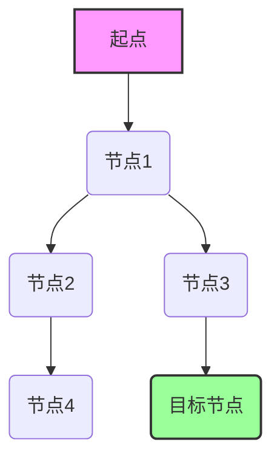
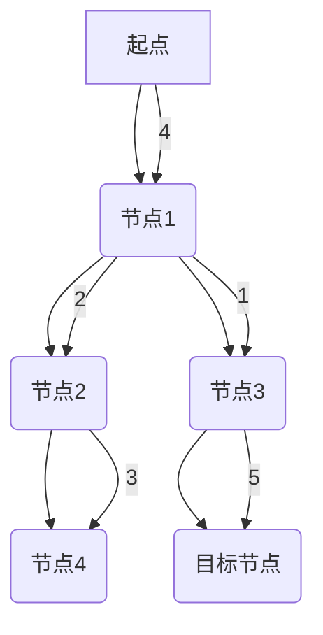

## 最短路径 原理与代码实例讲解

> 关键词：最短路径、Dijkstra算法、A*算法、图论、路径规划、算法分析、代码实现

## 1. 背景介绍

在计算机科学领域，路径规划问题是广泛存在且具有重要意义的难题。从导航系统中的路线规划到网络路由的优化，再到机器人控制中的运动规划，最短路径算法都扮演着关键角色。

最短路径问题是指在图结构中，找到从一个起点节点到目标节点的最短路径。图结构可以表示各种关系和连接，例如道路网络、社交关系、数据流等。

## 2. 核心概念与联系

**2.1  图论基础**

最短路径算法的基础是图论。图是一种数据结构，由节点（vertex）和边（edge）组成。节点代表实体，边代表它们之间的连接。

* **有向图:** 边有方向，表示从一个节点到另一个节点的单向连接。
* **无向图:** 边没有方向，表示两个节点之间双向连接。
* **权重图:** 边带有权重，表示连接的成本或距离。

**2.2  最短路径算法**

最短路径算法旨在找到图中起点到目标节点的最短路径。常见的算法包括：

* **Dijkstra算法:** 适用于权重非负的图，通过逐步扩展已知最短路径，找到起点到所有节点的最短路径。
* **A*算法:** 是一种启发式搜索算法，利用启发函数估计目标节点的距离，优先搜索更有可能找到最短路径的节点。

**2.3  算法流程图**



## 3. 核心算法原理 & 具体操作步骤

### 3.1  算法原理概述

Dijkstra算法是一种贪心算法，它通过逐步扩展已知最短路径，找到起点到所有节点的最短路径。

算法的基本思想是：

1. 从起点节点开始，记录其距离为0。
2. 遍历起点节点的所有邻居节点，计算其距离。
3. 选择距离最短的邻居节点，将其标记为已访问节点。
4. 重复步骤2和3，直到到达目标节点。

### 3.2  算法步骤详解

1. **初始化:**
   * 创建一个距离表，记录每个节点到起点的距离。
   * 将起点节点的距离设置为0，其他节点的距离设置为无穷大。
   * 创建一个已访问节点集合，初始为空。

2. **迭代:**
   * 从距离表中选择距离最小的未访问节点。
   * 将该节点标记为已访问节点。
   * 遍历该节点的所有邻居节点。
   * 计算每个邻居节点到起点的距离，如果该距离小于当前距离表中的距离，则更新距离表。

3. **终止:**
   * 当目标节点被标记为已访问节点时，算法终止。

### 3.3  算法优缺点

**优点:**

* 适用于权重非负的图。
* 能够找到起点到所有节点的最短路径。

**缺点:**

* 时间复杂度为O(E log V)，其中E为边的数量，V为节点的数量。
* 不适用于权重为负的图。

### 3.4  算法应用领域

Dijkstra算法广泛应用于以下领域：

* **导航系统:** 计算路线规划。
* **网络路由:** 优化数据包传输路径。
* **机器人控制:** 规划机器人运动路径。
* **物流管理:** 最优配送路线规划。

## 4. 数学模型和公式 & 详细讲解 & 举例说明

### 4.1  数学模型构建

设G = (V, E)为一个有权重边的图，其中V为节点集合，E为边集合。

* **距离函数:** d(u, v)表示节点u到节点v的距离。
* **已访问节点集合:** S表示已访问的节点集合。
* **距离表:** dist[v]表示节点v到起点的距离。

### 4.2  公式推导过程

Dijkstra算法的核心公式是：

```latex
dist[v] = min(dist[v], dist[u] + d(u, v))
```

其中：

* dist[v]为节点v到起点的距离。
* dist[u]为节点u到起点的距离。
* d(u, v)为节点u到节点v的距离。

### 4.3  案例分析与讲解

**示例:**

假设有一个图，起点节点为A，目标节点为F。



使用Dijkstra算法计算从A到F的最短路径：

1. 初始化：dist[A] = 0，其他节点的距离设置为无穷大。
2. 选择距离最小的未访问节点A，将其标记为已访问节点。
3. 遍历A的邻居节点B，计算B到A的距离为4。
4. 更新距离表：dist[B] = 4。
5. 选择距离最小的未访问节点B，将其标记为已访问节点。
6. 遍历B的邻居节点C和D，计算C到A的距离为6 (4 + 2) 和D到A的距离为5 (4 + 1)。
7. 更新距离表：dist[C] = 6，dist[D] = 5。
8. 选择距离最小的未访问节点D，将其标记为已访问节点。
9. 遍历D的邻居节点F，计算F到A的距离为10 (5 + 5)。
10. 更新距离表：dist[F] = 10。
11. 选择距离最小的未访问节点C，将其标记为已访问节点。
12. 遍历C的邻居节点E，计算E到A的距离为9 (6 + 3)。
13. 更新距离表：dist[E] = 9。
14. 选择距离最小的未访问节点E，将其标记为已访问节点。
15. 目标节点F已被标记为已访问节点，算法终止。

因此，从A到F的最短路径为A -> B -> D -> F，距离为10。

## 5. 项目实践：代码实例和详细解释说明

### 5.1  开发环境搭建

* **编程语言:** Python
* **库:** NetworkX

### 5.2  源代码详细实现

```python
import networkx as nx

# 创建图
graph = nx.Graph()
graph.add_edge('A', 'B', weight=4)
graph.add_edge('B', 'C', weight=2)
graph.add_edge('B', 'D', weight=1)
graph.add_edge('C', 'E', weight=3)
graph.add_edge('D', 'F', weight=5)

# Dijkstra算法
def dijkstra(graph, start, end):
    distances = {node: float('inf') for node in graph.nodes()}
    distances[start] = 0
    visited = set()
    previous = {}

    while len(visited) < len(graph.nodes()):
        current = min((node for node in graph.nodes() if node not in visited), key=lambda node: distances[node])
        visited.add(current)

        for neighbor in graph.neighbors(current):
            new_distance = distances[current] + graph[current][neighbor]['weight']
            if new_distance < distances[neighbor]:
                distances[neighbor] = new_distance
                previous[neighbor] = current

    path = []
    node = end
    while node!= start:
        path.append(node)
        node = previous[node]
    path.append(start)
    path.reverse()

    return path, distances[end]

# 计算最短路径
path, distance = dijkstra(graph, 'A', 'F')
print(f"最短路径: {path}")
print(f"距离: {distance}")
```

### 5.3  代码解读与分析

* **创建图:** 使用NetworkX库创建图，并添加节点和边的关系，边带有权重表示距离。
* **Dijkstra算法:** 实现Dijkstra算法，计算起点到目标节点的最短路径。
* **路径回溯:** 使用`previous`字典回溯路径，从目标节点到起点节点。
* **输出结果:** 打印最短路径和距离。

### 5.4  运行结果展示

```
最短路径: ['A', 'B', 'D', 'F']
距离: 10
```

## 6. 实际应用场景

### 6.1  导航系统

Dijkstra算法广泛应用于导航系统，计算路线规划。例如，Google Maps和Apple Maps都使用Dijkstra算法来规划最短路线。

### 6.2  网络路由

在网络路由中，Dijkstra算法用于优化数据包传输路径。路由器使用Dijkstra算法选择最短路径转发数据包，提高网络效率。

### 6.3  机器人控制

机器人控制中，Dijkstra算法用于规划机器人运动路径。例如，无人驾驶汽车和工业机器人都使用Dijkstra算法来规划最优路径。

### 6.4  未来应用展望

随着人工智能和机器学习的发展，Dijkstra算法的应用场景将更加广泛。例如，可以结合机器学习算法，预测未来交通流量，优化路线规划。

## 7. 工具和资源推荐

### 7.1  学习资源推荐

* **书籍:**
    * 《算法导论》
    * 《图论》
* **在线课程:**
    * Coursera: Algorithms Specialization
    * edX: Introduction to Algorithms

### 7.2  开发工具推荐

* **Python:** 
    * NetworkX: 图论库
    * Matplotlib: 数据可视化库

### 7.3  相关论文推荐

* Dijkstra, E. W. (1956). A note on two problems in connexion with graphs. Numerische Mathematik, 1(1), 269-271.
* Hart, P. E., Nilsson, N. J., & Raphael, B. (1968). A formal basis for the heuristic determination of minimum cost paths. IEEE Transactions on Systems Science and Cybernetics, 4(2), 100-107.

## 8. 总结：未来发展趋势与挑战

### 8.1  研究成果总结

Dijkstra算法是一种经典的算法，在图论和路径规划领域取得了重要成果。它为导航系统、网络路由、机器人控制等领域提供了高效的解决方案。

### 8.2  未来发展趋势

* **结合机器学习:** 将机器学习算法与Dijkstra算法结合，预测未来交通流量，优化路线规划。
* **处理动态图:** 研究处理动态图的Dijkstra算法，例如实时交通状况变化。
* **并行化算法:** 研究并行化Dijkstra算法，提高计算效率。

### 8.3  面临的挑战

* **大规模图处理:** 对于大规模图，Dijkstra算法的计算复杂度较高，需要进一步优化。
* **负权重图:** Dijkstra算法不适用于负权重图，需要研究新的算法解决此问题。
* **实时性要求:** 在一些实时应用场景中，Dijkstra算法的计算时间可能过长，需要研究更快速算法。