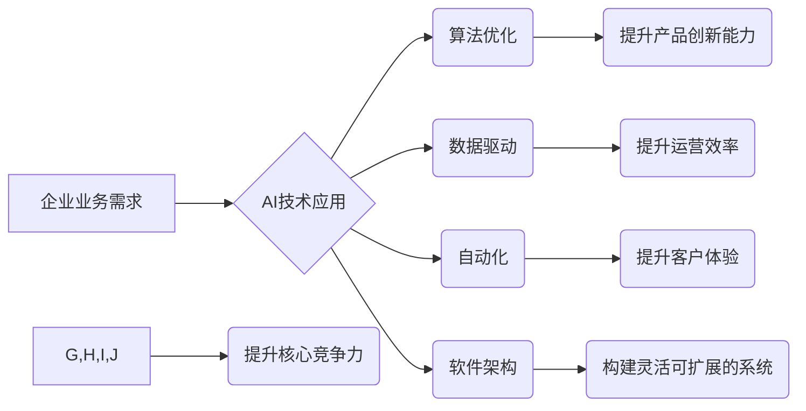

## 核心竞争力提升的新质生产力

> 关键词：人工智能、生产力、算法优化、数据驱动、自动化、机器学习、深度学习、软件架构

### 1. 背景介绍

在当今数字化时代，科技发展日新月异，人工智能（AI）技术作为科技发展的重要驱动力，正在深刻地改变着各行各业。AI技术的应用，不仅提升了生产效率，也催生了新的商业模式和经济增长点。然而，单纯依靠AI技术本身并不能带来真正的核心竞争力提升。 

我们需要深入思考，如何将AI技术与企业自身业务场景相结合，构建一套高效、可持续的生产力提升体系。这需要我们从以下几个方面进行探索：

* **算法优化：** 提升算法的效率和准确性，使其能够更好地处理复杂数据，并提供更精准的决策支持。
* **数据驱动：** 打造数据驱动的企业文化，充分利用数据资源，为AI算法提供充足的训练数据和反馈机制。
* **自动化：** 通过自动化技术，解放人力资源，将重复性、低效的工作流程交给机器处理，提高员工的工作效率和创造力。
* **软件架构：** 建立灵活、可扩展的软件架构，能够适应不断变化的业务需求，并支持AI技术的快速迭代和部署。

### 2. 核心概念与联系

**2.1 核心概念**

* **新质生产力：** 指的是在信息化、数字化、智能化时代，通过科技创新，特别是人工智能技术的应用，实现生产力质的飞跃，超越传统生产力的范畴。
* **核心竞争力：** 指的是企业在市场竞争中能够持续保持优势的独特能力，是企业长期发展的关键要素。

**2.2 核心概念联系**

新质生产力是提升企业核心竞争力的重要驱动力。通过AI技术的应用，企业可以实现以下方面的核心竞争力提升：

* **产品创新：** AI技术可以帮助企业更快、更有效地开发新产品，并根据用户需求进行个性化定制。
* **运营效率：** AI技术可以帮助企业优化运营流程，提高资源利用率，降低成本。
* **客户体验：** AI技术可以帮助企业提供更个性化、更智能化的客户服务，提升客户满意度。

**2.3  流程图**



### 3. 核心算法原理 & 具体操作步骤

**3.1 算法原理概述**

深度学习算法是人工智能领域的核心算法之一，它能够通过多层神经网络结构，学习数据中的复杂模式和特征，从而实现对数据的理解和预测。深度学习算法的应用范围非常广泛，包括图像识别、自然语言处理、语音识别等领域。

**3.2 算法步骤详解**

1. **数据预处理：** 将原始数据进行清洗、转换和格式化，使其能够被深度学习算法所接受。
2. **网络结构设计：** 根据具体任务需求，设计深度神经网络的结构，包括神经元数量、层数、激活函数等参数。
3. **模型训练：** 使用训练数据，通过反向传播算法，调整神经网络的权重和偏置，使模型能够准确地预测目标值。
4. **模型评估：** 使用测试数据，评估模型的性能，并根据评估结果进行模型调优。
5. **模型部署：** 将训练好的模型部署到实际应用场景中，用于进行数据预测和分析。

**3.3 算法优缺点**

**优点：**

* 能够学习数据中的复杂模式和特征，实现高精度预测。
* 具有强大的泛化能力，能够应用于不同的数据和任务。

**缺点：**

* 需要大量的训练数据，训练时间较长。
* 模型解释性较差，难以理解模型的决策过程。

**3.4 算法应用领域**

* **图像识别：** 人脸识别、物体检测、图像分类等。
* **自然语言处理：** 文本分类、情感分析、机器翻译等。
* **语音识别：** 语音转文本、语音助手等。
* **推荐系统：** 商品推荐、内容推荐等。

### 4. 数学模型和公式 & 详细讲解 & 举例说明

**4.1 数学模型构建**

深度学习算法的核心是多层神经网络结构。每个神经元接收多个输入信号，并通过权重进行加权求和，然后应用激活函数进行非线性变换，输出一个信号。神经网络的层数、神经元数量、激活函数等参数都会影响模型的性能。

**4.2 公式推导过程**

深度学习算法的训练过程是通过反向传播算法来实现的。反向传播算法的核心思想是，通过计算误差，反向传播到网络的每一层，调整每个神经元的权重和偏置，使得模型的预测结果与真实值之间的误差最小化。

**损失函数：** 用于衡量模型预测结果与真实值的差异。常见的损失函数包括均方误差（MSE）、交叉熵损失（Cross-Entropy Loss）等。

**梯度下降：** 用于更新神经网络权重和偏置的优化算法。梯度下降算法通过计算损失函数的梯度，沿着梯度相反的方向更新权重和偏置，从而逐渐降低损失函数的值。

**4.3 案例分析与讲解**

假设我们有一个简单的深度学习模型，用于预测房价。模型的输入特征包括房屋面积、房间数量、地理位置等，输出是房屋的价格。

我们可以使用均方误差作为损失函数，梯度下降算法作为优化算法，训练这个模型。训练过程会不断调整模型的权重和偏置，使得模型能够预测房价的误差最小化。

### 5. 项目实践：代码实例和详细解释说明

**5.1 开发环境搭建**

* Python 3.x
* TensorFlow 或 PyTorch 等深度学习框架
* Jupyter Notebook 或 VS Code 等代码编辑器

**5.2 源代码详细实现**

```python
import tensorflow as tf

# 定义模型结构
model = tf.keras.models.Sequential([
    tf.keras.layers.Dense(64, activation='relu', input_shape=(4,)),
    tf.keras.layers.Dense(32, activation='relu'),
    tf.keras.layers.Dense(1)
])

# 定义损失函数和优化器
model.compile(loss='mse', optimizer='adam')

# 训练模型
model.fit(X_train, y_train, epochs=10)

# 评估模型
loss = model.evaluate(X_test, y_test)
print('测试损失:', loss)

# 使用模型预测
predictions = model.predict(X_new)
```

**5.3 代码解读与分析**

* 代码首先定义了一个简单的深度学习模型，包含三层全连接神经网络。
* 每一层神经元都使用ReLU激活函数，输入层的神经元数量与特征数量一致。
* 模型使用均方误差作为损失函数，Adam优化器进行训练。
* 训练过程使用训练数据进行迭代训练，训练完成后使用测试数据评估模型的性能。
* 最后，使用训练好的模型对新的数据进行预测。

**5.4 运行结果展示**

训练完成后，我们可以查看模型的测试损失值，以及对新数据的预测结果。

### 6. 实际应用场景

**6.1 智能客服系统**

AI技术可以用于构建智能客服系统，自动处理客户咨询，提高客户服务效率。

**6.2 个性化推荐系统**

AI技术可以分析用户的行为数据，提供个性化的商品或内容推荐，提升用户体验。

**6.3 自动化生产线**

AI技术可以用于自动化生产线，提高生产效率，降低生产成本。

**6.4 医疗诊断辅助系统**

AI技术可以辅助医生进行医疗诊断，提高诊断准确率。

**6.5 未来应用展望**

随着AI技术的不断发展，其应用场景将会更加广泛，例如：

* **自动驾驶汽车**
* **个性化教育**
* **智能家居**
* **城市管理**

### 7. 工具和资源推荐

**7.1 学习资源推荐**

* **在线课程：** Coursera、edX、Udacity 等平台提供丰富的AI课程。
* **书籍：** 《深度学习》、《机器学习实战》等书籍。
* **开源项目：** TensorFlow、PyTorch 等开源深度学习框架。

**7.2 开发工具推荐**

* **Python：** 深度学习开发的主要编程语言。
* **Jupyter Notebook：** 用于代码编写、数据分析和可视化。
* **VS Code：** 强大的代码编辑器，支持深度学习开发。

**7.3 相关论文推荐**

* **《ImageNet Classification with Deep Convolutional Neural Networks》**
* **《Attention Is All You Need》**
* **《BERT: Pre-training of Deep Bidirectional Transformers for Language Understanding》**

### 8. 总结：未来发展趋势与挑战

**8.1 研究成果总结**

近年来，AI技术取得了长足的进步，在图像识别、自然语言处理、语音识别等领域取得了突破性进展。深度学习算法成为AI技术发展的主流方向，并取得了广泛应用。

**8.2 未来发展趋势**

* **模型规模和复杂度提升：** 未来深度学习模型将会更加庞大，包含更多的参数和层数，从而实现更强大的学习能力。
* **数据驱动的AI：** 数据将成为AI发展的关键要素，未来AI技术的发展将更加依赖于海量数据的积累和利用。
* **边缘计算和联邦学习：** AI模型将更加倾向于在边缘设备上进行部署和训练，以提高效率和隐私保护。
* **AI伦理和安全：** 随着AI技术的应用越来越广泛，AI伦理和安全问题将更加重要，需要制定相应的规范和制度。

**8.3 面临的挑战**

* **数据获取和隐私保护：** 训练高质量的AI模型需要大量的训练数据，如何获取和保护用户隐私是一个重要的挑战。
* **模型解释性和可信度：** 深度学习模型的决策过程难以解释，如何提高模型的透明度和可信度是一个重要的研究方向。
* **算法公平性和偏见：** AI算法可能会存在公平性和偏见问题，需要进行相应的检测和修正。

**8.4 研究展望**

未来，AI技术将会继续发展，并对我们的生活产生更深远的影响。我们需要加强对AI技术的理解和研究，并积极应对AI带来的挑战，以确保AI技术能够真正造福人类。

### 9. 附录：常见问题与解答

**9.1 如何选择合适的深度学习框架？**

选择深度学习框架需要根据具体项目需求和个人经验进行考虑。TensorFlow和PyTorch是目前最流行的深度学习框架，各有优缺点。

**9.2 如何处理数据中的缺失值？**

数据中的缺失值可以通过多种方法处理，例如：删除缺失值、用均值或中位数填充缺失值、使用插值方法等。

**9.3 如何评估深度学习模型的性能？**

深度学习模型的性能可以通过多种指标进行评估，例如：准确率、召回率、F1-score、AUC等。

**9.4 如何防止深度学习模型过拟合？**

过拟合是指模型在训练数据上表现很好，但在测试数据上表现较差。可以采用以下方法防止过拟合：

* 使用正则化技术
* 使用交叉验证
* 增加训练数据量
* 使用Dropout技术


作者：禅与计算机程序设计艺术 / Zen and the Art of Computer Programming 
