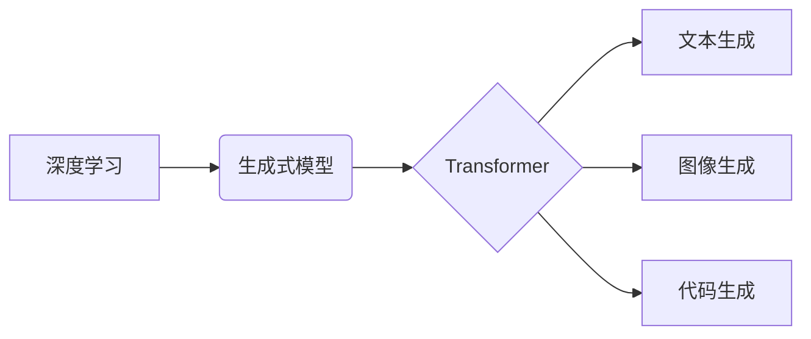

## 生成式AIGC：从理论到商业应用的跨越

> 关键词：生成式AI、AIGC、Transformer、自然语言处理、文本生成、图像生成、代码生成、商业应用

### 1. 背景介绍

近年来，人工智能（AI）技术取得了飞速发展，其中生成式人工智能（Generative AI）作为其重要分支，展现出强大的潜力，引发了广泛的关注和研究。生成式AI能够根据已有的数据样本，学习并生成新的、类似于训练数据的内容，例如文本、图像、音频、视频等。

传统的AI模型主要侧重于分类、识别等任务，而生成式AI则能够创造新的内容，这使得其在许多领域具有广泛的应用前景。例如，在文本生成领域，生成式AI可以用于自动写作、机器翻译、聊天机器人等；在图像生成领域，可以用于图像合成、艺术创作、游戏开发等；在代码生成领域，可以用于自动代码生成、代码修复等。

### 2. 核心概念与联系

**2.1 核心概念**

* **生成式模型:**  一种能够从输入数据中学习并生成新数据的机器学习模型。
* **深度学习:**  一种基于多层神经网络的机器学习方法，在处理复杂数据方面表现出色。
* **Transformer:**  一种新型的深度学习架构，能够有效处理序列数据，在自然语言处理领域取得了突破性进展。

**2.2 架构关系**



**2.3 联系**

深度学习是生成式模型的基础，而Transformer作为一种强大的深度学习架构，在生成式AI领域发挥着关键作用。Transformer的注意力机制能够有效捕捉序列数据中的长距离依赖关系，从而提高生成式模型的生成质量。

### 3. 核心算法原理 & 具体操作步骤

**3.1 算法原理概述**

生成式AI的核心算法通常基于概率模型，例如变分自编码器（VAE）和生成对抗网络（GAN）。

* **变分自编码器 (VAE):**  通过将输入数据编码成低维表示，然后解码成输出数据，学习数据的潜在结构。
* **生成对抗网络 (GAN):**  由两个网络组成：生成器和判别器。生成器试图生成逼真的数据样本，而判别器试图区分真实数据和生成数据。两者相互竞争，最终生成器能够生成与真实数据相似的样本。

**3.2 算法步骤详解**

以GAN为例，其训练过程如下：

1. **初始化生成器和判别器网络参数。**
2. **生成器生成样本数据，判别器对真实数据和生成数据进行分类。**
3. **根据判别器的分类结果，更新生成器和判别器的网络参数。**
4. **重复步骤2和3，直到生成器能够生成逼真的数据样本。**

**3.3 算法优缺点**

* **VAE:**
    * **优点:**  能够学习数据的潜在结构，生成数据质量相对稳定。
    * **缺点:**  生成数据可能缺乏多样性。
* **GAN:**
    * **优点:**  能够生成更逼真的数据样本，具有更高的多样性。
    * **缺点:**  训练过程较为复杂，容易出现模式崩溃等问题。

**3.4 算法应用领域**

* **文本生成:**  自动写作、机器翻译、聊天机器人等。
* **图像生成:**  图像合成、艺术创作、游戏开发等。
* **代码生成:**  自动代码生成、代码修复等。

### 4. 数学模型和公式 & 详细讲解 & 举例说明

**4.1 数学模型构建**

生成式AI模型通常基于概率模型，例如概率分布函数。

* **概率分布函数:**  描述随机变量取值的概率。

**4.2 公式推导过程**

例如，在GAN中，生成器网络的输出可以看作是一个概率分布，该分布表示生成样本数据的概率。判别器网络的输出是一个分类结果，表示样本数据是真实数据还是生成数据。

**4.3 案例分析与讲解**

在文本生成领域，可以使用语言模型，例如Transformer，来构建概率分布函数。语言模型可以学习文本数据的统计规律，并根据这些规律生成新的文本。

### 5. 项目实践：代码实例和详细解释说明

**5.1 开发环境搭建**

使用Python语言和深度学习框架TensorFlow或PyTorch搭建开发环境。

**5.2 源代码详细实现**

以下是一个简单的文本生成模型的代码示例，使用TensorFlow框架实现：

```python
import tensorflow as tf

# 定义模型结构
model = tf.keras.Sequential([
    tf.keras.layers.Embedding(input_dim=vocab_size, output_dim=embedding_dim),
    tf.keras.layers.LSTM(units=lstm_units),
    tf.keras.layers.Dense(units=vocab_size, activation='softmax')
])

# 编译模型
model.compile(optimizer='adam', loss='sparse_categorical_crossentropy', metrics=['accuracy'])

# 训练模型
model.fit(x_train, y_train, epochs=epochs)

# 生成文本
text = model.predict(x_input)
```

**5.3 代码解读与分析**

* **Embedding层:** 将单词转换为向量表示。
* **LSTM层:** 处理文本序列数据，捕捉长距离依赖关系。
* **Dense层:** 将LSTM层的输出转换为概率分布，预测下一个单词。

**5.4 运行结果展示**

训练完成后，可以使用模型生成新的文本。

### 6. 实际应用场景

**6.1 文本生成**

* **自动写作:**  生成新闻报道、产品描述、广告文案等。
* **机器翻译:**  将文本从一种语言翻译成另一种语言。
* **聊天机器人:**  与用户进行自然语言对话。

**6.2 图像生成**

* **图像合成:**  生成逼真的图像，例如人脸、场景等。
* **艺术创作:**  生成艺术作品，例如绘画、雕塑等。
* **游戏开发:**  生成游戏场景、角色等。

**6.3 代码生成**

* **自动代码生成:**  根据需求自动生成代码。
* **代码修复:**  自动修复代码中的错误。

**6.4 未来应用展望**

* **个性化内容生成:**  根据用户的喜好生成个性化的内容，例如新闻推荐、广告推送等。
* **虚拟现实和增强现实:**  生成虚拟场景和增强现实内容。
* **科学研究:**  加速科学研究，例如药物研发、材料设计等。

### 7. 工具和资源推荐

**7.1 学习资源推荐**

* **书籍:**  《深度学习》、《生成对抗网络》
* **在线课程:**  Coursera、edX、Udacity

**7.2 开发工具推荐**

* **深度学习框架:**  TensorFlow、PyTorch
* **文本处理工具:**  NLTK、spaCy

**7.3 相关论文推荐**

* **Generative Adversarial Networks**
* **Attention Is All You Need**

### 8. 总结：未来发展趋势与挑战

**8.1 研究成果总结**

生成式AI技术取得了显著进展，在文本生成、图像生成、代码生成等领域展现出强大的潜力。

**8.2 未来发展趋势**

* **模型规模和能力提升:**  模型规模不断扩大，能力不断增强。
* **多模态生成:**  融合文本、图像、音频等多种模态数据进行生成。
* **可解释性增强:**  提高生成模型的可解释性，使其生成结果更易理解。

**8.3 面临的挑战**

* **数据安全和隐私:**  生成式AI模型需要大量数据进行训练，如何保护数据安全和隐私是一个重要挑战。
* **伦理问题:**  生成式AI模型可能被用于生成虚假信息、恶意内容等，如何解决伦理问题是一个需要认真思考的问题。
* **可控性:**  生成式AI模型的输出结果可能难以控制，如何提高模型的可控性是一个重要的研究方向。

**8.4 研究展望**

未来，生成式AI技术将继续发展，在更多领域发挥重要作用。需要加强对数据安全、隐私、伦理等方面的研究，确保生成式AI技术安全、可控、可持续发展。

### 9. 附录：常见问题与解答

**9.1 如何选择合适的生成式AI模型？**

选择合适的生成式AI模型需要根据具体应用场景和数据特点进行选择。例如，对于文本生成任务，可以使用Transformer模型；对于图像生成任务，可以使用GAN模型。

**9.2 如何训练生成式AI模型？**

训练生成式AI模型需要准备充足的数据集，并使用深度学习框架进行训练。训练过程通常需要多次迭代，直到模型性能达到预期效果。

**9.3 如何评估生成式AI模型的性能？**

评估生成式AI模型的性能可以使用多种指标，例如准确率、困惑度、生成质量等。

作者：禅与计算机程序设计艺术 / Zen and the Art of Computer Programming


