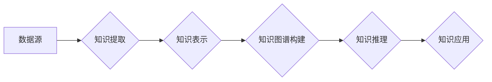

## 知识体系的构建：从基本元素到复杂结构

> 关键词：知识体系、知识图谱、知识表示、机器学习、深度学习、自然语言处理、人工智能

### 1. 背景介绍

在当今数据爆炸的时代，信息获取和处理能力已成为决定科技发展和社会进步的关键因素。如何有效地组织、存储、检索和利用海量知识，成为了一个亟待解决的挑战。知识体系的构建，旨在通过构建结构化的知识表示，将分散的知识点连接起来，形成一个完整的、可理解、可推理的知识网络。

传统的知识表示方法主要依赖于人工编纂的知识库，但随着知识的不断增长和复杂性增加，人工构建知识库变得越来越困难和耗时。近年来，随着机器学习和深度学习技术的快速发展，基于数据的知识体系构建方法逐渐成为主流。这些方法利用机器学习算法从海量文本、结构化数据等多种数据源中自动提取知识，并构建知识图谱，从而实现知识的自动化获取、组织和推理。

### 2. 核心概念与联系

**2.1 知识体系**

知识体系是指对某一领域或主题的知识进行系统化、结构化、层次化的组织和表达，形成一个完整的知识网络。它包含了知识的基本元素、知识之间的关系以及知识的层次结构。

**2.2 知识图谱**

知识图谱是一种基于知识表示的知识组织形式，它以实体和关系为基本单元，将知识表示为一个图结构。实体代表着事物或概念，关系代表着实体之间的联系。知识图谱能够有效地捕捉知识之间的复杂关系，并支持知识的推理和查询。

**2.3 知识表示**

知识表示是指将知识以机器可理解的形式进行表达。常见的知识表示方法包括：

* **本体论:** 本体论是一种形式化的知识表示语言，它定义了概念、属性和关系，并规定了它们之间的逻辑约束。
* **RDF:** RDF (Resource Description Framework) 是一种用于描述资源的标准语言，它使用三元组 (主体、谓词、对象) 来表示知识。
* **OWL:** OWL (Web Ontology Language) 是一种基于 RDF 的本体论语言，它提供了更丰富的表达能力，能够表示复杂的关系和逻辑推理。

**2.4 机器学习**

机器学习是一种人工智能技术，它通过训练模型来学习数据中的模式和规律，从而实现对未知数据的预测和分类。在知识体系构建中，机器学习算法可以用于自动提取知识、构建知识图谱以及进行知识推理。

**2.5 深度学习**

深度学习是一种基于人工神经网络的机器学习方法，它能够学习更复杂的模式和特征。深度学习算法在自然语言处理、图像识别等领域取得了突破性进展，也为知识体系构建提供了新的可能性。

**2.6 自然语言处理**

自然语言处理 (NLP) 是指使计算机能够理解、处理和生成人类语言的技术。在知识体系构建中，NLP 技术可以用于从文本数据中提取知识、识别实体和关系，以及构建知识图谱。

**2.7 人工智能**

人工智能 (AI) 是指模拟人类智能的计算机系统。知识体系构建是人工智能领域的重要研究方向之一，它为人工智能系统提供了一个结构化的知识基础，从而提高人工智能系统的推理能力和应用范围。

**Mermaid 流程图**



### 3. 核心算法原理 & 具体操作步骤

**3.1 算法原理概述**

知识体系构建的核心算法主要包括知识提取、知识表示和知识图谱构建。

* **知识提取:** 从文本、结构化数据等数据源中自动提取知识，包括实体识别、关系抽取和事件识别等任务。
* **知识表示:** 将提取的知识以机器可理解的形式进行表达，常用的方法包括本体论、RDF 和 OWL 等。
* **知识图谱构建:** 将知识表示形式化的连接起来，构建一个完整的知识网络。

**3.2 算法步骤详解**

1. **数据预处理:** 对数据源进行清洗、格式化和转换，以便于后续的知识提取和表示。
2. **实体识别:** 利用自然语言处理技术识别文本中的实体，例如人名、地名、机构名等。
3. **关系抽取:** 利用机器学习算法识别实体之间的关系，例如“张三工作于百度”中的“工作于”关系。
4. **知识表示:** 将提取的实体和关系表示为三元组或其他形式的知识表示。
5. **知识图谱构建:** 将知识表示形式化的连接起来，构建一个完整的知识网络。

**3.3 算法优缺点**

**优点:**

* 自动化知识获取: 可以自动从海量数据中提取知识，减少人工成本。
* 知识结构化: 将知识表示为结构化的知识图谱，方便知识的组织、检索和推理。
* 知识扩展: 可以通过不断学习新的数据来扩展知识体系。

**缺点:**

* 数据质量依赖: 知识体系的质量取决于数据源的质量。
* 知识覆盖率: 现有的知识提取算法仍然无法完全覆盖所有类型的知识。
* 知识可解释性: 一些机器学习算法的决策过程难以解释，这可能会影响知识体系的可信度。

**3.4 算法应用领域**

知识体系构建技术在各个领域都有广泛的应用，例如：

* **搜索引擎:** 构建知识图谱可以提高搜索引擎的准确性和相关性。
* **问答系统:** 知识图谱可以为问答系统提供背景知识和推理能力。
* **推荐系统:** 知识图谱可以帮助推荐系统更好地理解用户的兴趣和需求。
* **医疗诊断:** 知识图谱可以帮助医生进行疾病诊断和治疗方案制定。
* **教育领域:** 知识图谱可以用于构建智能教育系统，提供个性化的学习体验。

### 4. 数学模型和公式 & 详细讲解 & 举例说明

**4.1 数学模型构建**

知识体系的构建可以抽象为一个图论问题，其中实体和关系分别对应图中的节点和边。

* **实体:** 实体可以表示为一个集合 E = {e1, e2,..., en}，其中每个实体 ei 代表一个具体的概念或事物。
* **关系:** 关系可以表示为一个集合 R = {r1, r2,..., rm}，其中每个关系 ri 代表实体之间的一种联系。
* **知识图谱:** 知识图谱可以表示为一个三元组集合 T = {(e1, r1, e2), (e2, r2, e3),..., (en-1, rn, en)}，其中每个三元组 (ei, ri, ej) 表示实体 ei 和 ej 之间存在关系 ri。

**4.2 公式推导过程**

知识图谱的构建可以利用机器学习算法进行，例如：

* **路径挖掘:** 通过分析知识图谱中的路径，发现实体之间的隐含关系。
* **链接预测:** 利用已知的实体关系，预测实体之间的潜在关系。
* **知识图谱补全:** 利用已有的知识图谱信息，预测缺失的实体和关系。

这些算法通常基于图神经网络 (GNN) 或其他深度学习模型，并利用数学公式进行推理和预测。

**4.3 案例分析与讲解**

例如，在构建医疗知识图谱时，可以利用路径挖掘算法发现疾病和药物之间的关系，例如“糖尿病”和“胰岛素”之间的关系。

### 5. 项目实践：代码实例和详细解释说明

**5.1 开发环境搭建**

* Python 3.x
* TensorFlow 或 PyTorch
* NetworkX 或 DGL

**5.2 源代码详细实现**

```python
import networkx as nx

# 创建知识图谱
graph = nx.Graph()

# 添加实体
graph.add_nodes_from(["张三", "李四", "王五"])

# 添加关系
graph.add_edges_from([("张三", "工作于", "百度"), ("李四", "居住在", "北京"), ("王五", "爱好", "编程")])

# 打印知识图谱
print(graph.nodes())
print(graph.edges())
```

**5.3 代码解读与分析**

* 使用 NetworkX 库创建知识图谱。
* 添加实体和关系。
* 打印知识图谱中的节点和边。

**5.4 运行结果展示**

```
['张三', '李四', '王五']
[('张三', '工作于', '百度'), ('李四', '居住在', '北京'), ('王五', '爱好', '编程')]
```

### 6. 实际应用场景

**6.1 搜索引擎**

知识图谱可以帮助搜索引擎理解用户查询的意图，并提供更准确、更相关的搜索结果。例如，当用户搜索“苹果公司”时，搜索引擎可以利用知识图谱获取苹果公司的相关信息，例如公司名称、成立时间、CEO 等，并将其显示在搜索结果中。

**6.2 问答系统**

知识图谱可以为问答系统提供背景知识和推理能力，从而提高问答系统的准确性和自然语言理解能力。例如，当用户问“北京的首都是什么？”时，问答系统可以利用知识图谱中的信息，快速准确地回答“北京是中国的首都”。

**6.3 推荐系统**

知识图谱可以帮助推荐系统更好地理解用户的兴趣和需求，并提供更个性化的推荐。例如，当用户浏览了有关“人工智能”的新闻文章时，推荐系统可以利用知识图谱中的信息，推荐与“人工智能”相关的书籍、视频和课程。

**6.4 医疗诊断**

知识图谱可以帮助医生进行疾病诊断和治疗方案制定。例如，医生可以利用知识图谱中的信息，了解某一种疾病的症状、病因、治疗方法等，从而做出更准确的诊断和制定更有效的治疗方案。

**6.5 教育领域**

知识图谱可以用于构建智能教育系统，提供个性化的学习体验。例如，知识图谱可以根据学生的学习进度和兴趣，推荐相关的学习资源，并提供个性化的学习建议。

**6.6 未来应用展望**

随着人工智能技术的不断发展，知识体系构建技术将有更广泛的应用场景，例如：

* **智能客服:** 利用知识图谱构建智能客服系统，能够更准确地理解用户的需求，并提供更有效的帮助。
* **智能写作:** 利用知识图谱辅助写作，能够提高写作效率和质量。
* **虚拟现实和增强现实:** 利用知识图谱构建虚拟现实和增强现实场景，能够提供更沉浸式的体验。

### 7. 工具和资源推荐

**7.1 学习资源推荐**

* **Stanford CS224N: Natural Language Processing with Deep Learning:** https://web.stanford.edu/class/cs224n/
* **Deep Learning Specialization by Andrew Ng:** https://www.deeplearning.ai/
* **Knowledge Graph Embedding: A Survey:** https://arxiv.org/abs/1801.08800

**7.2 开发工具推荐**

* **NetworkX:** https://networkx.org/
* **DGL:** https://www.dgl.ai/
* **RDFlib:** https://rdflib.readthedocs.io/en/stable/

**7.3 相关论文推荐**

* **TransE: Embedding Entities and Relations for Learning and Inference in Knowledge Graphs:** https://arxiv.org/abs/1301.2576
* **RotatE: Knowledge Graph Embedding by Relational Rotation in Complex Space:** https://arxiv.org/abs/1902.06430
* **BERT for Knowledge Graph Completion:** https://arxiv.org/abs/1903.09183

### 8. 总结：未来发展趋势与挑战

**8.1 研究成果总结**

近年来，知识体系构建技术取得了显著进展，特别是深度学习技术的应用，使得知识提取、知识表示和知识推理能力得到大幅提升。

**8.2 未来发展趋势**

* **更强大的知识表示:** 开发更灵活、更 expressive 的知识表示方法，