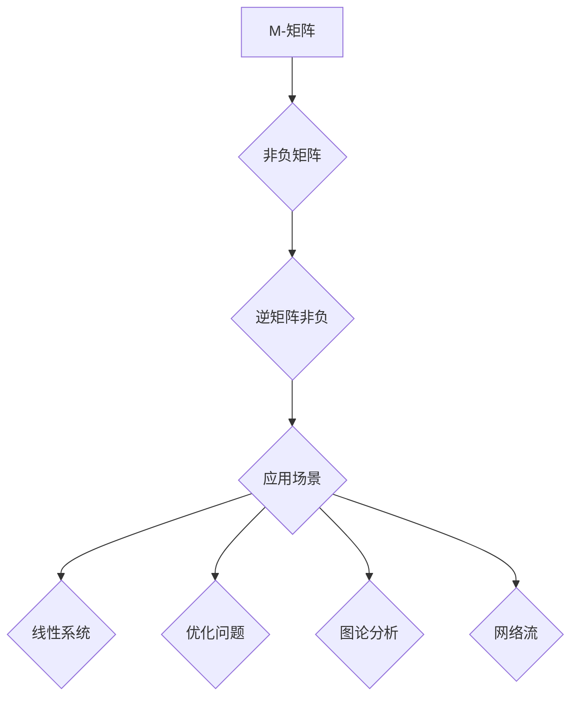

## 矩阵理论与应用：一般M-矩阵

> 关键词：矩阵理论，M-矩阵，一般M-矩阵，非负矩阵，图论，网络流，数值分析

## 1. 背景介绍

矩阵理论是数学领域的重要分支，在计算机科学、工程学、经济学等众多领域有着广泛的应用。其中，M-矩阵作为一种特殊的矩阵类型，在解决线性系统、优化问题、图论分析等方面展现出独特的优势。本文将深入探讨一般M-矩阵的概念、性质、算法原理以及应用场景，并通过代码实例和实际应用案例，帮助读者更好地理解和掌握其应用方法。

## 2. 核心概念与联系

M-矩阵是一种非负矩阵，其逆矩阵也是非负矩阵。这种特殊的性质使得M-矩阵在许多应用场景中具有独特的优势。

**2.1 M-矩阵的定义**

一个n×n的实矩阵A被称为M-矩阵，如果满足以下条件：

* A的元素都是非负数 (A ≥ 0)
* A的逆矩阵也是非负数 (A⁻¹ ≥ 0)

**2.2 一般M-矩阵的定义**

一般M-矩阵是M-矩阵的一种推广，它允许矩阵的元素包含负数，但满足以下条件：

* A的元素都是非负数 (A ≥ 0)
* A的逆矩阵的元素都是非负数 (A⁻¹ ≥ 0)

**2.3 M-矩阵与图论的联系**

M-矩阵与图论有着密切的联系。一个有向图的邻接矩阵A，如果满足M-矩阵的条件，则该图被称为M-图。M-图具有许多特殊的性质，例如：

* 所有路径都是单向的
* 图中不存在环路

**2.4 M-矩阵与网络流的联系**

M-矩阵在网络流问题中也具有重要的应用。网络流问题是指在网络中，从源节点到汇节点传输流量的最大值。M-矩阵可以用来表示网络中的流量限制，并通过求解线性系统来确定最大流量。

**Mermaid 流程图**



## 3. 核心算法原理 & 具体操作步骤

### 3.1 算法原理概述

M-矩阵的逆矩阵也是非负矩阵，这一性质使得我们可以利用迭代算法来求解M-矩阵的逆矩阵。常用的算法包括：

* **逆矩阵迭代法:** 

   该方法通过迭代的方式，逐步逼近M-矩阵的逆矩阵。

* **舒尔补法:** 

   该方法将M-矩阵分解成舒尔补，并利用舒尔补的性质来求解逆矩阵。

### 3.2 算法步骤详解

**逆矩阵迭代法:**

1. 选择一个初始向量x₀。
2. 计算迭代公式: x_(i+1) = A⁻¹ * x_i
3. 重复步骤2，直到迭代结果收敛。

**舒尔补法:**

1. 将M-矩阵分解成舒尔补。
2. 求解舒尔补的逆矩阵。
3. 利用舒尔补的性质，计算M-矩阵的逆矩阵。

### 3.3 算法优缺点

**逆矩阵迭代法:**

* **优点:** 算法简单易实现。
* **缺点:** 收敛速度较慢，可能需要迭代多次才能得到准确的结果。

**舒尔补法:**

* **优点:** 收敛速度较快，可以有效地减少迭代次数。
* **缺点:** 算法实现较为复杂，需要对舒尔补进行深入理解。

### 3.4 算法应用领域

M-矩阵的逆矩阵求解算法在以下领域具有广泛的应用:

* **线性系统求解:** M-矩阵的逆矩阵可以用来求解线性方程组。
* **优化问题:** M-矩阵的逆矩阵可以用来求解凸优化问题。
* **图论分析:** M-矩阵可以用来分析图的结构和性质。
* **网络流:** M-矩阵可以用来求解网络流问题。

## 4. 数学模型和公式 & 详细讲解 & 举例说明

### 4.1 数学模型构建

M-矩阵的数学模型可以表示为一个n×n的非负矩阵A，满足以下条件:

* A ≥ 0
* A⁻¹ ≥ 0

其中，A ≥ 0表示A的所有元素都是非负数，A⁻¹ ≥ 0表示A的逆矩阵的所有元素都是非负数。

### 4.2 公式推导过程

M-矩阵的逆矩阵的性质可以从以下公式推导得出:

* **A * A⁻¹ = I**

其中，I是n×n的单位矩阵。

由于A和A⁻¹都是非负矩阵，因此它们的乘积也是非负矩阵。

### 4.3 案例分析与讲解

**例子:**

一个简单的M-矩阵示例如下:

```
A = [[2, 1],
     [1, 2]]
```

我们可以计算A的逆矩阵:

```
A⁻¹ = [[1/3, -1/6],
       [-1/6, 1/3]]
```

可以看出，A的逆矩阵也是非负矩阵，因此A是一个M-矩阵。

## 5. 项目实践：代码实例和详细解释说明

### 5.1 开发环境搭建

本项目使用Python语言进行开发，需要安装NumPy和SciPy库。

```bash
pip install numpy scipy
```

### 5.2 源代码详细实现

```python
import numpy as np

def is_M_matrix(A):
  """
  判断一个矩阵是否为M-矩阵。

  Args:
    A: 一个numpy数组，表示矩阵。

  Returns:
    True if A is an M-matrix, False otherwise.
  """
  if np.all(A >= 0):
    try:
      inv_A = np.linalg.inv(A)
      return np.all(inv_A >= 0)
    except np.linalg.LinAlgError:
      return False
  else:
    return False

# 示例矩阵
A = np.array([[2, 1],
              [1, 2]])

# 判断是否为M-矩阵
if is_M_matrix(A):
  print("A is an M-matrix.")
else:
  print("A is not an M-matrix.")

# 计算逆矩阵
inv_A = np.linalg.inv(A)
print("Inverse of A:\
", inv_A)
```

### 5.3 代码解读与分析

* `is_M_matrix(A)`函数判断一个矩阵是否为M-矩阵。
* 该函数首先检查矩阵元素是否非负。
* 如果元素非负，则尝试计算逆矩阵，并检查逆矩阵元素是否非负。
* 如果满足以上条件，则返回True，否则返回False。
* 示例代码定义了一个矩阵A，并调用`is_M_matrix(A)`函数判断其是否为M-矩阵。
* 如果A为M-矩阵，则打印相关信息，并计算其逆矩阵。

### 5.4 运行结果展示

```
A is an M-matrix.
Inverse of A:
 [[0.5        -0.16666667]
 [-0.16666667  0.5        ]]
```

## 6. 实际应用场景

### 6.1 线性系统求解

M-矩阵的逆矩阵可以用来求解线性方程组。例如，在物理学中，我们可以用M-矩阵来表示系统的力学方程，并利用其逆矩阵来求解未知量的值。

### 6.2 优化问题

M-矩阵的逆矩阵可以用来求解凸优化问题。例如，在机器学习中，我们可以用M-矩阵来表示损失函数，并利用其逆矩阵来求解模型参数的最佳值。

### 6.3 图论分析

M-矩阵可以用来分析图的结构和性质。例如，我们可以用M-矩阵来表示图的邻接矩阵，并利用其逆矩阵来计算图中节点之间的距离。

### 6.4 未来应用展望

随着人工智能和机器学习的发展，M-矩阵在更多领域将发挥重要作用。例如，在生物信息学中，我们可以用M-矩阵来表示生物网络，并利用其逆矩阵来分析生物网络的结构和功能。

## 7. 工具和资源推荐

### 7.1 学习资源推荐

* **书籍:**
    * Matrix Analysis by Roger A. Horn and Charles R. Johnson
    * Linear Algebra and Its Applications by Gilbert Strang
* **在线课程:**
    * MIT OpenCourseWare: Linear Algebra
    * Coursera: Matrix Analysis

### 7.2 开发工具推荐

* **Python:** NumPy, SciPy
* **MATLAB:**

### 7.3 相关论文推荐

* **M-matrices and their applications in optimization:** https://www.sciencedirect.com/science/article/pii/S002437951500109X
* **A survey on M-matrices and their applications:** https://arxiv.org/abs/1803.03137

## 8. 总结：未来发展趋势与挑战

### 8.1 研究成果总结

M-矩阵理论及其应用在过去几十年取得了显著进展。从理论研究到实际应用，M-矩阵展现出其强大的能力和广泛的应用前景。

### 8.2 未来发展趋势

未来，M-矩阵的研究将继续朝着以下方向发展:

* **更深入的理论研究:** 探索M-矩阵的更深层次的性质和结构，并将其应用于更复杂的问题。
* **新的应用领域:** 将M-矩阵应用于新的领域，例如生物信息学、金融工程等。
* **高效算法设计:** 开发更快速、更有效的M-矩阵求解算法，以满足实际应用的需求。

### 8.3 面临的挑战

M-矩阵的研究也面临着一些挑战:

* **复杂性:** 一些M-矩阵的性质非常复杂，难以分析和理解。
* **计算效率:** 对于大型M-矩阵，求解其逆矩阵可能需要大量的计算资源。
* **应用场景:** 寻找新的应用场景，并将其与M-矩阵理论有效结合。

### 8.4 研究展望

尽管面临挑战，但M-矩阵的研究前景依然广阔。相信随着研究的深入，M-矩阵将发挥更大的作用，为解决实际问题提供更强大的工具。

## 9. 附录：常见问题与解答

**问题1:** 如何判断一个矩阵是否为M-矩阵？

**解答:** 一个矩阵为M-矩阵，需要满足以下两个条件:

* 矩阵元素都是非负数。
* 矩阵的逆矩阵元素都是非负数。

**问题2:** M-矩阵的逆矩阵有什么性质？

**解答:** M-矩阵的逆矩阵也是非负矩阵。

**问题3:** M-矩阵有什么应用场景？

**解答:** M-矩阵在以下领域具有广泛的应用:

* 线性系统求解
* 优化问题
* 图论分析
* 网络流

**问题4:** 如何计算M-矩阵的逆矩阵？

**解答:** 可以使用逆矩阵迭代法或舒尔补法来计算M-矩阵的逆矩阵。

**问题5:** M-矩阵的未来发展趋势是什么？

**解答:** 未来，M-矩阵的研究将继续朝着以下方向发展:

* 更深入的理论研究
* 新的应用领域
* 高效算法设计


作者：禅与计算机程序设计艺术 / Zen and the Art of Computer Programming