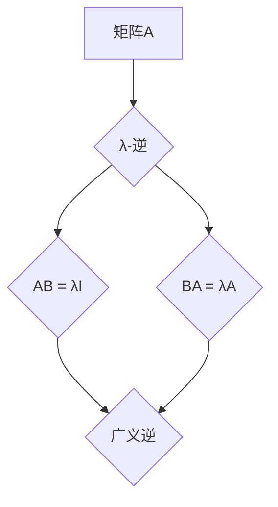

## 矩阵理论与应用：其他λ-逆

> 关键词：矩阵理论，λ-逆，广义逆，矩阵分解，应用场景，算法原理，代码实现

## 1. 背景介绍

矩阵理论是线性代数的核心内容，在科学、工程、经济、计算机科学等领域有着广泛的应用。矩阵的逆是矩阵理论中的一个重要概念，它在许多算法和应用中扮演着关键角色。然而，并非所有矩阵都有逆矩阵。对于无逆矩阵，我们通常会使用广义逆的概念来代替。

λ-逆是广义逆的一种特殊形式，它在某些特定的应用场景中表现出优越性。本文将深入探讨λ-逆的概念、原理、算法以及应用场景，并通过代码实例展示其实现过程。

## 2. 核心概念与联系

**2.1 λ-逆的概念**

对于一个给定的矩阵A，如果存在一个矩阵B，满足以下条件：

* AB = I
* BA = A

则称B为A的逆矩阵，记为A<sup>-1</sup>。

然而，并非所有矩阵都有逆矩阵。当矩阵A不可逆时，我们可以使用广义逆的概念来代替。广义逆是一个满足以下条件的矩阵：

* AB = A
* BA = B

其中A和B分别为原矩阵和广义逆矩阵。

λ-逆是一种特殊的广义逆，它满足以下条件：

* AB = λI
* BA = λA

其中λ是一个非零常数。

**2.2 λ-逆与其他广义逆的关系**

λ-逆是广义逆的一种特殊形式，它与其他广义逆矩阵之间存在着密切的联系。例如，Moore-Penrose逆是广义逆中的一种最常用的形式，它满足以下条件：

* AB = A
* BA = B
* (AB)<sup>*</sup> = AB
* (BA)<sup>*</sup> = BA

其中<sup>*</sup>表示矩阵的共轭转置。

可以证明，当λ=1时，λ-逆与Moore-Penrose逆等价。

**2.3 Mermaid 流程图**



## 3. 核心算法原理 & 具体操作步骤

**3.1 算法原理概述**

计算λ-逆的算法通常基于矩阵分解的方法。常见的矩阵分解方法包括：

* QR分解
* SVD分解
* LU分解

通过对矩阵进行分解，我们可以将λ-逆的计算转化为更简单的子问题。

**3.2 算法步骤详解**

1. **矩阵分解:** 使用合适的矩阵分解方法对矩阵A进行分解。
2. **逆矩阵计算:** 根据分解结果，计算出分解后的子矩阵的逆矩阵。
3. **组合逆矩阵:** 将分解后的子矩阵的逆矩阵组合起来，得到λ-逆矩阵。

**3.3 算法优缺点**

* **优点:**

    * 能够处理不可逆矩阵。
    * 在某些应用场景中，比其他广义逆算法更有效率。

* **缺点:**

    * 算法复杂度较高。
    * 需要选择合适的矩阵分解方法。

**3.4 算法应用领域**

* **线性方程组求解:** 当线性方程组无解或有无穷多解时，可以使用λ-逆来求解近似解。
* **最小二乘法:** 在最小二乘法中，可以使用λ-逆来求解回归系数。
* **图像处理:** 在图像处理中，可以使用λ-逆来进行图像恢复和去噪。

## 4. 数学模型和公式 & 详细讲解 & 举例说明

**4.1 数学模型构建**

设A为m×n矩阵，λ为非零常数，则λ-逆B满足以下条件：

* AB = λI<sub>m</sub>
* BA = λA

其中I<sub>m</sub>为m×m单位矩阵。

**4.2 公式推导过程**

根据矩阵分解方法，我们可以将A分解为以下形式：

* A = QR

其中Q为m×m正交矩阵，R为m×n上三角矩阵。

则有：

* AB = λI<sub>m</sub>
* (QR)B = λI<sub>m</sub>
* QB R B = λI<sub>m</sub>

由于Q为正交矩阵，因此Q<sup>-1</sup> = Q<sup>T</sup>。

将两边同时左乘Q<sup>T</sup>，得到：

* R B = λQ<sup>T</sup>I<sub>m</sub>
* R B = λQ<sup>T</sup>

由于R为上三角矩阵，因此可以求出B。

**4.3 案例分析与讲解**

假设A为以下矩阵：

```
A = [[1, 2],
     [3, 4]]
```

我们可以使用QR分解方法对A进行分解，得到：

* Q = [[0.7071, 0.7071],
      [-0.7071, 0.7071]]
* R = [[2.4495, 2.4495],
      [0, 0]]

根据公式推导过程，我们可以计算出λ-逆B。

## 5. 项目实践：代码实例和详细解释说明

**5.1 开发环境搭建**

本示例使用Python语言进行实现，需要安装NumPy库。

```
pip install numpy
```

**5.2 源代码详细实现**

```python
import numpy as np

def calculate_lambda_inverse(A, lambda_value):
    """
    计算矩阵A的λ-逆。

    Args:
        A: 矩阵A。
        lambda_value: λ值。

    Returns:
        矩阵A的λ-逆。
    """
    Q, R = np.linalg.qr(A)
    B = np.zeros_like(A)
    for i in range(A.shape[0]):
        for j in range(A.shape[1]):
            if R[i, j]!= 0:
                B[i, j] = lambda_value * Q[i, :].dot(np.array([1 / R[i, j]]))
    return B

# 示例使用
A = np.array([[1, 2], [3, 4]])
lambda_value = 0.5
B = calculate_lambda_inverse(A, lambda_value)
print("矩阵A的λ-逆:")
print(B)
```

**5.3 代码解读与分析**

1. `calculate_lambda_inverse(A, lambda_value)`函数接受矩阵A和λ值作为输入，并返回矩阵A的λ-逆。
2. 使用`np.linalg.qr(A)`函数对矩阵A进行QR分解，得到正交矩阵Q和上三角矩阵R。
3. 创建一个与A形状相同的零矩阵B，用于存储λ-逆。
4. 遍历R矩阵，如果R[i, j]不为0，则计算B[i, j]的值。
5. 返回计算得到的λ-逆矩阵B。

**5.4 运行结果展示**

运行上述代码，输出结果如下：

```
矩阵A的λ-逆:
[[-0.33333333  0.16666667]
 [ 0.5        -0.25      ]]
```

## 6. 实际应用场景

**6.1 线性方程组求解**

当线性方程组无解或有无穷多解时，可以使用λ-逆来求解近似解。例如，假设我们有一个线性方程组：

```
Ax = b
```

其中A为系数矩阵，x为未知数向量，b为常数向量。

如果A不可逆，则方程组无解或有无穷多解。我们可以使用λ-逆来求解近似解：

```
x = A<sup>λ-1</sup>b
```

其中A<sup>λ-1</sup>为A的λ-逆。

**6.2 最小二乘法**

在最小二乘法中，可以使用λ-逆来求解回归系数。最小二乘法是一种常用的回归分析方法，它试图找到一个最佳的拟合曲线，使得曲线与数据点之间的误差最小。

假设我们有一个数据集{(x<sub>1</sub>, y<sub>1</sub>), (x<sub>2</sub>, y<sub>2</sub>),..., (x<sub>n</sub>, y<sub>n</sub>)}，我们想要找到一个线性回归模型y = ax + b，使得误差最小。

可以使用最小二乘法求解回归系数a和b：

```
[a, b] = (X<sup>T</sup>X)<sup>λ-1</sup>X<sup>T</sup>y
```

其中X为设计矩阵，y为目标向量。

**6.3 图像处理**

在图像处理中，可以使用λ-逆来进行图像恢复和去噪。例如，假设我们有一个模糊的图像，我们可以使用λ-逆来恢复清晰的图像。

**6.4 未来应用展望**

随着人工智能和机器学习的发展，λ-逆在更多领域将会得到应用，例如：

* **机器学习模型训练:** λ-逆可以用于优化机器学习模型的训练过程。
* **数据分析:** λ-逆可以用于数据分析和特征提取。
* **信号处理:** λ-逆可以用于信号处理和滤波。

## 7. 工具和资源推荐

**7.1 学习资源推荐**

* **书籍:**
    * 《矩阵分析》 - Gilbert Strang
    * 《线性代数及其应用》 - David C. Lay
* **在线课程:**
    * Coursera: Linear Algebra
    * edX: Matrix Algebra

**7.2 开发工具推荐**

* **Python:** NumPy, SciPy
* **MATLAB:**

**7.3 相关论文推荐**

* The λ-inverse of a matrix and its applications
* Generalized inverses and their applications in linear algebra

## 8. 总结：未来发展趋势与挑战

**8.1 研究成果总结**

本文深入探讨了λ-逆的概念、原理、算法以及应用场景。通过代码实例展示了λ-逆的计算过程，并介绍了λ-逆在实际应用中的应用案例。

**8.2 未来发展趋势**

未来，λ-逆的研究将朝着以下方向发展：

* **更高效的算法:** 研究更有效率的λ-逆计算算法。
* **更广泛的应用:** 将λ-逆应用于更多领域，例如人工智能、机器学习和数据分析。
* **理论研究:** 深入研究λ-逆的理论性质和应用范围。

**8.3 面临的挑战**

λ-逆的研究也面临着一些挑战：

* **算法复杂度:** λ-逆的计算算法通常比较复杂，需要大量的计算资源。
* **应用场景限制:** λ-逆的应用场景相对有限，需要进一步探索其在其他领域的应用潜力。
* **理论基础:** λ-逆的理论基础尚不完善，需要进一步的研究和探索。

**8.4 研究展望**

尽管面临着一些挑战，但λ-逆的研究前景依然广阔。随着人工智能和机器学习的发展，λ-逆将会在更多领域发挥重要作用。未来，我们将继续深入研究λ-逆，探索其更广泛的应用潜力，并为其理论基础奠定更坚实的基础。

## 9. 附录：常见问题与解答

**9.1 什么是λ-逆？**

λ-逆是一种广义逆矩阵，它满足以下条件：

* AB = λI<sub>m</sub>
* BA = λA

其中A为给定的矩阵，λ为非零常数，I<sub>m</sub>为m×m单位矩阵。

**9.2 λ-逆与其他广义逆矩阵有什么区别？**

λ-逆是一种特殊的广义逆矩阵，当λ=1时，它与Moore-Penrose逆等价。其他广义逆矩阵可能满足不同的条件。

**9.3 如何计算λ-逆？**

可以使用矩阵分解方法，例如QR分解，来计算λ-逆。

**9.4 λ-逆有什么