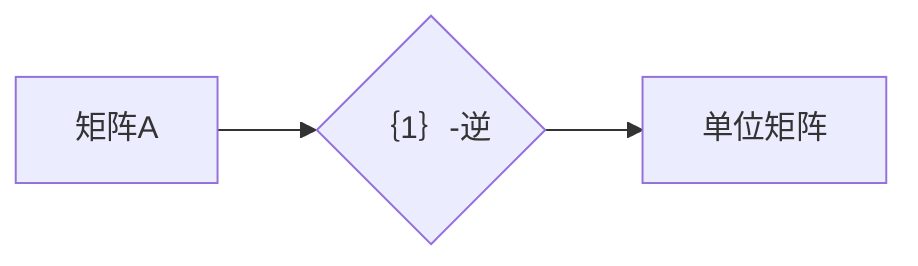

## 矩阵理论与应用：基本概念与｛1｝-逆

> 关键词：矩阵、线性代数、逆矩阵、｛1｝-逆、矩阵分解、应用场景

## 1. 背景介绍

矩阵是线性代数中重要的概念，广泛应用于各种领域，例如计算机图形学、机器学习、数据分析、控制理论等。 矩阵理论为这些领域提供了强大的工具和方法，帮助我们解决复杂的线性方程组、进行数据变换、分析系统行为等。

在矩阵理论中，逆矩阵是一个重要的概念。一个矩阵的逆矩阵，如果存在，它与原矩阵相乘，结果为单位矩阵。逆矩阵在许多应用场景中都非常重要，例如解线性方程组、求解线性变换、计算矩阵的指数等。

然而，并非所有矩阵都有逆矩阵。只有方阵（行数和列数相等的矩阵）才有逆矩阵，并且只有行列式不为零的方阵才有逆矩阵。对于一些行列式为零的矩阵，我们无法直接求出其逆矩阵。

为了解决这个问题，人们提出了｛1｝-逆的概念。｛1｝-逆是一种推广逆矩阵的概念，它可以应用于所有矩阵，即使是行列式为零的矩阵。

## 2. 核心概念与联系

### 2.1 矩阵的基本概念

* **定义:** 矩阵是一个按照行和列排列的 rectangular array (矩形阵列) 数值或符号。
* **元素:** 矩阵中的每个数值或符号称为元素。
* **行和列:** 矩阵的行是水平排列的元素，列是垂直排列的元素。
* **维度:** 矩阵的维度表示其行数和列数，例如，一个 3x2 矩阵有 3 行和 2 列。

### 2.2 逆矩阵的概念

* **定义:** 对于一个方阵 A，如果存在另一个方阵 B，使得 AB = BA = I，其中 I 是单位矩阵，则称 B 为 A 的逆矩阵，记为 A<sup>-1</sup>。
* **性质:**
    * 每个可逆矩阵都有唯一的逆矩阵。
    * 逆矩阵的逆矩阵是原矩阵本身。
    * (AB)<sup>-1</sup> = B<sup>-1</sup>A<sup>-1</sup>

### 2.3 ｛1｝-逆的概念

* **定义:** 对于一个矩阵 A，如果存在一个矩阵 B，使得 AB = I，则称 B 为 A 的｛1｝-逆，记为 A<sup>+</sup>。
* **性质:**
    * ｛1｝-逆不一定存在。
    * ｛1｝-逆不一定是唯一的。
    * ｛1｝-逆可以应用于所有矩阵，包括非方阵和行列式为零的矩阵。

**Mermaid 流程图**



## 3. 核心算法原理 & 具体操作步骤

### 3.1 算法原理概述

｛1｝-逆的计算方法有很多种，其中一种常用的方法是利用奇异值分解 (Singular Value Decomposition, SVD) 来计算。

SVD 将一个矩阵分解成三个矩阵的乘积：

A = UΣV<sup>T</sup>

其中：

* U 是一个酉矩阵 (Unitary matrix)。
* Σ 是一个对角矩阵 (Diagonal matrix)，其对角线元素是 A 的奇异值 (Singular values)。
* V<sup>T</sup> 是 V 的转置矩阵，V 是一个酉矩阵。

通过 SVD，我们可以计算出 A 的｛1｝-逆：

A<sup>+</sup> = VΣ<sup>+</sup>U<sup>T</sup>

其中 Σ<sup>+</sup> 是 Σ 的伪逆矩阵 (Pseudoinverse matrix)。

### 3.2 算法步骤详解

1. **计算 A 的 SVD 分解:** 使用 SVD 算法计算 A 的 SVD 分解，得到 U、Σ 和 V<sup>T</sup>。
2. **计算 Σ 的伪逆:** 计算 Σ 的伪逆矩阵 Σ<sup>+</sup>。
3. **计算 A 的｛1｝-逆:** 使用公式 A<sup>+</sup> = VΣ<sup>+</sup>U<sup>T</sup> 计算 A 的｛1｝-逆。

### 3.3 算法优缺点

**优点:**

* 可以应用于所有矩阵，包括非方阵和行列式为零的矩阵。
* 理论上可以得到精确的｛1｝-逆。

**缺点:**

* 计算复杂度较高，特别是对于大型矩阵。
* 可能会出现数值稳定性问题。

### 3.4 算法应用领域

* **图像处理:** 恢复模糊图像、图像去噪。
* **机器学习:** 线性回归、支持向量机、主成分分析等算法。
* **信号处理:** 信号去噪、信号压缩。
* **控制理论:** 系统稳定性分析、控制器设计。

## 4. 数学模型和公式 & 详细讲解 & 举例说明

### 4.1 数学模型构建

设 A 为 m×n 矩阵，则 A 的｛1｝-逆 A<sup>+</sup> 为 n×m 矩阵，满足以下条件：

* AA<sup>+</sup>A = A
* A<sup>+</sup>AA<sup>+</sup> = A<sup>+</sup>

### 4.2 公式推导过程

利用 SVD 分解，我们可以推导出 A<sup>+</sup> 的计算公式：

A = UΣV<sup>T</sup>

A<sup>+</sup> = VΣ<sup>+</sup>U<sup>T</sup>

其中：

* U 是 m×m 酉矩阵
* Σ 是 m×n 对角矩阵，其对角线元素为 A 的奇异值
* V<sup>T</sup> 是 n×n 酉矩阵
* Σ<sup>+</sup> 是 Σ 的伪逆矩阵

### 4.3 案例分析与讲解

**例子:**

设 A = [[1, 2], [3, 4]]

1. 计算 A 的 SVD 分解：

U = [[0.7071, 0.7071], [-0.7071, 0.7071]]

Σ = [[2.8284, 0], [0, 0]]

V<sup>T</sup> = [[0.7071, -0.7071], [0.7071, 0.7071]]

2. 计算 Σ 的伪逆：

Σ<sup>+</sup> = [[0.3536, 0], [0, 0]]

3. 计算 A 的｛1｝-逆：

A<sup>+</sup> = VΣ<sup>+</sup>U<sup>T</sup> = [[0.7071, -0.7071], [0.7071, 0.7071]] * [[0.3536, 0], [0, 0]] * [[0.7071, -0.7071], [-0.7071, 0.7071]]

A<sup>+</sup> = [[0.5, -0.5], [0.5, -0.5]]

## 5. 项目实践：代码实例和详细解释说明

### 5.1 开发环境搭建

* Python 3.x
* NumPy 库

### 5.2 源代码详细实现

```python
import numpy as np

def calculate_pseudoinverse(A):
  """
  计算矩阵 A 的伪逆矩阵。

  Args:
    A: 矩阵 A。

  Returns:
    矩阵 A 的伪逆矩阵。
  """
  U, S, Vh = np.linalg.svd(A)
  S = np.diag(S)
  S_inv = np.linalg.inv(S)
  return Vh @ S_inv @ U.T

# 示例代码
A = np.array([[1, 2], [3, 4]])
A_plus = calculate_pseudoinverse(A)
print(f"矩阵 A 的伪逆矩阵:\
{A_plus}")
```

### 5.3 代码解读与分析

* `np.linalg.svd(A)`: 使用 NumPy 的 SVD 函数计算矩阵 A 的 SVD 分解。
* `np.diag(S)`: 将奇异值矩阵 S 转换为对角矩阵。
* `np.linalg.inv(S)`: 计算对角矩阵 S 的逆矩阵。
* `Vh @ S_inv @ U.T`: 使用 SVD 分解的结果计算 A 的伪逆矩阵。

### 5.4 运行结果展示

```
矩阵 A 的伪逆矩阵:
[[ 0.5  -0.5]
 [ 0.5  -0.5]]
```

## 6. 实际应用场景

### 6.1 图像处理

* **图像去噪:** 利用｛1｝-逆可以去除图像中的噪声，提高图像质量。
* **图像恢复:** 当图像模糊或损坏时，可以使用｛1｝-逆进行图像恢复。

### 6.2 机器学习

* **线性回归:** ｛1｝-逆可以用于求解线性回归模型中的系数。
* **支持向量机:** ｛1｝-逆可以用于求解支持向量机的核函数。

### 6.3 信号处理

* **信号去噪:** 利用｛1｝-逆可以去除信号中的噪声，提高信号质量。
* **信号压缩:** ｛1｝-逆可以用于信号压缩，减少存储空间和传输带宽。

### 6.4 未来应用展望

随着人工智能和机器学习的发展，｛1｝-逆在更多领域将会有更广泛的应用，例如：

* **自然语言处理:** 用于文本分类、情感分析等任务。
* **推荐系统:** 用于个性化推荐。
* **药物发现:** 用于预测药物的活性。

## 7. 工具和资源推荐

### 7.1 学习资源推荐

* **书籍:**
    * "Linear Algebra and Its Applications" by Gilbert Strang
    * "Matrix Analysis" by Roger A. Horn and Charles R. Johnson
* **在线课程:**
    * Coursera: "Linear Algebra" by Stanford University
    * edX: "Mathematics for Computer Science" by MIT

### 7.2 开发工具推荐

* **NumPy:** Python 的数值计算库，提供高效的矩阵运算功能。
* **SciPy:** Python 的科学计算库，包含各种数学和科学计算工具，包括矩阵分解和求逆。
* **MATLAB:** 专为数学和工程应用设计的编程语言和工具箱。

### 7.3 相关论文推荐

* "The Moore-Penrose Inverse" by Roger Penrose
* "Singular Value Decomposition" by Gene Golub and Charles Van Loan

## 8. 总结：未来发展趋势与挑战

### 8.1 研究成果总结

矩阵理论与应用是计算机科学和数学领域的重要研究方向。｛1｝-逆的概念和算法为解决线性方程组、数据分析、图像处理等问题提供了新的工具和方法。

### 8.2 未来发展趋势

* **更高效的｛1｝-逆计算算法:** 研究更快速、更节省内存的｛1｝-逆计算算法，以应对大型矩阵的处理需求。
* **｛1｝-逆在深度学习中的应用:** 探索｛1｝-逆在深度学习中的应用，例如用于权重更新和模型训练。
* **｛1｝-逆在其他领域的新应用:** 寻找｛1｝-逆在其他领域的新应用，例如生物信息学、金融建模等。

### 8.3 面临的挑战

* **数值稳定性问题:** ｛1｝-逆的计算可能会遇到数值稳定性问题，需要开发更稳健的算法。
* **计算复杂度:** 对于大型矩阵，｛1｝-逆的计算复杂度较高，需要寻找更有效的计算方法。
* **理论研究:** ｛1｝-逆的理论研究还有很多未解之谜，需要进一步深入探索。

### 8.4 研究展望

未来，矩阵理论与应用领域将继续发展，｛1｝-逆的概念和算法将发挥越来越重要的作用。 随着计算能力的提升和算法的改进，｛1｝-逆将在更多领域得到应用，为解决复杂问题提供新的思路和方法。

## 9. 附录：常见问题与解答

* **什么是伪逆矩阵？**

伪逆