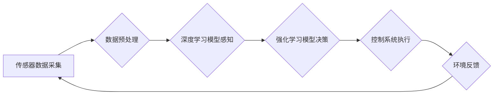

## 端到端自动驾驶的渐进式商业化路径

> 关键词：自动驾驶、端到端学习、商业化、渐进式部署、传感器融合、深度学习、强化学习

## 1. 背景介绍

自动驾驶技术作为未来交通运输的重要发展方向，近年来取得了显著进展。从早期基于规则的控制系统到如今的深度学习驱动的端到端自动驾驶，技术演进速度惊人。然而，将自动驾驶技术从实验室推向市场，实现商业化应用仍然面临着诸多挑战。

端到端自动驾驶，顾名思义，是指将感知、决策和控制等所有环节整合在一起，通过深度学习模型直接从传感器数据中学习驾驶策略，无需人工设计复杂的规则和中间层。这种方法具有学习能力强、适应性好、系统集成度高等优点，被认为是未来自动驾驶技术的发展方向。

然而，端到端自动驾驶的实现需要克服许多技术难题，例如：

* **数据获取和标注**: 训练高性能的端到端自动驾驶模型需要海量真实驾驶场景数据，而数据的标注成本高昂且耗时。
* **模型复杂度和训练效率**: 端到端自动驾驶模型通常非常复杂，训练过程需要大量的计算资源和时间。
* **安全性和可靠性**: 自动驾驶系统需要在各种复杂环境下保证安全性和可靠性，这需要进行严格的测试和验证。
* **法规和伦理**: 自动驾驶技术的应用涉及到法律法规和伦理道德等问题，需要进行充分的探讨和完善。

## 2. 核心概念与联系

端到端自动驾驶的核心概念包括：

* **传感器融合**: 利用多种传感器（如摄像头、雷达、激光雷达等）获取车辆周围环境信息，并进行融合处理，形成更加完整和可靠的感知结果。
* **深度学习**: 利用深度神经网络对传感器数据进行特征提取和学习，实现对驾驶场景的理解和预测。
* **强化学习**: 通过与环境交互，学习最优的驾驶策略，使车辆能够在复杂环境下安全高效地行驶。

**核心架构流程图:**



## 3. 核心算法原理 & 具体操作步骤

### 3.1  算法原理概述

端到端自动驾驶的核心算法主要包括深度学习和强化学习。

* **深度学习**: 通过多层神经网络，从传感器数据中学习特征和驾驶策略。常见的深度学习模型包括卷积神经网络（CNN）、循环神经网络（RNN）和生成对抗网络（GAN）。
* **强化学习**: 通过与环境交互，学习最优的驾驶策略。强化学习算法的目标是最大化累积奖励，通过试错和学习，找到最优的行动策略。

### 3.2  算法步骤详解

**深度学习算法步骤:**

1. **数据收集和预处理**: 收集大量真实驾驶场景数据，并进行预处理，例如图像裁剪、数据增强等。
2. **模型构建**: 根据任务需求，选择合适的深度学习模型架构，例如CNN、RNN等。
3. **模型训练**: 使用训练数据训练深度学习模型，通过反向传播算法调整模型参数，使模型能够准确预测驾驶场景信息。
4. **模型评估**: 使用测试数据评估模型性能，例如准确率、召回率等。
5. **模型部署**: 将训练好的模型部署到自动驾驶系统中，用于感知驾驶场景信息。

**强化学习算法步骤:**

1. **环境建模**: 建立自动驾驶系统的环境模型，模拟真实驾驶场景。
2. **奖励函数设计**: 设计奖励函数，根据车辆的行为和环境状态，给予相应的奖励或惩罚。
3. **策略学习**: 使用强化学习算法，例如Q学习、SARSA等，学习最优的驾驶策略，使车辆能够最大化累积奖励。
4. **策略评估**: 使用测试数据评估策略性能，例如平均奖励、成功率等。
5. **策略部署**: 将训练好的策略部署到自动驾驶系统中，用于决策驾驶行为。

### 3.3  算法优缺点

**深度学习算法:**

* **优点**: 学习能力强，能够从大量数据中提取复杂特征，适应性好。
* **缺点**: 数据依赖性强，需要海量数据进行训练，训练过程耗时且资源消耗大。

**强化学习算法:**

* **优点**: 可以学习最优的策略，适应性强，能够在复杂环境下做出决策。
* **缺点**: 训练过程复杂，需要设计合适的奖励函数，容易陷入局部最优。

### 3.4  算法应用领域

* **自动驾驶**: 感知环境、规划路径、控制车辆。
* **机器人**: 运动控制、目标识别、路径规划。
* **图像识别**: 物体检测、图像分类、场景理解。
* **自然语言处理**: 语义理解、机器翻译、文本生成。

## 4. 数学模型和公式 & 详细讲解 & 举例说明

### 4.1  数学模型构建

端到端自动驾驶的数学模型通常基于深度学习和强化学习框架。

* **深度学习模型**: 使用神经网络结构，通过多层神经元进行特征提取和学习。模型参数通过反向传播算法进行优化。
* **强化学习模型**: 使用状态、动作、奖励等概念，构建状态空间和动作空间。策略通过价值函数或策略梯度算法进行优化。

### 4.2  公式推导过程

**深度学习模型**:

* **损失函数**: 用于衡量模型预测结果与真实值的差异。常见的损失函数包括均方误差（MSE）、交叉熵损失（CE）等。
* **反向传播算法**: 用于计算模型参数的梯度，并根据梯度更新模型参数。

**强化学习模型**:

* **价值函数**: 用于评估状态或状态-动作对的期望回报。常见的价值函数包括状态价值函数（V）和动作价值函数（Q）。
* **策略梯度算法**: 用于更新策略参数，使策略能够最大化累积奖励。

### 4.3  案例分析与讲解

**案例**: 使用深度学习模型进行自动驾驶车辆的 Lane Keeping Assist (LKA)

* **目标**: 使车辆在车道内行驶，避免偏离车道。
* **数据**: 收集车辆行驶过程中摄像头图像数据，并标注车道信息。
* **模型**: 使用 CNN 模型提取图像特征，并预测车辆相对于车道的偏移量。
* **损失函数**: 使用 MSE 作为损失函数，最小化预测偏移量与真实偏移量的差异。
* **训练**: 使用训练数据训练 CNN 模型，并通过反向传播算法更新模型参数。
* **部署**: 将训练好的模型部署到自动驾驶系统中，用于控制车辆转向，保持在车道内行驶。

## 5. 项目实践：代码实例和详细解释说明

### 5.1  开发环境搭建

* **操作系统**: Ubuntu 18.04 或更高版本
* **编程语言**: Python 3.6 或更高版本
* **深度学习框架**: TensorFlow 或 PyTorch
* **其他工具**: Git、Docker

### 5.2  源代码详细实现

```python
# 使用 TensorFlow 实现简单的 Lane Keeping Assist 模型

import tensorflow as tf

# 定义模型结构
model = tf.keras.models.Sequential([
    tf.keras.layers.Conv2D(32, (3, 3), activation='relu', input_shape=(640, 480, 3)),
    tf.keras.layers.MaxPooling2D((2, 2)),
    tf.keras.layers.Conv2D(64, (3, 3), activation='relu'),
    tf.keras.layers.MaxPooling2D((2, 2)),
    tf.keras.layers.Flatten(),
    tf.keras.layers.Dense(10, activation='softmax')
])

# 定义损失函数和优化器
model.compile(loss='categorical_crossentropy', optimizer='adam', metrics=['accuracy'])

# 训练模型
model.fit(train_data, train_labels, epochs=10)

# 评估模型
loss, accuracy = model.evaluate(test_data, test_labels)
print('Loss:', loss)
print('Accuracy:', accuracy)

# 使用模型预测
predictions = model.predict(test_image)
```

### 5.3  代码解读与分析

* **模型结构**: 使用了卷积神经网络（CNN）结构，提取图像特征，并进行分类。
* **损失函数**: 使用了交叉熵损失函数，用于分类任务。
* **优化器**: 使用了 Adam 优化器，用于更新模型参数。
* **训练过程**: 使用训练数据训练模型，并通过评估指标（损失函数和准确率）监控训练过程。
* **预测过程**: 使用训练好的模型对测试图像进行预测，得到分类结果。

### 5.4  运行结果展示

* **训练过程**: 训练过程中，损失函数会逐渐降低，准确率会逐渐提高。
* **评估结果**: 评估结果会显示模型在测试数据上的损失函数和准确率。
* **预测结果**: 预测结果会显示模型对测试图像的分类结果。

## 6. 实际应用场景

### 6.1  自动驾驶汽车

端到端自动驾驶技术可以实现车辆的自动驾驶功能，例如自动泊车、自动变道、自动巡航等。

### 6.2  无人机

端到端自动驾驶技术可以应用于无人机的自主飞行，例如无人机航拍、无人机物流等。

### 6.3  机器人

端到端自动驾驶技术可以应用于机器人的自主导航，例如工业机器人、服务机器人等。

### 6.4  未来应用展望

端到端自动驾驶技术在未来将有更广泛的应用场景，例如：

* **智能交通系统**: 实现车辆之间的协同控制，提高交通效率和安全性。
* **智慧城市**: 实现无人驾驶公交车、无人驾驶出租车等，提高城市公共交通效率。
* **医疗服务**: 实现无人驾驶救护车，提高医疗服务效率和及时性。

## 7. 工具和资源推荐

### 7.1  学习资源推荐

* **书籍**:
    * Deep Learning by Ian Goodfellow
    * Reinforcement Learning: An Introduction by Richard S. Sutton and Andrew G. Barto
* **在线课程**:
    * Coursera: Deep Learning Specialization
    * Udacity: Self-Driving Car Engineer Nanodegree
* **开源项目**:
    * TensorFlow
    * PyTorch
    * OpenAI Gym

### 7.2  开发工具推荐

* **IDE**: PyCharm, VS Code
* **深度学习框架**: TensorFlow, PyTorch
* **数据标注工具**: LabelImg, CVAT

### 7.3  相关论文推荐

* **端到端自动驾驶**:
    * End to End Learning for Self-Driving Cars
    * Learning to Drive with Deep Reinforcement Learning
* **深度学习**:
    * ImageNet Classification with Deep Convolutional Neural Networks
    * Deep Residual Learning for Image Recognition
* **强化学习**:
    * Deep Q-Network
    * Proximal Policy Optimization Algorithms

## 8. 总结：未来发展趋势与挑战

### 8.1  研究成果总结

端到端自动驾驶技术取得了显著进展，能够实现车辆在复杂环境下的自主驾驶。

### 8.2  未来发展趋势

* **模型复杂度提升**: 使用更复杂的深度学习模型，例如Transformer、Graph Neural Network等，提高模型的学习能力和泛化能力。
* **数据获取与标注**: 开发更有效的自动标注方法，降低数据标注成本，提高数据质量。
* **安全性和可靠性**: 加强安全性和可靠性测试，确保自动驾驶系统的安全性和可靠性。
* **伦理与法律**: 完善自动驾驶技术的伦理和法律法规，解决自动驾驶技术带来的伦理和法律问题。

### 8.3  面临的挑战

* **数据获取**: 训练高性能的端到端自动驾驶模型需要海量真实驾驶场景数据，数据获取成本高昂且耗时。
* **