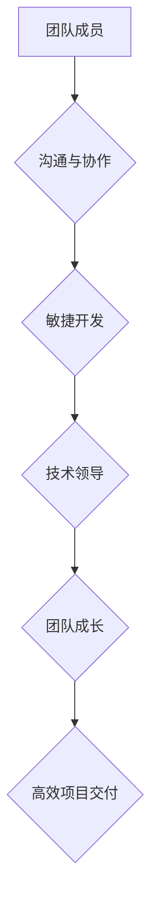

## 管理的智慧：激发团队潜能

> 关键词：团队管理、软件开发、协作、沟通、效率、敏捷开发、技术领导

### 1. 背景介绍

在当今科技日新月异的时代，软件开发已经成为推动社会进步的引擎之一。然而，软件开发项目往往面临着复杂的技术挑战、紧迫的交付压力以及团队成员之间的协作难题。如何有效地管理团队，激发团队成员的潜能，提高团队的效率和创新能力，成为软件开发领域的一项至关重要的课题。

传统的管理模式往往强调命令式管理和层级结构，这在某些情况下可能有效，但在软件开发领域，这种模式往往难以适应快速迭代、需求变化频繁的开发环境。现代软件开发更需要一种灵活、协作、以人为本的管理模式，才能真正激发团队的潜能，实现高效的项目交付。

### 2. 核心概念与联系

**2.1 团队协作与沟通**

团队协作是软件开发的核心要素之一。高效的团队协作需要建立良好的沟通机制，确保团队成员之间能够及时、准确地传递信息，共同理解项目目标和需求。

**2.2 敏捷开发理念**

敏捷开发是一种迭代式、增量式软件开发方法，强调快速反馈、持续改进和团队协作。敏捷开发的核心价值观包括：

* **个人和交互高于流程和工具**
* **工作软件高于全面文档**
* **客户合作高于合同谈判**
* **响应变化高于遵循计划**

**2.3 技术领导与团队成长**

技术领导者在软件开发团队中扮演着至关重要的角色。他们不仅需要具备扎实的技术能力，更需要具备良好的沟通、激励和引导能力，能够带领团队成员不断学习、成长，提升团队的技术水平。

**Mermaid 流程图**



### 3. 核心算法原理 & 具体操作步骤

**3.1 算法原理概述**

在软件开发团队管理中，我们可以将团队协作、沟通、敏捷开发和技术领导等核心概念看作是一种算法，其目标是实现高效的项目交付。

**3.2 算法步骤详解**

1. **明确目标和需求:** 团队成员需要共同理解项目目标和需求，并制定清晰的项目计划。
2. **建立沟通机制:** 建立有效的沟通机制，确保团队成员之间能够及时、准确地传递信息。
3. **采用敏捷开发方法:** 使用迭代式、增量式开发方法，快速反馈、持续改进，并根据需求变化进行调整。
4. **技术领导与团队成长:** 技术领导者需要带领团队成员不断学习、成长，提升团队的技术水平。
5. **持续评估和优化:** 定期评估团队工作效率和项目进度，并根据实际情况进行调整和优化。

**3.3 算法优缺点**

**优点:**

* 提高团队协作效率
* 增强团队成员的责任感和归属感
* 提高项目交付质量和速度
* 适应快速变化的开发环境

**缺点:**

* 需要团队成员具备良好的沟通和协作能力
* 需要技术领导者具备良好的领导和引导能力
* 需要团队成员不断学习和成长

**3.4 算法应用领域**

该算法适用于各种规模的软件开发团队，包括小型创业公司、大型企业以及开源项目。

### 4. 数学模型和公式 & 详细讲解 & 举例说明

**4.1 数学模型构建**

我们可以使用以下数学模型来描述团队协作效率：

```latex
Efficiency = \frac{Output}{Input}
```

其中：

* **Output:** 团队完成的工作量
* **Input:** 团队投入的时间和资源

**4.2 公式推导过程**

该公式的推导过程基于以下假设：

* 团队成员之间能够有效地协作
* 团队成员能够高效地利用时间和资源
* 项目目标和需求明确

**4.3 案例分析与讲解**

假设有两个软件开发团队，团队 A 和团队 B。

* 团队 A 的成员之间缺乏沟通，协作效率低，需要投入 100 小时才能完成一个功能模块。
* 团队 B 的成员之间沟通顺畅，协作效率高，只需要投入 60 小时才能完成同一个功能模块。

根据上述公式，我们可以计算出：

* 团队 A 的效率为 1/100
* 团队 B 的效率为 1/60

可见，团队 B 的协作效率更高，能够在更短的时间内完成相同的工作量。

### 5. 项目实践：代码实例和详细解释说明

**5.1 开发环境搭建**

为了更好地理解团队管理的实践，我们可以使用一个简单的项目来进行演示。

**项目目标:** 开发一个简单的在线聊天应用程序。

**开发环境:**

* 操作系统: Windows/macOS/Linux
* 编程语言: Python
* 框架: Flask

**5.2 源代码详细实现**

```python
from flask import Flask, render_template, request

app = Flask(__name__)

@app.route('/')
def index():
    return render_template('index.html')

@app.route('/send_message', methods=['POST'])
def send_message():
    message = request.form['message']
    # 处理消息，例如存储到数据库或发送给其他用户
    return 'Message sent successfully!'

if __name__ == '__main__':
    app.run(debug=True)
```

**5.3 代码解读与分析**

这段代码是一个简单的 Flask 应用程序，用于演示在线聊天应用程序的基本功能。

* `index()` 函数渲染聊天应用程序的首页。
* `send_message()` 函数处理用户发送的消息，并将其存储到数据库或发送给其他用户。

**5.4 运行结果展示**

运行上述代码后，可以在浏览器中访问 http://127.0.0.1:5000/，即可看到聊天应用程序的首页。

### 6. 实际应用场景

**6.1 软件开发团队管理**

在软件开发团队中，可以使用上述算法和工具来提高团队协作效率，例如：

* 使用协作工具，例如 Jira、Trello 或 Slack，来管理项目任务和沟通。
* 使用敏捷开发方法，例如 Scrum 或 Kanban，来进行项目迭代和管理。
* 定期进行团队建设活动，例如团队会议、代码审查和技术分享，来增强团队成员之间的沟通和协作。

**6.2 开源项目管理**

开源项目通常由来自世界各地的志愿者组成，团队管理更加复杂。可以使用上述算法和工具来提高开源项目的协作效率，例如：

* 使用 GitHub 等平台来管理代码仓库和项目任务。
* 使用邮件列表、IRC 或 Slack 等工具来进行项目沟通。
* 建立清晰的贡献指南和代码风格规范，来确保项目代码质量。

**6.4 未来应用展望**

随着人工智能技术的不断发展，未来软件开发团队管理将更加智能化和自动化。例如：

* 使用人工智能算法来分析团队成员的工作效率和沟通模式，并提供个性化的建议。
* 使用人工智能机器人来协助团队成员完成一些重复性的工作，例如代码审查和测试。
* 使用虚拟现实技术来创建虚拟团队协作环境，提高团队成员之间的互动和协作效率。

### 7. 工具和资源推荐

**7.1 学习资源推荐**

* **书籍:**
    * 《The Phoenix Project: A Novel About IT, DevOps, and Helping Your Business Win》
    * 《The DevOps Handbook: How to Create World-Class Agility, Reliability, and Security in Technology Organizations》
    * 《Agile Software Development, Principles, Patterns, and Practices》
* **在线课程:**
    * Udemy: Agile Project Management
    * Coursera: DevOps Fundamentals
    * edX: Introduction to Software Engineering

**7.2 开发工具推荐**

* **协作工具:** Jira, Trello, Slack, Microsoft Teams
* **版本控制工具:** Git, GitHub, Bitbucket
* **持续集成/持续交付工具:** Jenkins, CircleCI, Travis CI

**7.3 相关论文推荐**

* The Phoenix Project: A Novel About IT, DevOps, and Helping Your Business Win
* The DevOps Handbook: How to Create World-Class Agility, Reliability, and Security in Technology Organizations
* Agile Software Development, Principles, Patterns, and Practices

### 8. 总结：未来发展趋势与挑战

**8.1 研究成果总结**

本文探讨了软件开发团队管理的理论和实践，并提出了一个基于团队协作、沟通、敏捷开发和技术领导的算法模型。该模型可以帮助软件开发团队提高协作效率、提升项目交付质量和速度。

**8.2 未来发展趋势**

未来软件开发团队管理将更加智能化和自动化，人工智能技术将扮演越来越重要的角色。

**8.3 面临的挑战**

* 如何更好地利用人工智能技术来辅助团队管理
* 如何培养团队成员的协作能力和创新能力
* 如何应对快速变化的开发环境和技术挑战

**8.4 研究展望**

未来研究将继续探索人工智能在软件开发团队管理中的应用，并开发更加智能化、高效的团队管理工具和方法。

### 9. 附录：常见问题与解答

**9.1 如何提高团队协作效率？**

* 建立有效的沟通机制
* 使用协作工具
* 定期进行团队建设活动

**9.2 如何选择合适的敏捷开发方法？**

* 考虑团队规模和项目复杂度
* 评估团队成员的经验和能力
* 根据项目需求进行选择

**9.3 如何培养团队成员的创新能力？**

* 鼓励团队成员提出新的想法
* 提供学习和成长机会
* 创建一个开放、包容的团队文化


作者：禅与计算机程序设计艺术 / Zen and the Art of Computer Programming 
