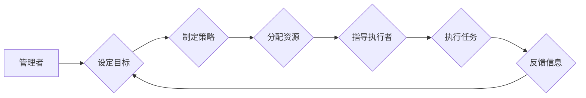

## 管理的艺术：德鲁克的洞见

> 关键词：管理学、组织架构、领导力、效率、创新、流程优化、德鲁克

### 1. 背景介绍

彼得·德鲁克（Peter Drucker）被誉为“管理学之父”，他的一生致力于研究和实践管理学，并将其理论应用于各个领域。他的著作《管理的艺术》被誉为管理学经典，对现代管理思想产生了深远影响。

在快速发展的科技时代，软件开发和IT项目管理面临着越来越复杂的挑战。团队规模不断扩大，项目周期缩短，技术迭代速度加快，如何高效地管理团队、资源和流程，成为了IT领域亟待解决的问题。

德鲁克的管理学理论，虽然诞生于工业时代，但其核心价值观和管理原则依然具有强大的指导意义。本文将从德鲁克的管理学视角出发，探讨如何将他的洞见应用于IT领域，提升团队效率、促进创新，最终实现项目成功。

### 2. 核心概念与联系

德鲁克的管理学体系建立在以下几个核心概念之上：

* **管理者与执行者:** 管理者负责制定目标、策略和计划，并通过激励和指导执行者实现目标。
* **目标管理:** 明确目标是管理的核心，管理者需要设定清晰、可衡量的目标，并将其分解为具体的行动计划。
* **决策:** 管理者需要不断进行决策，并根据反馈信息进行调整。
* **沟通:** 沟通是管理的基石，管理者需要有效地与团队成员、客户和合作伙伴进行沟通。
* **创新:** 创新是组织持续发展的动力，管理者需要鼓励和支持创新。

**Mermaid 流程图:**



**核心概念与IT项目管理的联系:**

* **管理者与执行者:** 在IT项目中，项目经理扮演管理者的角色，负责制定项目计划、分配任务和协调资源。开发人员、测试人员等则扮演执行者的角色，负责完成具体的开发和测试工作。
* **目标管理:** IT项目的目标通常是开发和交付一个功能完善、符合用户需求的软件产品。项目经理需要将这个目标分解为具体的里程碑和任务，并制定相应的计划和预算。
* **决策:** 在IT项目中，项目经理需要不断进行决策，例如选择技术方案、分配资源、解决问题等。
* **沟通:** 沟通是IT项目成功的关键，项目经理需要与团队成员、客户、利益相关者等进行有效的沟通，确保项目信息透明、协作顺畅。
* **创新:** IT行业发展迅速，需要不断创新才能保持竞争力。项目经理需要鼓励团队成员提出新的想法，并为创新提供支持和资源。

### 3. 核心算法原理 & 具体操作步骤

德鲁克的管理学理论本身并非算法，但其核心原则可以被抽象为一种管理流程，类似于算法的步骤。

**3.1 算法原理概述**

德鲁克的管理流程的核心原理是：

1. **明确目标:** 首先要明确组织或项目的最终目标是什么。
2. **分解目标:** 将目标分解为更小的、可实现的子目标。
3. **制定策略:** 为每个子目标制定相应的策略和计划。
4. **分配资源:** 为每个策略分配必要的资源，包括人力、物力、时间等。
5. **执行任务:** 按照计划执行任务，并进行监督和控制。
6. **反馈信息:** 收集反馈信息，并根据反馈进行调整和改进。

**3.2 算法步骤详解**

1. **明确目标:** 

   * 通过SWOT分析、市场调研等方式，明确组织或项目的最终目标。
   * 将目标量化，并设定具体的指标和时间节点。

2. **分解目标:**

   * 将最终目标分解为多个可实现的子目标。
   * 确保每个子目标都与最终目标相关，并相互关联。

3. **制定策略:**

   * 为每个子目标制定相应的策略和计划。
   * 考虑各种风险和挑战，并制定相应的应对措施。

4. **分配资源:**

   * 根据策略和计划，分配必要的资源。
   * 确保资源的合理配置，并进行有效的管理。

5. **执行任务:**

   * 按照计划执行任务，并进行监督和控制。
   * 定期跟踪进度，并及时解决问题。

6. **反馈信息:**

   * 收集反馈信息，并进行分析和评估。
   * 根据反馈信息，对策略和计划进行调整和改进。

**3.3 算法优缺点**

* **优点:**

   * 结构清晰，易于理解和实施。
   * 能够有效地分解复杂目标，并进行管理。
   * 能够促进团队协作和沟通。

* **缺点:**

   * 缺乏灵活性，难以应对突发事件。
   * 容易陷入僵化，缺乏创新。

**3.4 算法应用领域**

德鲁克的管理流程适用于各种组织和项目，例如：

* 软件开发项目
* IT服务管理
* 产品研发
* 市场营销
* 人力资源管理

### 4. 数学模型和公式 & 详细讲解 & 举例说明

德鲁克的管理学理论虽然并非严格的数学模型，但我们可以用一些数学概念来描述其核心原理。例如，目标管理可以看作是一个优化问题，目标是找到最优的资源配置方案，以实现预定的目标。

**4.1 数学模型构建**

我们可以用一个简单的数学模型来描述目标管理的过程：

```
目标 = f(资源, 策略)
```

其中：

* 目标：需要实现的目标
* 资源：包括人力、物力、时间等
* 策略：实现目标的方案

**4.2 公式推导过程**

这个模型可以进一步推导，例如：

* 优化资源配置：找到最优的资源分配方案，以最大化目标的实现程度。
* 评估策略效果：根据目标的实现程度，评估不同策略的效果。

**4.3 案例分析与讲解**

例如，一个软件开发项目的目标是开发一个功能完善的应用程序。

* 资源：包括开发人员、测试人员、硬件设备、软件工具等。
* 策略：包括技术方案、开发流程、测试方法等。

通过优化资源配置和评估策略效果，项目经理可以找到最有效的方案，以实现目标。

### 5. 项目实践：代码实例和详细解释说明

在实际的IT项目中，我们可以将德鲁克的管理学理论应用于以下方面：

* **项目计划:** 使用德鲁克的管理流程来制定项目计划，包括目标设定、任务分解、资源分配、时间安排等。
* **团队管理:** 采用德鲁克的管理理念来管理团队，例如明确目标、授权决策、激励团队成员等。
* **沟通协调:** 遵循德鲁克的沟通原则，确保项目信息透明、协作顺畅。
* **风险管理:** 提前识别和评估项目风险，制定相应的应对措施。

**5.1 开发环境搭建**

* 选择合适的开发工具和环境，例如IDE、版本控制系统、测试工具等。
* 确保开发环境稳定可靠，并进行必要的配置和测试。

**5.2 源代码详细实现**

* 使用编程语言编写项目代码，并遵循代码规范和风格。
* 进行代码测试和调试，确保代码质量和功能正确性。

**5.3 代码解读与分析**

* 对代码进行详细解读和分析，理解代码的功能和逻辑。
* 优化代码结构和性能，提高代码的可读性和可维护性。

**5.4 运行结果展示**

* 运行项目代码，并展示运行结果。
* 分析运行结果，并进行必要的调整和改进。

### 6. 实际应用场景

德鲁克的管理学理论在IT领域有着广泛的应用场景，例如：

* **软件开发项目管理:** 

   * 使用德鲁克的管理流程来制定项目计划，并进行有效的资源分配和进度管理。
   * 采用德鲁克的团队管理理念，激励团队成员，提高团队效率。

* **IT服务管理:** 

   * 使用德鲁克的管理原则来管理IT服务，例如服务质量管理、客户关系管理等。
   * 采用德鲁克的决策理论，进行有效的IT服务决策。

* **产品研发:** 

   * 使用德鲁克的管理学理论来指导产品研发过程，例如目标设定、市场调研、产品设计等。
   * 采用德鲁克的创新理念，鼓励团队成员提出新的产品想法。

**6.4 未来应用展望**

随着人工智能、大数据等技术的快速发展，德鲁克的管理学理论将面临新的挑战和机遇。

* 人工智能可以帮助自动化一些管理任务，例如数据分析、资源分配等，提高管理效率。
* 大数据可以提供更丰富的管理信息，帮助管理者做出更科学的决策。

未来，德鲁克的管理学理论将与新兴技术相结合，为IT领域提供更有效的管理解决方案。

### 7. 工具和资源推荐

**7.1 学习资源推荐**

* 《管理的艺术》
* 《高效能人士的七个习惯》
* 《领导力的本质》

**7.2 开发工具推荐**

* IDE: Visual Studio Code, IntelliJ IDEA, Eclipse
* 版本控制系统: Git, SVN
* 测试工具: JUnit, pytest

**7.3 相关论文推荐**

* Drucker, P. (1954). The practice of management. Harper & Row.
* Kotter, J. P. (1996). Leading change. Harvard Business School Press.
* Senge, P. M. (1990). The fifth discipline: The art and practice of the learning organization. Doubleday.

### 8. 总结：未来发展趋势与挑战

**8.1 研究成果总结**

德鲁克的管理学理论为IT领域提供了宝贵的管理智慧，帮助组织和项目更高效地运作。

**8.2 未来发展趋势**

未来，德鲁克的管理学理论将与新兴技术相结合，例如人工智能、大数据等，为IT领域提供更有效的管理解决方案。

**8.3 面临的挑战**

* 如何将德鲁克的管理学理论应用于快速变化的IT环境。
* 如何平衡效率和创新，避免管理僵化。
* 如何培养具备德鲁克管理理念的IT人才。

**8.4 研究展望**

未来研究可以关注以下方面：

* 基于人工智能的德鲁克管理学模型
* 德鲁克管理学理论与敏捷开发方法的结合
* 德鲁克管理理念的培养与实践

### 9. 附录：常见问题与解答

* **问题:** 德鲁克的管理学理论适用于所有类型的IT项目吗？
* **答案:** 德鲁克的管理学理论是一个通用的管理框架，适用于大多数类型的IT项目。但具体应用需要根据项目的实际情况进行调整。
* **问题:** 如何将德鲁克的管理学理论与敏捷开发方法相结合？
* **答案:** 敏捷开发方法强调迭代和反馈，与德鲁克的管理学理论的“持续改进”理念相契合。可以将德鲁克的管理流程融入敏捷开发框架，例如在每次迭代开始前进行目标设定和资源分配。


作者：禅与计算机程序设计艺术 / Zen and the Art of Computer Programming 
