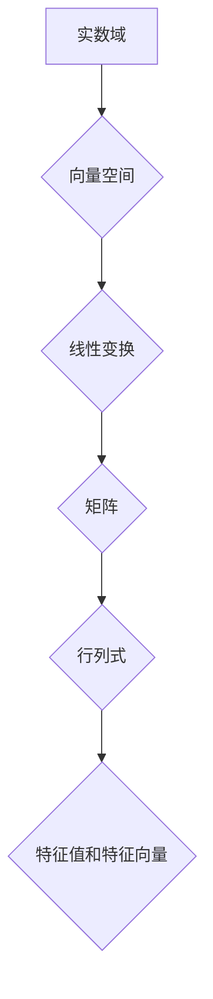

## 线性代数导引：实数结构基本代数特性

> 关键词：线性代数、实数域、向量空间、线性变换、矩阵、行列式、特征值、特征向量

### 1. 背景介绍

线性代数作为数学的一个分支，研究的是向量空间、线性变换、矩阵等概念。它在计算机科学领域有着广泛的应用，例如机器学习、计算机图形学、数据分析等。 

理解线性代数的基础知识对于深入学习这些领域至关重要。本文将从实数结构的基本代数特性出发，逐步引出线性代数的核心概念，并探讨其在计算机科学中的应用。

### 2. 核心概念与联系

**2.1 实数域**

实数域 (ℝ) 是包含所有实数的集合，它是一个有序域，满足以下性质：

* **封闭性:**  实数域对加法和乘法运算封闭，即两个实数相加或相乘的结果仍然是实数。
* **结合律:**  对于任意实数 a, b, c，有 (a + b) + c = a + (b + c) 和 (a * b) * c = a * (b * c)。
* **交换律:**  对于任意实数 a, b，有 a + b = b + a 和 a * b = b * a。
* **分配律:**  对于任意实数 a, b, c，有 a * (b + c) = a * b + a * c。
* **单位元:**  存在一个单位元 0，使得对于任意实数 a，有 a + 0 = a。
* **逆元:**  对于任意非零实数 a，存在一个逆元 1/a，使得 a * (1/a) = 1。
* **序关系:**  实数域上存在一个序关系 "<"，使得对于任意实数 a, b，只有以下情况之一成立：a < b, a = b 或 a > b。

**2.2 向量空间**

向量空间是一个集合，其中元素称为向量，并定义了两个运算：向量加法和数乘。向量空间必须满足以下八条公理：

* **封闭性:**  对于任意两个向量 **u** 和 **v**，它们的和 **u** + **v** 也属于该向量空间。
* **结合律:**  对于任意三个向量 **u**, **v**, **w**，有 (**u** + **v**) + **w** = **u** + (**v** + **w**)。
* **交换律:**  对于任意两个向量 **u** 和 **v**，有 **u** + **v** = **v** + **u**。
* **零向量:**  存在一个零向量 **0**，使得对于任意向量 **u**，有 **u** + **0** = **u**。
* **逆向量:**  对于任意向量 **u**，存在一个逆向量 -**u**，使得 **u** + (-**u**) = **0**。
* **数乘封闭性:**  对于任意实数 c 和向量 **u**，c**u** 也属于该向量空间。
* **分配律:**  对于任意实数 c 和向量 **u**, **v**，有 c(**u** + **v**) = c**u** + c**v** 和 (c + d)**u** = c**u** + d**u**。
* **单位元:**  对于任意向量 **u**，有 1**u** = **u**。

**2.3 线性变换**

线性变换是一种从一个向量空间到另一个向量空间的映射，它满足以下两个性质：

* **加性:**  对于任意两个向量 **u** 和 **v**，有 T(**u** + **v**) = T(**u**) + T(**v**)。
* **齐次性:**  对于任意实数 c 和向量 **u**，有 T(c**u**) = cT(**u**)。

**2.4 矩阵**

矩阵是一种数的排列，它可以表示线性变换。

**2.5 行列式**

行列式是方阵的一个标量值，它可以用来判断线性变换是否可逆。

**2.6 特征值和特征向量**

特征值和特征向量是线性变换的特殊性质，它们可以用来简化线性变换的表示。

**2.7 Mermaid 流程图**



### 3. 核心算法原理 & 具体操作步骤

**3.1 算法原理概述**

线性代数算法主要用于解决向量空间、线性变换、矩阵等方面的计算问题。这些算法通常基于实数域的基本代数特性，并利用矩阵的性质进行计算。

**3.2 算法步骤详解**

* **向量加法和数乘:**  将两个向量的对应分量相加，或将向量每个分量乘以一个实数。
* **矩阵加法和数乘:**  将两个矩阵对应位置的元素相加，或将矩阵每个元素乘以一个实数。
* **矩阵乘法:**  将两个矩阵相乘，需要满足一定的条件，例如第一个矩阵的列数必须等于第二个矩阵的行数。
* **行列式计算:**  根据矩阵元素的排列关系，计算出矩阵的行列式值。
* **逆矩阵计算:**  如果矩阵可逆，则可以计算出它的逆矩阵。
* **特征值和特征向量计算:**  通过求解特征方程，可以得到线性变换的特征值和特征向量。

**3.3 算法优缺点**

* **优点:**  线性代数算法具有良好的效率和稳定性，可以处理大量数据。
* **缺点:**  一些算法的计算复杂度较高，对于大型矩阵可能需要较长时间。

**3.4 算法应用领域**

* **机器学习:**  线性回归、逻辑回归、主成分分析等算法都依赖于线性代数。
* **计算机图形学:**  3D 模型变换、投影、光照计算等都需要用到线性代数。
* **数据分析:**  数据降维、特征提取、聚类分析等都需要用到线性代数。
* **信号处理:**  信号滤波、频谱分析等都需要用到线性代数。

### 4. 数学模型和公式 & 详细讲解 & 举例说明

**4.1 数学模型构建**

线性代数的数学模型主要基于向量空间和线性变换的概念。

* **向量空间:**  一个集合 V，其中元素称为向量，并定义了两个运算：向量加法和数乘。
* **线性变换:**  从一个向量空间 V 到另一个向量空间 W 的映射 T，满足加性和齐次性。

**4.2 公式推导过程**

* **向量加法:**  **u** + **v** = (u1, u2,..., un) + (v1, v2,..., vn) = (u1 + v1, u2 + v2,..., un + vn)
* **数乘:**  c**u** = c(u1, u2,..., un) = (cu1, cu2,..., cun)
* **矩阵乘法:**  A * **u** = (a11u1 + a12u2 +... + a1n*un, a21u1 + a22u2 +... + a2n*un,..., am1u1 + am2u2 +... + amn*un)

**4.3 案例分析与讲解**

**例题:**  计算向量 **u** = (1, 2, 3) 和 **v** = (4, 5, 6) 的加法和数乘。

**解题步骤:**

* **向量加法:**  **u** + **v** = (1 + 4, 2 + 5, 3 + 6) = (5, 7, 9)
* **数乘:**  2**u** = 2(1, 2, 3) = (2, 4, 6)

### 5. 项目实践：代码实例和详细解释说明

**5.1 开发环境搭建**

可以使用 Python 语言和 NumPy 库进行线性代数计算。

**5.2 源代码详细实现**

```python
import numpy as np

# 定义两个向量
u = np.array([1, 2, 3])
v = np.array([4, 5, 6])

# 计算向量加法
u_plus_v = u + v
print("向量加法:", u_plus_v)

# 计算数乘
two_u = 2 * u
print("数乘:", two_u)

# 定义一个矩阵
A = np.array([[1, 2], [3, 4]])

# 计算矩阵乘法
B = np.array([[5, 6], [7, 8]])
A_times_B = np.dot(A, B)
print("矩阵乘法:", A_times_B)
```

**5.3 代码解读与分析**

* 使用 NumPy 库可以方便地进行向量和矩阵的运算。
* `np.array()` 函数用于创建 NumPy 数组。
* `+` 和 `*` 运算符用于进行向量加法和数乘。
* `np.dot()` 函数用于计算矩阵乘法。

**5.4 运行结果展示**

```
向量加法: [5 7 9]
数乘: [2 4 6]
矩阵乘法: [[19 22]
 [43 50]]
```

### 6. 实际应用场景

**6.1 机器学习**

* **线性回归:**  用于预测连续变量，模型假设目标变量与输入变量之间存在线性关系。
* **逻辑回归:**  用于分类问题，模型假设目标变量服从伯努利分布。
* **主成分分析 (PCA):**  用于降维，将高维数据投影到低维空间，保留数据的主要信息。

**6.2 计算机图形学**

* **3D 模型变换:**  使用矩阵进行旋转、缩放、平移等操作，实现 3D 模型的变形。
* **投影:**  将 3D 空间中的场景投影到 2D 屏幕上，实现视差效果。
* **光照计算:**  使用向量和矩阵计算光线与物体的反射和散射，实现光照效果。

**6.3 数据分析**

* **数据降维:**  使用 PCA 等算法将高维数据降维，降低计算复杂度和数据存储空间。
* **特征提取:**  使用线性代数方法提取数据的特征，用于分类、聚类等分析。
* **聚类分析:**  将数据点根据相似度进行分组，用于发现数据中的潜在结构。

**6.4 未来应用展望**

随着人工智能和机器学习的发展，线性代数在这些领域将发挥越来越重要的作用。例如，深度学习模型的训练和推理都依赖于大量的矩阵运算。

### 7. 工具和资源推荐

**7.1 学习资源推荐**

* **书籍:**
    * 《线性代数及其应用》 - Gilbert Strang
    * 《线性代数及其应用》 - David C. Lay
* **在线课程:**
    * MIT OpenCourseWare 线性代数课程
    * Coursera 线性代数课程

**7.2 开发工具推荐**

* **Python:**  一个广泛使用的编程语言，拥有丰富的科学计算库，例如 NumPy、SciPy、Pandas。
* **NumPy:**  Python 的科学计算库，提供高效的数组运算和线性代数函数。
* **SciPy:**  Python 的科学计算库，提供更高级的科学计算功能，例如优化、积分、信号处理等。

**7.3 相关论文推荐**

* **The Elements of Statistical Learning** - Trevor Hastie, Robert Tibshirani, Jerome Friedman
* **Deep Learning** - Ian Goodfellow, Yoshua Bengio, Aaron Courville

### 8. 总结：未来发展趋势与挑战

**8