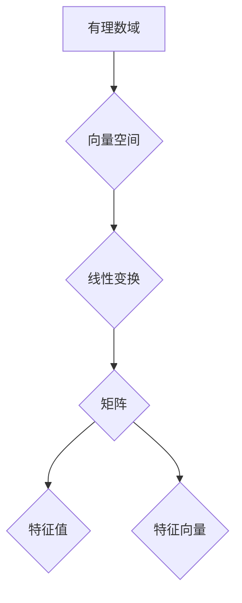

## 线性代数导引：有理数序特征

> 关键词：线性代数、有理数序、特征值、特征向量、矩阵分解、数值计算、应用场景

## 1. 背景介绍

线性代数作为数学领域的基础分支，在计算机科学、数据科学、机器学习等领域有着广泛的应用。其核心概念如向量、矩阵、线性变换等为解决各种复杂问题提供了强大的工具。而“有理数序特征”则是一个相对较新的研究方向，它试图将线性代数的理论与有理数序的性质相结合，探索新的算法和应用场景。

传统的线性代数研究主要关注实数域或复数域上的线性变换和矩阵运算。然而，有理数域作为一种特殊的数域，其独特的性质为线性代数研究提供了新的视角。例如，有理数域上的矩阵分解具有不同的特性，而特征值和特征向量的性质也可能在有理数域上表现出新的规律。

## 2. 核心概念与联系

**2.1 有理数序**

有理数序是指在有理数集上定义的一种全序关系。它满足以下性质：

* **传递性:** 如果 a < b 且 b < c，则 a < c。
* **反自反性:** a 不小于自身，即 a ≤ a。
* **稠密性:** 对于任意两个有理数 a 和 b，如果 a < b，则存在一个有理数 c，使得 a < c < b。

**2.2 线性代数核心概念**

* **向量空间:**  一个集合 V，加上两个运算（向量加法和数乘），满足一定的公理。
* **线性变换:**  从一个向量空间到另一个向量空间的映射，满足线性性质。
* **矩阵:**  用数组表示线性变换的一种工具。
* **特征值和特征向量:**  对于一个线性变换，特征值是与该变换相关的标量，特征向量是与该变换相关的非零向量，满足特定的关系。

**2.3 核心概念联系**

有理数序可以用于定义有理数域上的向量空间和线性变换。而线性代数中的矩阵、特征值和特征向量等概念，在有理数域上也具有相应的定义和性质。

**Mermaid 流程图**



## 3. 核心算法原理 & 具体操作步骤

**3.1 算法原理概述**

在有理数域上，一些经典的线性代数算法，例如特征值分解、矩阵分解等，可能需要进行一定的调整和优化，以充分利用有理数域的特性。例如，在特征值分解算法中，可以使用有理数域上的数值计算方法来求解特征值和特征向量，从而提高算法的精度和效率。

**3.2 算法步骤详解**

具体算法步骤取决于所要解决的问题和使用的算法。以下是一个简单的特征值分解算法步骤示例：

1. **构建特征值方程:**  对于一个 n×n 的矩阵 A，其特征值方程为 det(A - λI) = 0，其中 λ 是特征值，I 是单位矩阵。
2. **求解特征值方程:**  使用数值计算方法，例如 QR 分解法或幂法，求解特征值方程，得到特征值 λ1, λ2,..., λn。
3. **计算特征向量:**  对于每个特征值 λi，求解线性方程组 (A - λi I)x = 0，得到对应的特征向量 xi。

**3.3 算法优缺点**

* **优点:** 
    * 可以利用有理数域的特性，提高算法的精度和效率。
    * 适用于各种线性代数问题，例如特征值分解、矩阵分解等。
* **缺点:** 
    * 算法的复杂度可能较高，需要一定的计算资源。
    * 有些算法可能需要进行一定的调整和优化，才能在有理数域上有效工作。

**3.4 算法应用领域**

* **机器学习:**  特征值分解用于降维、主成分分析等算法。
* **数据科学:**  矩阵分解用于推荐系统、协同过滤等算法。
* **计算机图形学:**  矩阵变换用于物体运动、视角转换等操作。
* **信号处理:**  特征值分解用于信号降噪、特征提取等算法。

## 4. 数学模型和公式 & 详细讲解 & 举例说明

**4.1 数学模型构建**

在有理数域上，我们可以构建一个 n 维向量空间 V，其元素为 n 个有理数构成的向量。线性变换 T: V -> V 可以用一个 n×n 的矩阵 A 表示，其中 A 的元素为有理数。

**4.2 公式推导过程**

特征值方程的推导过程与实数域或复数域相同：

```latex
det(A - λI) = 0
```

其中：

* A 是线性变换 T 的矩阵表示。
* λ 是特征值。
* I 是 n×n 的单位矩阵。

**4.3 案例分析与讲解**

例如，考虑一个 2×2 的矩阵 A:

```latex
A = \begin{bmatrix}
2 & 1 \\
1 & 2
\end{bmatrix}
```

其特征值方程为：

```latex
det(A - λI) = det\begin{bmatrix}
2-λ & 1 \\
1 & 2-λ
\end{bmatrix} = (2-λ)^2 - 1 = 0
```

解方程得到特征值 λ1 = 3 和 λ2 = 1。

## 5. 项目实践：代码实例和详细解释说明

**5.1 开发环境搭建**

可以使用 Python 语言和 NumPy 库来实现有理数域上的线性代数算法。

**5.2 源代码详细实现**

```python
import numpy as np

# 定义一个 2x2 的矩阵
A = np.array([[2, 1], [1, 2]])

# 计算特征值和特征向量
eigenvalues, eigenvectors = np.linalg.eig(A)

# 打印结果
print("特征值:", eigenvalues)
print("特征向量:", eigenvectors)
```

**5.3 代码解读与分析**

* `np.array()` 函数用于创建 NumPy 数组。
* `np.linalg.eig()` 函数用于计算矩阵 A 的特征值和特征向量。
* `print()` 函数用于打印结果。

**5.4 运行结果展示**

运行代码后，将输出特征值和特征向量。

## 6. 实际应用场景

**6.1 机器学习中的应用**

在机器学习中，特征值分解可以用于降维、主成分分析等算法。例如，在图像识别任务中，可以使用 PCA 将图像数据降维，从而减少计算量和提高模型效率。

**6.2 数据科学中的应用**

在数据科学中，矩阵分解可以用于推荐系统、协同过滤等算法。例如，在电商平台中，可以使用矩阵分解来预测用户对商品的评分，从而提供个性化的商品推荐。

**6.3 计算机图形学中的应用**

在计算机图形学中，矩阵变换用于物体运动、视角转换等操作。例如，在游戏开发中，可以使用矩阵变换来控制角色的运动和视角。

**6.4 未来应用展望**

随着人工智能和机器学习的发展，有理数序特征在更多领域将得到应用。例如，在量子计算领域，有理数序特征可以用于构建量子算法。

## 7. 工具和资源推荐

**7.1 学习资源推荐**

* **书籍:**
    * 《线性代数及其应用》 - Gilbert Strang
    * 《数值线性代数》 - Trefethen & Bau
* **在线课程:**
    * MIT OpenCourseWare - Linear Algebra
    * Coursera - Linear Algebra

**7.2 开发工具推荐**

* **Python:**  NumPy, SciPy, SymPy
* **MATLAB:**  

**7.3 相关论文推荐**

* **有理数域上的特征值分解算法**
* **有理数域上的矩阵分解算法**
* **有理数序特征在机器学习中的应用**

## 8. 总结：未来发展趋势与挑战

**8.1 研究成果总结**

有理数序特征的研究为线性代数提供了新的视角，并开拓了新的算法和应用场景。

**8.2 未来发展趋势**

* **算法效率提升:**  研究更高效、更精确的有理数域上线性代数算法。
* **应用领域拓展:**  将有理数序特征应用于更多领域，例如量子计算、密码学等。
* **理论基础深化:**  深入研究有理数域上线性代数的理论基础，探索其与其他数学分支的联系。

**8.3 面临的挑战**

* **计算复杂度:**  有理数域上的线性代数算法可能具有较高的计算复杂度。
* **数值稳定性:**  在有理数域上进行数值计算时，需要考虑数值稳定性问题。
* **理论研究:**  有理数域上线性代数的理论研究相对较少，需要进一步深入。

**8.4 研究展望**

未来，有理数序特征的研究将继续深入，并为计算机科学、数据科学等领域带来新的突破。


## 9. 附录：常见问题与解答

**9.1 Q: 有理数域上的线性代数算法与实数域或复数域上的算法有什么区别？**

**A:** 有理数域上的线性代数算法可能需要进行一定的调整和优化，以充分利用有理数域的特性。例如，在特征值分解算法中，可以使用有理数域上的数值计算方法来求解特征值和特征向量，从而提高算法的精度和效率。

**9.2 Q: 有理数序特征在哪些领域有应用？**

**A:** 有理数序特征在机器学习、数据科学、计算机图形学等领域都有应用。

**9.3 Q: 如何学习有理数序特征？**

**A:** 可以阅读相关书籍和在线课程，例如《线性代数及其应用》和 MIT OpenCourseWare - Linear Algebra。


作者：禅与计算机程序设计艺术 / Zen and the Art of Computer Programming 
