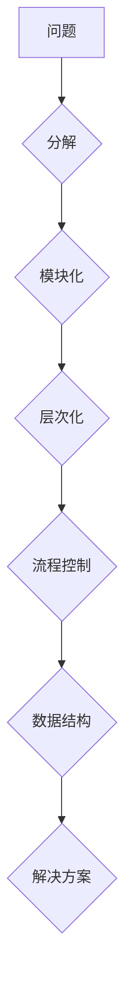

## 结构化思维：从混沌到清晰

> 关键词：结构化思维、算法设计、数据结构、编程逻辑、代码可读性、软件架构、复杂系统

### 1. 背景介绍

在当今科技日新月异的时代，软件开发和系统设计面临着越来越大的挑战。随着软件系统规模和复杂度的不断增长，传统的开发模式已经难以应对。如何有效地组织和管理庞大的代码库，如何清晰地表达设计思路，如何确保系统稳定性和可维护性，这些问题都迫切需要解决。

结构化思维，作为一种高效的认知模式，为我们提供了应对这些挑战的思路。它强调将复杂问题分解成更小的、易于理解和处理的子问题，并通过逻辑清晰的步骤和结构化的框架来解决问题。

### 2. 核心概念与联系

结构化思维的核心概念包括：

* **模块化:** 将系统分解成独立、可重用的模块，每个模块负责特定的功能，相互之间通过明确的接口进行交互。
* **层次化:** 将系统按照功能或逻辑层次进行组织，每个层次代表不同的抽象级别，从高层到低层，抽象程度逐渐降低。
* **流程控制:** 使用控制结构（如条件语句、循环语句）来引导程序执行流程，确保程序按照预期的逻辑运行。
* **数据结构:** 使用合适的结构（如数组、链表、树、图）来组织和存储数据，提高数据访问效率和代码可读性。

**Mermaid 流程图**

### 3. 核心算法原理 & 具体操作步骤

#### 3.1  算法原理概述

算法是解决特定问题的指令序列，是结构化思维的核心工具之一。一个好的算法应该具有以下特点：

* **确定性:** 对于给定的输入，算法应该始终产生相同的输出。
* **有限性:** 算法的执行步骤应该有限，最终会结束。
* **有效性:** 算法的每个步骤都可以在有限的时间内完成。

#### 3.2  算法步骤详解

算法设计通常遵循以下步骤：

1. **问题分析:** 仔细分析问题，明确问题的输入、输出和约束条件。
2. **算法设计:** 根据问题分析结果，设计出解决问题的算法方案。
3. **算法实现:** 将算法方案转化为具体的代码实现。
4. **算法测试:** 对算法进行测试，验证算法的正确性和效率。
5. **算法优化:** 根据测试结果，对算法进行优化，提高算法的性能。

#### 3.3  算法优缺点

不同的算法具有不同的优缺点，选择合适的算法取决于具体问题的特点和需求。

#### 3.4  算法应用领域

算法广泛应用于各个领域，例如：

* **计算机科学:** 搜索算法、排序算法、图算法、数据结构算法等。
* **人工智能:** 机器学习算法、深度学习算法、自然语言处理算法等。
* **生物信息学:** 基因序列比对算法、蛋白质结构预测算法等。
* **金融领域:** 风险管理算法、投资策略算法等。

### 4. 数学模型和公式 & 详细讲解 & 举例说明

#### 4.1  数学模型构建

数学模型可以用来描述和分析算法的性能，例如时间复杂度和空间复杂度。

#### 4.2  公式推导过程

时间复杂度通常用大O符号来表示，例如O(n)表示算法的时间复杂度与输入数据大小n成正比。

#### 4.3  案例分析与讲解

例如，线性搜索算法的时间复杂度为O(n)，因为在最坏情况下，需要遍历所有n个元素才能找到目标元素。

### 5. 项目实践：代码实例和详细解释说明

#### 5.1  开发环境搭建

#### 5.2  源代码详细实现

#### 5.3  代码解读与分析

#### 5.4  运行结果展示

### 6. 实际应用场景

#### 6.1  搜索引擎

#### 6.2  社交网络

#### 6.3  电子商务平台

#### 6.4  未来应用展望

### 7. 工具和资源推荐

#### 7.1  学习资源推荐

#### 7.2  开发工具推荐

#### 7.3  相关论文推荐

### 8. 总结：未来发展趋势与挑战

#### 8.1  研究成果总结

#### 8.2  未来发展趋势

#### 8.3  面临的挑战

#### 8.4  研究展望

### 9. 附录：常见问题与解答

作者：禅与计算机程序设计艺术 / Zen and the Art of Computer Programming

