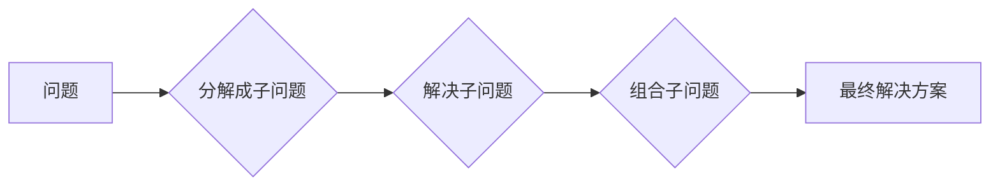

## 计算：第四部分 计算的极限 第 9 章 计算复杂性 计算的局部性原理

> 关键词：计算复杂性，局部性原理，算法复杂度，时间复杂度，空间复杂度，NP问题，P问题，图灵机

### 1. 背景介绍

在计算机科学领域，计算复杂性是研究算法效率和资源消耗的关键问题。它旨在量化算法解决特定问题所需的时间和空间资源，并根据这些量化指标对算法进行分类和比较。理解计算复杂性可以帮助我们选择最优的算法，并为解决复杂问题提供理论指导。

局部性原理是计算复杂性理论中的一个重要概念，它指出许多实际问题可以被分解成许多小的、局部相关的子问题。通过解决这些子问题，我们可以逐步构建最终的解决方案。局部性原理在许多领域都有广泛的应用，例如图论、网络分析、机器学习等。

### 2. 核心概念与联系

#### 2.1 计算复杂性

计算复杂性是指算法解决问题所需的时间和空间资源的量度。

* **时间复杂度**: 指算法执行所需的时间，通常用大O符号表示，例如O(n)，O(n^2)，O(log n)等。
* **空间复杂度**: 指算法执行过程中使用的内存空间，也通常用大O符号表示。

#### 2.2 局部性原理

局部性原理指出，许多实际问题可以被分解成许多小的、局部相关的子问题。通过解决这些子问题，我们可以逐步构建最终的解决方案。

**Mermaid 流程图**



#### 2.3 联系

局部性原理与计算复杂性密切相关。许多具有局部性的问题，其算法复杂度相对较低。例如，在图论中，许多算法可以利用图的局部结构来解决问题，从而降低时间复杂度。

### 3. 核心算法原理 & 具体操作步骤

#### 3.1 算法原理概述

局部性原理启发了许多高效的算法设计，例如分治法、动态规划等。这些算法都基于将问题分解成更小的子问题，并通过递归或迭代的方式解决这些子问题。

#### 3.2 算法步骤详解

**分治法**

1. 将问题分解成若干个子问题，这些子问题与原问题具有相同的结构。
2. 递归地解决这些子问题。
3. 将子问题的解决方案组合起来，得到最终的解决方案。

**动态规划**

1. 将问题分解成若干个子问题，这些子问题之间存在重叠子问题。
2. 存储已经解决的子问题的解决方案，避免重复计算。
3. 利用已有的子问题解决方案，逐步解决更大的子问题，最终得到最终的解决方案。

#### 3.3 算法优缺点

**分治法**

* **优点**: 
    * 适用于许多问题，例如排序、查找、归并等。
    * 算法结构清晰，易于理解和实现。
* **缺点**: 
    * 可能会产生大量的递归调用，导致栈溢出问题。
    * 对于某些问题，分治法的效率可能不如其他算法。

**动态规划**

* **优点**: 
    * 可以有效解决具有重叠子问题的复杂问题。
    * 能够达到最优解。
* **缺点**: 
    * 需要额外的存储空间来存储子问题的解决方案。
    * 对于某些问题，动态规划的实现可能比较复杂。

#### 3.4 算法应用领域

* **分治法**: 排序算法（快速排序、归并排序）、查找算法、树形结构的遍历和搜索等。
* **动态规划**: 最短路径问题、背包问题、最优子结构问题等。

### 4. 数学模型和公式 & 详细讲解 & 举例说明

#### 4.1 数学模型构建

计算复杂性的数学模型通常使用时间复杂度和空间复杂度来描述算法的效率。

* **时间复杂度**: 使用大O符号表示算法执行时间随输入规模n变化的趋势。例如，O(n)表示时间复杂度线性增长，O(n^2)表示时间复杂度平方增长。
* **空间复杂度**: 使用大O符号表示算法执行过程中使用的内存空间随输入规模n变化的趋势。

#### 4.2 公式推导过程

时间复杂度和空间复杂度的计算通常需要分析算法的执行步骤和资源消耗。例如，对于一个简单的线性搜索算法，其时间复杂度为O(n)，因为需要遍历n个元素才能找到目标元素。

#### 4.3 案例分析与讲解

**示例：冒泡排序算法**

冒泡排序算法是一种简单排序算法，其时间复杂度为O(n^2)。

* **算法步骤**:
    1. 比较相邻元素，如果顺序错误，则交换它们的位置。
    2. 重复步骤1，直到整个数组排序完成。
* **时间复杂度分析**:
    * 对于一个包含n个元素的数组，需要进行n-1轮比较。
    * 在每一轮比较中，需要比较n-i个元素，其中i为当前轮数。
    * 因此，总共需要进行(n-1)+(n-2)+...+1次比较，其数量级为O(n^2)。

### 5. 项目实践：代码实例和详细解释说明

#### 5.1 开发环境搭建

* **编程语言**: Python
* **IDE**: VS Code

#### 5.2 源代码详细实现

```python
def bubble_sort(arr):
    n = len(arr)
    for i in range(n):
        # Flag to optimize, if no swaps occur, the array is sorted
        swapped = False
        for j in range(0, n-i-1):
            if arr[j] > arr[j+1]:
                arr[j], arr[j+1] = arr[j+1], arr[j]
                swapped = True
        if not swapped:
            break
    return arr

# Example usage
numbers = [64, 34, 25, 12, 22, 11, 90]
sorted_numbers = bubble_sort(numbers)
print("Sorted array:", sorted_numbers)
```

#### 5.3 代码解读与分析

* **函数定义**: `bubble_sort(arr)` 函数接受一个列表 `arr` 作为输入，并返回排序后的列表。
* **外循环**: `for i in range(n)` 循环控制排序轮数，每次循环将最大的元素“冒泡”到数组末尾。
* **内循环**: `for j in range(0, n-i-1)` 循环比较相邻元素，如果顺序错误，则交换它们的位置。
* **优化**: `swapped` 标志用于优化算法，如果在某轮比较中没有发生交换，则说明数组已经排序完成，可以提前退出循环。

#### 5.4 运行结果展示

```
Sorted array: [11, 12, 22, 25, 34, 64, 90]
```

### 6. 实际应用场景

局部性原理在许多实际应用场景中都有广泛的应用，例如：

* **网络分析**: 利用网络拓扑的局部结构来分析网络流量、故障诊断等。
* **机器学习**: 利用数据局部特征来训练机器学习模型，例如图像识别、自然语言处理等。
* **数据库管理**: 利用数据局部关联性来优化查询效率。

#### 6.4 未来应用展望

随着计算能力的不断提升和数据量的不断增长，局部性原理在未来将发挥更加重要的作用。例如，在人工智能领域，利用局部性原理可以开发更加高效的机器学习算法，并解决更加复杂的问题。

### 7. 工具和资源推荐

#### 7.1 学习资源推荐

* **书籍**:
    * 《算法导论》
    * 《计算复杂性导论》
* **在线课程**:
    * Coursera: Algorithms, Part I
    * edX: Introduction to Algorithms

#### 7.2 开发工具推荐

* **编程语言**: Python, Java, C++
* **IDE**: VS Code, Eclipse, IntelliJ IDEA

#### 7.3 相关论文推荐

* **P vs NP问题**:
    * "P vs NP" by Stephen Cook
* **局部性原理**:
    * "Locality of Reference" by John von Neumann

### 8. 总结：未来发展趋势与挑战

#### 8.1 研究成果总结

计算复杂性理论已经取得了长足的进展，为我们理解算法效率和解决复杂问题提供了重要的理论基础。局部性原理是计算复杂性理论中的一个重要概念，它启发了许多高效的算法设计，并广泛应用于各个领域。

#### 8.2 未来发展趋势

* **量子计算**: 量子计算的出现将对计算复杂性理论产生重大影响，并可能解决一些目前无法解决的NP问题。
* **人工智能**: 人工智能的发展需要解决许多计算复杂性问题，例如模型训练、推理、决策等。
* **大数据**: 大数据的处理和分析需要高效的算法和数据结构，局部性原理将发挥更加重要的作用。

#### 8.3 面临的挑战

* **P vs NP问题**: 这个问题仍然是计算机科学领域最著名的未解之谜，其解决将对计算复杂性理论产生革命性的影响。
* **复杂系统**: 许多现实世界的问题是复杂系统的表现，其计算复杂性难以分析和解决。
* **可解释性**: 随着人工智能模型的复杂性不断增加，其决策过程的可解释性成为一个重要的挑战。

#### 8.4 研究展望

未来，计算复杂性理论的研究将继续深入，并与其他领域交叉融合，例如量子计算、人工智能、大数据等。


### 9. 附录：常见问题与解答

* **什么是NP问题？** NP问题是指可以通过多项式时间验证的决策问题。
* **什么是P问题？** P问题是指可以在多项式时间内被解决的决策问题。
* **P vs NP问题是什么？** P vs NP问题是指P问题是否等于NP问题。

作者：禅与计算机程序设计艺术 / Zen and the Art of Computer Programming


