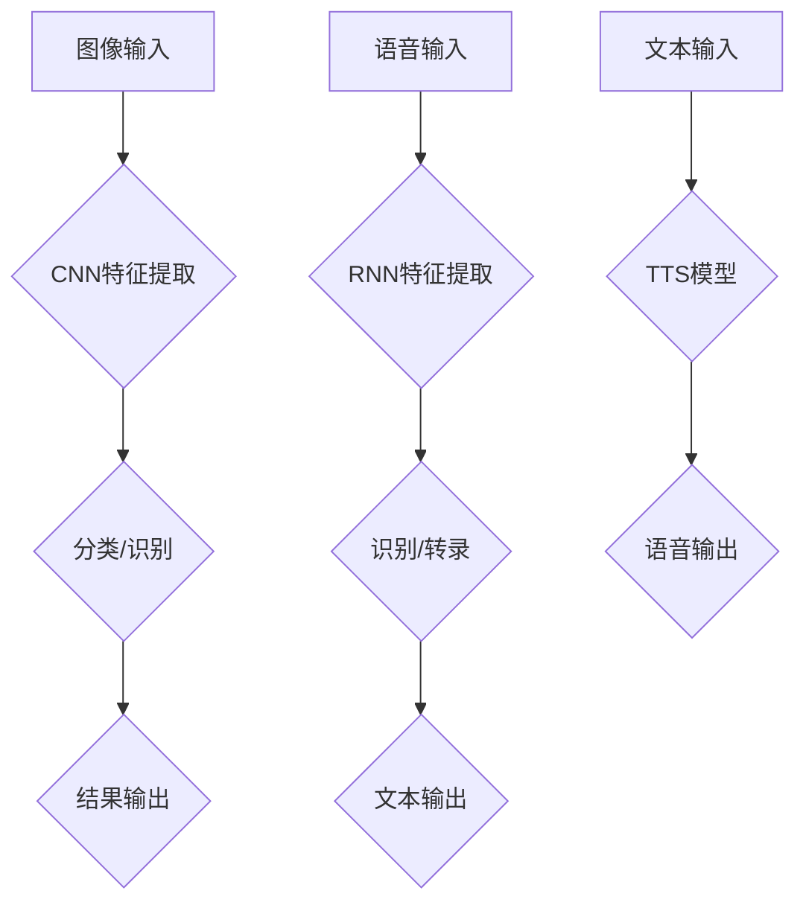

## 软件 2.0 的应用：视觉识别、语音识别、语音合成

> 关键词：视觉识别、语音识别、语音合成、深度学习、卷积神经网络、循环神经网络、Transformer、自然语言处理、人工智能

### 1. 背景介绍

软件 2.0 时代，人工智能（AI）技术飞速发展，深刻地改变着我们生活和工作方式。其中，视觉识别、语音识别和语音合成作为 AI 的重要应用领域，正在广泛应用于各个行业，例如医疗、教育、金融、交通等。

**1.1 视觉识别**

视觉识别是指计算机通过摄像头或图像传感器获取图像信息，并对其进行分析、理解和识别，从而实现对物体、场景、人物等进行分类、定位、跟踪等功能。

**1.2 语音识别**

语音识别是指计算机通过麦克风获取语音信号，并将其转换为文本信息的过程。它可以用于各种应用场景，例如语音搜索、语音助手、自动语音转录等。

**1.3 语音合成**

语音合成是指计算机根据文本信息生成逼真的人类语音的过程。它可以用于语音导航、虚拟助手、播报系统等应用场景。

### 2. 核心概念与联系

视觉识别、语音识别和语音合成都依赖于深度学习技术，特别是卷积神经网络（CNN）、循环神经网络（RNN）和 Transformer 等模型。

**2.1 深度学习**

深度学习是一种机器学习的子领域，它利用多层神经网络来模拟人类大脑的学习过程。深度学习模型能够从海量数据中自动学习特征，从而实现对复杂任务的处理。

**2.2 卷积神经网络（CNN）**

CNN 是一种专门用于处理图像数据的深度学习模型。它利用卷积操作来提取图像特征，并通过池化操作来降低特征维度。

**2.3 循环神经网络（RNN）**

RNN 是一种专门用于处理序列数据的深度学习模型。它具有记忆单元，能够记住之前处理过的信息，从而处理时间序列数据，例如语音信号。

**2.4 Transformer**

Transformer 是一种新型的深度学习模型，它利用注意力机制来处理序列数据，能够更好地捕捉长距离依赖关系。

**2.5 自然语言处理（NLP）**

NLP 是指计算机处理自然语言的技术。语音识别和语音合成都属于 NLP 的范畴。

**2.6 Mermaid 流程图**



### 3. 核心算法原理 & 具体操作步骤

#### 3.1 算法原理概述

视觉识别、语音识别和语音合成都依赖于深度学习算法，这些算法通过训练大量的样本数据来学习特征和模式，从而实现对输入数据的处理和理解。

#### 3.2 算法步骤详解

**3.2.1 视觉识别**

1. **数据预处理:** 对图像进行尺寸调整、归一化等处理，使其适合模型输入。
2. **特征提取:** 使用 CNN 模型提取图像特征，例如边缘、纹理、形状等。
3. **分类/识别:** 使用分类器或识别器对提取的特征进行分类或识别，例如识别物体类别、定位物体位置等。
4. **结果输出:** 将识别结果输出，例如物体类别标签、物体坐标等。

**3.2.2 语音识别**

1. **语音信号预处理:** 对语音信号进行降噪、增益调整等处理，提高信号质量。
2. **特征提取:** 使用 MFCC、PLP 等方法提取语音特征，例如音素、声调等。
3. **模型训练:** 使用 RNN 或 Transformer 模型训练语音识别模型，将语音特征映射到文本信息。
4. **解码:** 使用解码器将识别结果转换为文本序列。

**3.2.3 语音合成**

1. **文本预处理:** 对文本进行分词、标注等处理，使其适合语音合成模型输入。
2. **声学模型训练:** 使用 TTS 模型训练声学模型，将文本信息映射到语音信号。
3. **语音生成:** 使用声学模型生成语音信号。
4. **音频处理:** 对生成的语音信号进行音频处理，例如添加背景音乐、调整音量等。

#### 3.3 算法优缺点

**3.3.1 视觉识别**

* **优点:** 识别精度高，能够处理复杂图像场景。
* **缺点:** 需要大量的训练数据，计算量大，实时性较差。

**3.3.2 语音识别**

* **优点:** 能够识别多种语言和口音，应用场景广泛。
* **缺点:** 识别精度受环境噪声影响较大，识别复杂语音语境较困难。

**3.3.3 语音合成**

* **优点:** 可以生成逼真的人类语音，应用场景多样。
* **缺点:** 语音合成技术仍处于发展阶段，生成的语音有时缺乏情感表达。

#### 3.4 算法应用领域

**3.4.1 视觉识别**

* **医疗诊断:** 辅助医生诊断疾病，例如识别肿瘤、骨折等。
* **自动驾驶:** 识别道路标志、车辆、行人等，辅助车辆自动驾驶。
* **安防监控:** 人脸识别、行为识别，提高安防监控效率。

**3.4.2 语音识别**

* **语音搜索:** 通过语音进行搜索，提高用户体验。
* **语音助手:** 例如 Siri、Alexa，通过语音控制智能设备。
* **自动语音转录:** 将语音会议、演讲等转换为文本，提高工作效率。

**3.4.3 语音合成**

* **语音导航:** 通过语音导航系统指引用户路线。
* **虚拟助手:** 例如聊天机器人，通过语音与用户进行交互。
* **播报系统:** 例如新闻播报、天气预报等，通过语音进行信息播报。

### 4. 数学模型和公式 & 详细讲解 & 举例说明

#### 4.1 数学模型构建

**4.1.1 视觉识别**

视觉识别模型通常使用 CNN 来提取图像特征。CNN 的核心结构是卷积层和池化层。卷积层使用卷积核对图像进行卷积操作，提取图像局部特征。池化层对卷积层的输出进行降维操作，降低特征维度，提高模型鲁棒性。

**4.1.2 语音识别**

语音识别模型通常使用 RNN 或 Transformer 来处理语音特征序列。RNN 能够记住之前处理过的信息，适合处理语音信号中的时序依赖关系。Transformer 利用注意力机制，能够更好地捕捉长距离依赖关系。

**4.1.3 语音合成**

语音合成模型通常使用 TTS 模型，将文本信息映射到语音信号。TTS 模型通常由声学模型和语言模型组成。声学模型负责将文本信息转换为语音信号，语言模型负责生成自然流畅的文本序列。

#### 4.2 公式推导过程

**4.2.1 卷积操作**

卷积操作是 CNN 的核心操作，其公式如下：

$$
y(i,j) = \sum_{m=0}^{M-1} \sum_{n=0}^{N-1} x(i+m,j+n) * w(m,n)
$$

其中：

* $y(i,j)$ 是卷积输出的像素值。
* $x(i+m,j+n)$ 是输入图像的像素值。
* $w(m,n)$ 是卷积核的权值。
* $M$ 和 $N$ 是卷积核的大小。

**4.2.2 池化操作**

池化操作是 CNN 中常用的降维操作，其公式如下：

$$
y(i,j) = \max_{m=0}^{k-1} \max_{n=0}^{l-1} x(i*s+m,j*s+n)
$$

其中：

* $y(i,j)$ 是池化输出的像素值。
* $x(i*s+m,j*s+n)$ 是输入特征图的像素值。
* $s$ 是池化窗口的大小。
* $k$ 和 $l$ 是池化窗口的大小。

#### 4.3 案例分析与讲解

**4.3.1 视觉识别案例**

使用 CNN 模型识别猫和狗的图片。训练数据包含大量猫和狗的图片，模型学习了猫和狗的特征，例如耳朵形状、尾巴长度等。在测试阶段，输入一张新的图片，模型会输出猫或狗的类别标签。

**4.3.2 语音识别案例**

使用 RNN 模型识别语音命令，例如“打开灯”、“播放音乐”。训练数据包含大量语音命令的录音和对应的文本信息。模型学习了语音命令的特征，例如音调、语速等。在测试阶段，输入一段语音信号，模型会识别出对应的语音命令。

**4.3.3 语音合成案例**

使用 TTS 模型将文本信息合成语音。例如，将文本信息“今天天气很好”合成语音，并播放出来。TTS 模型学习了文本信息与语音信号之间的映射关系，能够生成逼真的人类语音。

### 5. 项目实践：代码实例和详细解释说明

#### 5.1 开发环境搭建

* **操作系统:** Ubuntu 20.04 LTS
* **编程语言:** Python 3.8
* **深度学习框架:** TensorFlow 2.0
* **其他工具:** Git, Jupyter Notebook

#### 5.2 源代码详细实现

```python
# 视觉识别代码示例 (使用 TensorFlow 和 Keras)

import tensorflow as tf
from tensorflow.keras.models import Sequential
from tensorflow.keras.layers import Conv2D, MaxPooling2D, Flatten, Dense

# 定义 CNN 模型
model = Sequential()
model.add(Conv2D(32, (3, 3), activation='relu', input_shape=(28, 28, 1)))
model.add(MaxPooling2D((2, 2)))
model.add(Conv2D(64, (3, 3), activation='relu'))
model.add(MaxPooling2D((2, 2)))
model.add(Flatten())
model.add(Dense(10, activation='softmax'))

# 编译模型
model.compile(optimizer='adam',
              loss='sparse_categorical_crossentropy',
              metrics=['accuracy'])

# 训练模型
model.fit(x_train, y_train, epochs=10)

# 语音识别代码示例 (使用 TensorFlow 和 Keras)

import tensorflow as tf
from tensorflow.keras.models import Sequential
from tensorflow.keras.layers import LSTM, Dense

# 定义 RNN 模型
model = Sequential()
model.add(LSTM(128, input_shape=(timesteps, features)))
model.add(Dense(vocab_size, activation='softmax'))

# 编译模型
model.compile(optimizer='adam',
              loss='sparse_categorical_crossentropy',
              metrics=['accuracy'])

# 训练模型
model.fit(x_train, y_train, epochs=10)

# 语音合成代码示例 (使用 Tacotron 2 模型)

# 使用预训练的 Tacotron 2 模型进行语音合成
from transformers import Tacotron2Tokenizer, Tacotron2Processor

# 加载模型和数据处理工具
tokenizer = Tacotron2Tokenizer.from_pretrained("NVIDIA/tacotron2")
processor = Tacotron2Processor.from_pretrained("NVIDIA/tacotron2")

# 将文本信息转换为模型输入格式
input_text = "今天天气很好"
input_ids = tokenizer(input_text, return_tensors="pt").input_ids

# 使用模型进行语音合成
output = model.generate(input_ids)

# 将合成语音保存为音频文件
output.save("synthesized_speech.wav")
```

#### 5.3 代码解读与分析

* **