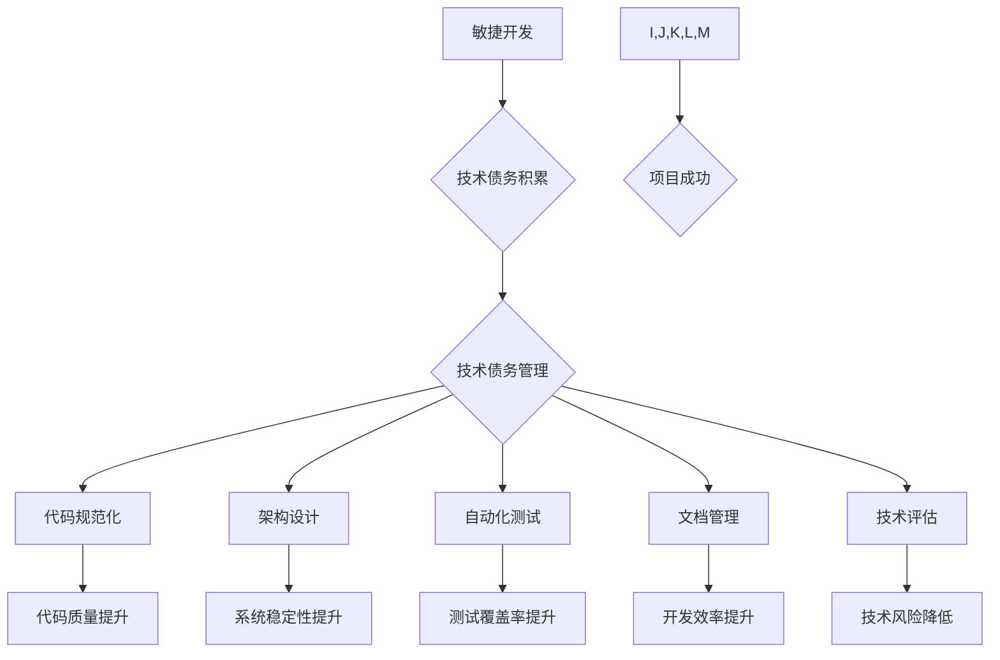

## 软件2.0的技术债务管理策略

> 关键词：技术债务、软件架构、敏捷开发、持续交付、代码质量、自动化测试、DevOps、技术演进

### 1. 背景介绍

软件行业正经历着前所未有的变革。云计算、大数据、人工智能等新兴技术不断涌现，推动着软件开发模式的演进。传统的软件开发模式已经难以满足现代软件系统复杂性和快速迭代的需求。软件2.0应运而生，它强调敏捷开发、持续交付、自动化测试等理念，旨在构建更加灵活、可扩展、可靠的软件系统。

然而，软件2.0的快速迭代和频繁更新也带来了新的挑战——技术债务。技术债务是指为了更快地交付软件而作出的短期妥协，这些妥协可能会导致软件系统在未来维护、扩展和演进过程中产生额外的成本和风险。

技术债务的积累会对软件项目的长期健康发展造成严重影响。它会导致代码质量下降、开发效率降低、系统稳定性降低，甚至最终导致项目失败。因此，有效管理技术债务是软件2.0时代软件开发不可或缺的一部分。

### 2. 核心概念与联系

**2.1 技术债务的概念**

技术债务是指在软件开发过程中为了满足短期需求而作出的技术上的妥协，这些妥协可能会导致软件系统在未来维护、扩展和演进过程中产生额外的成本和风险。

**2.2 技术债务的类型**

技术债务可以分为以下几种类型：

* **代码债务:** 代码结构混乱、缺乏注释、难以理解和维护。
* **设计债务:** 软件架构设计缺陷，导致系统难以扩展和维护。
* **测试债务:** 测试覆盖率不足，导致软件系统存在潜在的bug。
* **文档债务:** 文档不完整、不准确，导致开发人员难以理解软件系统。

**2.3 技术债务的危害**

技术债务的积累会对软件项目的长期健康发展造成严重影响。它会导致：

* 代码质量下降
* 开发效率降低
* 系统稳定性降低
* 项目成本增加
* 项目延期

**2.4 技术债务管理的必要性**

在软件2.0时代，技术债务管理变得尤为重要。因为软件2.0强调快速迭代和持续交付，这使得技术债务更容易积累。

**2.5 技术债务管理的策略**

技术债务管理需要采用多方面的策略，包括：

* 代码规范化
* 架构设计
* 自动化测试
* 文档管理
* 技术评估

**Mermaid 流程图**



### 3. 核心算法原理 & 具体操作步骤

**3.1 算法原理概述**

技术债务管理的核心算法原理是基于风险评估和优先级排序。通过分析软件系统的各个方面，例如代码质量、架构设计、测试覆盖率等，评估每个方面所带来的技术风险。然后根据风险等级和业务价值，对技术债务进行优先级排序，制定相应的改进计划。

**3.2 算法步骤详解**

1. **数据收集:** 收集软件系统的相关数据，例如代码复杂度、代码覆盖率、缺陷数量、架构复杂度等。
2. **风险评估:** 根据收集到的数据，对软件系统的各个方面进行风险评估，并计算每个方面的风险等级。
3. **优先级排序:** 根据风险等级和业务价值，对技术债务进行优先级排序。
4. **改进计划制定:** 制定针对不同优先级技术债务的改进计划，并安排相应的资源和时间。
5. **实施和监控:** 实施改进计划，并定期监控技术债务的状况，及时调整改进策略。

**3.3 算法优缺点**

**优点:**

* 基于数据分析，能够客观地评估技术债务的风险等级。
* 能够根据业务价值和风险等级，制定合理的改进计划。
* 能够有效地控制技术债务的积累。

**缺点:**

* 数据收集和风险评估需要专业知识和经验。
* 算法的准确性取决于数据质量和评估模型的合理性。
* 算法无法完全解决技术债务问题，需要结合其他管理策略。

**3.4 算法应用领域**

该算法可以应用于各种软件开发项目，例如：

* Web应用程序开发
* 移动应用程序开发
* 企业级软件开发
* 大数据平台开发

### 4. 数学模型和公式 & 详细讲解 & 举例说明

**4.1 数学模型构建**

技术债务的风险等级可以根据以下公式进行计算：

```latex
Risk Level = \frac{Complexity \times Impact \times Probability}{Mitigation}
```

其中：

* **Complexity:** 软件系统的复杂度，例如代码复杂度、架构复杂度等。
* **Impact:** 技术债务带来的潜在影响，例如代码质量下降、系统稳定性降低等。
* **Probability:** 技术债务发生的概率。
* **Mitigation:** 缓解技术债务的措施，例如代码规范化、架构设计等。

**4.2 公式推导过程**

该公式的推导过程基于风险评估的基本原理：风险 = 威胁 × 可能性 × 影响。

* **威胁:** 软件系统的复杂度和潜在影响可以看作是威胁。
* **可能性:** 技术债务发生的概率可以看作是可能性。
* **影响:** 技术债务带来的潜在影响可以看作是影响。

**4.3 案例分析与讲解**

假设一个软件系统，其代码复杂度为 5，架构复杂度为 3，技术债务带来的潜在影响为 7，技术债务发生的概率为 0.8，缓解技术债务的措施为 2。

根据公式，该软件系统的技术债务风险等级为：

```latex
Risk Level = \frac{5 \times 7 \times 0.8}{2} = 14
```

该风险等级表明该软件系统存在较高的技术债务风险。

### 5. 项目实践：代码实例和详细解释说明

**5.1 开发环境搭建**

* 操作系统：Linux
* 编程语言：Python
* 开发工具：VS Code

**5.2 源代码详细实现**

```python
import os
import re

def calculate_complexity(file_path):
    """
    计算代码复杂度
    """
    with open(file_path, 'r') as f:
        code = f.read()
    complexity = len(re.findall(r'if|else|for|while', code))
    return complexity

def analyze_technical_debt(project_path):
    """
    分析技术债务
    """
    technical_debt = {}
    for root, dirs, files in os.walk(project_path):
        for file in files:
            if file.endswith('.py'):
                file_path = os.path.join(root, file)
                complexity = calculate_complexity(file_path)
                technical_debt[file_path] = complexity
    return technical_debt

# 示例代码
project_path = '/path/to/project'
technical_debt = analyze_technical_debt(project_path)
print(technical_debt)
```

**5.3 代码解读与分析**

该代码实现了一个简单的技术债务分析工具。

* `calculate_complexity()` 函数计算代码复杂度，通过统计代码中特定关键字的出现次数来评估代码复杂度。
* `analyze_technical_debt()` 函数遍历项目目录，分析每个 Python 文件的代码复杂度，并将结果存储在 `technical_debt` 字典中。

**5.4 运行结果展示**

运行该代码后，会输出每个 Python 文件的代码复杂度，例如：

```
{'/path/to/project/file1.py': 10, '/path/to/project/file2.py': 5,...}
```

### 6. 实际应用场景

**6.1 项目维护**

技术债务管理可以帮助开发团队更好地维护软件系统。通过定期评估技术债务，开发团队可以及时发现和解决潜在的问题，避免软件系统出现重大故障。

**6.2 系统演进**

技术债务管理可以帮助开发团队更好地进行系统演进。通过优先解决高风险的技术债务，开发团队可以确保软件系统能够适应新的需求和技术变化。

**6.3 产品迭代**

技术债务管理可以帮助开发团队更好地进行产品迭代。通过控制技术债务的积累，开发团队可以确保产品迭代能够顺利进行，并提高产品的质量和稳定性。

**6.4 未来应用展望**

随着软件开发模式的不断演进，技术债务管理将变得更加重要。未来，技术债务管理工具将更加智能化和自动化，能够更好地帮助开发团队识别、评估和解决技术债务问题。

### 7. 工具和资源推荐

**7.1 学习资源推荐**

* 《软件危机》
* 《代码的艺术》
* 《设计模式》

**7.2 开发工具推荐**

* SonarQube
* Code Climate
* DeepSource

**7.3 相关论文推荐**

* "Technical Debt: A Systematic Review"
* "Managing Technical Debt in Agile Software Development"

### 8. 总结：未来发展趋势与挑战

**8.1 研究成果总结**

技术债务管理是一个重要的软件工程问题，它与软件系统的质量、稳定性和可维护性密切相关。通过对技术债务的识别、评估和管理，可以有效地降低软件开发的风险，提高软件系统的质量和可靠性。

**8.2 未来发展趋势**

未来，技术债务管理将朝着以下几个方向发展：

* **自动化:** 技术债务管理工具将更加智能化和自动化，能够自动识别和评估技术债务。
* **数据驱动:** 技术债务管理将更加注重数据分析，通过收集和分析软件开发数据，更好地理解技术债务的产生和影响。
* **协作:** 技术债务管理将更加强调团队协作，鼓励开发人员共同参与技术债务的管理。

**8.3 面临的挑战**

技术债务管理也面临一些挑战：

* **技术债务的定义和度量:** 技术债务是一个模糊的概念，缺乏统一的定义和度量标准。
* **技术债务的优先级排序:** 如何根据不同的技术债务进行优先级排序是一个复杂的问题。
* **技术债务的管理成本:** 技术债务的管理需要投入一定的成本，例如时间、人力和资源。

**8.4 研究展望**

未来，需要进一步研究以下问题：

* 如何更好地定义和度量技术债务？
* 如何开发更智能、更有效的技术债务管理工具？
* 如何降低技术债务的管理成本？


### 9. 附录：常见问题与解答

**9.1 技术债务和代码质量有什么关系？**

技术债务会降低代码质量。因为技术债务往往是由于为了更快地交付软件而作出的短期妥协，这些妥协可能会导致代码结构混乱、缺乏注释、难以理解和维护。

**9.2 如何避免技术债务的积累？**

* 坚持代码规范化
* 做好架构设计
* 编写自动化测试
* 定期进行技术评估
* 鼓励团队成员积极沟通

**9.3 如何解决已经积累的技术债务？**

* 优先解决高风险的技术债务
* 制定合理的改进计划
* 分阶段进行改进
* 持续监控技术债务的状况

作者：禅与计算机程序设计艺术 / Zen and the Art of Computer Programming


