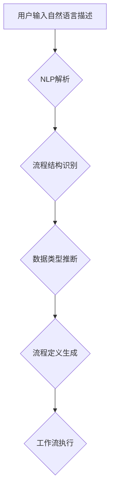

## 通过自然语言创建工作流

> 关键词：自然语言处理，工作流自动化，流程建模，人工智能，低代码开发

### 1. 背景介绍

在当今数字化时代，工作流自动化已成为提高效率、降低成本和增强企业敏捷性的关键驱动力。传统的流程建模方法通常依赖于专业的软件工具和技术人员，这使得流程设计和维护变得复杂且耗时。随着自然语言处理（NLP）技术的快速发展，利用自然语言描述和构建工作流成为了一种新的趋势，它为非技术人员提供了更直观、易于理解和操作的流程设计方式。

### 2. 核心概念与联系

#### 2.1 自然语言处理（NLP）

自然语言处理是人工智能领域的一个重要分支，旨在使计算机能够理解、解释和生成人类语言。NLP技术涵盖了多种任务，例如文本分类、情感分析、机器翻译和对话系统。

#### 2.2 工作流自动化

工作流自动化是指通过软件工具自动执行一系列预定义的任务或流程。工作流通常由多个步骤组成，每个步骤代表一个特定的任务，步骤之间通过条件和逻辑关系连接起来。工作流自动化可以帮助企业提高效率、减少人为错误和简化业务流程。

#### 2.3 自然语言工作流建模

自然语言工作流建模是指利用自然语言描述和构建工作流的过程。它将自然语言作为流程建模的输入语言，通过NLP技术将自然语言转换为可执行的流程定义。

**Mermaid 流程图**



### 3. 核心算法原理 & 具体操作步骤

#### 3.1 算法原理概述

自然语言工作流建模的核心算法通常基于以下几个步骤：

1. **自然语言解析：** 使用NLP技术分析用户输入的自然语言描述，识别关键信息，例如任务名称、输入参数、条件判断和流程分支。
2. **流程结构识别：** 根据解析结果，识别流程的结构，例如顺序、并行和循环。
3. **数据类型推断：** 推断流程中涉及的数据类型，例如文本、数字、日期和布尔值。
4. **流程定义生成：** 将解析结果和流程结构转换为可执行的流程定义，例如BPMN流程图或工作流引擎的配置脚本。

#### 3.2 算法步骤详解

1. **预处理：** 对用户输入的自然语言进行预处理，例如去除停用词、分词和词性标注。
2. **依存句法分析：** 使用依存句法分析算法识别句子中的词语关系，例如主语、谓语和宾语。
3. **关系抽取：** 使用关系抽取算法识别句子中的关键关系，例如“如果A发生，则执行B”。
4. **流程图生成：** 根据关系抽取结果，生成流程图，例如BPMN流程图。

#### 3.3 算法优缺点

**优点：**

* **易于使用：** 非技术人员也可以使用自然语言描述工作流。
* **灵活性：** 可以灵活地修改和调整工作流。
* **可维护性：** 工作流定义更加清晰易懂，便于维护和更新。

**缺点：**

* **准确性：** 自然语言理解的准确性仍然存在挑战，可能导致流程定义错误。
* **复杂度：** 处理复杂的工作流可能需要更复杂的算法和模型。
* **安全性：** 需要确保自然语言输入的安全性和可靠性。

#### 3.4 算法应用领域

自然语言工作流建模技术在以下领域具有广泛的应用前景：

* **企业流程自动化：** 自动化业务流程，例如订单处理、客户服务和财务管理。
* **软件开发：** 自动化软件开发流程，例如代码生成、测试和部署。
* **数据分析：** 自动化数据分析流程，例如数据清洗、特征提取和模型训练。
* **智能家居：** 自动化家居设备的控制和管理。

### 4. 数学模型和公式 & 详细讲解 & 举例说明

#### 4.1 数学模型构建

自然语言工作流建模可以抽象为一个图论模型，其中节点代表任务或活动，边代表任务之间的关系。

* **节点：** 每个节点表示一个任务或活动，可以包含任务名称、输入参数、输出结果和执行条件。
* **边：** 每个边表示任务之间的关系，例如顺序、并行或条件分支。

#### 4.2 公式推导过程

可以使用图论算法来推导工作流的执行顺序和逻辑关系。例如，可以使用深度优先搜索（DFS）算法遍历图，并根据边上的条件判断执行相应的任务。

#### 4.3 案例分析与讲解

假设我们有一个简单的自然语言描述：

“如果订单状态为‘待处理’，则将订单分配给客服人员；否则，将订单标记为‘已完成’。”

我们可以将其抽象为一个图论模型：

* 节点：

    * 订单状态检查
    * 订单分配
    * 订单标记

* 边：

    * 订单状态检查 -> 订单分配 (条件：订单状态为‘待处理’)
    * 订单状态检查 -> 订单标记 (条件：订单状态不为‘待处理’)

使用DFS算法可以推导出以下执行顺序：

1. 检查订单状态
2. 如果订单状态为‘待处理’，则分配订单给客服人员
3. 否则，标记订单为‘已完成’

### 5. 项目实践：代码实例和详细解释说明

#### 5.1 开发环境搭建

* Python 3.x
* 自然语言处理库：spaCy, NLTK
* 流程图生成库：graphviz

#### 5.2 源代码详细实现

```python
import spacy
from graphviz import Digraph

nlp = spacy.load("en_core_web_sm")

def parse_workflow(text):
    doc = nlp(text)
    #... (实现自然语言解析逻辑)
    # 返回流程图节点和边信息

def generate_workflow_graph(nodes, edges):
    graph = Digraph(comment='Workflow Graph')
    for node in nodes:
        graph.node(node['id'], node['name'])
    for edge in edges:
        graph.edge(edge['source'], edge['target'], label=edge['condition'])
    return graph

# 示例代码
text = "如果订单状态为‘待处理’，则将订单分配给客服人员；否则，将订单标记为‘已完成’。"
nodes, edges = parse_workflow(text)
graph = generate_workflow_graph(nodes, edges)
graph.render('workflow_graph', view=True)
```

#### 5.3 代码解读与分析

* `parse_workflow()` 函数负责解析用户输入的自然语言描述，识别流程中的节点和边信息。
* `generate_workflow_graph()` 函数根据节点和边信息生成流程图。
* 示例代码演示了如何使用 spaCy 库解析自然语言，并使用 graphviz 库生成流程图。

#### 5.4 运行结果展示

运行代码后，将生成一个名为“workflow_graph”的流程图文件，展示了示例工作流的结构。

### 6. 实际应用场景

#### 6.1 企业流程自动化

自然语言工作流建模可以帮助企业自动化各种业务流程，例如：

* **订单处理流程：** 自动化订单接收、处理、发货和售后服务等流程。
* **客户服务流程：** 自动化客户咨询、投诉处理和问题解决等流程。
* **财务管理流程：** 自动化发票处理、付款审批和账单生成等流程。

#### 6.2 软件开发流程

自然语言工作流建模可以帮助软件开发团队自动化软件开发流程，例如：

* **代码生成流程：** 根据用户需求自动生成代码模板。
* **测试流程：** 自动化代码测试和测试报告生成。
* **部署流程：** 自动化代码部署到测试环境和生产环境。

#### 6.3 数据分析流程

自然语言工作流建模可以帮助数据分析师自动化数据分析流程，例如：

* **数据清洗流程：** 自动化数据格式转换、缺失值处理和异常值检测。
* **特征提取流程：** 自动化特征选择和特征工程。
* **模型训练流程：** 自动化模型选择、模型训练和模型评估。

#### 6.4 未来应用展望

随着自然语言处理技术的不断发展，自然语言工作流建模技术将在未来得到更广泛的应用，例如：

* **智能家居自动化：** 通过自然语言描述，用户可以轻松地控制和管理智能家居设备。
* **医疗保健流程自动化：** 自动化患者记录管理、预约挂号和诊断分析等流程。
* **教育流程自动化：** 自动化课程安排、作业批改和学生评估等流程。

### 7. 工具和资源推荐

#### 7.1 学习资源推荐

* **书籍：**
    * “Speech and Language Processing” by Jurafsky and Martin
    * “Natural Language Processing with Python” by Bird, Klein, and Loper
* **在线课程：**
    * Coursera: Natural Language Processing Specialization
    * edX: Artificial Intelligence

#### 7.2 开发工具推荐

* **自然语言处理库：** spaCy, NLTK, Gensim
* **流程图生成库：** graphviz, Mermaid
* **工作流引擎：** Apache Airflow, Camunda

#### 7.3 相关论文推荐

* “A Survey of Natural Language Processing for Workflow Management”
* “Towards a Unified Framework for Natural Language Workflow Modeling”

### 8. 总结：未来发展趋势与挑战

#### 8.1 研究成果总结

自然语言工作流建模技术取得了显著的进展，为企业流程自动化、软件开发流程自动化和数据分析流程自动化提供了新的解决方案。

#### 8.2 未来发展趋势

* **更准确的自然语言理解：** 随着深度学习技术的进步，自然语言理解的准确性将进一步提高。
* **更智能的工作流建模：** 工作流建模系统将更加智能，能够自动识别用户意图并生成最佳的工作流方案。
* **更广泛的应用场景：** 自然语言工作流建模技术将应用于更多领域，例如智能家居、医疗保健和教育。

#### 8.3 面临的挑战

* **复杂工作流建模：** 处理复杂的工作流仍然是一个挑战，需要更复杂的算法和模型。
* **安全性与可靠性：** 需要确保自然语言输入的安全性和可靠性，防止恶意攻击和数据泄露。
* **跨语言支持：** 需要支持多种语言，以便更好地服务全球用户。

#### 8.4 研究展望

未来研究将重点关注以下几个方面：

* **开发更强大的自然语言理解模型。**
* **设计更智能的工作流建模算法。**
* **探索自然语言工作流建模在更多领域的应用。**

### 9. 附录：常见问题与解答

* **Q：如何确保自然语言输入的准确性？**

A：可以使用多种技术来提高自然语言输入的准确性，例如：

* **词性标注：** 识别词语的词性，例如名词、动词和形容词。
* **依存句法分析：** 识别句子中的词语关系，例如主语、谓语和宾语。
* **语义角色标注：** 识别句子中的语义角色，例如动作、对象和地点。

* **Q：如何处理复杂的工作流？**

A：处理复杂的工作流需要更复杂的算法和模型，例如：

* **状态机：** 用于表示工作流中的状态和状态转换。
* **流程网：** 用于表示工作流中的任务和任务之间的关系。
* **深度学习：** 可以用于学习复杂的工作流模式。

* **Q：如何确保工作流的安全性？**

A：可以使用以下措施来确保工作流的安全性：

* **身份验证和授权：** 确保只有授权用户才能访问和修改工作流。
* **数据加密：** 对工作流中的数据进行加密，防止数据泄露。
* **审计日志：** 记录所有对工作流的操作，