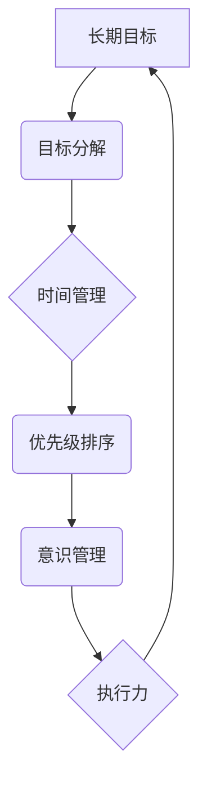

## 长期目标管理的意识方法

> 关键词：长期目标、意识管理、目标分解、时间管理、优先级排序、执行力、反馈机制、持续改进

## 1. 背景介绍

在瞬息万变的科技时代，作为一名IT从业者，我们常常面临着各种挑战和机遇。想要在激烈的竞争中脱颖而出，实现个人职业发展和技术突破，就必须拥有清晰的长期目标，并制定有效的管理策略。然而，仅仅设定目标还不够，更重要的是要培养一种“意识管理”的能力，将目标融入到日常工作和学习中，并持续地进行调整和优化。

传统的项目管理方法往往侧重于短期目标的完成，而长期目标管理则需要更深入的思考和规划。它要求我们能够洞察自身的长远发展方向，将宏大的目标分解成一个个可执行的步骤，并制定相应的行动计划。同时，还需要不断地评估和调整目标，以适应不断变化的环境和需求。

## 2. 核心概念与联系

### 2.1 长期目标

长期目标是指个人或团队在未来一段时间内（通常超过一年）想要实现的宏观目标，它代表着我们的职业理想、技术追求和人生愿景。

### 2.2 意识管理

意识管理是指通过提高自我认知、专注力和执行力，将目标融入到日常行为和思考模式中，从而实现目标的有效达成。

### 2.3 目标分解

目标分解是指将一个复杂的长期目标分解成多个相对独立、可管理的小目标，以便更容易地进行规划和执行。

### 2.4 时间管理

时间管理是指合理安排和利用时间，确保能够高效地完成目标任务。

### 2.5 优先级排序

优先级排序是指根据目标的重要性、紧迫性和影响力，对任务进行排序，以便集中精力完成最重要的任务。

**核心概念与联系流程图**

## 3. 核心算法原理 & 具体操作步骤

### 3.1 算法原理概述

长期目标管理的意识方法本质上是一种迭代优化过程，它通过不断地设定、分解、执行、评估和调整目标，来实现个人或团队的持续进步。

### 3.2 算法步骤详解

1. **设定长期目标:** 明确个人或团队未来想要达成的宏观目标，并将其转化为具体的、可衡量的目标。
2. **目标分解:** 将长期目标分解成多个可执行的小目标，并为每个小目标设定相应的截止日期和责任人。
3. **时间管理:** 利用时间管理工具和技巧，合理安排时间，确保能够高效地完成目标任务。
4. **优先级排序:** 根据目标的重要性、紧迫性和影响力，对任务进行排序，优先完成最重要的任务。
5. **意识管理:** 将目标融入到日常工作和学习中，保持对目标的关注和思考，并不断调整行动计划。
6. **执行力:** 坚持执行计划，克服拖延和干扰，并不断提高执行效率。
7. **反馈机制:** 定期评估目标的进展情况，收集反馈信息，并根据反馈进行调整和优化。

### 3.3 算法优缺点

**优点:**

* 能够帮助个人或团队明确目标方向，并制定有效的行动计划。
* 通过目标分解和优先级排序，能够提高工作效率和执行力。
* 意识管理机制能够帮助个人保持对目标的专注和动力。
* 反馈机制能够确保目标管理过程的持续改进。

**缺点:**

* 需要投入时间和精力进行目标设定和分解。
* 可能会出现目标过于宏大或过于细致的情况，需要不断调整和优化。
* 需要具备一定的自我管理能力和执行力。

### 3.4 算法应用领域

长期目标管理的意识方法适用于各种个人和团队，包括：

* IT从业者
* 创业者
* 学生
* 管理者
* 个人发展者

## 4. 数学模型和公式 & 详细讲解 & 举例说明

### 4.1 数学模型构建

我们可以用一个简单的数学模型来描述长期目标管理的过程：

**目标 = ∑(小目标)**

其中，目标代表长期目标，小目标代表目标分解后的各个子目标。

### 4.2 公式推导过程

通过目标分解，我们可以将一个复杂的长期目标分解成多个相对独立、可管理的小目标。每个小目标都可以用一个具体的公式来描述，例如：

**小目标 = 任务 * 时间 * 资源**

其中，任务代表需要完成的具体工作，时间代表完成任务所需的时间，资源代表完成任务所需的资源。

### 4.3 案例分析与讲解

假设一个IT从业者想要在未来五年内成为一名架构师。

**长期目标:** 成为一名架构师

**目标分解:**

* 学习架构设计相关的知识和技能（小目标1）
* 参与架构设计项目实践（小目标2）
* 积累架构设计经验（小目标3）
* 获得相关认证（小目标4）

**公式推导:**

* 小目标1: 学习架构设计知识和技能 = 阅读架构设计书籍 * 1年 * 个人学习时间
* 小目标2: 参与架构设计项目实践 = 参与项目数量 * 项目时长 * 个人贡献度
* 小目标3: 积累架构设计经验 = 项目数量 * 项目时长 * 个人学习和反思时间
* 小目标4: 获得相关认证 = 通过认证考试 * 认证考试时间 * 个人学习和准备时间

通过分解目标和使用公式，我们可以更清晰地了解每个小目标需要完成的工作，所需的时间和资源，并制定相应的行动计划。

## 5. 项目实践：代码实例和详细解释说明

### 5.1 开发环境搭建

为了实现长期目标管理的意识方法，我们可以使用一些工具和平台来辅助我们的工作，例如：

* **任务管理工具:** Trello, Asana, Jira
* **时间管理工具:**番茄工作法, TimeTree
* **笔记工具:** Evernote, Notion
* **目标设定工具:** LifeGoals, Habitica

### 5.2 源代码详细实现

由于长期目标管理的意识方法是一个概念性的框架，它本身并不需要具体的代码实现。但是，我们可以使用代码来实现一些辅助工具，例如：

* **目标分解工具:** 可以使用Python或JavaScript编写一个脚本，根据用户的输入自动分解目标。
* **时间管理工具:** 可以使用Python或Java编写一个应用程序，帮助用户记录时间，并分析时间使用情况。
* **反馈机制工具:** 可以使用数据库和API来构建一个反馈系统，收集用户对目标管理过程的反馈信息。

### 5.3 代码解读与分析

代码的解读和分析需要根据具体的实现细节进行。

### 5.4 运行结果展示

运行结果展示需要根据具体的工具和功能进行。

## 6. 实际应用场景

### 6.1 IT从业者

IT从业者可以利用长期目标管理的意识方法来规划自己的职业发展，例如：

* 明确想要成为哪种类型的工程师，例如软件工程师、数据科学家、架构师等。
* 学习相关的技术技能和知识，并参与项目实践。
* 积累经验，获得相关认证，提升自己的竞争力。

### 6.2 创业者

创业者可以利用长期目标管理的意识方法来规划自己的创业项目，例如：

* 明确项目的目标市场和商业模式。
* 制定产品开发计划和营销策略。
* 筹集资金，组建团队，并进行市场推广。

### 6.3 学生

学生可以利用长期目标管理的意识方法来规划自己的学习和职业发展，例如：

* 明确想要学习的专业和未来职业方向。
* 制定学习计划，并合理安排时间。
* 参加实习和项目实践，积累经验。

### 6.4 未来应用展望

随着人工智能和自动化技术的不断发展，长期目标管理的意识方法将更加重要。未来，我们可以期待看到更多基于人工智能的工具和平台，帮助个人和团队更有效地管理长期目标。

## 7. 工具和资源推荐

### 7.1 学习资源推荐

* **书籍:** 《Getting Things Done》、《Atomic Habits》、《The 7 Habits of Highly Effective People》
* **在线课程:** Coursera, Udemy, edX
* **博客和网站:** Zen Habits, Lifehacker, MindTools

### 7.2 开发工具推荐

* **任务管理工具:** Trello, Asana, Jira
* **时间管理工具:**番茄工作法, TimeTree
* **笔记工具:** Evernote, Notion
* **目标设定工具:** LifeGoals, Habitica

### 7.3 相关论文推荐

* **SMART目标设定:** Doran, G. T. (1980). There's SMART about SMART goals!. *Management Review*, *70*(11), 35-36.
* **目标分解:**  Eisenhower, D. (1954). *The Eisenhower Matrix*.
* **意识管理:**  Kabat-Zinn, J. (1994). *Wherever You Go, There You Are: Mindfulness Meditation in Everyday Life*.

## 8. 总结：未来发展趋势与挑战

### 8.1 研究成果总结

长期目标管理的意识方法已经取得了一定的成果，它帮助个人和团队更好地规划目标，提高效率，实现个人和团队的成长。

### 8.2 未来发展趋势

未来，长期目标管理的意识方法将更加注重个性化、智能化和协作性。

* **个性化:** 随着人工智能技术的进步，我们可以期待看到更加个性化的目标管理工具，能够根据用户的特点和需求提供定制化的建议和支持。
* **智能化:** 智能算法能够帮助用户自动分析目标进展情况，并提供相应的建议和提醒，提高目标管理的效率。
* **协作性:** 团队协作的目标管理工具将更加普及，帮助团队成员更好地协同工作，共同实现目标。

### 8.3 面临的挑战

长期目标管理的意识方法也面临着一些挑战，例如：

* **用户习惯:** 许多人习惯于短期目标管理，需要时间和努力才能适应长期目标管理的思维方式。
* **数据隐私:** 目标管理工具需要收集用户的个人数据，如何保护用户隐私是一个重要的挑战。
* **技术复杂性:** 开发智能化的目标管理工具需要复杂的算法和技术，需要不断进行研究和创新。

### 8.4 研究展望

未来，我们需要继续研究和探索长期目标管理的意识方法，使其更加有效、智能和人性化，帮助个人和团队更好地实现自己的目标。

## 9. 附录：常见问题与解答

### 9.1 如何设定长期目标？

设定长期目标需要考虑以下几个方面：

* **个人价值观:** 你的目标应该与你的价值观和人生目标相一致。
* **兴趣和能力:** 选择你感兴趣和擅长的领域作为目标。
* **可实现性:** 目标应该具有可实现性，不要设定过于遥远或不切实际的目标。
* **时间范围:** 长期目标通常设定在未来一年以上的时间范围。

### 9.2 如何分解长期目标？

分解长期目标需要遵循以下原则：

* **层次分明:** 将目标分解成多个层次，从宏观到微观。
* **独立性:** 每个小目标应该相对独立，相互之间没有强烈的依赖关系。
* **可衡量性:** 每个小目标应该能够用具体的指标来衡量。
* **可执行性:** 每个小目标应该能够在有限的时间内完成。

### 9.3 如何保持对目标的专注和动力？

保持对目标的专注和动力需要以下方法：

* **定期回顾目标:** 定期回顾自己的目标，并评估目标的进展情况。
* **设定奖励机制:** 为完成目标设定相应的奖励，激励自己不断前进。
* **寻找支持者:** 与朋友、家人或导师分享你的目标，寻求他们的支持和鼓励。
* **保持积极的心态:** 相信自己能够实现目标，并保持积极乐观的心态。

作者：禅与计算机程序设计艺术 / Zen and the Art of Computer Programming 
