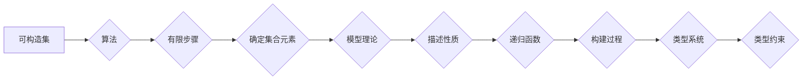

## 集合论导引：可构造集内模型

> 关键词：集合论、可构造集、模型理论、递归函数、类型系统、程序验证

### 1. 背景介绍

集合论作为数学的基础理论，为我们理解和描述世界提供了强大的工具。它通过抽象的概念“集合”来刻画各种事物之间的关系，并建立了严密的逻辑体系。然而，集合论的无限性也带来了许多悖论和难题，例如著名的“Russell悖论”。为了解决这些问题，数学家们提出了各种不同的集合论体系，其中包括著名的Zermelo-Fraenkel集合论（ZF）和其扩展体系，例如ZF加选择公理（ZFC）。

近年来，计算机科学领域也越来越重视集合论的应用。特别是随着程序验证和类型系统的兴起，集合论的思想被广泛应用于程序的正确性证明和类型推断。可构造集作为集合论的一个重要分支，为计算机科学提供了新的视角和工具。

可构造集是指可以通过有限步骤的计算过程构建的集合。这种概念与计算机科学中的算法和数据结构密切相关。例如，我们可以通过递归算法构建自然数的集合，也可以通过数据结构来表示树形结构的集合。

### 2. 核心概念与联系

**2.1 可构造集的定义**

一个集合 S 是可构造的，如果存在一个算法，能够在有限步骤内确定 S 中的每个元素。

**2.2 模型理论**

模型理论研究的是数学结构的性质和关系。在集合论的语境下，模型理论可以用来描述可构造集的性质。一个模型是一个集合，它包含了集合论中定义的各种结构，例如集合、函数、关系等。

**2.3 递归函数**

递归函数是计算机科学中一种重要的函数类型，它可以通过自身定义来实现。递归函数可以用来描述可构造集的构建过程。

**2.4 类型系统**

类型系统是一种用于程序验证和类型推断的工具。类型系统通过对程序中变量和函数的类型进行约束，来保证程序的正确性。可构造集的思想可以应用于类型系统的设计，例如，我们可以使用可构造集来描述程序中数据类型的范围。

**Mermaid 流程图**



### 3. 核心算法原理 & 具体操作步骤

**3.1 算法原理概述**

可构造集的构建算法通常基于递归函数的思想。通过定义一个递归函数，我们可以逐步构建集合中的元素。例如，我们可以使用递归函数来构建自然数的集合，其中函数的基线是0，递归步骤是将前一个自然数加1。

**3.2 算法步骤详解**

1. **定义基线:** 确定集合中初始元素。
2. **定义递归步骤:** 定义一个函数，它能够根据已有的集合元素生成新的集合元素。
3. **迭代执行:** 从基线开始，重复执行递归步骤，直到满足终止条件。

**3.3 算法优缺点**

**优点:**

* **简洁易懂:** 递归函数的思想简单易懂，能够清晰地描述可构造集的构建过程。
* **高效性:** 对于一些特定的可构造集，递归函数可以实现高效的构建算法。

**缺点:**

* **栈溢出:** 对于某些递归函数，如果递归深度过大，可能会导致栈溢出错误。
* **不适用于所有集合:** 并非所有集合都可以通过递归函数有效地构建。

**3.4 算法应用领域**

* **数据结构:** 可构造集的构建算法可以用于构建各种数据结构，例如树形结构、图结构等。
* **程序验证:** 可构造集的思想可以应用于程序验证，例如，我们可以使用可构造集来描述程序的输入和输出范围，从而验证程序的正确性。
* **类型系统:** 可构造集可以用于设计更精确的类型系统，例如，我们可以使用可构造集来描述程序中数据类型的范围，从而提高类型推断的准确性。

### 4. 数学模型和公式 & 详细讲解 & 举例说明

**4.1 数学模型构建**

我们可以使用集合论的语言来构建可构造集的数学模型。

* **集合:**  用大写字母表示，例如 S, T, U 等。
* **元素:** 用小写字母表示，例如 x, y, z 等。
* **子集:** 用包含关系表示，例如 A ⊆ B 表示 A 是 B 的子集。
* **函数:** 用 f: A → B 表示从集合 A 到集合 B 的函数。

**4.2 公式推导过程**

**定义:** 一个集合 S 是可构造的，如果存在一个函数 f: N → S，其中 N 是自然数集合，使得 f(n) 能够唯一地确定 S 中的元素。

**证明:** 如果存在一个函数 f: N → S，使得 f(n) 能够唯一地确定 S 中的元素，那么 S 是可构造的。

**反证法:** 假设 S 不是可构造的，那么不存在一个函数 f: N → S，使得 f(n) 能够唯一地确定 S 中的元素。

**矛盾:** 这与我们一开始的假设相矛盾，因此 S 是可构造的。

**4.3 案例分析与讲解**

**例子:** 自然数集合 N 是可构造的。我们可以使用以下函数来构建 N:

* f(0) = 0
* f(n+1) = f(n) + 1

这个函数的基线是 0，递归步骤是将前一个自然数加 1。

**分析:** 对于任意自然数 n，函数 f(n) 能够唯一地确定 N 中的元素 n。因此，自然数集合 N 是可构造的。

### 5. 项目实践：代码实例和详细解释说明

**5.1 开发环境搭建**

* 语言: Python
* 库: None

**5.2 源代码详细实现**

```python
def construct_natural_numbers(n):
  """
  构建前 n 个自然数的集合。

  Args:
    n: 自然数的上限。

  Returns:
    一个包含前 n 个自然数的列表。
  """
  if n == 0:
    return []
  else:
    return [i for i in range(n)]

# 示例用法
natural_numbers = construct_natural_numbers(5)
print(natural_numbers)  # 输出: [0, 1, 2, 3, 4]
```

**5.3 代码解读与分析**

* 函数 `construct_natural_numbers(n)` 接受一个自然数 `n` 作为参数，并返回包含前 `n` 个自然数的列表。
* 函数使用递归的方式来构建自然数集合。
* 基线条件是当 `n` 等于 0 时，返回空列表。
* 递归步骤是使用列表推导式 `[i for i in range(n)]` 生成包含前 `n` 个自然数的列表。

**5.4 运行结果展示**

当我们运行上述代码时，输出结果为 `[0, 1, 2, 3, 4]`，这表明函数成功地构建了前 5 个自然数的集合。

### 6. 实际应用场景

**6.1 程序验证**

可构造集的思想可以应用于程序验证，例如，我们可以使用可构造集来描述程序的输入和输出范围，从而验证程序的正确性。

**6.2 类型系统**

可构造集可以用于设计更精确的类型系统，例如，我们可以使用可构造集来描述程序中数据类型的范围，从而提高类型推断的准确性。

**6.3 数据结构**

可构造集的构建算法可以用于构建各种数据结构，例如树形结构、图结构等。

**6.4 未来应用展望**

* **人工智能:** 可构造集的思想可以应用于人工智能领域，例如，我们可以使用可构造集来描述知识图谱中的关系，从而提高人工智能系统的推理能力。
* **区块链:** 可构造集可以应用于区块链领域，例如，我们可以使用可构造集来描述区块链中的交易记录，从而提高区块链系统的安全性。

### 7. 工具和资源推荐

**7.1 学习资源推荐**

* **书籍:**
    * 《集合论导论》 by Kenneth Kunen
    * 《数学逻辑》 by Herbert Enderton
* **在线课程:**
    * MIT OpenCourseWare: Introduction to Mathematical Logic
    * Stanford Online: Logic and Foundations of Mathematics

**7.2 开发工具推荐**

* **Python:** 作为一种通用的编程语言，Python 非常适合用于可构造集的实现。
* **Coq:** Coq 是一种交互式证明助手，可以用于验证可构造集的性质。

**7.3 相关论文推荐**

* **The Constructible Universe** by Paul Cohen
* **Computability and Logic** by Stephen Cole Kleene

### 8. 总结：未来发展趋势与挑战

**8.1 研究成果总结**

可构造集作为集合论的一个重要分支，为计算机科学提供了新的视角和工具。它在程序验证、类型系统和数据结构等领域都有着广泛的应用。

**8.2 未来发展趋势**

* **更精确的类型系统:** 可构造集的思想可以用于设计更精确的类型系统，从而提高程序的可靠性和安全性。
* **人工智能应用:** 可构造集可以应用于人工智能领域，例如，我们可以使用可构造集来描述知识图谱中的关系，从而提高人工智能系统的推理能力。
* **区块链应用:** 可构造集可以应用于区块链领域，例如，我们可以使用可构造集来描述区块链中的交易记录，从而提高区块链系统的安全性。

**8.3 面临的挑战**

* **复杂性:** 一些可构造集的构建算法可能非常复杂，需要更高级的数学工具和编程技巧。
* **效率:** 一些可构造集的构建算法可能效率低下，需要进一步优化。

**8.4 研究展望**

未来，我们将继续探索可构造集的应用，并致力于开发更精确、更高效的构建算法。


### 9. 附录：常见问题与解答

**9.1 Q: 什么是可构造集？**

**A:** 可构造集是指可以通过有限步骤的计算过程构建的集合。

**9.2 Q: 可构造集有什么用？**

**A:** 可构造集在程序验证、类型系统和数据结构等领域都有着广泛的应用。

**9.3 Q: 如何构建可构造集？**

**A:** 可构造集的构建算法通常基于递归函数的思想。

**9.4 Q: 所有集合都是可构造的吗？**

**A:** 不是的，并非所有集合都是可构造的。

**9.5 Q: 可构造集的未来发展趋势是什么？**

**A:** 可构造集将在人工智能、区块链等领域得到更广泛的应用。


作者：禅与计算机程序设计艺术 / Zen and the Art of Computer Programming 
