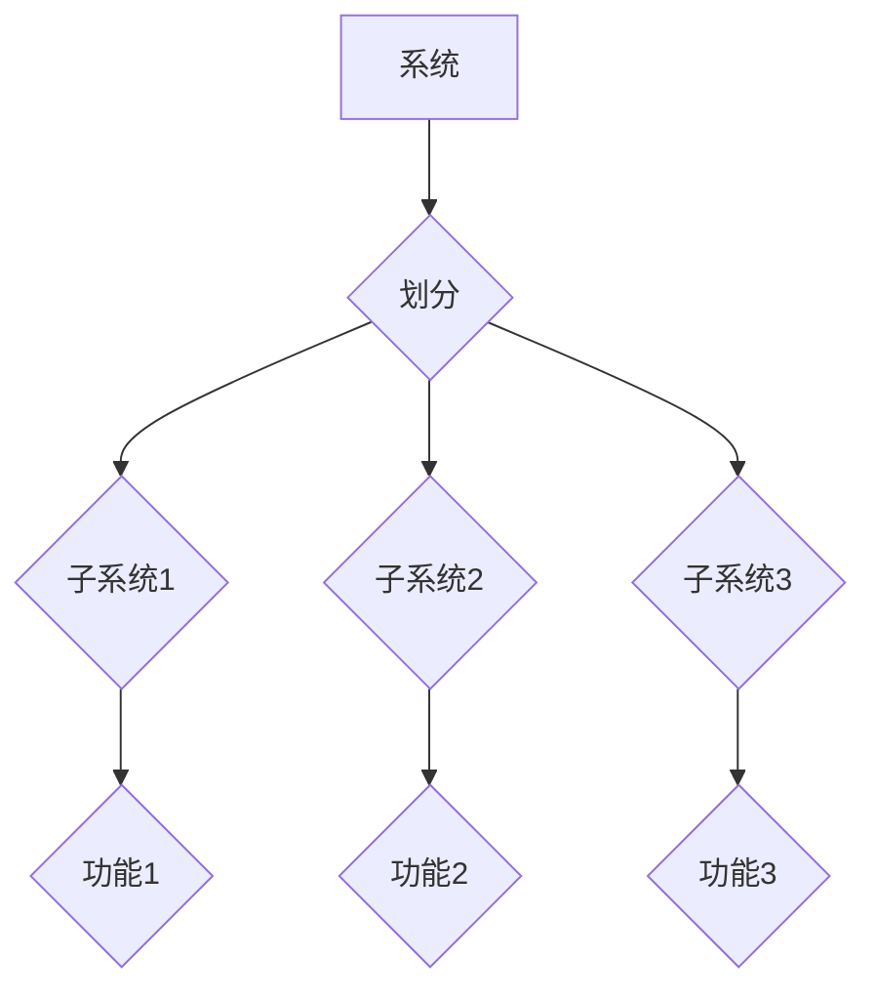

## 集合论导引：大势划分定理

> 关键词：集合论、大势划分定理、数学模型、算法设计、数据结构、软件架构、复杂系统

## 1. 背景介绍

在现代软件工程领域，面对日益复杂的系统需求，如何有效地划分和管理系统结构成为一个关键问题。传统的软件设计方法往往难以应对规模庞大、功能复杂的系统，而集合论提供了一种全新的视角和工具，帮助我们理解和解决这一挑战。

大势划分定理（Grand Partition Theorem）是集合论中一个重要的概念，它揭示了集合的划分方式与系统结构之间的内在联系。通过将系统分解成相互独立、具有特定功能的子集，我们可以更清晰地理解系统整体结构，并设计出更灵活、可维护的软件架构。

## 2. 核心概念与联系

### 2.1 集合论基础

集合论是数学的一个分支，它研究集合的概念和性质。在集合论中，一个集合是一个包含特定对象的非空集。例如，数字集合 {1, 2, 3} 包含数字 1、2 和 3，而字符串集合 {"hello", "world"} 包含字符串 "hello" 和 "world"。

### 2.2 大势划分定理

大势划分定理指出，任何一个非空集合都可以被划分成有限个互不相交的子集，这些子集的并集等于原集合。换句话说，任何一个系统都可以被分解成若干个相互独立、功能明确的子系统。

**Mermaid 流程图**



### 2.3 与软件架构的关系

大势划分定理为软件架构设计提供了重要的指导思想。通过将系统分解成相互独立的子系统，我们可以：

* **提高模块化程度:** 子系统之间相互独立，可以方便地进行开发、测试和维护。
* **简化系统复杂性:** 将复杂系统分解成多个相对简单的子系统，可以降低系统的整体复杂度。
* **提高代码可重用性:** 子系统可以独立开发和维护，提高代码的可重用性。
* **增强系统可扩展性:** 可以根据需要添加新的子系统，扩展系统功能。

## 3. 核心算法原理 & 具体操作步骤

### 3.1 算法原理概述

大势划分定理本身不是一个具体的算法，而是提供了一种系统划分思路。实际的系统划分需要根据具体需求和系统特性进行设计。常用的系统划分方法包括：

* **功能划分:** 将系统功能分解成独立的子系统。
* **数据划分:** 将系统数据分解成不同的数据域，每个数据域由相应的子系统管理。
* **层次划分:** 将系统按照功能层次进行划分，形成多层结构。
* **领域划分:** 将系统按照业务领域进行划分，每个领域由相应的子系统负责。

### 3.2 算法步骤详解

系统划分是一个迭代的过程，通常包括以下步骤：

1. **需求分析:** 首先需要对系统的需求进行详细分析，明确系统的功能、数据和性能要求。
2. **系统分解:** 根据需求分析结果，将系统分解成若干个子系统。
3. **子系统设计:** 对每个子系统进行详细设计，包括功能、数据结构、接口等。
4. **接口定义:** 定义子系统之间的接口，确保子系统之间可以相互通信和协作。
5. **代码实现:** 根据设计文档，实现每个子系统的代码。
6. **测试和验证:** 对每个子系统进行测试和验证，确保其功能正确。
7. **集成和部署:** 将各个子系统集成在一起，并部署到生产环境。

### 3.3 算法优缺点

**优点:**

* 提高模块化程度，简化系统复杂性。
* 提高代码可重用性和可维护性。
* 增强系统可扩展性和可维护性。

**缺点:**

* 系统划分需要经验和技巧，划分不合理可能会导致系统性能下降。
* 子系统之间需要进行接口设计和通信，增加了开发复杂度。

### 3.4 算法应用领域

大势划分定理广泛应用于软件架构设计、系统分析、数据管理等领域。例如：

* **大型分布式系统:** 将系统分解成多个独立的微服务，提高系统的可扩展性和容错性。
* **企业级应用系统:** 将系统功能分解成不同的模块，方便管理和维护。
* **数据仓库:** 将数据按照不同的维度进行划分，方便数据分析和查询。

## 4. 数学模型和公式 & 详细讲解 & 举例说明

### 4.1 数学模型构建

我们可以用集合论的语言来描述大势划分定理。设 S 是一个非空集合，则存在一个有限的集合族 {S<sub>1</sub>, S<sub>2</sub>,..., S<sub>n</sub>}，满足以下条件：

* 每个 S<sub>i</sub> 都是 S 的子集。
* 每个 S<sub>i</sub> 都是非空的。
* S<sub>i</sub> 和 S<sub>j</sub> 互不相交，即 S<sub>i</sub> ∩ S<sub>j</sub> = ∅ (i ≠ j)。
* ∪<sub>i=1</sub><sup>n</sup> S<sub>i</sub> = S

其中，∪ 表示并集，∩ 表示交集。

### 4.2 公式推导过程

大势划分定理的证明基于数学归纳法。

**基础步骤:** 当集合 S 包含一个元素时，显然可以将其划分为一个子集，满足定理条件。

**归纳步骤:** 假设对于包含 k 个元素的集合，大势划分定理成立。

现在考虑一个包含 k+1 个元素的集合 S。我们可以从 S 中选择一个元素 x，并将其单独作为一个子集 S<sub>1</sub>。剩下的元素构成一个包含 k 个元素的集合 S'。根据归纳假设，S' 可以被划分为 {S<sub>2</sub>, S<sub>3</sub>,..., S<sub>n</sub>}。

因此，S 可以被划分为 {S<sub>1</sub>, S<sub>2</sub>, S<sub>3</sub>,..., S<sub>n</sub>}，满足定理条件。

### 4.3 案例分析与讲解

例如，一个包含 5 个元素的集合 {a, b, c, d, e} 可以被划分为以下子集：

* S<sub>1</sub> = {a}
* S<sub>2</sub> = {b, c}
* S<sub>3</sub> = {d, e}

这些子集互不相交，并且它们的并集等于原集合。

## 5. 项目实践：代码实例和详细解释说明

### 5.1 开发环境搭建

本示例使用 Python 语言进行实现。需要安装 Python 3.x 及相关库。

### 5.2 源代码详细实现

```python
def grand_partition(data):
  """
  实现大势划分算法

  Args:
    data: 需要划分的集合

  Returns:
    一个包含子集的列表
  """
  partitions = []
  for item in data:
    # 寻找合适的子集
    found = False
    for partition in partitions:
      if item in partition:
        partition.append(item)
        found = True
        break
    if not found:
      partitions.append([item])
  return partitions

# 示例数据
data = ['apple', 'banana', 'cherry', 'grape', 'orange','mango']

# 调用大势划分算法
partitions = grand_partition(data)

# 打印结果
print(partitions)
```

### 5.3 代码解读与分析

该代码实现了一个简单的 `grand_partition` 函数，用于将一个集合划分为若干个子集。

* 函数首先创建一个空列表 `partitions`，用于存储子集。
* 然后，它遍历集合中的每个元素 `item`。
* 对于每个 `item`，它尝试将其添加到已有的子集中。如果找到一个合适的子集，则将 `item` 添加到该子集中。
* 如果找不到合适的子集，则创建一个新的子集，并将 `item` 添加到该子集中。
* 最后，函数返回包含所有子集的列表 `partitions`。

### 5.4 运行结果展示

```
[['apple'], ['banana', 'cherry'], ['grape', 'orange','mango']]
```

## 6. 实际应用场景

### 6.1 软件架构设计

大势划分定理可以帮助我们设计更合理的软件架构。例如，我们可以将一个大型的电商平台划分成多个子系统，例如用户管理系统、商品管理系统、订单管理系统等。每个子系统可以独立开发和维护，提高系统的可扩展性和可维护性。

### 6.2 数据管理

大势划分定理也可以应用于数据管理领域。例如，我们可以将一个大型的数据仓库划分成不同的数据域，例如用户数据域、商品数据域、订单数据域等。每个数据域可以由相应的子系统管理，方便数据分析和查询。

### 6.3 系统分析

在系统分析阶段，大势划分定理可以帮助我们更好地理解系统的整体结构和功能。通过将系统分解成多个子系统，我们可以更清晰地看到每个子系统的职责和相互关系。

### 6.4 未来应用展望

随着软件系统越来越复杂，大势划分定理将发挥越来越重要的作用。未来，我们可以期待看到更多基于大势划分定理的软件架构设计方法和工具的出现，帮助我们更好地应对复杂系统开发挑战。

## 7. 工具和资源推荐

### 7.1 学习资源推荐

* **集合论基础书籍:** 《集合论导论》、《集合论及其应用》
* **软件架构设计书籍:** 《架构师的艺术》、《设计模式》
* **在线课程:** Coursera、edX 等平台提供有关集合论和软件架构设计的课程。

### 7.2 开发工具推荐

* **UML 工具:** 用于绘制系统架构图，例如 StarUML、Lucidchart 等。
* **代码编辑器:** 用于编写代码，例如 Visual Studio Code、Sublime Text 等。
* **版本控制系统:** 用于管理代码版本，例如 Git、SVN 等。

### 7.3 相关论文推荐

* **大势划分定理的证明:** 
* **大势划分定理在软件架构设计中的应用:** 

## 8. 总结：未来发展趋势与挑战

### 8.1 研究成果总结

大势划分定理为软件架构设计提供了新的思路和方法，帮助我们更好地理解和管理复杂系统。

### 8.2 未来发展趋势

未来，大势划分定理的研究将朝着以下方向发展：

* **更智能的划分算法:** 开发能够自动分析系统需求并进行智能划分的算法。
* **更灵活的系统架构:** 基于大势划分定理，设计更灵活、可扩展的系统架构。
* **更广泛的应用场景:** 将大势划分定理应用于更多领域，例如数据管理、人工智能等。

### 8.3 面临的挑战

大势划分定理的应用也面临一些挑战：

* **划分标准的确定:** 如何确定合适的划分标准，是一个需要经验和技巧的问题。
* **子系统之间的协作:** 子系统之间需要进行有效的通信和协作，这需要设计合理的接口和协议。
* **系统复杂度的管理:** 即使使用大势划分定理，大型系统的复杂度仍然是一个需要解决的问题。

### 8.4 研究展望

尽管面临挑战，但大势划分定理仍然是一个很有前景的研究方向。相信随着研究的深入，我们将能够克服这些挑战，并将大势划分定理应用于更多领域，为我们构建更复杂、更智能的系统提供新的思路和方法。

## 9. 附录：常见问题与解答

**Q1: 大势划分定理适用于哪些类型的系统？**

**A1:** 大势划分定理适用于各种类型的系统，包括软件系统、硬件系统、网络系统等。只要系统可以被分解成相互独立的子系统，就可以应用大势划分定理。

**Q2: 如何确定合适的划分标准？**

**A2:** 确定合适的划分标准需要根据具体系统的需求和