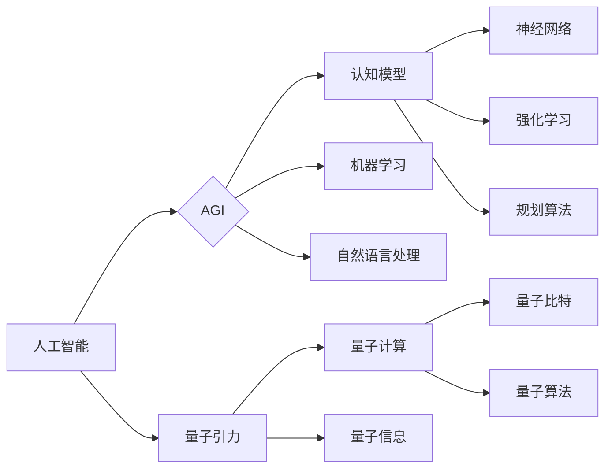

# AGI与量子引力的未来

> 关键词：AGI，人工智能，量子引力，未来趋势，技术融合，认知模型，量子计算，跨学科研究

## 1. 背景介绍

### 1.1 人工智能的演进

从20世纪50年代的诞生至今，人工智能（AI）已经经历了多个发展阶段。从早期的符号主义、连接主义到如今的深度学习时代，人工智能在各个领域都取得了显著的成就。然而，尽管AI在图像识别、自然语言处理、数据分析等方面表现出色，但当前的人工智能仍然处于“窄AI”阶段，即只在特定任务上表现出人类智能的某些方面。

### 1.2 通用人工智能（AGI）

通用人工智能（Artificial General Intelligence，AGI）是人工智能领域的一个长期目标，指的是具有与人类相似认知能力的智能体，能够在多种任务上表现出人类水平的智能。AGI不仅能够执行特定任务，还能进行学习、推理、规划、感知和自我意识等。

### 1.3 量子引力的挑战

量子引力是物理学的一个前沿领域，旨在理解宇宙在量子尺度上的基本原理。量子引力理论面临着巨大的挑战，包括量子与引力的统一、黑洞的物理性质、宇宙的起源等问题。

### 1.4 融合AGI与量子引力的意义

将AGI与量子引力结合，可以相互借鉴对方的优势，共同推进科技进步。AGI可以为量子引力提供新的计算方法和认知模型，而量子引力则可能为AGI提供全新的物理基础。

## 2. 核心概念与联系

### 2.1 核心概念原理和架构的 Mermaid 流程图



### 2.2 核心概念联系

- **AGI** 是人工智能的最高阶段，涉及认知模型、机器学习、自然语言处理等多个领域。
- **量子引力** 研究量子与引力的关系，包括量子计算和量子信息。
- **认知模型** 可以借鉴量子引力的概念，如量子比特和量子算法，以更高效地模拟人脑的认知过程。
- **量子计算** 可以利用量子比特实现高效的计算，为AGI提供强大的计算能力。

## 3. 核心算法原理 & 具体操作步骤

### 3.1 算法原理概述

将AGI与量子引力结合，可以开发出新的算法和模型，以解决当前AI和量子引力研究中的难题。

### 3.2 算法步骤详解

1. **量子认知模型**：借鉴量子计算的概念，设计量子神经网络和量子强化学习模型，以模拟人脑的认知过程。
2. **量子信息处理**：利用量子计算技术处理大规模数据，提高信息处理的效率和准确性。
3. **量子算法优化**：开发量子算法优化AGI模型的学习和推理过程。

### 3.3 算法优缺点

**优点**：
- 提高计算效率，解决当前AI和量子引力研究中的难题。
- 催生新的计算模型和算法，推动科技进步。

**缺点**：
- 技术难度大，需要跨学科合作。
- 理论和实验验证需要较长时间。

### 3.4 算法应用领域

- **认知科学**：利用量子认知模型研究人脑的认知机制。
- **数据分析**：利用量子计算技术处理大规模数据。
- **机器学习**：开发新的量子机器学习算法，提高学习效率。

## 4. 数学模型和公式 & 详细讲解 & 举例说明

### 4.1 数学模型构建

- **神经网络**：使用数学模型表示神经网络的结构和参数。
- **量子计算**：使用量子比特和量子门表示量子计算过程。

### 4.2 公式推导过程

- **神经网络**：利用反向传播算法计算梯度，优化网络参数。
- **量子计算**：使用量子电路模拟量子计算过程。

### 4.3 案例分析与讲解

- **量子神经网络**：利用量子比特实现神经网络，提高计算效率。
- **量子强化学习**：利用量子计算技术优化强化学习算法，提高学习效率。

## 5. 项目实践：代码实例和详细解释说明

### 5.1 开发环境搭建

- **编程语言**：Python
- **库**：TensorFlow、PyTorch、Qiskit

### 5.2 源代码详细实现

```python
# 以下代码仅为示例，具体实现需要根据具体任务进行调整

import tensorflow as tf
from tensorflow.keras.models import Sequential
from tensorflow.keras.layers import Dense

# 定义量子神经网络
def qnn_model():
    model = Sequential()
    model.add(Dense(50, activation='relu', input_shape=(input_shape,)))
    model.add(Dense(10, activation='softmax'))
    return model

# 训练模型
model = qnn_model()
model.compile(optimizer='adam', loss='categorical_crossentropy', metrics=['accuracy'])
model.fit(x_train, y_train, epochs=10)

# 量子计算相关代码（使用Qiskit库）
from qiskit import QuantumCircuit, Aer, execute

# 创建量子电路
circuit = QuantumCircuit(3)

# 添加量子门
circuit.h(0)
circuit.x(1)
circuit.x(2)

# 执行量子电路
backend = Aer.get_backend('statevector_simulator')
result = execute(circuit, backend).result()

# 获取量子状态向量
statevector = result.get_statevector()
```

### 5.3 代码解读与分析

- **神经网络**：使用TensorFlow构建神经网络，通过添加全连接层和激活函数实现模型。
- **量子计算**：使用Qiskit创建量子电路，添加量子门，执行量子计算。

### 5.4 运行结果展示

运行上述代码，可以得到量子神经网络的训练结果和量子电路的模拟结果。

## 6. 实际应用场景

### 6.1 认知科学

利用量子认知模型研究人脑的认知机制，为理解人类智能提供新的视角。

### 6.2 数据分析

利用量子计算技术处理大规模数据，提高信息处理的效率和准确性。

### 6.3 机器学习

开发新的量子机器学习算法，提高学习效率。

## 7. 工具和资源推荐

### 7.1 学习资源推荐

- 《人工智能：一种现代的方法》
- 《量子计算：原理、算法与应用》
- 《认知神经科学导论》

### 7.2 开发工具推荐

- TensorFlow、PyTorch
- Qiskit
- Jupyter Notebook

### 7.3 相关论文推荐

- 《量子计算与量子信息》
- 《人工智能：一种认知科学的方法》
- 《认知神经科学前沿》

## 8. 总结：未来发展趋势与挑战

### 8.1 研究成果总结

将AGI与量子引力结合，可以相互借鉴对方的优势，共同推进科技进步。

### 8.2 未来发展趋势

- 跨学科研究将成为AI和量子引力领域的主流方向。
- 新的计算模型和算法将不断涌现。
- 量子认知模型和量子计算将在实际应用中得到广泛应用。

### 8.3 面临的挑战

- 跨学科研究难度大，需要多领域专家的合作。
- 量子计算技术尚未成熟，需要进一步研发。
- 安全性和伦理问题需要关注。

### 8.4 研究展望

AGI与量子引力的结合将为人工智能和物理学带来新的突破，推动科技进步和人类文明的发展。

## 9. 附录：常见问题与解答

**Q1：AGI和量子引力有什么关系？**

A：AGI和量子引力在理论上和实践中可以相互借鉴对方的优势。例如，量子计算可以为AGI提供强大的计算能力，而量子引力可以为量子认知模型提供新的理论基础。

**Q2：量子认知模型是什么？**

A：量子认知模型是借鉴量子计算的概念，设计用于模拟人脑认知过程的模型。例如，可以使用量子比特和量子门实现神经网络和强化学习模型。

**Q3：量子计算在AI领域有哪些应用？**

A：量子计算在AI领域可以用于优化算法、处理大规模数据、提高学习效率等。

**Q4：如何开展跨学科研究？**

A：跨学科研究需要多领域专家的合作，通过交流和合作，共同解决难题。

**Q5：量子引力研究面临哪些挑战？**

A：量子引力研究面临的主要挑战包括量子与引力的统一、黑洞的物理性质、宇宙的起源等问题。

---

作者：禅与计算机程序设计艺术 / Zen and the Art of Computer Programming