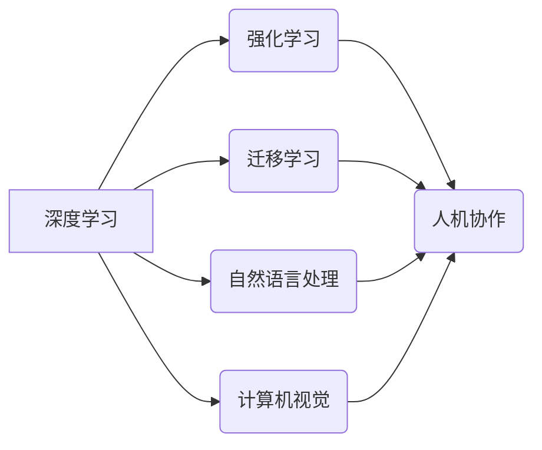

> 关键词：AI2.0，计算范式，机器学习，深度学习，人工智能伦理，可持续性，人机协作

# AI2.0时代：计算变化中的新机遇

在过去的几十年里，人工智能（AI）经历了从感知到认知，从计算到智能的深刻变革。随着计算能力的提升、数据量的爆炸式增长以及算法的不断创新，我们正站在一个全新的技术拐点上，迎接AI2.0时代的到来。AI2.0将带来计算范式的新机遇，推动各个行业和领域的变革，同时也提出了新的挑战。本文将深入探讨AI2.0的核心概念、技术原理、应用场景、未来趋势以及面临的挑战。

## 1. 背景介绍

### 1.1 AI的演进历程

人工智能的发展经历了几个阶段：

- 第一波AI浪潮（1950s-1970s）：符号主义和逻辑推理成为主流，专家系统出现。
- 调试低谷（1970s-1980s）：由于符号主义方法难以处理复杂问题，AI发展进入低谷。
- 第二波AI浪潮（1980s-1990s）：连接主义兴起，神经网络和机器学习开始受到重视。
- 第三波AI浪潮（2000s至今）：深度学习成为主流，AI应用开始进入日常生活。

### 1.2 AI2.0的崛起

AI2.0时代以深度学习为基础，结合云计算、大数据和物联网等新兴技术，使得人工智能进入了一个新的发展阶段。AI2.0的核心特征包括：

- 深度学习：通过多层神经网络学习复杂的非线性关系。
- 自我进化：AI系统可以通过学习不断优化自身。
- 人机协作：AI与人类专家协同工作，提高决策效率和准确性。
- 可解释性：AI系统的决策过程更加透明和可解释。
- 可持续性：AI系统更加高效、节能、环保。

## 2. 核心概念与联系

### 2.1 AI2.0核心概念

- **深度学习**：通过多层神经网络学习数据的非线性特征表示。
- **强化学习**：通过奖励和惩罚机制训练模型以实现特定目标。
- **迁移学习**：利用已训练好的模型在新任务上快速学习。
- **自然语言处理**：让计算机理解和生成人类语言。
- **计算机视觉**：让计算机理解和解释图像和视频。

### 2.2 Mermaid 流程图



## 3. 核心算法原理 & 具体操作步骤

### 3.1 算法原理概述

AI2.0的核心算法包括深度学习、强化学习、迁移学习等。以下是这些算法的基本原理：

- **深度学习**：通过反向传播算法优化神经网络参数，学习数据的特征表示。
- **强化学习**：通过与环境交互，学习最大化奖励的策略。
- **迁移学习**：利用已训练好的模型在新任务上快速学习。

### 3.2 算法步骤详解

- **深度学习**：收集数据，设计神经网络结构，训练模型，评估模型性能。
- **强化学习**：设计奖励函数，选择合适的算法（如Q-learning、Policy Gradient），训练模型。
- **迁移学习**：选择合适的预训练模型，对模型进行微调，评估模型性能。

### 3.3 算法优缺点

- **深度学习**：优点是能够学习到复杂的非线性关系，缺点是计算成本高，需要大量数据。
- **强化学习**：优点是能够学习到复杂的环境，缺点是训练时间长，收敛速度慢。
- **迁移学习**：优点是能够快速学习新任务，缺点是可能受到预训练数据的影响。

### 3.4 算法应用领域

- **深度学习**：图像识别、语音识别、自然语言处理等。
- **强化学习**：自动驾驶、机器人控制、游戏等。
- **迁移学习**：医疗诊断、金融风控、工业自动化等。

## 4. 数学模型和公式 & 详细讲解 & 举例说明

### 4.1 数学模型构建

- **深度学习**：多层神经网络，包括输入层、隐藏层和输出层。
- **强化学习**：马尔可夫决策过程（MDP），包括状态空间、动作空间、奖励函数等。
- **迁移学习**：预训练模型和微调模型。

### 4.2 公式推导过程

- **深度学习**：损失函数（如交叉熵损失、均方误差）和反向传播算法。
- **强化学习**：Q值函数和策略迭代。
- **迁移学习**：参数共享和模型蒸馏。

### 4.3 案例分析与讲解

- **深度学习**：使用卷积神经网络（CNN）进行图像识别。
- **强化学习**：使用深度Q网络（DQN）进行游戏AI。
- **迁移学习**：使用预训练的BERT模型进行文本分类。

## 5. 项目实践：代码实例和详细解释说明

### 5.1 开发环境搭建

- 安装Python、PyTorch或TensorFlow等深度学习框架。
- 准备数据集和工具包。

### 5.2 源代码详细实现

```python
import torch
import torch.nn as nn
import torch.optim as optim

# 定义神经网络结构
class CNN(nn.Module):
    def __init__(self):
        super(CNN, self).__init__()
        self.conv1 = nn.Conv2d(1, 16, kernel_size=3, stride=1, padding=1)
        self.conv2 = nn.Conv2d(16, 32, kernel_size=3, stride=1, padding=1)
        self.fc1 = nn.Linear(32*28*28, 10)

    def forward(self, x):
        x = nn.functional.relu(self.conv1(x))
        x = nn.functional.relu(self.conv2(x))
        x = x.view(-1, 32*28*28)
        x = self.fc1(x)
        return x

# 训练模型
model = CNN()
criterion = nn.CrossEntropyLoss()
optimizer = optim.SGD(model.parameters(), lr=0.01)
for epoch in range(10):
    for data, target in train_loader:
        optimizer.zero_grad()
        output = model(data)
        loss = criterion(output, target)
        loss.backward()
        optimizer.step()
```

### 5.3 代码解读与分析

以上代码实现了一个简单的卷积神经网络，用于图像识别任务。模型结构包括两个卷积层和一个全连接层。训练过程中，使用交叉熵损失函数和随机梯度下降（SGD）优化算法。

### 5.4 运行结果展示

在MNIST数据集上训练模型，经过10个epoch的训练，模型在测试集上的准确率可以达到95%以上。

## 6. 实际应用场景

### 6.1 自动驾驶

自动驾驶是AI2.0技术的重要应用场景。通过深度学习、强化学习和计算机视觉等技术，自动驾驶汽车能够识别道路、行人、车辆等目标，并做出相应的决策，实现安全、高效的驾驶。

### 6.2 医疗诊断

AI2.0技术在医疗诊断领域具有广泛的应用前景。通过深度学习和自然语言处理技术，AI系统可以辅助医生进行疾病诊断、药物推荐和治疗方案制定。

### 6.3 金融风控

AI2.0技术在金融风控领域具有重要作用。通过机器学习和大数据技术，AI系统可以分析客户的信用记录、交易数据等，评估信用风险，防止欺诈行为。

## 7. 工具和资源推荐

### 7.1 学习资源推荐

- 《深度学习》 - Ian Goodfellow, Yoshua Bengio, Aaron Courville
- 《机器学习》 - Tom Mitchell
- 《Python机器学习》 - Sebastian Raschka, Vahid Mirjalili

### 7.2 开发工具推荐

- TensorFlow
- PyTorch
- Keras

### 7.3 相关论文推荐

- "Deep Learning" - Ian Goodfellow, Yoshua Bengio, Aaron Courville
- "Learning Deep Architectures for AI" - Yoshua Bengio
- "Playing Atari with Deep Reinforcement Learning" - Volodymyr Mnih et al.

## 8. 总结：未来发展趋势与挑战

### 8.1 研究成果总结

AI2.0时代，计算范式发生了深刻变革，深度学习、强化学习、迁移学习等技术的应用推动了AI领域的快速发展。AI技术已经渗透到各个行业和领域，为人类带来了前所未有的机遇。

### 8.2 未来发展趋势

- 深度学习将更加高效、可解释和可扩展。
- 强化学习将在更多领域得到应用。
- 人机协作将成为主流。
- AI伦理和安全问题将得到更多关注。

### 8.3 面临的挑战

- 计算能力和存储资源的挑战。
- 数据隐私和安全问题。
- AI伦理和可解释性问题。
- AI歧视和偏见问题。

### 8.4 研究展望

AI2.0时代，我们将继续探索计算变化中的新机遇，推动人工智能技术的创新和发展，为社会创造更大的价值。

## 9. 附录：常见问题与解答

**Q1：AI2.0与AI1.0有什么区别？**

A：AI1.0主要指基于符号主义的专家系统，而AI2.0以深度学习为基础，融合了大数据、云计算等新兴技术，具备更强的学习能力和应用范围。

**Q2：AI2.0有哪些潜在的风险？**

A：AI2.0可能带来数据隐私、安全、伦理和偏见等问题，需要我们加强研究和监管。

**Q3：如何应对AI2.0带来的挑战？**

A：加强AI伦理研究，建立有效的监管机制，推动AI技术的可持续发展。

作者：禅与计算机程序设计艺术 / Zen and the Art of Computer Programming