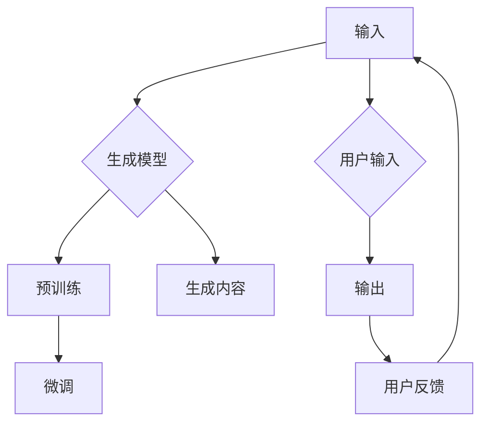

# AIGC从入门到实战：Microsoft 365 Copilot—用 AI 助手轻松驾驭办公软件

> 关键词：AIGC, Microsoft 365, Copilot, 办公自动化, 人工智能, 智能助手, 文本生成, 代码生成, 图像生成

## 1. 背景介绍

随着人工智能技术的飞速发展，人工智能生成内容（Artificial Intelligence Generated Content, AIGC）逐渐成为了一个热门的研究方向。AIGC技术能够利用机器学习算法自动生成文本、图像、音频、视频等多种类型的内容，极大地提高了内容生产的效率和质量。Microsoft 365 Copilot 是微软公司推出的一款革命性的 AI 助手，它将 AIGC 技术应用于办公软件，为用户提供了一个全新的办公体验。

### 1.1 AIGC 技术的兴起

AIGC 技术的兴起得益于以下几个方面：

- **海量数据的积累**：随着互联网的普及，大量的数据被收集和存储起来，为 AIGC 技术提供了丰富的训练数据。
- **计算能力的提升**：随着云计算和边缘计算的发展，计算能力得到了极大的提升，为 AIGC 技术的实现提供了强大的计算支持。
- **算法的进步**：深度学习、自然语言处理、计算机视觉等算法的进步，为 AIGC 技术的实现提供了理论基础和技术手段。

### 1.2 Microsoft 365 Copilot 的诞生

Microsoft 365 Copilot 是微软公司推出的首款将 AIGC 技术应用于办公软件的产品。Copilot 可以帮助用户自动生成各种类型的内容，如文档、电子邮件、演示文稿、代码等，极大地提高了办公效率。

### 1.3 本文结构

本文将围绕 Microsoft 365 Copilot 展开，首先介绍 AIGC 的基本概念和原理，然后详细讲解 Copilot 的功能和使用方法，最后探讨 Copilot 的实际应用场景和未来发展趋势。

## 2. 核心概念与联系

### 2.1 AIGC 的核心概念

AIGC 的核心概念包括以下几个方面：

- **生成模型**：生成模型是 AIGC 技术的核心，它能够根据输入的条件生成新的内容。
- **预训练**：预训练是指在使用特定任务的数据集对模型进行训练之前，先在大量无标注数据上进行训练，以学习通用知识。
- **微调**：微调是指在预训练的基础上，使用特定任务的数据集对模型进行进一步训练，以适应特定任务的需求。

### 2.2 Mermaid 流程图

以下是一个 Mermaid 流程图，展示了 AIGC 技术的核心概念和它们之间的联系：



### 2.3 AIGC 技术的架构

AIGC 技术的架构通常包括以下几个部分：

- **数据收集与预处理**：收集和预处理数据，为模型训练提供高质量的数据。
- **模型训练**：使用生成模型进行训练，学习数据的特征和规律。
- **内容生成**：使用训练好的模型生成新的内容。
- **用户交互**：与用户进行交互，收集用户反馈，不断优化模型。

## 3. 核心算法原理 & 具体操作步骤

### 3.1 算法原理概述

Microsoft 365 Copilot 的核心算法原理主要包括以下几部分：

- **预训练**：使用大量无标注数据对预训练模型进行训练，学习通用语言知识和知识库。
- **微调**：使用特定任务的数据集对模型进行微调，以适应特定任务的需求。
- **生成**：根据用户输入生成新的内容。

### 3.2 算法步骤详解

1. **数据收集与预处理**：收集和预处理无标注数据和特定任务的数据集。
2. **预训练**：使用无标注数据对预训练模型进行训练，学习通用语言知识和知识库。
3. **微调**：使用特定任务的数据集对模型进行微调，以适应特定任务的需求。
4. **生成**：根据用户输入生成新的内容。

### 3.3 算法优缺点

#### 优点：

- **效率高**：Copilot 可以自动生成各种类型的内容，极大地提高了办公效率。
- **准确性高**：Copilot 使用了先进的预训练和微调技术，生成的内容的准确性和质量较高。
- **用户体验好**：Copilot 的用户界面友好，易于使用。

#### 缺点：

- **依赖高质量数据**：Copilot 的性能取决于训练数据的质量，如果训练数据质量不高，Copilot 的性能也会受到影响。
- **模型复杂度高**：Copilot 使用了复杂的模型，对计算资源的要求较高。

### 3.4 算法应用领域

Microsoft 365 Copilot 可以应用于以下领域：

- **文本生成**：自动生成文档、电子邮件、演示文稿等。
- **代码生成**：自动生成代码片段，提高编程效率。
- **图像生成**：自动生成图像，用于设计、编辑等。

## 4. 数学模型和公式 & 详细讲解 & 举例说明

### 4.1 数学模型构建

Microsoft 365 Copilot 的数学模型主要包括以下几部分：

- **预训练模型**：如 GPT-3、BERT 等。
- **微调模型**：在预训练模型的基础上，添加特定任务的任务层。
- **生成模型**：使用生成模型（如 Transformer）生成新的内容。

### 4.2 公式推导过程

由于篇幅限制，此处不进行具体的公式推导过程。但可以简要说明，预训练模型和微调模型的训练过程遵循深度学习的基本原理，如反向传播算法、梯度下降等。

### 4.3 案例分析与讲解

以下是一个使用 Microsoft 365 Copilot 自动生成文档的案例：

1. **用户输入**：用户输入一个主题，如“产品介绍”。
2. **Copilot 生成**：Copilot 根据主题生成一个产品介绍文档。
3. **用户反馈**：用户对生成的文档进行修改和补充。

通过这个案例，可以看到 Microsoft 365 Copilot 如何帮助用户快速生成高质量的文档。

## 5. 项目实践：代码实例和详细解释说明

### 5.1 开发环境搭建

由于 Microsoft 365 Copilot 是一个基于微软云服务的应用，用户无需进行开发环境的搭建，只需在 Microsoft 365 平台开通 Copilot 服务即可。

### 5.2 源代码详细实现

Microsoft 365 Copilot 的源代码由微软公司内部开发，对外不公开。

### 5.3 代码解读与分析

由于源代码不公开，无法进行代码解读与分析。

### 5.4 运行结果展示

以下是一个使用 Microsoft 365 Copilot 自动生成文档的示例：

```
主题：产品介绍

一、产品概述

我们的产品是一款面向企业的协同办公软件，旨在提高团队的协作效率和办公效率。

二、产品功能

1. 文档协作：支持多人实时协作编辑文档，提高团队协作效率。

2. 任务管理：支持任务分配、进度跟踪等功能，帮助团队高效完成工作。

3. 日程管理：支持日程安排、提醒等功能，方便用户管理个人时间。

4. 云存储：提供云端存储空间，方便用户随时随地访问文件。

三、产品优势

1. 便捷的协作：支持多人实时协作，提高团队协作效率。

2. 丰富的功能：提供文档协作、任务管理、日程管理、云存储等功能，满足企业办公需求。

3. 安全可靠：采用数据加密、权限控制等技术，保障企业数据安全。

4. 适配性强：支持多种设备和操作系统，方便用户随时随地使用。

```

## 6. 实际应用场景

### 6.1 文档生成

Microsoft 365 Copilot 可以帮助用户自动生成各种类型的文档，如：

- 商业计划书
- 报告
- 产品说明书
- 新闻稿
- 邮件

### 6.2 代码生成

Microsoft 365 Copilot 可以帮助程序员自动生成代码片段，如：

- 函数
- 类
- 控制器
- 模板

### 6.3 图像生成

Microsoft 365 Copilot 可以帮助用户自动生成图像，如：

- 产品设计图
- 用户体验图
- 营销海报

## 7. 工具和资源推荐

### 7.1 学习资源推荐

- Microsoft 365 官方文档：https://learn.microsoft.com/en-us/microsoft-365/
- AIGC 技术博客：https://aigc.github.io/
- 深度学习教程：https://www.deeplearningbook.org/

### 7.2 开发工具推荐

- Microsoft 365 Copilot：https://www.microsoft.com/microsoft-365/copilot
- Jupyter Notebook：https://jupyter.org/
- Colab：https://colab.research.google.com/

### 7.3 相关论文推荐

- AIGC 相关论文列表：https://github.com/AIGC-research/AIGC-papers

## 8. 总结：未来发展趋势与挑战

### 8.1 研究成果总结

Microsoft 365 Copilot 的推出，标志着 AIGC 技术在办公软件领域的应用取得了重要突破。Copilot 的成功，为 AIGC 技术在更多领域的应用提供了借鉴和参考。

### 8.2 未来发展趋势

未来，AIGC 技术将朝着以下方向发展：

- **更强大的生成能力**：AIGC 技术将能够生成更加丰富、更加复杂的内容。
- **更加智能的交互**：AIGC 技术将能够更好地理解用户需求，提供更加个性化的服务。
- **更加广泛的应用**：AIGC 技术将应用于更多领域，如教育、医疗、娱乐等。

### 8.3 面临的挑战

AIGC 技术在发展过程中也面临着一些挑战：

- **数据隐私**：AIGC 技术需要大量数据作为训练数据，如何保护用户数据隐私是一个重要问题。
- **内容质量**：如何保证 AIGC 生成的内容的准确性和可靠性是一个挑战。
- **伦理道德**：AIGC 生成的内容的伦理道德问题需要引起重视。

### 8.4 研究展望

未来，我们需要在以下方面加强研究：

- **数据隐私保护**：研究数据隐私保护技术，保护用户数据隐私。
- **内容质量控制**：研究内容质量控制技术，保证 AIGC 生成的内容的准确性和可靠性。
- **伦理道德规范**：制定 AIGC 技术的伦理道德规范，确保 AIGC 技术的健康发展。

## 9. 附录：常见问题与解答

### Q1：什么是 AIGC？

AIGC 是人工智能生成内容的缩写，是指利用人工智能技术自动生成文本、图像、音频、视频等多种类型的内容。

### Q2：什么是 Microsoft 365 Copilot？

Microsoft 365 Copilot 是微软公司推出的一款革命性的 AI 助手，它将 AIGC 技术应用于办公软件，为用户提供了一个全新的办公体验。

### Q3：Copilot 的主要功能是什么？

Copilot 的主要功能包括文档生成、代码生成、图像生成等。

### Q4：如何使用 Copilot？

用户可以通过 Microsoft 365 平台开通 Copilot 服务，然后根据提示进行操作。

### Q5：Copilot 的安全性如何保证？

微软公司对 Copilot 的安全性进行了严格的测试和评估，确保用户数据的安全。

---

作者：禅与计算机程序设计艺术 / Zen and the Art of Computer Programming