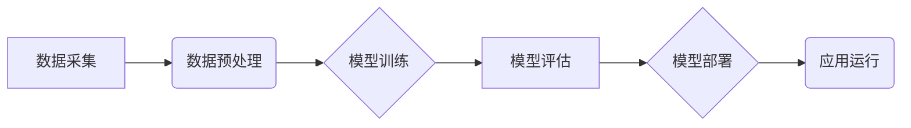

## AI-Native应用开发：以Pailido为例

> 关键词：AI-Native, Pailido, 应用程序开发, 人工智能, 深度学习, 自然语言处理, 机器学习, 智能化

## 1. 背景介绍

随着人工智能技术的飞速发展，AI已经不再是实验室的专属概念，而是逐渐渗透到生活的方方面面。从智能手机的语音助手到自动驾驶汽车，AI正在改变着我们的生活方式。在这个背景下，一种新的应用开发模式应运而生——AI-Native应用开发。

AI-Native应用开发是指将人工智能技术作为核心驱动力，从设计、开发到部署的全生命周期融入应用程序开发流程。这种模式的核心思想是，应用程序应该能够像人类一样学习、理解和响应用户需求，从而提供更加智能、个性化和便捷的用户体验。

Pailido是一个基于AI-Native开发模式的开源平台，旨在简化AI应用开发流程，让开发者能够更轻松地构建智能应用程序。Pailido提供了一套完整的开发工具链，包括数据标注工具、模型训练平台、模型部署服务等，帮助开发者从零开始构建AI应用，并将其快速部署到生产环境。

## 2. 核心概念与联系

### 2.1 AI-Native应用开发的核心概念

AI-Native应用开发的核心概念包括：

* **数据驱动**: AI-Native应用依赖于海量数据进行训练和学习，数据是AI应用的核心驱动力。
* **模型中心化**: AI-Native应用的核心是机器学习模型，模型的训练、部署和管理是关键环节。
* **智能化**: AI-Native应用的目标是实现智能化，能够像人类一样理解和响应用户需求。
* **可扩展性**: AI-Native应用需要能够适应不断变化的数据和用户需求，并能够进行规模化部署。

### 2.2 Pailido平台架构

Pailido平台采用分层架构，主要包括以下几个模块：

* **数据采集**: 从各种数据源收集数据，包括文本、图像、音频等。
* **数据预处理**: 对收集到的数据进行清洗、转换和格式化，使其能够用于模型训练。
* **模型训练**: 使用深度学习算法训练机器学习模型，例如自然语言处理模型、图像识别模型等。
* **模型评估**: 对训练好的模型进行评估，评估模型的性能和准确性。
* **模型部署**: 将训练好的模型部署到生产环境，使其能够用于实际应用。
* **应用运行**: 用户使用AI-Native应用程序，应用程序根据用户需求调用部署的模型进行处理。

## 3. 核心算法原理 & 具体操作步骤

### 3.1 算法原理概述

Pailido平台支持多种机器学习算法，例如深度神经网络、支持向量机、决策树等。这些算法都基于统计学和数学原理，通过学习数据中的模式和规律，能够对新的数据进行预测和分类。

### 3.2 算法步骤详解

以深度神经网络为例，其训练步骤如下：

1. **数据准备**: 将数据分为训练集、验证集和测试集。
2. **网络结构设计**: 根据任务需求设计深度神经网络的结构，包括层数、节点数、激活函数等。
3. **参数初始化**: 为网络参数进行随机初始化。
4. **前向传播**: 将训练数据输入网络，计算输出结果。
5. **损失函数计算**: 计算输出结果与真实值的差异，即损失函数值。
6. **反向传播**: 根据损失函数值，反向传播误差，更新网络参数。
7. **迭代训练**: 重复步骤4-6，直到模型性能达到预期水平。

### 3.3 算法优缺点

**优点**:

* 能够学习复杂的数据模式，具有较高的准确率。
* 可用于多种类型的数据，包括文本、图像、音频等。

**缺点**:

* 训练时间长，需要大量的计算资源。
* 模型解释性差，难以理解模型的决策过程。

### 3.4 算法应用领域

深度神经网络广泛应用于以下领域：

* **自然语言处理**: 文本分类、情感分析、机器翻译等。
* **图像识别**: 图像分类、目标检测、图像分割等。
* **语音识别**: 语音转文本、语音合成等。
* **推荐系统**: 商品推荐、内容推荐等。

## 4. 数学模型和公式 & 详细讲解 & 举例说明

### 4.1 数学模型构建

深度神经网络可以看作是一个多层感知机，每个层包含多个神经元。每个神经元接收来自上一层的输入信号，并通过激活函数进行处理，输出到下一层。

### 4.2 公式推导过程

**激活函数**:

常用的激活函数包括 sigmoid 函数、ReLU 函数、tanh 函数等。

**损失函数**:

常用的损失函数包括均方误差 (MSE)、交叉熵损失 (Cross-Entropy Loss) 等。

**反向传播算法**:

反向传播算法通过计算梯度，更新网络参数。

### 4.3 案例分析与讲解

以图像分类为例，假设我们有一个包含猫和狗的图像数据集。我们可以使用深度神经网络训练一个模型，能够识别图像中是猫还是狗。

训练过程中，我们会将图像数据输入到网络中，网络会输出一个概率分布，表示图像中是猫的概率和狗的概率。然后，我们会使用交叉熵损失函数计算模型的预测结果与真实标签之间的差异。

通过反向传播算法，我们会计算损失函数对网络参数的梯度，并根据梯度更新网络参数。重复这个过程多次，直到模型的性能达到预期水平。

## 5. 项目实践：代码实例和详细解释说明

### 5.1 开发环境搭建

Pailido平台支持多种开发环境，例如 Linux、Windows、macOS 等。

### 5.2 源代码详细实现

Pailido平台提供了一套完整的开发工具链，包括数据标注工具、模型训练平台、模型部署服务等。开发者可以使用这些工具来构建AI应用。

### 5.3 代码解读与分析

Pailido平台的源代码开源，开发者可以自由查看和修改代码。

### 5.4 运行结果展示

Pailido平台提供了丰富的监控和分析工具，开发者可以实时查看模型的训练进度和性能指标。

## 6. 实际应用场景

Pailido平台可以应用于各种场景，例如：

* **智能客服**: 使用自然语言处理模型，构建智能客服机器人，能够自动回答用户问题。
* **图像识别**: 使用图像识别模型，识别图像中的物体，例如人脸识别、物体检测等。
* **文本生成**: 使用文本生成模型，生成高质量的文本内容，例如新闻报道、广告文案等。

### 6.4 未来应用展望

随着人工智能技术的不断发展，Pailido平台的应用场景将会更加广泛。例如，可以应用于医疗诊断、金融风险控制、自动驾驶等领域。

## 7. 工具和资源推荐

### 7.1 学习资源推荐

* **Pailido官方文档**: https://pailido.com/docs
* **深度学习书籍**: 《深度学习》

### 7.2 开发工具推荐

* **Python**: Pailido平台基于Python开发。
* **TensorFlow**: Pailido平台支持TensorFlow深度学习框架。
* **PyTorch**: Pailido平台也支持PyTorch深度学习框架。

### 7.3 相关论文推荐

* **《ImageNet Classification with Deep Convolutional Neural Networks》**: https://arxiv.org/abs/1202.1938

## 8. 总结：未来发展趋势与挑战

### 8.1 研究成果总结

Pailido平台为AI-Native应用开发提供了便捷的工具和平台，促进了AI技术的普及和应用。

### 8.2 未来发展趋势

未来，Pailido平台将继续朝着以下方向发展：

* **更易于使用的开发工具**: 提供更直观、更易于使用的开发工具，降低AI应用开发的门槛。
* **更强大的模型库**: 提供更多类型的预训练模型，方便开发者快速构建AI应用。
* **更完善的部署方案**: 提供更灵活、更安全的部署方案，方便开发者将AI应用部署到生产环境。

### 8.3 面临的挑战

Pailido平台也面临一些挑战：

* **数据安全**: AI应用依赖于海量数据，数据安全是一个重要的挑战。
* **模型解释性**: 深度学习模型的解释性差，难以理解模型的决策过程。
* **伦理问题**: AI技术的应用可能会带来一些伦理问题，例如算法偏见、隐私泄露等。

### 8.4 研究展望

Pailido平台的未来发展将围绕解决这些挑战展开，例如：

* 研究更安全的机器学习算法，保护数据安全。
* 研究更有效的模型解释方法，提高模型的透明度。
* 研究AI技术的伦理问题，确保AI技术的健康发展。

## 9. 附录：常见问题与解答

### 9.1 如何安装Pailido平台？

### 9.2 如何使用Pailido平台构建AI应用？

### 9.3 Pailido平台支持哪些机器学习算法？

### 9.4 Pailido平台的开源协议是什么？

### 9.5 如何联系Pailido平台的开发者？

作者：禅与计算机程序设计艺术 / Zen and the Art of Computer Programming 
