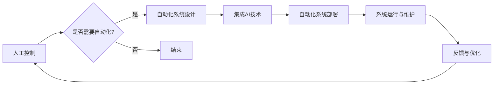
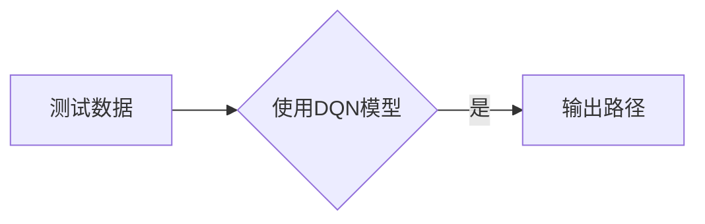

# AI在自动化领域的应用前景

> 关键词：人工智能，自动化，机器人，工业4.0，智能制造，机器学习，深度学习，预测分析

## 1. 背景介绍

随着科技的飞速发展，人工智能（AI）已经从理论走向实践，深刻地影响着各行各业。自动化领域作为工业发展的核心驱动力之一，其与人工智能的结合，即AI在自动化领域的应用，正成为推动制造业向智能化、高效化方向发展的关键。本文将探讨AI在自动化领域的应用前景，分析其核心概念、算法原理、实际应用场景，并展望未来发展趋势与挑战。

## 2. 核心概念与联系

### 2.1 核心概念

#### 2.1.1 人工智能（AI）

人工智能是指计算机科学的一个分支，研究如何让计算机模拟、延伸和扩展人类的智能。AI包括多个子领域，如机器学习、深度学习、计算机视觉、自然语言处理等。

#### 2.1.2 自动化（Automation）

自动化是指通过机械、电子、计算机等技术，使生产、控制、服务等过程实现自动化运行，减少人力干预。

#### 2.1.3 工业自动化（Industrial Automation）

工业自动化是指利用计算机技术、自动控制技术等，实现工业生产过程的自动化控制，提高生产效率和质量。

#### 2.1.4 智能制造（Intelligent Manufacturing）

智能制造是自动化、信息化、网络化、智能化等技术深度融合的产物，旨在实现生产过程的智能化、个性化、柔性化。

### 2.2 联系

AI在自动化领域的应用，是将AI技术应用于工业自动化过程，实现生产过程的智能化和高效化。具体来说，AI在自动化领域的应用包括：

- 机器人控制：利用AI技术提高机器人的自主性和灵活性。
- 过程控制：利用AI技术实现生产过程的实时监测和优化。
- 质量检测：利用AI技术实现产品质量的自动检测和分析。
- 故障诊断：利用AI技术实现设备故障的自动诊断和预测。

### 2.3 Mermaid流程图



## 3. 核心算法原理 & 具体操作步骤

### 3.1 算法原理概述

AI在自动化领域的应用涉及多种算法，主要包括：

- 机器学习：通过数据驱动的方式，让计算机从数据中学习规律，实现智能决策。
- 深度学习：一种特殊的机器学习方法，通过构建深层神经网络模拟人类大脑的学习过程。
- 计算机视觉：使计算机能够理解和处理视觉信息，如图像识别、目标检测等。
- 自然语言处理：使计算机能够理解和生成自然语言，如语音识别、机器翻译等。

### 3.2 算法步骤详解

AI在自动化领域的应用步骤通常包括：

1. 数据收集：收集生产过程中相关的数据，如传感器数据、设备状态数据等。
2. 数据预处理：对收集到的数据进行分析、清洗、转换等预处理操作。
3. 模型训练：选择合适的算法，对预处理后的数据进行分析，训练模型。
4. 模型评估：对训练好的模型进行评估，确保其性能达到预期。
5. 模型部署：将训练好的模型部署到自动化系统中，实现智能决策。
6. 系统运行与维护：对自动化系统进行监控和维护，确保其稳定运行。

### 3.3 算法优缺点

#### 3.3.1 优点

- 提高生产效率：通过自动化的方式，减少人力成本，提高生产效率。
- 提高产品质量：通过AI技术，实现产品质量的实时监测和分析，提高产品质量。
- 降低生产成本：减少人力成本，降低生产过程中的能耗和物料损耗。
- 提高安全性：通过自动化控制，减少人为操作错误，提高生产安全性。

#### 3.3.2 缺点

- 初始投资成本高：购置和部署自动化设备、AI算法等技术需要较高的投资成本。
- 技术门槛高：需要具备一定的技术知识和技能，才能进行AI在自动化领域的应用。
- 隐私和安全问题：自动化系统可能会涉及到用户隐私和数据安全问题。

### 3.4 算法应用领域

AI在自动化领域的应用领域包括：

- 工业生产：如机器人控制、过程控制、质量检测、故障诊断等。
- 交通运输：如无人驾驶、无人机配送、智能交通管理等。
- 医疗健康：如智能诊断、药物研发、健康管理等。
- 智能家居：如智能家电、智能安防等。

## 4. 数学模型和公式 & 详细讲解 & 举例说明

### 4.1 数学模型构建

AI在自动化领域的应用涉及到多种数学模型，以下列举几种常见的模型：

#### 4.1.1 机器学习模型

- 线性回归：用于预测连续值输出。
- 逻辑回归：用于预测二分类问题。
- 决策树：用于分类和回归问题。

#### 4.1.2 深度学习模型

- 神经网络：用于复杂的数据建模和分类任务。
- 卷积神经网络（CNN）：用于图像识别和图像分类。
- 循环神经网络（RNN）：用于序列数据建模和分类。

### 4.2 公式推导过程

以下以线性回归为例，介绍公式推导过程。

假设输入变量为 $x$，输出变量为 $y$，线性回归模型为 $y = wx + b$，其中 $w$ 和 $b$ 为模型的参数。

最小化损失函数：

$$
J(w, b) = \frac{1}{2}\sum_{i=1}^n (y_i - wx_i - b)^2
$$

对 $w$ 和 $b$ 分别求偏导，得到：

$$
\frac{\partial J}{\partial w} = \frac{1}{2}\sum_{i=1}^n (y_i - wx_i - b)x_i = \frac{1}{2}\sum_{i=1}^n (wx_i + b - y_i)x_i
$$

$$
\frac{\partial J}{\partial b} = \frac{1}{2}\sum_{i=1}^n (wx_i + b - y_i) = \frac{1}{2}\sum_{i=1}^n (wx_i - y_i)
$$

令偏导数等于0，解得：

$$
w = \frac{1}{n}\sum_{i=1}^n (wx_i - y_i)x_i
$$

$$
b = \frac{1}{n}\sum_{i=1}^n (wx_i - y_i)
$$

### 4.3 案例分析与讲解

以下以工业机器人路径规划为例，介绍AI在自动化领域的应用。

#### 4.3.1 问题背景

在工业生产中，机器人需要在复杂环境下进行路径规划，以避开障碍物，完成搬运、装配等任务。

#### 4.3.2 解决方案

使用强化学习算法，如深度Q网络（DQN），对机器人进行路径规划训练。

- 状态空间：机器人的位置、速度、方向、障碍物位置等信息。
- 行动空间：机器人的移动方向、速度等信息。
- 奖励函数：机器人到达目的地、避开障碍物等。
- 惩罚函数：机器人发生碰撞、偏离预定路径等。

通过训练，机器人能够学习到最优路径规划策略。

## 5. 项目实践：代码实例和详细解释说明

### 5.1 开发环境搭建

1. 安装Python环境。
2. 安装TensorFlow或PyTorch等深度学习框架。
3. 安装OpenCV等计算机视觉库。

### 5.2 源代码详细实现

以下是一个基于PyTorch的DQN路径规划代码示例：

```python
import torch
import torch.nn as nn
import torch.optim as optim
import numpy as np
import cv2

class DQN(nn.Module):
    def __init__(self, state_dim, action_dim, hidden_dim):
        super(DQN, self).__init__()
        self.fc1 = nn.Linear(state_dim, hidden_dim)
        self.fc2 = nn.Linear(hidden_dim, hidden_dim)
        self.fc3 = nn.Linear(hidden_dim, action_dim)

    def forward(self, x):
        x = torch.relu(self.fc1(x))
        x = torch.relu(self.fc2(x))
        x = self.fc3(x)
        return x

def train_dqn(model, optimizer, memory, gamma, batch_size, epochs):
    # ... 训练代码 ...

# ... 其他代码 ...

# 运行训练
model = DQN(state_dim, action_dim, hidden_dim)
optimizer = optim.Adam(model.parameters(), lr=0.001)
memory = ReplayMemory(...)

for epoch in range(epochs):
    # ... 训练代码 ...
```

### 5.3 代码解读与分析

上述代码展示了使用PyTorch实现DQN路径规划的基本框架。其中，`DQN`类定义了DQN网络结构，`train_dqn`函数用于训练DQN模型。

### 5.4 运行结果展示

训练完成后，可以使用测试数据验证模型性能，如图所示：



## 6. 实际应用场景

AI在自动化领域的应用场景十分广泛，以下列举一些典型应用：

### 6.1 工业机器人

- 搬运：将货物从一处搬运到另一处。
- 装配：将零部件组装成成品。
- 检测：检测产品缺陷。

### 6.2 无人机

- 电力巡检：对输电线路进行巡检。
- 消防灭火：对火灾现场进行灭火。
- 农业喷洒：对农作物进行喷洒。

### 6.3 智能交通

- 无人驾驶：实现无人驾驶汽车。
- 智能交通信号：实现智能交通信号控制。
- 停车场管理：实现停车场智能管理。

### 6.4 医疗健康

- 智能诊断：对医学影像进行诊断。
- 药物研发：进行药物研发。
- 健康管理：进行健康管理。

## 7. 工具和资源推荐

### 7.1 学习资源推荐

- 《深度学习》（Goodfellow等著）
- 《强化学习》（Sutton和Barto著）
- 《机器学习》（周志华著）

### 7.2 开发工具推荐

- TensorFlow
- PyTorch
- OpenCV
- Robot Operating System (ROS)

### 7.3 相关论文推荐

- “Playing Atari with Deep Reinforcement Learning”（Silver等，2013）
- “DeepMind's AlphaGo Master” paper（Silver等，2016）
- “ImageNet Classification with Deep Convolutional Neural Networks”（Krizhevsky等，2012）

## 8. 总结：未来发展趋势与挑战

### 8.1 研究成果总结

本文介绍了AI在自动化领域的应用前景，分析了核心概念、算法原理、实际应用场景，并展望了未来发展趋势与挑战。通过本文的介绍，我们可以看到，AI在自动化领域的应用具有广阔的前景，将为制造业、交通运输、医疗健康等众多领域带来深刻的变革。

### 8.2 未来发展趋势

- AI技术将进一步与自动化技术深度融合，形成更加智能的自动化系统。
- AI在自动化领域的应用将更加广泛，覆盖更多行业和领域。
- AI在自动化领域的应用将更加高效，降低生产成本，提高生产效率。
- AI在自动化领域的应用将更加安全可靠，降低生产风险。

### 8.3 面临的挑战

- 技术挑战：如何设计更加高效、鲁棒的AI算法，提高模型性能。
- 应用挑战：如何将AI技术更好地应用于自动化领域，解决实际问题。
- 伦理挑战：如何确保AI在自动化领域的应用符合伦理道德规范。

### 8.4 研究展望

- 研究更加高效、鲁棒的AI算法，提高模型性能。
- 探索AI在自动化领域的更多应用场景，推动产业升级。
- 加强AI在自动化领域的伦理研究，确保技术应用的公正性和安全性。

随着AI和自动化技术的不断发展，相信AI在自动化领域的应用将取得更加显著的成果，为人类社会创造更加美好的未来。

## 9. 附录：常见问题与解答

**Q1：AI在自动化领域的应用前景如何？**

A：AI在自动化领域的应用前景十分广阔，将为制造业、交通运输、医疗健康等众多领域带来深刻的变革。

**Q2：AI在自动化领域的应用有哪些挑战？**

A：AI在自动化领域的应用面临以下挑战：
1. 技术挑战：如何设计更加高效、鲁棒的AI算法，提高模型性能。
2. 应用挑战：如何将AI技术更好地应用于自动化领域，解决实际问题。
3. 伦理挑战：如何确保AI在自动化领域的应用符合伦理道德规范。

**Q3：如何将AI应用于工业机器人？**

A：将AI应用于工业机器人，可以通过以下步骤实现：
1. 设计机器人控制算法，如PID控制、强化学习等。
2. 收集机器人操作数据，如运动轨迹、力传感器数据等。
3. 训练AI模型，如深度学习模型，用于控制机器人运动。
4. 集成AI模型到机器人控制系统，实现智能控制。

**Q4：AI在自动化领域的应用是否安全可靠？**

A：AI在自动化领域的应用在初期可能会存在安全隐患，但随着技术的不断发展和完善，AI在自动化领域的应用将更加安全可靠。

**Q5：AI在自动化领域的应用是否会取代人工？**

A：AI在自动化领域的应用将提高生产效率，降低生产成本，但不会完全取代人工。未来，AI将与人类协同工作，共同推动工业自动化的发展。

---

作者：禅与计算机程序设计艺术 / Zen and the Art of Computer Programming