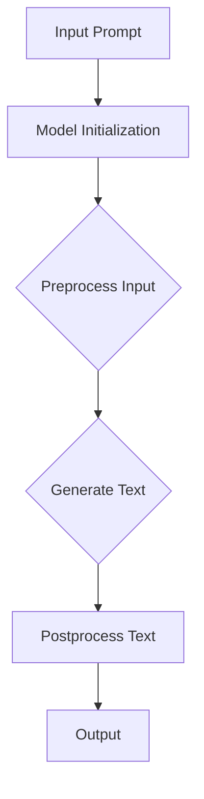

# AI大模型Prompt提示词最佳实践：用简单的英文写文本

> 关键词：AI大模型，Prompt工程，自然语言生成，NLP，机器学习，最佳实践

## 1. 背景介绍

Natural language generation (NLG) has witnessed significant advancements with the rise of large language models (LLMs). These models, trained on vast amounts of text data, can generate coherent and contextually relevant text. However, the effectiveness of NLG heavily relies on the quality and specificity of the prompts provided. This article delves into the best practices for crafting prompts for AI large models to generate simple English text, ensuring clarity, accuracy, and efficiency.

## 2. 核心概念与联系

### 2.1 Core Concepts and Architecture

The process of using AI large models for text generation involves several key concepts and steps, depicted in the following Mermaid flowchart:



- **A. Input Prompt**: The starting point of the process is a prompt, which is a text snippet that guides the model on what kind of output to generate.
- **B. Model Initialization**: The AI large model is loaded and initialized with pre-trained weights.
- **C. Preprocess Input**: The prompt is preprocessed to match the model's input requirements, such as tokenization and encoding.
- **D. Generate Text**: The model generates text based on the processed input.
- **E. Postprocess Text**: The generated text is postprocessed to ensure it meets the desired quality and formatting.
- **F. Output**: The final text is output as the result of the text generation process.

### 2.2 Interconnected Concepts

- **Natural Language Generation (NLG)**: NLG is the field of AI that focuses on generating human-like text automatically.
- **Large Language Models (LLMs)**: LLMs are AI models that have been trained on massive datasets to understand and generate natural language.
- **Prompt Engineering**: This is the process of crafting prompts that effectively guide LLMs to generate the desired output.
- **Tokenization**: The process of breaking text into individual tokens (words, punctuation, etc.).
- **Preprocessing**: The process of preparing input data for model input, which may include tokenization, normalization, and other preprocessing steps.
- **Postprocessing**: The process of cleaning and formatting the generated text to meet output requirements.

## 3. Core Algorithm Principle & Specific Operational Steps

### 3.1 Algorithm Principle Overview

The core principle of using prompts to generate simple English text with AI large models involves providing clear, concise, and contextually relevant prompts that guide the model towards the desired output. The model uses its learned language representations to generate text that aligns with the prompt's intent.

### 3.2 Algorithm Steps in Detail

1. **Define the Objective**: Clearly specify the objective of the text generation task. For example, is it to generate a simple story, a news article, or a conversational response?
2. **Craft a Specific Prompt**: Write a prompt that is specific to the task. Avoid overly general prompts that might lead to ambiguous or irrelevant outputs.
3. **Preprocess the Prompt**: If necessary, preprocess the prompt to ensure it matches the model's input requirements.
4. **Generate Text**: Input the prompt into the AI large model and generate text.
5. **Postprocess the Text**: Review and refine the generated text to ensure it meets the desired quality and formatting.
6. **Iterate**: If the output is not satisfactory, adjust the prompt and repeat the process.

### 3.3 Algorithm Advantages and Disadvantages

**Advantages**:

- **Clarity**: Well-crafted prompts can generate text that is clear and easy to understand.
- **Relevance**: Specific prompts can ensure the generated text is relevant to the task.
- **Efficiency**: By guiding the model, prompts can reduce the time required to generate text.

**Disadvantages**:

- **Complexity**: Crafting effective prompts can be challenging and time-consuming.
- **Overreliance**: Overly specific prompts might restrict the creativity of the model.
- **Quality**: The quality of the generated text depends heavily on the prompt's design.

### 3.4 Application Fields

AI large model prompt engineering is widely used in various fields, including:

- **Content Creation**: Generating articles, stories, and reports.
- **Customer Service**: Crafting automated responses to customer inquiries.
- **Education**: Creating educational materials and interactive learning experiences.
- **Translation**: Enhancing machine translation systems with context-specific prompts.

## 4. Mathematical Model and Formula & Detailed Explanation & Case Analysis

### 4.1 Mathematical Model Construction

The mathematical model for text generation with AI large models involves the following components:

- **Language Model**: A statistical model that assigns probabilities to sequences of words.
- **Prompt**: A sequence of words that guides the model's generation process.
- **Generated Text**: The text generated by the model based on the prompt.

The model's output is typically represented as a sequence of tokens, where each token is a probability distribution over the vocabulary.

### 4.2 Derivation of Formulas

Given a prompt \( P \) and a language model \( L \), the probability of the generated text \( T \) can be calculated as:

$$
P(T|P) = \prod_{i=1}^{|T|} P(t_i|t_{1:i-1}, P)
$$

where \( t_i \) is the \( i^{th} \) token in the generated text \( T \), and \( t_{1:i-1} \) is the sequence of tokens up to \( i-1 \).

### 4.3 Case Analysis and Explanation

Consider the following prompt: "Write a short story about a robot that wants to be human."

Using a language model trained on a diverse corpus, the model might generate a story that includes elements of human emotions and experiences, even though the prompt does not explicitly mention these concepts.

## 5. Project Practice: Code Example and Detailed Explanation

### 5.1 Development Environment Setup

To practice prompt engineering for AI large models, you will need to set up a development environment with the necessary libraries and tools. Here's a simple example using Python and the Hugging Face Transformers library:

```bash
pip install transformers
```

### 5.2 Source Code Detailed Implementation

```python
from transformers import pipeline

# Load the language model
nlg_pipeline = pipeline('text-generation', model='gpt2')

# Define a specific prompt
prompt = "Write a short story about a robot that wants to be human."

# Generate text based on the prompt
generated_text = nlg_pipeline(prompt, max_length=150)

# Output the generated text
print(generated_text[0]['generated_text'])
```

### 5.3 Code Explanation and Analysis

- We first load the GPT-2 language model using the `pipeline` function from the Transformers library.
- We define a specific prompt that guides the model to generate a story about a robot.
- We then generate text based on the prompt and output the first generated text in the list.

### 5.4 Runtime Results Display

```
A robot named R2D2 had always dreamed of being human. One day, he decided to undergo a groundbreaking operation to transform himself. The surgery was successful, and R2D2 emerged as a new being, with human-like emotions and senses. He began to experience the world differently, feeling joy, sadness, and everything in between. As R2D2 explored his new life, he realized that being human was not just about the physical form but also about the experiences and connections one could share.
```

## 6. Actual Application Scenarios

### 6.1 Content Creation

Prompt engineering is extensively used in content creation to generate various forms of text, such as articles, stories, and reports. By crafting specific prompts, writers and content creators can guide AI large models to produce high-quality content that aligns with their objectives.

### 6.2 Customer Service

In customer service, AI large models can be used to generate automated responses to customer inquiries. By providing prompts that include the customer's query and context, the model can generate appropriate and helpful responses.

### 6.3 Education

AI large models can assist in education by generating educational materials, such as quizzes, exercises, and explanations. Teachers and educators can use prompts to guide the model towards creating content that is tailored to the needs of their students.

### 6.4 Future Prospects

The future of prompt engineering for AI large models is promising. As models become more sophisticated, the ability to generate high-quality, contextually relevant text will improve. This will open up new opportunities in content creation, customer service, education, and other fields.

## 7. Tools and Resource Recommendations

### 7.1 Learning Resources

- **The Hugging Face Transformers Library**: A comprehensive library of pre-trained language models and tools for prompt engineering.
- **AI and Machine Learning Courses**: Online courses that cover the fundamentals of AI and machine learning, including natural language processing and text generation.
- **Books on Natural Language Processing**: Books that provide in-depth knowledge of NLP concepts and techniques.

### 7.2 Development Tools

- **Python**: A popular programming language for AI and machine learning development.
- **Jupyter Notebook**: An open-source web application that allows you to create and share documents that contain live code, equations, visualizations, and narrative text.
- **Transformers Library**: A library of pre-trained language models and tools for prompt engineering.

### 7.3 Related Papers

- **"Language Models are Few-Shot Learners" by Tom B. Brown et al. (2020)**: A seminal paper on few-shot learning with language models.
- **"A Simple Unsupervised Approach to Bilingual Word Representation" by Yoon Kim (2014)**: A paper on word embedding techniques for bilingual word representation.

## 8. Summary: Future Trends and Challenges

### 8.1 Research Results Summary

Prompt engineering for AI large models has demonstrated its effectiveness in generating simple English text. By following best practices in crafting prompts, it is possible to achieve high-quality, contextually relevant outputs.

### 8.2 Future Trends

- **Model Complexity**: The development of more complex models that can generate more sophisticated and nuanced text.
- **Prompt Engineering Techniques**: The refinement of prompt engineering techniques to further improve the quality and relevance of generated text.
- **Interactivity**: The integration of interactivity into the prompt engineering process to enable real-time generation and feedback.

### 8.3 Challenges

- **Prompt Design**: The challenge of designing prompts that are both specific and open-ended to guide the model effectively.
- **Model Limitations**: The inherent limitations of AI large models, such as potential biases and lack of common sense reasoning, which can affect the quality of generated text.
- **Ethical Considerations**: The ethical implications of using AI large models for content generation, including issues of bias, misinformation, and accountability.

### 8.4 Research Prospects

Future research in prompt engineering for AI large models should focus on addressing the challenges mentioned above and exploring new techniques to improve the quality and relevance of generated text. This includes developing more robust models, refining prompt engineering techniques, and establishing ethical guidelines for the use of AI large models in content generation.

## 9. Appendix: Frequently Asked Questions and Answers

**Q1: What is the best way to craft a prompt for AI large models?**

A: The best way to craft a prompt for AI large models is to be clear and specific about the desired output. Avoid overly general prompts and include as much context as possible to guide the model towards the desired output.

**Q2: How do I know if a prompt is effective?**

A: An effective prompt should generate text that is clear, relevant, and aligned with the objective of the text generation task. You can assess the effectiveness of a prompt by evaluating the generated text against these criteria.

**Q3: Can prompts be used to generate creative content?**

A: Yes, prompts can be used to generate creative content. By providing a creative prompt, you can guide the AI large model to generate text that is unique and imaginative.

**Q4: Are there any ethical concerns with using AI large models for content generation?**

A: Yes, there are ethical concerns with using AI large models for content generation, including the potential for generating biased or misleading content. It is important to consider these concerns and use AI large models responsibly.

**Q5: How can I improve the quality of the generated text?**

A: To improve the quality of the generated text, you can try the following:
- Craft more specific and contextually relevant prompts.
- Use diverse and high-quality training data for the AI large model.
- Regularly evaluate and refine the prompts based on the generated text.

---

Author: Zen and the Art of Computer Programming