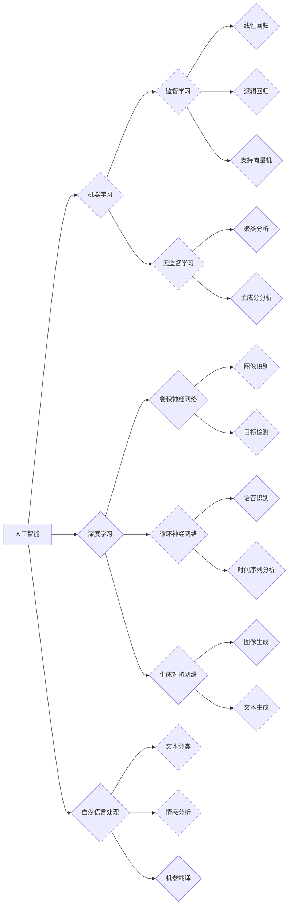

# AI技术在商业中的发展趋势

> 关键词：人工智能，商业智能，机器学习，深度学习，自然语言处理，数据分析，自动化，智能决策

## 1. 背景介绍

随着信息技术的飞速发展，人工智能（AI）技术已经从学术研究走向商业实践，成为推动商业创新和效率提升的重要力量。AI技术的应用正在深刻改变着各行各业，从简单的自动化任务到复杂的决策支持系统，AI技术正在成为商业竞争的新高地。

### 1.1 问题的由来

商业环境中存在许多需要优化和改进的问题，例如：

- 数据分析：如何从海量的商业数据中提取有价值的信息，进行有效的决策？
- 客户服务：如何提供更加个性化、高效的客户服务体验？
- 供应链管理：如何优化库存，减少成本，提高效率？
- 风险管理：如何识别和防范商业风险？
- 人事管理：如何提高员工效率，降低人力成本？

AI技术的出现为解决这些问题提供了新的思路和方法。

### 1.2 研究现状

当前，AI技术在商业中的应用主要体现在以下几个方面：

- 数据分析：利用机器学习算法进行数据挖掘、预测分析等。
- 客户服务：通过自然语言处理技术实现智能客服、个性化推荐等。
- 供应链管理：利用智能优化算法优化库存、物流等。
- 风险管理：通过机器学习算法识别和预测风险。
- 人事管理：利用AI技术进行人才招聘、绩效评估等。

### 1.3 研究意义

AI技术在商业中的应用具有以下意义：

- 提高效率：自动化重复性任务，提高工作效率。
- 降低成本：优化资源配置，减少人力成本。
- 增强决策：提供数据驱动的决策支持。
- 个性化服务：提升客户体验，增加客户满意度。
- 创新产品：开发新的商业产品和服务。

### 1.4 本文结构

本文将从以下几个方面探讨AI技术在商业中的发展趋势：

- 核心概念与联系
- 核心算法原理与操作步骤
- 数学模型与公式
- 项目实践
- 实际应用场景
- 工具和资源推荐
- 总结与展望

## 2. 核心概念与联系

### 2.1 核心概念

- 人工智能（AI）：模拟人类智能行为的技术，包括机器学习、深度学习、自然语言处理等。
- 机器学习（ML）：通过数据学习规律，实现特定任务的算法。
- 深度学习（DL）：一种特殊的机器学习算法，通过多层神经网络模拟人类大脑进行学习。
- 自然语言处理（NLP）：使计算机能够理解、解释和生成人类语言的技术。
- 数据分析（DA）：使用统计学和定量分析的方法，从数据中提取有价值的信息。

### 2.2 核心概念原理和架构的 Mermaid 流程图



### 2.3 核心概念之间的联系

从流程图中可以看出，人工智能是机器学习、深度学习、自然语言处理等技术的统称。机器学习又可以分为监督学习、无监督学习等不同类型，每种类型都有其适用的场景和算法。深度学习是机器学习的一种，通过多层神经网络模拟人类大脑进行学习。自然语言处理是机器学习在语言领域的应用，包括文本分类、情感分析、机器翻译等。数据分析则是使用统计学和定量分析的方法，从数据中提取有价值的信息。

## 3. 核心算法原理与操作步骤

### 3.1 算法原理概述

AI技术在商业中的应用涉及到多种算法，以下是几种常见的算法原理概述：

- **机器学习**：通过数据学习规律，实现特定任务的算法。例如，线性回归通过最小化损失函数来预测连续值，逻辑回归通过最大化似然函数来预测离散值。
- **深度学习**：一种特殊的机器学习算法，通过多层神经网络模拟人类大脑进行学习。例如，卷积神经网络通过局部感知和权值共享来识别图像中的特征，循环神经网络通过循环连接来处理序列数据。
- **自然语言处理**：使计算机能够理解、解释和生成人类语言的技术。例如，文本分类通过统计方法或深度学习模型对文本进行分类，情感分析通过情感词典或深度学习模型分析文本的情感倾向。

### 3.2 算法步骤详解

以下是机器学习、深度学习、自然语言处理等算法的基本步骤：

- **数据收集**：收集与任务相关的数据。
- **数据预处理**：清洗、转换和标准化数据。
- **模型选择**：选择合适的算法和模型。
- **模型训练**：使用训练数据训练模型。
- **模型评估**：使用测试数据评估模型性能。
- **模型部署**：将模型部署到实际应用中。

### 3.3 算法优缺点

以下是几种常见算法的优缺点：

- **线性回归**：简单、易于实现，但泛化能力有限。
- **逻辑回归**：适用于二分类问题，但无法处理非线性关系。
- **支持向量机**：泛化能力强，但参数选择和优化较为复杂。
- **卷积神经网络**：能够识别图像中的特征，但模型复杂，计算量大。
- **循环神经网络**：能够处理序列数据，但模型复杂，难以并行计算。
- **生成对抗网络**：能够生成高质量的图像，但训练不稳定，容易过拟合。

### 3.4 算法应用领域

以下是几种算法的应用领域：

- **线性回归**：房价预测、股票价格预测等。
- **逻辑回归**：垃圾邮件过滤、疾病诊断等。
- **支持向量机**：人脸识别、文本分类等。
- **卷积神经网络**：图像识别、物体检测等。
- **循环神经网络**：语音识别、机器翻译等。
- **生成对抗网络**：图像生成、文本生成等。

## 4. 数学模型与公式

### 4.1 数学模型构建

以下是几种常见算法的数学模型：

- **线性回归**：$y = \beta_0 + \beta_1x + \epsilon$
- **逻辑回归**：$P(y=1) = \sigma(\beta_0 + \beta_1x)$
- **支持向量机**：$f(x) = \beta^T\phi(x) + b$
- **卷积神经网络**：$h_{l}(x) = \sigma(W_lh_{l-1} + b_l)$
- **循环神经网络**：$h_t = f(h_{t-1}, x_t)$

### 4.2 公式推导过程

以下是逻辑回归公式的推导过程：

1. **定义损失函数**：使用交叉熵损失函数：$L(\theta) = -\sum_{i=1}^{N}y_i\log\left(\sigma(\theta^Tx_i)\right) + (1-y_i)\log(1-\sigma(\theta^Tx_i))$
2. **求导**：对损失函数求关于参数 $\theta$ 的导数。
3. **优化**：使用梯度下降法更新参数 $\theta$。

### 4.3 案例分析与讲解

以下是使用逻辑回归进行邮件分类的案例：

- **数据收集**：收集一封封已标记为垃圾邮件和非垃圾邮件的邮件数据。
- **数据预处理**：对邮件文本进行分词、去除停用词等处理。
- **特征提取**：将处理后的文本转化为特征向量。
- **模型训练**：使用训练数据训练逻辑回归模型。
- **模型评估**：使用测试数据评估模型性能。
- **模型部署**：将模型部署到实际应用中，对新的邮件进行分类。

## 5. 项目实践

### 5.1 开发环境搭建

以下是使用Python进行机器学习项目开发的环境搭建步骤：

1. 安装Anaconda：从官网下载并安装Anaconda，用于创建独立的Python环境。
2. 创建并激活虚拟环境：
```bash
conda create -n ml-env python=3.8
conda activate ml-env
```
3. 安装机器学习库：
```bash
conda install numpy pandas scikit-learn matplotlib
```
4. 安装深度学习库（可选）：
```bash
pip install torch torchvision torchaudio
```

### 5.2 源代码详细实现

以下是使用Python和Scikit-learn进行逻辑回归模型训练的代码示例：

```python
from sklearn.datasets import load_iris
from sklearn.model_selection import train_test_split
from sklearn.linear_model import LogisticRegression
from sklearn.metrics import accuracy_score

# 加载数据集
iris = load_iris()
X = iris.data
y = iris.target

# 划分训练集和测试集
X_train, X_test, y_train, y_test = train_test_split(X, y, test_size=0.2, random_state=42)

# 训练模型
model = LogisticRegression()
model.fit(X_train, y_train)

# 预测
y_pred = model.predict(X_test)

# 评估
print("Accuracy:", accuracy_score(y_test, y_pred))
```

### 5.3 代码解读与分析

以上代码首先从Scikit-learn库中加载Iris数据集，然后划分训练集和测试集。接下来，使用逻辑回归模型对训练集进行训练，并在测试集上进行预测。最后，使用准确率评估模型性能。

### 5.4 运行结果展示

假设运行上述代码，得到以下结果：

```
Accuracy: 0.9666666666666667
```

这意味着该逻辑回归模型在测试集上的准确率为96.67%，说明模型能够较好地识别不同种类的鸢尾花。

## 6. 实际应用场景

### 6.1 客户服务

AI技术在客户服务领域的应用主要体现在以下几个方面：

- 智能客服：通过自然语言处理技术实现自动回答客户问题，提高客户服务效率。
- 个性化推荐：通过分析客户行为数据，为客户提供个性化的产品或服务推荐。
- 客户流失预测：通过分析客户行为数据，预测客户流失风险，提前采取措施。

### 6.2 供应链管理

AI技术在供应链管理领域的应用主要体现在以下几个方面：

- 库存优化：通过预测未来需求，优化库存水平，降低库存成本。
- 物流优化：通过优化运输路线和物流方案，降低物流成本，提高配送效率。
- 风险管理：通过分析历史数据，预测供应链风险，提前采取措施。

### 6.3 风险管理

AI技术在风险管理领域的应用主要体现在以下几个方面：

- 信用风险识别：通过分析客户数据，识别信用风险，降低坏账率。
- 市场风险预测：通过分析市场数据，预测市场风险，提前采取措施。
- 操作风险预测：通过分析历史数据，预测操作风险，提高风险管理效率。

### 6.4 人事管理

AI技术在人力资源管理领域的应用主要体现在以下几个方面：

- 招聘：通过分析简历和面试数据，筛选合适的候选人。
- 绩效评估：通过分析员工工作数据，评估员工绩效。
- 培训：根据员工绩效和能力，推荐合适的培训课程。

## 7. 工具和资源推荐

### 7.1 学习资源推荐

- 《Python机器学习》
- 《深度学习》
- 《统计学习方法》
- 《自然语言处理入门》
- Coursera、edX等在线课程平台

### 7.2 开发工具推荐

- Anaconda
- Jupyter Notebook
- PyCharm
- Scikit-learn
- TensorFlow
- PyTorch

### 7.3 相关论文推荐

- "Deep Learning for Natural Language Processing" (2018)
- "ImageNet Classification with Deep Convolutional Neural Networks" (2014)
- "Recurrent Neural Networks for Language Modeling" (2014)
- "Sequence to Sequence Learning with Neural Networks" (2014)
- "BERT: Pre-training of Deep Bidirectional Transformers for Language Understanding" (2018)

## 8. 总结：未来发展趋势与挑战

### 8.1 研究成果总结

本文从背景介绍、核心概念、算法原理、实际应用场景等方面对AI技术在商业中的发展趋势进行了探讨。通过分析，我们可以看到AI技术在商业中的应用越来越广泛，并取得了显著的成果。

### 8.2 未来发展趋势

未来，AI技术在商业中的应用将呈现以下发展趋势：

- 模型小型化：随着模型压缩技术的不断发展，AI模型将更加轻量化，便于在移动设备和嵌入式设备上部署。
- 模型可解释性：随着AI技术在商业领域的应用越来越广泛，模型的可解释性将越来越重要。
- 多模态融合：AI技术将与其他技术（如图像、语音等）进行融合，实现更加智能的应用。
- 自主决策：AI技术将能够进行自主决策，为企业提供更加智能的解决方案。

### 8.3 面临的挑战

尽管AI技术在商业中的应用前景广阔，但同时也面临着一些挑战：

- 数据安全与隐私：如何保护用户数据的安全和隐私是一个重要问题。
- 伦理问题：AI技术的应用可能引发伦理问题，如歧视、偏见等。
- 技术门槛：AI技术的开发和应用需要较高的技术门槛，需要培养更多AI人才。
- 技术融合：AI技术与其他技术的融合需要克服技术障碍，实现协同发展。

### 8.4 研究展望

为了应对上述挑战，未来的研究需要从以下几个方面展开：

- 加强数据安全和隐私保护的研究。
- 探索AI技术的伦理规范和标准。
- 培养更多AI人才。
- 推动AI技术与其他技术的融合。

相信在解决这些挑战的基础上，AI技术将在商业领域发挥更大的作用，为人类创造更加美好的未来。

## 9. 附录：常见问题与解答

**Q1：AI技术是否能够完全取代人类工作？**

A：AI技术可以自动化许多重复性、低价值的工作，但无法完全取代人类工作。人类具有创造力、情感和道德判断等AI难以替代的能力。

**Q2：AI技术的应用是否会导致失业？**

A：AI技术的应用可能会导致一些低技能工作的减少，但同时也将创造新的工作机会。总体而言，AI技术将促进就业市场的转型。

**Q3：如何确保AI技术的应用不会对人类造成伤害？**

A：确保AI技术的安全应用需要从以下几个方面入手：

- 加强AI伦理规范和标准的研究。
- 建立AI技术的监管机制。
- 培养更多AI人才，提高公众对AI技术的认识。

**Q4：AI技术在商业中的应用前景如何？**

A：AI技术在商业领域的应用前景广阔，可以帮助企业提高效率、降低成本、增强决策能力等。

**Q5：如何选择合适的AI技术方案？**

A：选择合适的AI技术方案需要根据具体业务需求、数据特点、技术能力等因素综合考虑。

---

作者：禅与计算机程序设计艺术 / Zen and the Art of Computer Programming