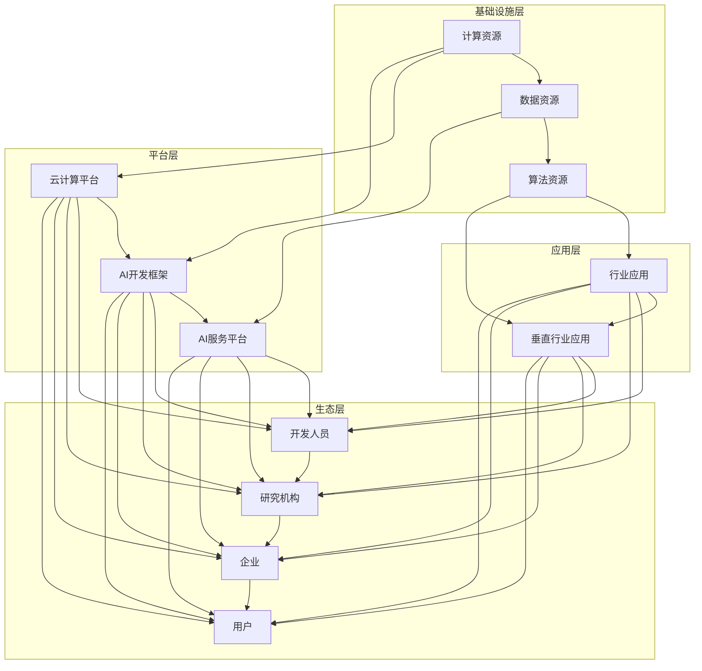

# AI生态系统的多样性:构建创新的珊瑚礁

> 关键词：人工智能生态系统，多样性，珊瑚礁模型，创新，协作，生态平衡，可持续发展

## 1. 背景介绍

在当今世界，人工智能（AI）正在以前所未有的速度发展，深刻地影响着社会、经济和科技领域。AI的应用已经从简单的计算任务扩展到复杂的数据分析、智能决策、人机交互等多个领域。然而，AI生态系统并非孤立存在，它需要一个健康、多样、可持续的环境来茁壮成长。本文将借鉴自然生态系统中珊瑚礁的多样性原理，探讨如何构建创新的AI生态系统，使其成为推动科技进步和社会发展的强大引擎。

### 1.1 AI生态系统的发展现状

随着深度学习、大数据、云计算等技术的快速发展，AI生态系统正在迅速壮大。目前，AI生态系统的构成主要包括以下几部分：

- **基础层**：包括计算资源、数据资源、算法资源等基础设施，为AI应用提供支撑。
- **平台层**：提供AI开发、部署、管理和服务的一站式平台，如云计算平台、AI开发框架等。
- **应用层**：将AI技术应用于各个行业，解决实际问题，创造价值。
- **生态层**：包括开发人员、研究机构、企业、用户等，共同推动AI生态系统的繁荣。

### 1.2 生态系统的多样性原理

在自然生态系统中，珊瑚礁因其高度的多样性和复杂性而闻名。珊瑚礁由成千上万的珊瑚生物共同构建，形成了丰富多彩的海洋生态系统。珊瑚礁的多样性使得它能够承受环境变化和自然灾害的冲击，保持生态平衡。

借鉴珊瑚礁的多样性原理，我们可以将AI生态系统分为以下几个层次：

- **物种多样性**：不同的AI技术、应用、平台和服务，形成丰富的AI生态系统。
- **功能多样性**：AI生态系统具备不同的功能，如数据采集、处理、分析、决策等。
- **层次多样性**：AI生态系统具有多层次的结构，从基础设施到应用层，形成一个复杂的网络。

## 2. 核心概念与联系

### 2.1 核心概念原理

**珊瑚礁模型**：借鉴珊瑚礁的多样性原理，构建的AI生态系统模型。它强调生态系统的多样性和协同作用，以实现可持续发展。

**生态平衡**：在AI生态系统中，不同组成部分之间保持平衡，共同促进生态系统的健康发展。

**可持续发展**：AI生态系统在满足当前需求的同时，兼顾未来需求，确保其长期繁荣。

### 2.2 架构的 Mermaid 流程图



## 3. 核心算法原理 & 具体操作步骤

### 3.1 算法原理概述

AI生态系统的构建需要遵循以下原则：

- **开放性**：鼓励不同主体参与生态系统的建设，共享资源和技术。
- **协作性**：不同主体之间相互协作，共同推动AI技术的发展和应用。
- **可持续性**：关注AI生态系统的长期发展，确保其健康发展。

### 3.2 算法步骤详解

构建AI生态系统的具体步骤如下：

1. **确定生态目标**：明确AI生态系统的目标，如推动科技创新、促进产业发展、提升社会效益等。
2. **构建基础设施**：搭建计算资源、数据资源和算法资源等基础设施。
3. **开发平台**：开发云计算平台、AI开发框架和AI服务平台等，为开发者提供便捷的开发和部署环境。
4. **培育应用**：鼓励开发者和企业将AI技术应用于各个行业，解决实际问题。
5. **建设生态层**：吸引开发人员、研究机构、企业、用户等参与生态系统的建设。

### 3.3 算法优缺点

**优点**：

- **多样性**：促进不同主体之间的创新和协作，形成多元化的AI生态系统。
- **协同效应**：不同组成部分之间相互促进，共同推动AI技术的发展和应用。
- **可持续发展**：关注长期发展，确保AI生态系统的健康和稳定。

**缺点**：

- **协调难度大**：不同主体之间可能存在利益冲突，协调难度较大。
- **技术风险**：AI技术发展迅速，生态系统的建设需要不断适应新技术。

### 3.4 算法应用领域

AI生态系统的构建可以应用于以下领域：

- **智慧城市**：利用AI技术提升城市管理效率，改善居民生活质量。
- **医疗健康**：应用AI技术辅助诊断、治疗和健康管理。
- **教育**：利用AI技术实现个性化教学和智能辅导。
- **金融**：利用AI技术进行风险管理、欺诈检测和智能投顾。
- **制造**：应用AI技术实现智能生产和智能制造。

## 4. 数学模型和公式 & 详细讲解 & 举例说明

### 4.1 数学模型构建

AI生态系统的数学模型可以采用复杂网络模型进行构建。复杂网络模型能够描述系统中各个节点之间的关系，以及节点之间的相互作用。

### 4.2 公式推导过程

复杂网络模型的构建通常涉及以下步骤：

1. **定义节点**：将AI生态系统中的各个主体定义为节点。
2. **定义边**：根据节点之间的关系，定义边连接节点。
3. **构建网络**：根据定义的节点和边，构建复杂网络模型。

### 4.3 案例分析与讲解

以智慧城市建设为例，可以将城市中的各个部门、企业和居民定义为节点，节点之间的关系可以用边表示。通过分析复杂网络模型，可以了解城市中的信息流动、资源分配和协同效应。

## 5. 项目实践：代码实例和详细解释说明

### 5.1 开发环境搭建

由于本文主要探讨AI生态系统的构建，因此不涉及具体的代码实现。以下是一个简单的示例，展示如何使用Python的NetworkX库构建复杂网络模型。

```python
import networkx as nx

# 创建一个空图
G = nx.Graph()

# 添加节点
G.add_node('城市管理部门')
G.add_node('企业')
G.add_node('居民')

# 添加边
G.add_edge('城市管理部门', '企业')
G.add_edge('企业', '居民')
G.add_edge('居民', '城市管理部门')

# 显示图的结构
print(nx.draw(G))
```

### 5.2 源代码详细实现

由于本文主要探讨AI生态系统的构建，因此不涉及具体的代码实现。以上代码仅用于演示如何使用Python的NetworkX库构建复杂网络模型。

### 5.3 代码解读与分析

以上代码首先导入了NetworkX库，然后创建了一个空图。接着，添加了三个节点（城市管理部门、企业和居民），并定义了它们之间的关系。最后，使用`nx.draw()`函数绘制了网络结构。

### 5.4 运行结果展示

运行以上代码，将显示一个简单的复杂网络结构图，其中包含了三个节点和三条边。

## 6. 实际应用场景

### 6.1 智慧城市

智慧城市是AI生态系统的典型应用场景。通过构建智慧城市AI生态系统，可以提升城市管理效率，改善居民生活质量。

### 6.2 医疗健康

在医疗健康领域，AI生态系统可以应用于疾病诊断、治疗和健康管理等方面。

### 6.3 教育

在教育领域，AI生态系统可以应用于个性化教学、智能辅导和考试评估等方面。

## 7. 工具和资源推荐

### 7.1 学习资源推荐

- 《人工智能：一种现代的方法》
- 《深度学习》
- 《机器学习：一种统计方法》

### 7.2 开发工具推荐

- Python
- TensorFlow
- PyTorch
- scikit-learn

### 7.3 相关论文推荐

- 《Complex Network Theory》
- 《Social Network Analysis》
- 《Graph Neural Networks》

## 8. 总结：未来发展趋势与挑战

### 8.1 研究成果总结

本文借鉴珊瑚礁的多样性原理，探讨了如何构建创新的AI生态系统。通过分析AI生态系统的构成、构建原则和应用场景，提出了构建AI生态系统的具体步骤。

### 8.2 未来发展趋势

未来，AI生态系统将呈现以下发展趋势：

- **更加开放和协作**：不同主体之间的合作将更加紧密，共同推动AI技术的发展和应用。
- **更加智能化和自动化**：AI生态系统将更加智能化和自动化，为开发者提供更加便捷的服务。
- **更加绿色和可持续**：AI生态系统将更加注重可持续发展，减少资源消耗和环境影响。

### 8.3 面临的挑战

AI生态系统在发展过程中面临以下挑战：

- **数据安全和隐私保护**：AI应用需要大量数据，如何确保数据安全和隐私保护是一个重要问题。
- **技术标准和规范**：AI技术的发展需要相应的技术标准和规范，以确保技术的健康发展。
- **伦理和社会责任**：AI应用需要关注伦理和社会责任，避免对人类社会造成负面影响。

### 8.4 研究展望

未来，AI生态系统的研究将主要集中在以下几个方面：

- **数据安全和隐私保护**：研究更加安全的AI数据存储和传输技术，保护用户隐私。
- **技术标准和规范**：制定AI技术标准和规范，推动AI技术的健康发展。
- **伦理和社会责任**：加强AI伦理和社会责任研究，确保AI技术造福人类社会。

## 9. 附录：常见问题与解答

**Q1：AI生态系统如何促进创新？**

A1：AI生态系统通过促进不同主体之间的创新和协作，为AI技术的发展和应用提供源源不断的动力。例如，企业可以与高校、研究机构合作，共同研发新技术；开发者可以共享代码和数据，加速AI应用的落地。

**Q2：AI生态系统如何实现可持续发展？**

A2：AI生态系统通过以下方式实现可持续发展：

- **技术创新**：持续技术创新，推动AI技术的发展和应用。
- **人才培养**：培养更多AI人才，为AI生态系统提供人才保障。
- **社会责任**：关注AI技术的伦理和社会责任，确保AI技术造福人类社会。

**Q3：AI生态系统如何应对数据安全和隐私保护问题？**

A3：AI生态系统可以通过以下方式应对数据安全和隐私保护问题：

- **数据加密**：使用加密技术保护数据安全。
- **匿名化处理**：对数据进行匿名化处理，保护用户隐私。
- **用户授权**：确保用户对数据拥有授权，避免数据泄露。

**Q4：AI生态系统如何推动社会进步？**

A4：AI生态系统通过以下方式推动社会进步：

- **提高效率**：利用AI技术提高工作效率，降低成本。
- **改善生活**：利用AI技术改善人们的生活质量，提升幸福感。
- **促进发展**：利用AI技术促进经济发展，创造更多就业机会。

作者：禅与计算机程序设计艺术 / Zen and the Art of Computer Programming