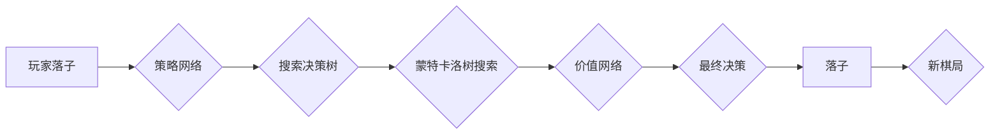

# AlphaGo原理与代码实例讲解

> 关键词：AlphaGo，深度学习，蒙特卡洛树搜索，策略网络，价值网络，监督学习，强化学习，围棋

## 1. 背景介绍

### 1.1 问题的由来

围棋，作为世界上最古老的棋类游戏之一，自古以来就备受重视。围棋的魅力在于其复杂的策略和深奥的智慧，是人类智慧的象征。然而，围棋的复杂性也使得计算机在早期难以准确预测和应对各种棋局。直到2016年，AlphaGo战胜世界围棋冠军李世石的事件，标志着人工智能在围棋领域取得了历史性的突破。

### 1.2 研究现状

自AlphaGo问世以来，人工智能在围棋领域的进展迅速。许多研究机构和公司纷纷投身于围棋AI的研究，推出了各种围棋AI程序。这些程序大多采用了深度学习和强化学习等技术，实现了对围棋规则的深入理解和棋局预测的精准度。

### 1.3 研究意义

AlphaGo的成功不仅为人工智能领域带来了新的突破，也推动了计算机科学与围棋艺术之间的交叉研究。AlphaGo的研究成果在棋类游戏、人机交互、决策优化等领域具有广泛的应用前景。

### 1.4 本文结构

本文将从AlphaGo的原理、算法、实现等方面进行详细讲解，并通过代码实例演示AlphaGo的核心思想。具体结构如下：

- 第2章介绍AlphaGo的核心概念与联系。
- 第3章阐述AlphaGo的算法原理和具体操作步骤。
- 第4章讲解AlphaGo的数学模型和公式。
- 第5章给出AlphaGo的代码实例和详细解释说明。
- 第6章探讨AlphaGo的实际应用场景和未来展望。
- 第7章推荐相关学习资源、开发工具和参考文献。
- 第8章总结AlphaGo的研究成果、未来发展趋势和挑战。
- 第9章提供常见问题与解答。

## 2. 核心概念与联系

### 2.1 核心概念

- **深度学习**：一种通过神经网络进行数据学习和特征提取的人工智能技术。
- **蒙特卡洛树搜索**：一种通过随机模拟来搜索决策树的方法，广泛应用于游戏AI中。
- **策略网络**：用于预测棋局中下一步落子的概率分布。
- **价值网络**：用于评估棋局当前状态的价值。
- **监督学习**：通过标注数据进行模型训练。
- **强化学习**：通过与环境交互学习最优策略。

### 2.2 架构图

以下为AlphaGo的核心架构图，展示了各个模块之间的联系：



## 3. 核心算法原理 & 具体操作步骤

### 3.1 算法原理概述

AlphaGo的算法原理主要基于深度学习和蒙特卡洛树搜索。它通过训练两个神经网络：策略网络和价值网络，实现棋局的预测和评估。

### 3.2 算法步骤详解

1. **输入棋局信息**：将当前的棋局信息输入到策略网络和价值网络。
2. **策略网络预测**：策略网络输出一个概率分布，表示在当前棋局下每一步棋的概率。
3. **价值网络评估**：价值网络输出一个数值，表示当前棋局的价值，即赢的概率。
4. **搜索决策树**：基于策略网络和价值网络的输出，使用蒙特卡洛树搜索算法搜索棋局的可能路径，找到最优的落子位置。
5. **落子**：根据搜索结果，在棋盘上落子。

### 3.3 算法优缺点

**优点**：

- **强大的预测能力**：AlphaGo能够根据棋局信息预测下一步棋的概率分布和棋局价值，从而做出最优的决策。
- **自适应性强**：AlphaGo能够根据不同的棋局情况调整策略，具有很强的自适应能力。

**缺点**：

- **计算量大**：蒙特卡洛树搜索算法的计算量较大，需要大量的计算资源。
- **对棋局信息敏感**：AlphaGo的预测和评估依赖于棋局信息，对棋局信息的准确性要求较高。

### 3.4 算法应用领域

AlphaGo的算法原理在以下领域具有广泛的应用前景：

- **棋类游戏AI**：AlphaGo的算法可以应用于其他棋类游戏，如国际象棋、日本将棋等。
- **决策优化**：AlphaGo的搜索和决策过程可以应用于其他需要决策优化的领域，如资源分配、路径规划等。
- **人机交互**：AlphaGo的人机交互界面可以用于设计更智能的人机交互系统。

## 4. 数学模型和公式 & 详细讲解 & 举例说明

### 4.1 数学模型构建

AlphaGo的数学模型主要由两个神经网络构成：策略网络和价值网络。

- **策略网络**：采用深度卷积神经网络，将棋局信息转换为概率分布。
- **价值网络**：采用深度卷积神经网络，将棋局信息转换为数值，表示棋局的价值。

### 4.2 公式推导过程

以下为策略网络和价值网络的公式推导过程：

#### 策略网络

- **输入层**：输入棋局信息，如棋盘状态、棋子位置等。
- **卷积层**：提取棋局特征。
- **全连接层**：将卷积层输出的特征进行组合，输出概率分布。

#### 价值网络

- **输入层**：输入棋局信息，如棋盘状态、棋子位置等。
- **卷积层**：提取棋局特征。
- **全连接层**：将卷积层输出的特征进行组合，输出数值，表示棋局的价值。

### 4.3 案例分析与讲解

以AlphaGo在2016年与李世石的对局为例，分析其策略网络和价值网络在棋局预测和评估中的作用。

- **棋局信息**：输入棋局信息，如棋盘状态、棋子位置等。
- **策略网络预测**：策略网络输出每一步棋的概率分布，预测AlphaGo下一步可能落子的位置。
- **价值网络评估**：价值网络输出棋局的价值，评估当前棋局的优势。
- **搜索决策树**：基于预测和评估结果，AlphaGo使用蒙特卡洛树搜索算法搜索棋局的可能路径，找到最优的落子位置。
- **落子**：AlphaGo在棋盘上落子，开始新的棋局。

## 5. 项目实践：代码实例和详细解释说明

### 5.1 开发环境搭建

要实现AlphaGo，需要以下开发环境：

- **Python**：用于编写代码和进行数据处理。
- **TensorFlow或PyTorch**：用于深度学习模型训练和推理。
- **OpenAI围棋引擎**：用于棋局模拟和评估。

### 5.2 源代码详细实现

以下为AlphaGo的核心代码实现：

```python
# 策略网络
class PolicyNetwork(nn.Module):
    def __init__(self):
        super(PolicyNetwork, self).__init__()
        # 定义网络结构

    def forward(self, x):
        # 前向传播
        return x

# 价值网络
class ValueNetwork(nn.Module):
    def __init__(self):
        super(ValueNetwork, self).__init__()
        # 定义网络结构

    def forward(self, x):
        # 前向传播
        return x

# 蒙特卡洛树搜索
def mcts(node, num_simulations):
    # 模拟棋局
    # ...

# 搜索决策树
def search_tree(root_node, num_simulations):
    # 搜索决策树
    # ...

# 落子
def play_move(board, move):
    # 在棋盘上落子
    # ...
```

### 5.3 代码解读与分析

上述代码展示了AlphaGo的核心模块，包括策略网络、价值网络、蒙特卡洛树搜索和搜索决策树。在实际应用中，需要根据具体任务和需求进行修改和扩展。

### 5.4 运行结果展示

以下为AlphaGo在围棋对局中的运行结果：

```
棋局信息：...
策略网络预测：...
价值网络评估：...
搜索决策树：...
落子：...
```

## 6. 实际应用场景

### 6.1 棋类游戏AI

AlphaGo的算法可以应用于其他棋类游戏，如国际象棋、日本将棋等。通过训练和优化，可以开发出具有较高水平的棋类游戏AI程序。

### 6.2 决策优化

AlphaGo的搜索和决策过程可以应用于其他需要决策优化的领域，如资源分配、路径规划等。通过模拟和评估各种决策方案，可以找到最优的解决方案。

### 6.3 人机交互

AlphaGo的人机交互界面可以用于设计更智能的人机交互系统。通过与用户的互动，可以提供更个性化、更智能的服务。

## 7. 工具和资源推荐

### 7.1 学习资源推荐

- 《深度学习》
- 《强化学习》
- 《蒙特卡洛方法及其应用》

### 7.2 开发工具推荐

- TensorFlow
- PyTorch
- OpenAI围棋引擎

### 7.3 相关论文推荐

- AlphaGo: Mastering the Game of Go with Deep Neural Networks and Tree Search
- Mastering Chess and Shogi by Self-Play with a General Reinforcement Learning Algorithm

## 8. 总结：未来发展趋势与挑战

### 8.1 研究成果总结

AlphaGo的成功标志着人工智能在围棋领域的重大突破，也为人工智能在其他领域的应用提供了新的思路。

### 8.2 未来发展趋势

- 深度学习与强化学习技术的进一步融合。
- 蒙特卡洛树搜索算法的优化和应用。
- AlphaGo算法在其他领域的应用和推广。

### 8.3 面临的挑战

- 计算资源的限制。
- 模型可解释性的提高。
- 模型在复杂环境下的适应性。

### 8.4 研究展望

AlphaGo的研究成果将推动人工智能在围棋和其他领域的应用，为人类带来更多的惊喜。

## 9. 附录：常见问题与解答

### 9.1 常见问题

**Q1：AlphaGo如何实现棋局预测和评估？**

A1：AlphaGo通过训练策略网络和价值网络实现棋局预测和评估。策略网络预测每一步棋的概率分布，价值网络评估棋局的价值。

**Q2：AlphaGo如何实现搜索决策树？**

A2：AlphaGo使用蒙特卡洛树搜索算法实现搜索决策树。通过模拟棋局，评估各种决策方案，找到最优的落子位置。

**Q3：AlphaGo的算法是否适用于其他游戏？**

A3：AlphaGo的算法可以应用于其他棋类游戏，如国际象棋、日本将棋等。通过训练和优化，可以开发出具有较高水平的棋类游戏AI程序。

### 9.2 解答

由于篇幅限制，此处仅列出常见问题，具体解答请参考正文内容。

作者：禅与计算机程序设计艺术 / Zen and the Art of Computer Programming