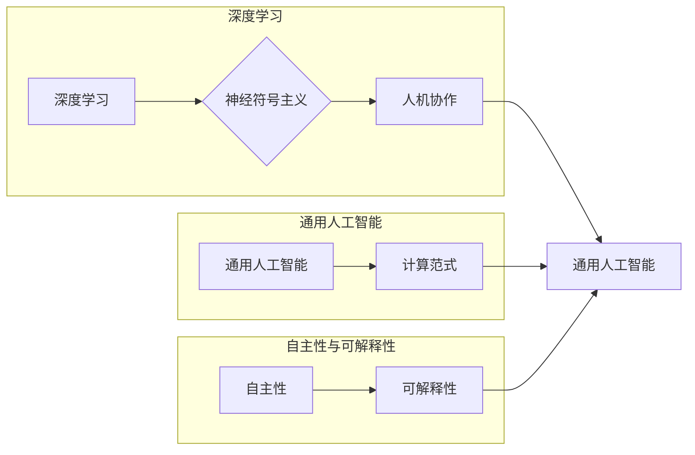

# Andrej Karpathy：人工智能的未来发展方向

> 关键词：Andrej Karpathy，人工智能，深度学习，神经符号主义，人机协作，通用人工智能，计算范式，自主性，可解释性

## 1. 背景介绍

Andrej Karpathy 是一位杰出的计算机科学家，以其在深度学习领域的研究和贡献而闻名。他的工作涵盖了从计算机视觉到自然语言处理的多个领域，并且他的博客和演讲经常探讨人工智能的未来发展方向。本文将深入探讨 Andrej Karpathy 的观点，分析人工智能的未来可能的发展路径。

## 2. 核心概念与联系

### 2.1 核心概念

#### 深度学习
深度学习是机器学习的一个子领域，它使用多层神经网络来学习数据的复杂模式。深度学习在图像识别、语音识别和自然语言处理等领域取得了显著的成功。

#### 神经符号主义
神经符号主义是一种将神经网络与逻辑推理相结合的方法，旨在构建能够执行复杂任务的智能系统。

#### 人机协作
人机协作是指人类和机器之间的合作，旨在利用人类的直觉和创造力与机器的准确性和效率相结合。

#### 通用人工智能
通用人工智能（AGI）是指能够在任何认知任务上表现如同人类智能的机器。

#### 计算范式
计算范式是指计算技术和算法的发展趋势，它们影响着人工智能的发展。

#### 自主性
自主性是指系统在没有人类干预的情况下执行任务的能力。

#### 可解释性
可解释性是指系统决策过程的透明度和可理解性。

### 2.2 Mermaid 流程图



## 3. 核心算法原理 & 具体操作步骤

### 3.1 算法原理概述

Andrej Karpathy 强调了深度学习作为计算范式的变革性作用。深度学习通过模拟人脑神经元的工作方式，使计算机能够从数据中学习复杂模式。

### 3.2 算法步骤详解

1. 数据收集：收集用于训练的数据集。
2. 数据预处理：清洗和转换数据以适应模型。
3. 模型设计：选择合适的神经网络架构。
4. 模型训练：使用大量数据进行模型训练。
5. 模型评估：评估模型的性能。
6. 模型优化：根据评估结果调整模型参数。

### 3.3 算法优缺点

#### 优点
- 高效：深度学习模型可以处理大量数据，并在多个领域取得突破。
- 泛化能力强：深度学习模型能够泛化到新的数据集。

#### 缺点
- 计算成本高：训练深度学习模型需要大量的计算资源。
- 可解释性差：深度学习模型的决策过程通常难以解释。

### 3.4 算法应用领域

深度学习在以下领域有广泛应用：
- 图像识别
- 语音识别
- 自然语言处理
- 医学影像
- 自动驾驶

## 4. 数学模型和公式 & 详细讲解 & 举例说明

### 4.1 数学模型构建

深度学习中的核心数学模型是神经网络。以下是神经网络的基本公式：

$$
y = f(W \cdot x + b)
$$

其中，$y$ 是输出，$x$ 是输入，$W$ 是权重，$b$ 是偏置，$f$ 是激活函数。

### 4.2 公式推导过程

神经网络的训练过程涉及梯度下降算法。以下是梯度下降的基本步骤：

1. 计算损失函数对权重的梯度。
2. 使用梯度更新权重。

### 4.3 案例分析与讲解

以下是一个简单的神经网络模型示例：

```python
import numpy as np

# 定义神经网络
def neural_network(x):
    weights = np.array([0.5, -0.2])
    bias = np.array([0.1])
    return np.dot(x, weights) + bias

# 定义损失函数
def loss(y_true, y_pred):
    return (y_true - y_pred) ** 2

# 训练神经网络
def train(x_train, y_train, learning_rate):
    for x, y in zip(x_train, y_train):
        y_pred = neural_network(x)
        gradient = 2 * (y - y_pred)
        weights += -learning_rate * gradient
        bias += -learning_rate * gradient

# 示例数据
x_train = np.array([1, 2])
y_train = np.array([1, 0])

# 训练
train(x_train, y_train, learning_rate=0.01)

# 测试
x_test = np.array([3, 4])
y_test = neural_network(x_test)
```

## 5. 项目实践：代码实例和详细解释说明

### 5.1 开发环境搭建

为了实现上述神经网络示例，你需要安装以下Python库：

- NumPy：用于数值计算。

### 5.2 源代码详细实现

请参考上述代码示例。

### 5.3 代码解读与分析

这段代码实现了一个简单的线性回归模型。通过梯度下降算法，模型能够学习到输入和输出之间的线性关系。

### 5.4 运行结果展示

通过运行上述代码，你可以观察到模型在训练集和测试集上的表现。

## 6. 实际应用场景

Andrej Karpathy 的研究涉及多个领域，以下是一些实际应用场景：

- 自动驾驶
- 医学诊断
- 自然语言处理
- 图像识别

## 7. 工具和资源推荐

### 7.1 学习资源推荐

- 《深度学习》（Goodfellow、Bengio和Courville著）
- 《神经网络与深度学习》（邱锡鹏著）
- Andrej Karpathy 的博客：http://karpathy.github.io/

### 7.2 开发工具推荐

- TensorFlow
- PyTorch
- Keras

### 7.3 相关论文推荐

- "A Tutorial on Deep Learning" by Ian Goodfellow, Yoshua Bengio and Aaron Courville
- "The Unsupervised Learning of Humanlike Visual Behaviors" by Andrej Karpathy and Fei-Fei Li

## 8. 总结：未来发展趋势与挑战

### 8.1 研究成果总结

Andrej Karpathy 的工作在深度学习领域取得了显著的成果，推动了人工智能的发展。

### 8.2 未来发展趋势

- 深度学习将继续发展，并与其他技术（如神经符号主义）相结合。
- 人机协作将成为主流，人类和机器将共同工作。
- 通用人工智能将是一个长期目标，需要持续的研究和努力。

### 8.3 面临的挑战

- 数据隐私和安全性
- 可解释性和透明度
- 伦理和道德问题

### 8.4 研究展望

未来的研究将集中在构建更加智能、安全、透明和可解释的人工智能系统上。

## 9. 附录：常见问题与解答

### 9.1 常见问题

**Q1：什么是深度学习？**

A1：深度学习是一种机器学习方法，它使用多层神经网络来学习数据的复杂模式。

**Q2：深度学习有哪些应用？**

A2：深度学习在图像识别、语音识别、自然语言处理、医学诊断和自动驾驶等领域有广泛应用。

**Q3：为什么深度学习如此重要？**

A3：深度学习通过模拟人脑神经元的工作方式，能够处理大量数据并学习复杂模式，这在许多领域都取得了突破性进展。

### 9.2 解答

请参考上述“常见问题”部分的解答。

作者：禅与计算机程序设计艺术 / Zen and the Art of Computer Programming