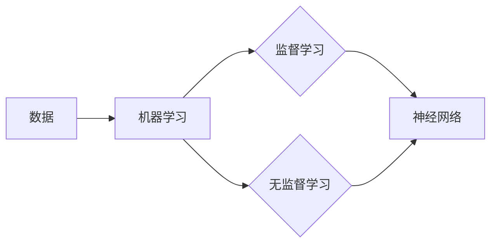

# Andrej Karpathy：人工智能的未来发展机遇

> 关键词：Andrej Karpathy，人工智能，深度学习，机器学习，神经网络，未来展望

## 1. 背景介绍

Andrej Karpathy，一位在人工智能领域享有盛誉的研究员和程序员，以其对深度学习的深刻理解和独到见解而闻名。他的作品，如著名的深度学习教科书《Deep Learning with Python》和Twitter上的技术博客，为全球开发者提供了宝贵的学习资源和思想启示。本文将围绕Andrej Karpathy的观点，探讨人工智能的未来发展机遇。

## 2. 核心概念与联系

### 2.1 人工智能的核心概念

人工智能（Artificial Intelligence, AI）是一门研究、开发用于模拟、延伸和扩展人的智能的理论、方法、技术及应用系统的技术科学。人工智能的核心概念包括：

- **机器学习（Machine Learning, ML）**：机器学习是人工智能的一个子领域，它使计算机系统能够从数据中学习并做出决策或预测，而无需显式编程。
- **深度学习（Deep Learning, DL）**：深度学习是机器学习的一个分支，它使用层次化的神经网络来学习数据的复杂模式。
- **神经网络（Neural Network, NN）**：神经网络是一种模仿人脑工作原理的计算模型，由大量相互连接的节点（或神经元）组成。

### 2.2 核心概念原理和架构的 Mermaid 流程图



### 2.3 核心概念之间的联系

机器学习是人工智能的实现手段，而深度学习则是机器学习的最新技术。神经网络作为深度学习的基础，通过学习大量数据来发现复杂的特征和模式。

## 3. 核心算法原理 & 具体操作步骤

### 3.1 算法原理概述

深度学习模型的核心是神经网络，它通过调整神经元之间的连接权重来学习数据。以下是深度学习的基本原理：

- **前向传播（Forward Propagation）**：输入数据通过网络的每一层，每一层的输出成为下一层的输入。
- **损失函数（Loss Function）**：衡量模型预测结果与真实结果之间的差异。
- **反向传播（Back Propagation）**：根据损失函数计算梯度，更新网络权重，以最小化损失。
- **优化器（Optimizer）**：选择合适的优化算法（如SGD、Adam等）来更新权重。

### 3.2 算法步骤详解

1. **数据预处理**：对数据进行清洗、标准化等处理，以便于模型学习。
2. **模型构建**：选择合适的神经网络架构，如卷积神经网络（CNN）、循环神经网络（RNN）或Transformer。
3. **训练模型**：使用训练数据对模型进行训练，通过优化算法调整权重。
4. **验证模型**：使用验证数据评估模型性能，调整模型参数以优化性能。
5. **测试模型**：使用测试数据测试模型的最终性能。

### 3.3 算法优缺点

#### 优点

- **强大的学习能力**：深度学习模型能够从大量数据中学习复杂的特征和模式。
- **自动化特征提取**：深度学习模型能够自动从数据中提取特征，无需人工设计特征。
- **泛化能力强**：经过充分训练的深度学习模型在未见过的数据上也能表现良好。

#### 缺点

- **需要大量数据**：深度学习模型需要大量的数据进行训练。
- **计算资源需求高**：深度学习模型需要大量的计算资源进行训练。
- **模型可解释性差**：深度学习模型的决策过程通常难以解释。

### 3.4 算法应用领域

深度学习在各个领域都有广泛的应用，包括：

- **计算机视觉**：图像识别、物体检测、图像生成等。
- **自然语言处理**：机器翻译、文本分类、语音识别等。
- **推荐系统**：个性化推荐、商品推荐等。
- **医疗诊断**：疾病诊断、药物发现等。

## 4. 数学模型和公式 & 详细讲解 & 举例说明

### 4.1 数学模型构建

深度学习模型通常使用以下数学公式：

- **激活函数（Activation Function）**：

$$
a = \sigma(z)
$$

其中，$z$ 是神经元的输入，$\sigma$ 是激活函数。

- **损失函数（Loss Function）**：

$$
L(y, \hat{y}) = -\sum_{i=1}^{N} y_i \log \hat{y}_i
$$

其中，$y$ 是真实标签，$\hat{y}$ 是模型预测的标签。

### 4.2 公式推导过程

以神经网络中的反向传播算法为例，推导过程如下：

1. **计算损失函数的梯度**：

$$
\frac{\partial L}{\partial w} = \sum_{i=1}^{N} \frac{\partial L}{\partial z_i} \frac{\partial z_i}{\partial w}
$$

2. **计算损失函数对输入的梯度**：

$$
\frac{\partial L}{\partial z} = \frac{\partial L}{\partial y} \frac{\partial y}{\partial z}
$$

3. **计算损失函数对输出的梯度**：

$$
\frac{\partial L}{\partial y} = y - \hat{y}
$$

### 4.3 案例分析与讲解

以下是一个简单的神经网络模型，用于进行二分类：

```
input -> [0.5, 0.3] -> hidden layer -> [0.8, 0.6] -> output -> 0.7
```

其中，输入层有2个神经元，隐藏层有2个神经元，输出层有1个神经元。

1. **前向传播**：

- 输入层到隐藏层的权重：$W_1 = [1, 1], W_2 = [1, 1]$
- 隐藏层到输出层的权重：$W_3 = [1, 1]$

- 输入层到隐藏层的输出：

$$
z_1 = W_1 \cdot [0.5, 0.3] + b_1 = [0.8, 0.6]
$$

- 隐藏层到输出层的输出：

$$
z_2 = W_2 \cdot [0.8, 0.6] + b_2 = 0.7
$$

- 模型预测的标签：

$$
\hat{y} = \sigma(z_2) = 0.7
$$

2. **计算损失函数**：

$$
L(y, \hat{y}) = -\log(\hat{y}) = -\log(0.7) \approx 0.356
$$

3. **反向传播**：

- 计算损失函数对输出层的梯度：

$$
\frac{\partial L}{\partial z_2} = \frac{\partial L}{\partial y} \frac{\partial y}{\partial z_2} = \frac{\partial L}{\partial y} = y - \hat{y} = 0.2
$$

- 计算损失函数对隐藏层的梯度：

$$
\frac{\partial L}{\partial z_1} = \frac{\partial L}{\partial z_2} \frac{\partial z_2}{\partial z_1} = \frac{\partial L}{\partial z_2} W_2^T = 0.2 [1, 1] = [0.2, 0.2]
$$

- 更新权重：

$$
W_1 \leftarrow W_1 - \eta \frac{\partial L}{\partial W_1} = [1, 1] - 0.01 [0.2, 0.2] = [0.8, 0.8]
$$
$$
W_2 \leftarrow W_2 - \eta \frac{\partial L}{\partial W_2} = [1, 1] - 0.01 [0.2, 0.2] = [0.8, 0.8]
$$
$$
W_3 \leftarrow W_3 - \eta \frac{\partial L}{\partial W_3} = [1, 1] - 0.01 [0.2, 0.2] = [0.8, 0.8]
$$

通过上述步骤，神经网络模型可以通过反向传播算法不断更新权重，以最小化损失函数。

## 5. 项目实践：代码实例和详细解释说明

### 5.1 开发环境搭建

在开始项目实践之前，我们需要搭建以下开发环境：

- Python 3.8+
- TensorFlow 2.x 或 PyTorch
- NumPy
- Matplotlib

### 5.2 源代码详细实现

以下是一个简单的神经网络模型，使用PyTorch实现：

```python
import torch
import torch.nn as nn
import torch.optim as optim

# 定义神经网络模型
class SimpleNN(nn.Module):
    def __init__(self):
        super(SimpleNN, self).__init__()
        self.fc1 = nn.Linear(2, 2)
        self.fc2 = nn.Linear(2, 1)
        
    def forward(self, x):
        x = torch.relu(self.fc1(x))
        x = self.fc2(x)
        return x

# 初始化模型、损失函数和优化器
model = SimpleNN()
criterion = nn.BCELoss()
optimizer = optim.SGD(model.parameters(), lr=0.01)

# 训练模型
for epoch in range(100):
    # 假设输入数据为[0.5, 0.3]，标签为[0]
    inputs = torch.tensor([[0.5, 0.3]])
    labels = torch.tensor([[0]])
    
    # 前向传播
    outputs = model(inputs)
    loss = criterion(outputs, labels)
    
    # 反向传播和优化
    optimizer.zero_grad()
    loss.backward()
    optimizer.step()
    
    # 打印损失函数值
    print(f"Epoch {epoch+1}, Loss: {loss.item()}")

# 测试模型
inputs = torch.tensor([[0.5, 0.3]])
outputs = model(inputs)
print(f"Model output: {outputs.item()}")
```

### 5.3 代码解读与分析

上述代码实现了一个简单的神经网络模型，用于进行二分类。模型包含两个线性层，第一个线性层使用ReLU激活函数，第二个线性层使用Sigmoid激活函数。

1. **导入库**：导入所需的库，包括PyTorch、NumPy和Matplotlib。
2. **定义模型**：定义一个名为`SimpleNN`的神经网络模型类，继承自`nn.Module`。模型包含两个线性层，第一个线性层使用ReLU激活函数，第二个线性层使用Sigmoid激活函数。
3. **初始化模型、损失函数和优化器**：初始化神经网络模型、损失函数（BCELoss用于二分类）和优化器（SGD）。
4. **训练模型**：使用训练数据进行训练，通过前向传播计算损失函数，通过反向传播和优化器更新模型权重。
5. **测试模型**：使用测试数据测试模型的性能。

通过上述步骤，我们可以使用PyTorch实现一个简单的神经网络模型，并进行训练和测试。

## 6. 实际应用场景

### 6.1 图像识别

深度学习在图像识别领域取得了显著的成果，如人脸识别、物体检测、图像分类等。例如，Google的Inception模型在ImageNet图像分类竞赛中取得了历史性的突破。

### 6.2 自然语言处理

深度学习在自然语言处理领域也取得了巨大的进展，如机器翻译、文本分类、情感分析等。例如，Google的BERT模型在多项自然语言处理任务上刷新了SOTA。

### 6.3 语音识别

深度学习在语音识别领域也取得了显著成果，如语音到文本、语音合成等。例如，Google的WaveNet模型在语音合成任务上取得了前所未有的效果。

### 6.4 未来应用展望

深度学习在各个领域都有广泛的应用前景，如：

- **自动驾驶**：通过深度学习技术，可以实现更加安全、智能的自动驾驶汽车。
- **医疗诊断**：深度学习可以帮助医生进行更加准确的疾病诊断。
- **金融风控**：深度学习可以帮助金融机构进行风险控制，降低信贷风险。
- **教育**：深度学习可以帮助个性化教育，提高教育质量。

## 7. 工具和资源推荐

### 7.1 学习资源推荐

- 《Deep Learning》[Goodfellow, I., Bengio, Y., & Courville, A.]：深度学习的经典教材，适合初学者和进阶者。
- fast.ai：提供丰富的深度学习课程和教程。
- TensorFlow官方网站：提供TensorFlow框架的详细文档和示例。

### 7.2 开发工具推荐

- TensorFlow：Google开源的深度学习框架。
- PyTorch：Facebook开源的深度学习框架。
- Keras：Python深度学习库，可以方便地构建和训练深度学习模型。

### 7.3 相关论文推荐

- "ImageNet Classification with Deep Convolutional Neural Networks" [ Krizhevsky, A., Sutskever, I., & Hinton, G. E.]：卷积神经网络在ImageNet图像分类竞赛中的突破性论文。
- "BERT: Pre-training of Deep Bidirectional Transformers for Language Understanding" [Devlin, J., Chang, M. W., Lee, K., & Toutanova, K.]：BERT模型的原论文。
- "Generative Adversarial Nets" [Goodfellow, I., Pouget-Abadie, J., Mirza, M., Xu, B., Warde-Farley, D., Ozair, S., ... & Bengio, Y.]：生成对抗网络的原论文。

## 8. 总结：未来发展趋势与挑战

### 8.1 研究成果总结

本文对Andrej Karpathy关于人工智能的未来发展机遇进行了探讨，涵盖了人工智能的核心概念、深度学习算法原理、项目实践等方面。通过分析深度学习在各个领域的应用，展示了人工智能的巨大潜力。

### 8.2 未来发展趋势

- **更强大的模型**：随着计算能力的提升，未来将出现更强大的深度学习模型，能够处理更加复杂的问题。
- **更有效的训练方法**：新的训练方法将提高模型训练效率和性能。
- **多模态学习**：深度学习将融合多种模态信息，如文本、图像、视频等。
- **可解释性**：提高模型的可解释性，使其更加可靠和可信。

### 8.3 面临的挑战

- **数据隐私**：如何保护用户数据隐私是一个重要挑战。
- **计算资源**：深度学习模型的计算需求仍然很高。
- **模型可解释性**：提高模型的可解释性，使其更加可靠和可信。
- **伦理问题**：人工智能的应用需要考虑伦理问题，如歧视、偏见等。

### 8.4 研究展望

未来，人工智能将继续快速发展，为人类社会带来更多福祉。研究者需要关注以下方向：

- **数据安全和隐私**：开发安全的数据处理和存储方法，保护用户隐私。
- **公平性和透明度**：提高模型的可解释性和透明度，避免歧视和偏见。
- **跨学科合作**：促进人工智能与其他学科的交叉融合，推动技术创新。
- **可持续发展**：确保人工智能技术的可持续发展，使其惠及全人类。

## 9. 附录：常见问题与解答

**Q1：深度学习模型如何工作？**

A1：深度学习模型通过调整神经元之间的连接权重来学习数据。它通过前向传播计算模型输出，通过反向传播计算损失函数，并通过优化算法更新权重。

**Q2：深度学习模型如何优化？**

A2：深度学习模型可以通过调整学习率、批量大小、激活函数、优化器等参数来优化。

**Q3：深度学习模型如何应用于实际项目？**

A3：深度学习模型可以应用于各种实际项目，如图像识别、自然语言处理、语音识别等。开发者需要根据具体项目需求选择合适的模型和算法。

**Q4：深度学习模型如何处理非结构化数据？**

A4：深度学习模型可以通过特征提取和降维等方法处理非结构化数据。

**Q5：深度学习模型的局限性是什么？**

A5：深度学习模型的局限性包括需要大量数据、计算资源需求高、模型可解释性差等。

作者：禅与计算机程序设计艺术 / Zen and the Art of Computer Programming