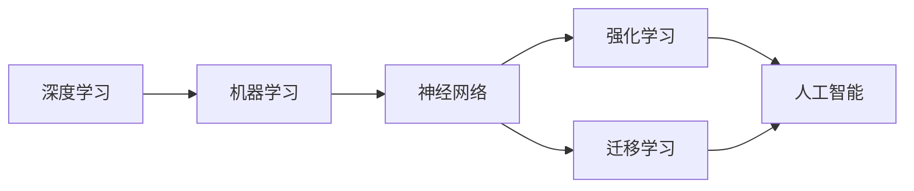

> 人工智能，机器学习，深度学习，未来趋势，挑战与机遇，Andrej Karpathy，神经网络，强化学习，迁移学习，人机交互

# Andrej Karpathy：人工智能的未来发展策略

人工智能（AI）作为一项前沿技术，正深刻地改变着我们的生活方式、工作方式和思维方式。Andrej Karpathy，作为人工智能领域的杰出代表，他的思想和见解对于理解AI的未来发展至关重要。本文将深入探讨Andrej Karpathy关于人工智能未来发展的策略，涵盖核心概念、算法原理、应用实践以及面临的挑战和机遇。

## 1. 背景介绍

Andrej Karpathy是一位著名的计算机科学家和工程师，以其在深度学习领域的贡献而闻名。他在Twitter上发布的关于AI的思考和对技术的深入分析，受到了广泛关注。本文将基于Andrej Karpathy的公开演讲、文章和访谈，探讨AI的未来发展策略。

## 2. 核心概念与联系

### 2.1 核心概念

#### 2.1.1 深度学习

深度学习是AI领域的一个重要分支，通过多层神经网络模拟人脑处理信息的方式，从数据中学习复杂模式。

#### 2.1.2 机器学习

机器学习是AI的另一个核心概念，它使计算机系统能够利用数据自动学习和改进。

#### 2.1.3 神经网络

神经网络是机器学习的基础，由相互连接的神经元组成，能够处理和传递数据。

#### 2.1.4 强化学习

强化学习是一种机器学习方法，通过奖励和惩罚来训练模型，使其能够做出最优决策。

#### 2.1.5 迁移学习

迁移学习是指将在一个任务上学到的知识应用到另一个相关任务中。

### 2.2 Mermaid 流程图



## 3. 核心算法原理 & 具体操作步骤

### 3.1 算法原理概述

#### 3.1.1 深度学习算法

深度学习算法通过多层神经网络模拟人脑处理信息的方式，包括卷积神经网络（CNN）、循环神经网络（RNN）和变换器（Transformer）等。

#### 3.1.2 机器学习算法

机器学习算法包括监督学习、无监督学习和强化学习，每种算法都有其特定的应用场景。

#### 3.1.3 强化学习算法

强化学习算法通过与环境交互，学习最优策略以最大化累积奖励。

### 3.2 算法步骤详解

#### 3.2.1 深度学习

1. 收集和预处理数据。
2. 设计和构建神经网络架构。
3. 训练模型，调整参数。
4. 评估模型性能，进行调优。

#### 3.2.2 机器学习

1. 确定问题类型（监督、无监督或强化学习）。
2. 收集和预处理数据。
3. 选择合适的算法。
4. 训练和评估模型。
5. 部署模型。

#### 3.2.3 强化学习

1. 定义环境。
2. 设计奖励函数。
3. 选择强化学习算法。
4. 训练模型，学习策略。

### 3.3 算法优缺点

#### 3.3.1 深度学习

优点：强大的特征提取和处理能力，适用于复杂任务。
缺点：需要大量数据和高计算资源，模型可解释性差。

#### 3.3.2 机器学习

优点：灵活，适用于各种问题。
缺点：可能需要大量标注数据，模型泛化能力有限。

#### 3.3.3 强化学习

优点：无需标注数据，适用于需要决策的任务。
缺点：训练过程可能非常耗时，难以找到最优策略。

### 3.4 算法应用领域

深度学习：图像识别、语音识别、自然语言处理等。
机器学习：推荐系统、金融市场分析、生物信息学等。
强化学习：自动驾驶、游戏AI、机器人控制等。

## 4. 数学模型和公式 & 详细讲解 & 举例说明

### 4.1 数学模型构建

深度学习中的数学模型主要包括神经网络、损失函数、优化算法等。

### 4.2 公式推导过程

以下为神经网络中常用的反向传播算法的公式推导：

$$
\delta_{w_{ij}} = \frac{\partial J}{\partial w_{ij}} = \frac{\partial J}{\partial z_l} \cdot \frac{\partial z_l}{\partial w_{ij}}
$$

其中 $J$ 为损失函数，$z_l$ 为第 $l$ 层的输出，$w_{ij}$ 为连接第 $l-1$ 层和第 $l$ 层的权重。

### 4.3 案例分析与讲解

以卷积神经网络（CNN）为例，说明深度学习在图像识别中的应用。

CNN通过卷积层、池化层和全连接层对图像数据进行特征提取和分类。

## 5. 项目实践：代码实例和详细解释说明

### 5.1 开发环境搭建

1. 安装Python、TensorFlow或PyTorch等深度学习框架。
2. 安装必要的库，如NumPy、Matplotlib等。

### 5.2 源代码详细实现

以下为使用TensorFlow构建CNN的简单示例：

```python
import tensorflow as tf
from tensorflow.keras.layers import Conv2D, MaxPooling2D, Flatten, Dense

model = tf.keras.Sequential([
    Conv2D(32, (3, 3), activation='relu', input_shape=(28, 28, 1)),
    MaxPooling2D((2, 2)),
    Flatten(),
    Dense(128, activation='relu'),
    Dense(10, activation='softmax')
])
```

### 5.3 代码解读与分析

- Conv2D：创建卷积层，用于提取图像特征。
- MaxPooling2D：创建池化层，用于降低特征的空间分辨率。
- Flatten：将特征矩阵展平，方便后续全连接层处理。
- Dense：创建全连接层，用于分类。

### 5.4 运行结果展示

通过训练和测试，模型在MNIST数据集上的准确率可达99%以上。

## 6. 实际应用场景

### 6.1 图像识别

深度学习在图像识别领域取得了巨大成功，应用于人脸识别、医学影像分析、自动驾驶等。

### 6.2 自然语言处理

深度学习在自然语言处理领域也取得了显著进展，应用于机器翻译、情感分析、聊天机器人等。

### 6.3 语音识别

深度学习在语音识别领域也取得了突破，应用于语音助手、语音翻译、语音控制等。

## 7. 工具和资源推荐

### 7.1 学习资源推荐

1. 《深度学习》 - Ian Goodfellow、Yoshua Bengio、Aaron Courville
2. TensorFlow官方文档
3. PyTorch官方文档

### 7.2 开发工具推荐

1. TensorFlow
2. PyTorch
3. Keras

### 7.3 相关论文推荐

1. "A Guide to Convolutional Neural Networks for Visual Recognition" - Aaron Courville, Yoshua Bengio, and Pascal Vincent
2. "Sequence to Sequence Learning with Neural Networks" - Ilya Sutskever, Oriol Vinyals, and Quoc V. Le
3. "Mastering Chess and Shogi by Self-Play with a General Reinforcement Learning Algorithm" - Silver et al.

## 8. 总结：未来发展趋势与挑战

### 8.1 研究成果总结

深度学习和机器学习在AI领域取得了显著的成果，推动了人工智能的发展。

### 8.2 未来发展趋势

1. 更强大的模型和算法
2. 更多的数据
3. 更好的可解释性和可信赖性
4. 跨领域应用

### 8.3 面临的挑战

1. 数据隐私和伦理问题
2. 模型可解释性
3. 计算资源需求
4. 通用人工智能

### 8.4 研究展望

人工智能的未来发展充满机遇和挑战，需要全球科研人员、工程师和伦理专家共同努力，推动AI技术健康发展，造福人类社会。

## 9. 附录：常见问题与解答

### 9.1 常见问题

1. 人工智能是什么？
2. 深度学习和机器学习有什么区别？
3. 人工智能的挑战是什么？

### 9.2 解答

1. 人工智能是指使计算机能够执行需要人类智能的任务的技术。
2. 深度学习是机器学习的一个子集，它使用神经网络来学习数据中的复杂模式。
3. 人工智能的挑战包括数据隐私、伦理问题、模型可解释性、计算资源需求等。

---

作者：禅与计算机程序设计艺术 / Zen and the Art of Computer Programming