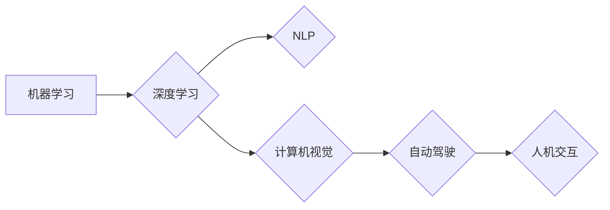

# Andrej Karpathy：人工智能的未来发展规划

> 关键词：Andrej Karpathy，人工智能，机器学习，深度学习，自然语言处理，计算机视觉，自动驾驶，人机交互，未来展望

## 1. 背景介绍

Andrej Karpathy 是一位著名的机器学习研究员和工程师，曾在 OpenAI 担任首席工程师，负责开发了著名的 GPT 模型家族。他的工作对人工智能领域产生了深远的影响，尤其是在自然语言处理（NLP）和计算机视觉领域。本文将探讨 Andrej Karpathy 对人工智能未来发展规划的看法，分析其核心观点，并结合当前技术发展趋势，展望人工智能的未来。

## 2. 核心概念与联系

### 2.1 核心概念

#### 2.1.1 机器学习

机器学习是一种使计算机系统能够从数据中学习并做出决策或预测的技术。它包括监督学习、无监督学习、强化学习等不同类型。

#### 2.1.2 深度学习

深度学习是机器学习的一个子集，它使用多层神经网络来学习数据的复杂模式。深度学习在图像识别、语音识别、自然语言处理等领域取得了突破性进展。

#### 2.1.3 自然语言处理（NLP）

自然语言处理是人工智能的一个分支，旨在使计算机能够理解、解释和生成人类语言。

#### 2.1.4 计算机视觉

计算机视觉是人工智能的另一个分支，旨在使计算机能够从图像或视频中理解场景和对象。

#### 2.1.5 自动驾驶

自动驾驶是一种利用计算机视觉、传感器和其他技术实现车辆自主导航的技术。

#### 2.1.6 人机交互

人机交互是研究如何使人类与计算机系统更有效地交互的领域。

### 2.2 Mermaid 流程图



## 3. 核心算法原理 & 具体操作步骤

### 3.1 算法原理概述

Andrej Karpathy 的研究主要集中在深度学习领域，特别是在 NLP 和计算机视觉方面。他的核心算法原理包括：

- 使用大规模数据集进行预训练，以学习数据的复杂模式。
- 使用神经网络架构，如卷积神经网络（CNN）和循环神经网络（RNN）。
- 使用优化算法，如梯度下降，来训练模型。

### 3.2 算法步骤详解

1. 数据收集：收集大量的数据，包括文本、图像和视频。
2. 数据预处理：对数据进行清洗、标注和转换，以便于模型训练。
3. 模型设计：选择合适的神经网络架构。
4. 模型训练：使用预训练数据训练模型。
5. 模型评估：使用验证数据评估模型性能。
6. 模型部署：将训练好的模型部署到实际应用中。

### 3.3 算法优缺点

#### 3.3.1 优点

- 高效：深度学习模型能够从大量数据中学习复杂模式。
- 强大：深度学习模型在多个领域取得了突破性进展。
- 泛化能力强：深度学习模型能够适应不同的任务和数据集。

#### 3.3.2 缺点

- 计算量大：训练深度学习模型需要大量的计算资源和时间。
- 需要大量标注数据：训练深度学习模型需要大量的标注数据。
- 可解释性差：深度学习模型的决策过程难以解释。

### 3.4 算法应用领域

- 自然语言处理：文本分类、机器翻译、情感分析。
- 计算机视觉：图像识别、物体检测、图像生成。
- 自动驾驶：场景感知、路径规划、车辆控制。
- 医学：疾病诊断、药物发现、影像分析。

## 4. 数学模型和公式 & 详细讲解 & 举例说明

### 4.1 数学模型构建

深度学习模型通常由多个神经元组成的神经网络构成。每个神经元通过学习输入数据的特征，生成输出。

### 4.2 公式推导过程

以下是一个简单的神经网络公式：

$$
y = \sigma(W \cdot x + b)
$$

其中，$y$ 是输出，$W$ 是权重矩阵，$x$ 是输入，$b$ 是偏置，$\sigma$ 是激活函数。

### 4.3 案例分析与讲解

以 GPT 模型为例，GPT 是一种基于 Transformer 的预训练语言模型。它通过学习大量文本数据，能够生成连贯、流畅的文本内容。

## 5. 项目实践：代码实例和详细解释说明

### 5.1 开发环境搭建

为了进行深度学习项目实践，需要安装以下软件：

- Python
- TensorFlow 或 PyTorch
- CUDA (可选，用于GPU加速)

### 5.2 源代码详细实现

以下是一个简单的 TensorFlow 模型实现的例子：

```python
import tensorflow as tf

# 创建模型
model = tf.keras.Sequential([
    tf.keras.layers.Dense(128, activation='relu', input_shape=(784,)),
    tf.keras.layers.Dense(10, activation='softmax')
])

# 编译模型
model.compile(optimizer='adam',
              loss='sparse_categorical_crossentropy',
              metrics=['accuracy'])

# 训练模型
model.fit(train_images, train_labels, epochs=5)

# 评估模型
test_loss, test_acc = model.evaluate(test_images,  test_labels, verbose=2)
print('\
Test accuracy:', test_acc)
```

### 5.3 代码解读与分析

以上代码创建了一个简单的神经网络，用于识别手写数字。模型由两个全连接层组成，第一个层的神经元数量为 128，激活函数为 ReLU。第二个层的神经元数量为 10，表示 0 到 9 的数字类别。模型使用 Adam 优化器和交叉熵损失函数进行编译。训练过程中，模型在训练集上迭代 5 个 epoch，并在测试集上评估性能。

## 6. 实际应用场景

Andrej Karpathy 的研究在多个实际应用场景中取得了成功，以下是一些例子：

- OpenAI 的 GPT 模型：一种能够生成高质量文本的预训练语言模型。
- OpenAI 的 DALL-E：一种能够生成视觉内容的 AI 系统。
- OpenAI 的 GPT-3：一种具有广泛语言理解能力的预训练语言模型。

## 7. 工具和资源推荐

### 7.1 学习资源推荐

- 《深度学习》（Goodfellow et al.）
- 《Python机器学习》（Seabold et al.）
- TensorFlow 官方文档
- PyTorch 官方文档

### 7.2 开发工具推荐

- TensorFlow
- PyTorch
- Keras

### 7.3 相关论文推荐

- "A Neural Algorithm of Artistic Style"
- "Generative Adversarial Nets"
- "Attention Is All You Need"

## 8. 总结：未来发展趋势与挑战

### 8.1 研究成果总结

Andrej Karpathy 的研究在人工智能领域取得了显著的成果，特别是在 NLP 和计算机视觉领域。他的工作推动了深度学习技术的发展，并使其在多个实际应用场景中取得了成功。

### 8.2 未来发展趋势

- 深度学习模型将变得更加高效和可解释。
- 人工智能将在更多领域得到应用，如医疗、教育、交通等。
- 人机交互将变得更加自然和流畅。

### 8.3 面临的挑战

- 模型的可解释性和透明度。
- 人工智能的伦理和社会影响。
- 数据隐私和安全。

### 8.4 研究展望

未来，人工智能将朝着更加高效、可解释和安全的方向发展。研究者将努力解决当前面临的挑战，推动人工智能技术的进步。

## 9. 附录：常见问题与解答

### 9.1 常见问题

**Q1：什么是深度学习？**

A1：深度学习是机器学习的一种，它使用多层神经网络来学习数据的复杂模式。

**Q2：什么是自然语言处理？**

A2：自然语言处理是人工智能的一个分支，旨在使计算机能够理解、解释和生成人类语言。

**Q3：什么是计算机视觉？**

A3：计算机视觉是人工智能的另一个分支，旨在使计算机能够从图像或视频中理解场景和对象。

**Q4：什么是自动驾驶？**

A4：自动驾驶是一种利用计算机视觉、传感器和其他技术实现车辆自主导航的技术。

**Q5：什么是人机交互？**

A5：人机交互是研究如何使人类与计算机系统更有效地交互的领域。

### 9.2 解答

**A1：深度学习使用多层神经网络来学习数据的复杂模式，它比传统的机器学习方法更加强大和高效。**

**A2：自然语言处理旨在使计算机能够理解、解释和生成人类语言。它包括文本分类、机器翻译、情感分析等多个子领域。**

**A3：计算机视觉旨在使计算机能够从图像或视频中理解场景和对象。它包括图像识别、物体检测、图像生成等多个子领域。**

**A4：自动驾驶是一种利用计算机视觉、传感器和其他技术实现车辆自主导航的技术。它有望在未来改变交通出行方式。**

**A5：人机交互是研究如何使人类与计算机系统更有效地交互的领域。它包括图形用户界面、语音识别、手势识别等多个子领域。**