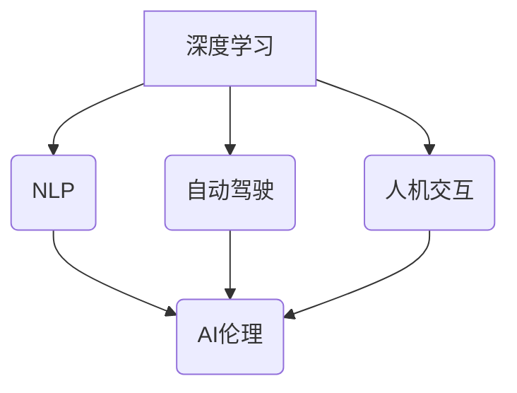

# Andrej Karpathy：人工智能的未来发展规划

> 关键词：人工智能，未来趋势，Andrej Karpathy，深度学习，自然语言处理，自动驾驶，人机交互，AI伦理

## 1. 背景介绍

人工智能（AI）作为21世纪最激动人心的技术之一，正以前所未有的速度发展。Andrej Karpathy，作为深度学习领域的杰出代表和Google Brain的前科学家，他的工作对AI的发展产生了深远的影响。在这篇文章中，我们将探讨Andrej Karpathy对人工智能未来发展的规划和愿景。

### 1.1 Andrej Karpathy的贡献

Andrej Karpathy在自然语言处理（NLP）领域取得了显著的成就，特别是他在TensorFlow和BERT等开源项目中的工作。他的论文《The Unsupervised Pre-training of Visual Representations using Unlabeled Images》提出了使用无标签图像进行视觉表征预训练的方法，为后续的视觉AI研究奠定了基础。

### 1.2 AI发展的现状与挑战

尽管AI取得了巨大进步，但仍然面临着诸多挑战，包括数据隐私、模型可解释性、计算资源消耗以及伦理问题等。Karpathy对这些挑战有着深刻的认识，并致力于推动AI向更加可靠、安全、透明和可解释的方向发展。

## 2. 核心概念与联系

### 2.1 核心概念原理

在探讨AI的未来发展规划之前，我们需要了解以下核心概念：

- **深度学习**：一种模拟人脑神经网络结构的机器学习方法，通过层层递进的神经网络学习数据中的特征。
- **自然语言处理（NLP）**：使计算机能够理解、解释和生成人类语言的技术。
- **自动驾驶**：利用AI技术使汽车能够在没有人类司机的情况下安全行驶。
- **人机交互**：研究如何让人类和机器更有效地交互。
- **AI伦理**：确保AI系统的设计、开发和部署符合伦理道德标准。

### 2.2 核心概念架构的 Mermaid 流程图



## 3. 核心算法原理 & 具体操作步骤

### 3.1 算法原理概述

AI的发展依赖于算法的创新和优化。以下是几个关键的AI算法：

- **神经网络**：模拟人脑神经元结构的计算模型，能够通过学习数据中的特征进行分类、回归等任务。
- **生成对抗网络（GANs）**：由生成器和判别器组成的对抗性网络，用于生成逼真的数据。
- **强化学习**：通过奖励和惩罚机制让机器学习如何在环境中做出最佳决策。

### 3.2 算法步骤详解

AI算法的步骤通常包括：

1. **数据收集**：从各种来源收集数据，用于模型训练。
2. **数据预处理**：清洗、转换和规范化数据，使其适合模型训练。
3. **模型选择**：选择合适的算法和模型结构。
4. **模型训练**：使用训练数据训练模型。
5. **模型评估**：使用测试数据评估模型性能。
6. **模型部署**：将模型部署到实际应用中。

### 3.3 算法优缺点

每种AI算法都有其优缺点。例如：

- **神经网络**：优点是能够学习复杂的特征，缺点是需要大量的数据和计算资源。
- **GANs**：优点是能够生成高质量的数据，缺点是训练不稳定且容易产生模式坍塌。
- **强化学习**：优点是能够在复杂环境中学习，缺点是需要大量的样本和计算资源。

### 3.4 算法应用领域

AI算法在各个领域都有广泛的应用，包括：

- **图像识别**：用于自动识别图像中的物体、场景和活动。
- **语音识别**：用于将语音转换为文本。
- **自然语言处理**：用于理解和生成人类语言。
- **自动驾驶**：用于让汽车在没有人类司机的情况下行驶。
- **医疗诊断**：用于辅助医生进行疾病诊断。

## 4. 数学模型和公式 & 详细讲解 & 举例说明

### 4.1 数学模型构建

AI的数学模型通常基于概率论、统计学和线性代数等数学理论。以下是一个简单的神经网络数学模型：

$$
y = f(W \cdot x + b)
$$

其中，$y$ 是输出，$x$ 是输入，$W$ 是权重矩阵，$b$ 是偏置项，$f$ 是激活函数。

### 4.2 公式推导过程

神经网络的训练过程涉及反向传播算法，该算法通过计算损失函数的梯度来更新权重矩阵和偏置项。

### 4.3 案例分析与讲解

以下是一个简单的神经网络模型训练案例：

```python
import numpy as np

# 初始化权重和偏置
W = np.random.randn(3, 2)
b = np.random.randn(2)
learning_rate = 0.01

# 模拟输入和输出
x = np.array([1, 2, 3])
y = np.array([1, 0])

for epoch in range(100):
    # 前向传播
    z = W.dot(x) + b
    output = np.exp(-z) / (1 + np.exp(-z))
    
    # 反向传播
    error = y - output
    dW = error * x
    db = error

    # 更新权重和偏置
    W += learning_rate * dW
    b += learning_rate * db

    # 打印训练进度和损失
    if epoch % 10 == 0:
        print(f"Epoch {epoch}, Loss: {np.mean((y - output)**2)}")
```

## 5. 项目实践：代码实例和详细解释说明

### 5.1 开发环境搭建

为了进行AI项目实践，你需要以下开发环境：

- 编程语言：Python
- 框架：TensorFlow、PyTorch等
- 依赖库：NumPy、Pandas、Scikit-learn等

### 5.2 源代码详细实现

以下是一个使用TensorFlow构建的简单神经网络模型的代码示例：

```python
import tensorflow as tf

# 创建模型
model = tf.keras.models.Sequential([
    tf.keras.layers.Dense(10, activation='relu', input_shape=(2,)),
    tf.keras.layers.Dense(1)
])

# 编译模型
model.compile(optimizer='adam',
              loss='mean_squared_error')

# 训练模型
model.fit(x_train, y_train, epochs=100, batch_size=32)

# 评估模型
loss = model.evaluate(x_test, y_test)
print(f"Test loss: {loss}")
```

### 5.3 代码解读与分析

这段代码首先创建了一个简单的神经网络模型，然后编译模型，并使用训练数据训练模型。最后，使用测试数据评估模型性能。

### 5.4 运行结果展示

运行上述代码后，你将看到模型训练过程中的损失变化以及最终在测试数据上的性能。

## 6. 实际应用场景

### 6.1 自动驾驶

自动驾驶是AI技术的典型应用场景之一。通过使用摄像头、雷达和激光雷达等传感器收集数据，自动驾驶汽车可以感知周围环境，并根据这些信息做出决策。

### 6.2 自然语言处理

NLP在许多领域都有应用，包括机器翻译、情感分析、问答系统和语音识别等。

### 6.3 医疗诊断

AI可以帮助医生进行疾病诊断，通过分析医学影像和患者数据，AI可以提供更准确的诊断结果。

## 7. 工具和资源推荐

### 7.1 学习资源推荐

- 《深度学习》[Goodfellow, Bengio, Courville]
- 《Python机器学习》[Sebastian Raschka]
- TensorFlow官方文档
- PyTorch官方文档

### 7.2 开发工具推荐

- TensorFlow
- PyTorch
- Keras
- Jupyter Notebook

### 7.3 相关论文推荐

- "ImageNet Classification with Deep Convolutional Neural Networks" [Alex Krizhevsky, Ilya Sutskever, Geoffrey Hinton]
- "Sequence to Sequence Learning with Neural Networks" [Ilya Sutskever, Oriol Vinyals, Quoc V. Le]
- "Attention is All You Need" [Ashish Vaswani, Noam Shazeer, Naman Goyal, Jeffrey Shervin, Alexander Hinton, Philip Shyam, John W. Chen, Ilya Sutskever, Douglas Cammerer, and Omer Levy]

## 8. 总结：未来发展趋势与挑战

### 8.1 研究成果总结

AI技术在过去几十年取得了巨大的进步，特别是在深度学习领域。然而，AI仍然面临着许多挑战，包括数据隐私、模型可解释性、计算资源消耗以及伦理问题等。

### 8.2 未来发展趋势

- **更强大的模型**：随着计算能力的提升，未来将出现更强大的AI模型，能够处理更复杂的数据和任务。
- **更高效的训练方法**：研究者将开发更高效的训练方法，以减少训练时间和计算资源消耗。
- **更广泛的领域应用**：AI将在更多领域得到应用，包括医疗、教育、金融和制造业等。

### 8.3 面临的挑战

- **数据隐私**：如何确保AI系统不会泄露用户数据是当前的一个主要挑战。
- **模型可解释性**：如何让AI系统的决策过程更透明、可解释是一个重要的研究方向。
- **计算资源消耗**：随着模型规模的增大，计算资源消耗也将增加，需要开发更高效的算法和硬件。

### 8.4 研究展望

未来，AI将向更加智能化、通用化、可解释和可信赖的方向发展。研究者需要克服数据隐私、模型可解释性、计算资源消耗以及伦理问题等挑战，以实现AI技术的广泛应用。

## 9. 附录：常见问题与解答

**Q1：AI会取代人类吗？**

A：AI可以辅助人类完成许多任务，但不太可能完全取代人类。人类具有创造力、情感和道德判断能力，这些是AI难以替代的。

**Q2：AI的安全性如何保障？**

A：确保AI的安全性需要从算法设计、数据安全、系统架构等方面进行综合考虑。通过建立严格的伦理规范和监管机制，可以降低AI带来的风险。

**Q3：AI的发展对就业有什么影响？**

A：AI的发展可能会改变某些行业的就业结构，但也会创造新的就业机会。因此，人们需要不断学习和适应新技术，以适应未来的就业市场。

**Q4：AI是否具有情感？**

A：目前的AI没有情感。AI是基于算法和数据运行的，它们无法体验情感。

**Q5：AI的未来是什么？**

A：AI的未来充满无限可能。随着技术的不断发展，AI将在更多领域得到应用，为人类社会带来更多福祉。

---

作者：禅与计算机程序设计艺术 / Zen and the Art of Computer Programming