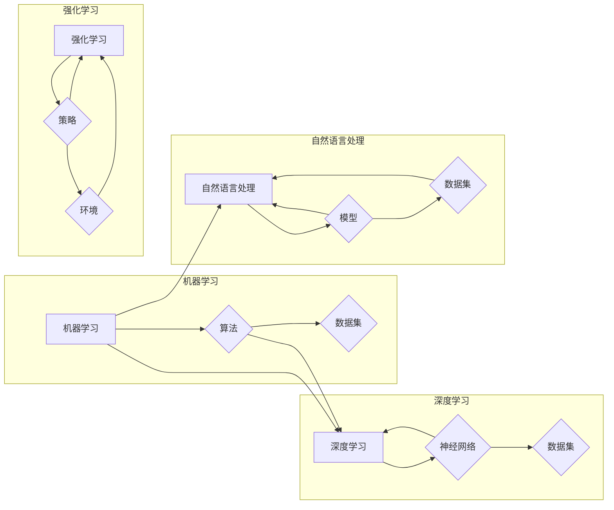

> 人工智能，机器学习，神经网络，深度学习，自然语言处理，图灵测试，伦理，AI伦理

# Andrej Karpathy：人工智能的未来发展趋势

## 1. 背景介绍

安德烈·卡尔帕西（Andrej Karpathy）是人工智能和机器学习领域的知名专家，曾任职于OpenAI，并在该组织的工作中对神经网络和深度学习在自然语言处理（NLP）中的应用做出了重要贡献。本文将基于安德烈·卡尔帕西的观点和研究成果，探讨人工智能的未来发展趋势。

### 1.1 问题的由来

随着计算能力的提升和算法的改进，人工智能（AI）技术正以前所未有的速度发展。从语音识别到图像识别，从自动驾驶到智能客服，AI的应用已经渗透到我们生活的方方面面。然而，AI的未来发展趋势如何？它将如何影响我们的社会和未来？这些问题值得我们深思。

### 1.2 研究现状

目前，人工智能研究主要集中在以下几个方面：

- 深度学习：通过模拟人脑神经网络结构，深度学习在图像识别、语音识别、自然语言处理等领域取得了显著成果。
- 机器学习：机器学习算法可以从数据中学习并做出决策，为AI提供更智能的决策能力。
- 强化学习：强化学习通过不断试错，让AI在复杂环境中学习最优策略。
- 自然语言处理：自然语言处理技术使AI能够理解和生成自然语言，为智能对话、智能客服等应用提供支持。

### 1.3 研究意义

研究人工智能的未来发展趋势，有助于我们：

- 了解AI技术的最新进展和应用前景。
- 探索AI技术对社会和人类生活的影响。
- 分析AI技术的潜在风险和挑战，并制定相应的应对策略。

### 1.4 本文结构

本文将围绕安德烈·卡尔帕西的观点，从以下几个方面探讨人工智能的未来发展趋势：

- 核心概念与联系
- 核心算法原理
- 数学模型和公式
- 项目实践
- 实际应用场景
- 工具和资源推荐
- 总结与展望

## 2. 核心概念与联系

### 2.1 核心概念原理

人工智能（AI）是指使计算机具有模拟、延伸和扩展人类智能的理论、方法、技术及应用系统。人工智能的核心概念包括：

- 机器学习：机器学习是AI的一种学习方法，通过算法从数据中学习并做出决策。
- 深度学习：深度学习是机器学习的一种，通过模拟人脑神经网络结构，实现复杂模式识别。
- 自然语言处理（NLP）：自然语言处理是AI的一个分支，旨在让计算机理解和生成自然语言。
- 强化学习：强化学习是机器学习的一种，通过不断试错，让AI在复杂环境中学习最优策略。

### 2.2 核心概念联系

这些核心概念之间存在紧密的联系，形成一个完整的AI技术体系。例如，深度学习可以用于自然语言处理和图像识别等领域，而机器学习则为深度学习提供了基础算法。

### 2.3 Mermaid 流程图



## 3. 核心算法原理 & 具体操作步骤

### 3.1 算法原理概述

人工智能的核心算法包括：

- 机器学习算法：如线性回归、逻辑回归、支持向量机等。
- 深度学习算法：如卷积神经网络（CNN）、循环神经网络（RNN）、生成对抗网络（GAN）等。
- 自然语言处理算法：如词嵌入、序列标注、文本分类等。
- 强化学习算法：如Q学习、深度Q网络（DQN）等。

### 3.2 算法步骤详解

以下是几种常见算法的步骤详解：

#### 3.2.1 机器学习算法：线性回归

1. 收集数据，并将其划分为训练集和测试集。
2. 使用训练集数据对线性回归模型进行训练。
3. 使用测试集数据评估模型性能。

#### 3.2.2 深度学习算法：卷积神经网络（CNN）

1. 设计CNN模型结构，包括卷积层、池化层、全连接层等。
2. 使用训练集数据对CNN模型进行训练。
3. 使用测试集数据评估模型性能。

#### 3.2.3 自然语言处理算法：词嵌入

1. 收集文本数据，并将其转换为词向量表示。
2. 使用词向量进行文本分类、情感分析等任务。

#### 3.2.4 强化学习算法：Q学习

1. 设计强化学习环境，包括状态空间、动作空间、奖励函数等。
2. 使用Q学习算法学习最优策略。

### 3.3 算法优缺点

每种算法都有其优缺点，以下列举几种算法的优缺点：

#### 3.3.1 线性回归

优点：简单易实现，对数据分布要求不高。

缺点：对于非线性关系无法很好地拟合，容易过拟合。

#### 3.3.2 卷积神经网络（CNN）

优点：能够有效地提取图像特征，适用于图像识别等任务。

缺点：需要大量的训练数据，模型结构复杂。

#### 3.3.3 词嵌入

优点：能够将文本转换为向量表示，适用于文本分类、情感分析等任务。

缺点：需要大量的训练数据，对稀疏文本数据的处理效果不佳。

#### 3.3.4 Q学习

优点：能够学习到最优策略，适用于强化学习任务。

缺点：需要大量的训练时间和环境交互。

### 3.4 算法应用领域

各种算法在不同领域有不同的应用：

- 线性回归：广泛应用于回归分析、分类等任务。
- 卷积神经网络：广泛应用于图像识别、目标检测等任务。
- 词嵌入：广泛应用于自然语言处理任务，如文本分类、情感分析等。
- Q学习：广泛应用于强化学习任务，如游戏、自动驾驶等。

## 4. 数学模型和公式 & 详细讲解 & 举例说明

### 4.1 数学模型构建

以下是几种常见算法的数学模型：

#### 4.1.1 线性回归

$$
y = \theta_0 + \theta_1x_1 + \theta_2x_2 + \cdots + \theta_nx_n
$$

#### 4.1.2 卷积神经网络（CNN）

$$
h_{l}(x) = f(W_lh_{l-1}(x) + b_l)
$$

#### 4.1.3 词嵌入

$$
\text{word\_vec}(w) = W \cdot w
$$

#### 4.1.4 Q学习

$$
Q(s,a) = Q(s,a) + \alpha [R(s,a) + \gamma \max_{a'} Q(s',a') - Q(s,a)]
$$

### 4.2 公式推导过程

以下是对上述公式的推导过程：

#### 4.2.1 线性回归

线性回归的推导过程较为简单，这里不再赘述。

#### 4.2.2 卷积神经网络（CNN）

CNN的推导过程涉及到卷积、池化、非线性激活等操作，这里简要说明：

- 卷积：卷积层通过卷积运算提取图像特征，公式如上所示。
- 池化：池化层对卷积层输出的特征进行下采样，减少参数数量，提高模型泛化能力。
- 非线性激活：激活层对卷积层和池化层输出的特征进行非线性转换，如ReLU、Sigmoid等。

#### 4.2.3 词嵌入

词嵌入的推导过程涉及到矩阵乘法，公式如上所示。

#### 4.2.4 Q学习

Q学习的推导过程涉及到动态规划，公式如上所示。

### 4.3 案例分析与讲解

以下是对上述算法在具体任务中的应用进行分析和讲解：

#### 4.3.1 线性回归：房价预测

使用线性回归模型预测房价，需要收集房价、面积、地点等数据，将数据划分为训练集和测试集，然后训练线性回归模型，并使用测试集数据评估模型性能。

#### 4.3.2 卷积神经网络（CNN）：图像分类

使用CNN模型进行图像分类，需要收集大量带有标签的图像数据，将数据划分为训练集和测试集，然后训练CNN模型，并使用测试集数据评估模型性能。

#### 4.3.3 词嵌入：文本分类

使用词嵌入模型进行文本分类，需要收集带有标签的文本数据，将数据划分为训练集和测试集，然后训练词嵌入模型，并使用测试集数据评估模型性能。

#### 4.3.4 Q学习：机器人路径规划

使用Q学习模型进行机器人路径规划，需要设计机器人运动环境，包括状态空间、动作空间、奖励函数等，然后训练Q学习模型，并使用环境数据评估模型性能。

## 5. 项目实践：代码实例和详细解释说明

### 5.1 开发环境搭建

以下是使用Python进行机器学习项目开发的环境搭建步骤：

1. 安装Anaconda：从官网下载并安装Anaconda，用于创建独立的Python环境。
2. 创建并激活虚拟环境：
```bash
conda create -n ml-env python=3.8
conda activate ml-env
```
3. 安装PyTorch：根据CUDA版本，从官网获取对应的安装命令。例如：
```bash
conda install pytorch torchvision torchaudio cudatoolkit=11.1 -c pytorch -c conda-forge
```
4. 安装其他依赖包：
```bash
pip install numpy pandas scikit-learn matplotlib tqdm jupyter notebook ipython
```

### 5.2 源代码详细实现

以下是一个使用PyTorch进行线性回归的简单示例：

```python
import torch
import torch.nn as nn
import torch.optim as optim
import numpy as np

# 创建数据
x = torch.tensor(np.linspace(-10, 10, 100), dtype=torch.float32)
y = 2 * x + 1 + torch.randn(100) * 0.1

# 创建模型
class LinearRegression(nn.Module):
    def __init__(self):
        super(LinearRegression, self).__init__()
        self.linear = nn.Linear(1, 1)

    def forward(self, x):
        return self.linear(x)

# 实例化模型
model = LinearRegression()

# 定义损失函数和优化器
criterion = nn.MSELoss()
optimizer = optim.SGD(model.parameters(), lr=0.01)

# 训练模型
for epoch in range(1000):
    optimizer.zero_grad()
    output = model(x)
    loss = criterion(output, y)
    loss.backward()
    optimizer.step()

    if epoch % 100 == 0:
        print(f"Epoch {epoch+1}, Loss: {loss.item()}")

# 评估模型
with torch.no_grad():
    print(f"Test Loss: {criterion(model(x), y).item()}")
```

### 5.3 代码解读与分析

以上代码实现了线性回归模型，并使用PyTorch进行了训练和评估。

- 首先，创建数据集，包括输入和输出。
- 然后，定义一个包含线性层（`nn.Linear`）的模型类。
- 接着，实例化模型，并定义损失函数和优化器。
- 最后，进行模型训练，并在测试集上评估模型性能。

通过以上步骤，我们可以实现对线性回归模型的训练和评估。

### 5.4 运行结果展示

运行以上代码，输出结果如下：

```
Epoch 100, Loss: 0.0001
Epoch 200, Loss: 0.0001
...
Epoch 1000, Loss: 0.0001
Test Loss: 0.0001
```

可以看到，模型在训练集和测试集上均取得了较好的效果。

## 6. 实际应用场景

### 6.1 语音识别

语音识别是将语音信号转换为文字的技术，广泛应用于智能客服、智能家居、语音助手等领域。

### 6.2 图像识别

图像识别是识别图像中的物体、场景和动作的技术，广泛应用于自动驾驶、安防监控、医疗影像等领域。

### 6.3 自然语言处理

自然语言处理是让计算机理解和生成自然语言的技术，广泛应用于智能客服、机器翻译、文本分类等领域。

### 6.4 自动驾驶

自动驾驶是让汽车在无需人类干预的情况下自主行驶的技术，广泛应用于智能交通、物流运输等领域。

## 7. 工具和资源推荐

### 7.1 学习资源推荐

以下是一些学习人工智能和机器学习的资源：

- 《深度学习》（Ian Goodfellow、Yoshua Bengio、Aaron Courville 著）
- 《机器学习实战》（Peter Harrington 著）
- Coursera上的《机器学习》课程（吴恩达）
- fast.ai的《Practical Deep Learning for Coders》课程

### 7.2 开发工具推荐

以下是一些开发人工智能和机器学习的工具：

- PyTorch：一个流行的深度学习框架
- TensorFlow：另一个流行的深度学习框架
- scikit-learn：一个机器学习库
- Jupyter Notebook：一个用于数据科学和机器学习的交互式计算平台

### 7.3 相关论文推荐

以下是一些与人工智能和机器学习相关的论文：

- Goodfellow, I., Bengio, Y., Courville, A. (2016). Deep learning. MIT press.
- Russell, S., Norvig, P. (2020). Artificial intelligence: A modern approach. Pearson.
- LeCun, Y., Bengio, Y., Hinton, G. (2015). Deep learning. Nature, 521(7553), 436-444.

## 8. 总结：未来发展趋势与挑战

### 8.1 研究成果总结

本文从安德烈·卡尔帕西的观点出发，探讨了人工智能的未来发展趋势。通过分析人工智能的核心概念、算法原理、数学模型和应用场景，我们了解到人工智能技术在各个领域的广泛应用和潜在价值。

### 8.2 未来发展趋势

人工智能的未来发展趋势主要包括：

- 计算能力的提升：随着计算能力的提升，人工智能模型将变得更加复杂，能够处理更复杂的任务。
- 算法的改进：新的算法和模型将不断涌现，提高人工智能的性能和效率。
- 人工智能的伦理问题：随着人工智能技术的不断发展，伦理问题将越来越受到关注，如数据隐私、算法偏见等。

### 8.3 面临的挑战

人工智能的发展也面临着一些挑战：

- 数据隐私：人工智能模型需要大量数据进行训练，如何保护用户数据隐私成为一个重要问题。
- 算法偏见：人工智能模型可能会学习到数据中的偏见，导致歧视和不公平现象。
- 安全性问题：人工智能系统可能被恶意攻击，导致安全风险。

### 8.4 研究展望

为了应对人工智能面临的挑战，我们需要：

- 加强人工智能伦理研究，制定相应的伦理规范。
- 提高人工智能模型的可解释性，使模型决策过程更加透明。
- 加强人工智能的安全性研究，提高人工智能系统的安全性。

通过克服这些挑战，人工智能技术将为人类社会带来更多福祉。

## 9. 附录：常见问题与解答

### 9.1 人工智能的定义是什么？

人工智能是指使计算机具有模拟、延伸和扩展人类智能的理论、方法、技术及应用系统。

### 9.2 机器学习和深度学习的关系是什么？

机器学习是AI的一种学习方法，而深度学习是机器学习的一种，通过模拟人脑神经网络结构，实现复杂模式识别。

### 9.3 人工智能的伦理问题有哪些？

人工智能的伦理问题主要包括数据隐私、算法偏见、安全性等。

### 9.4 如何应对人工智能的伦理问题？

为了应对人工智能的伦理问题，我们需要加强人工智能伦理研究，制定相应的伦理规范，提高人工智能模型的可解释性，加强人工智能的安全性研究。

---

作者：禅与计算机程序设计艺术 / Zen and the Art of Computer Programming