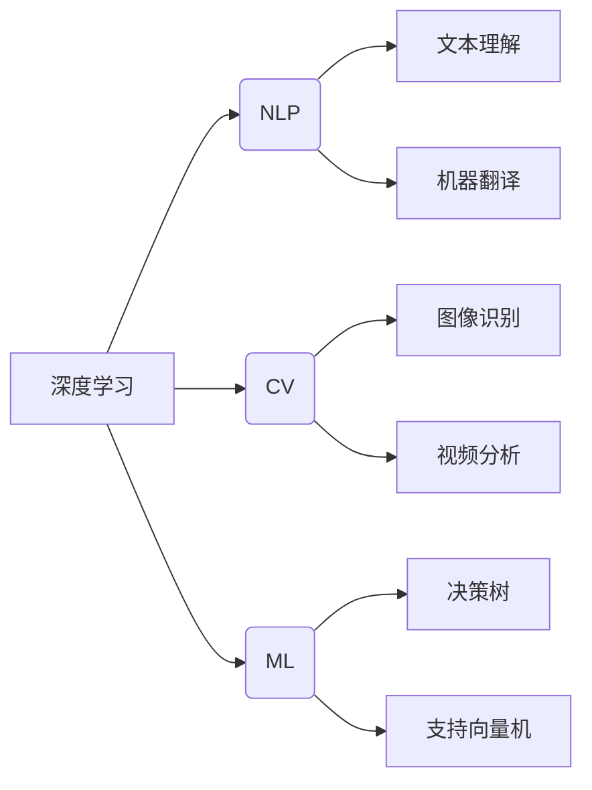

# Andrej Karpathy：人工智能的未来发展趋势

> 关键词：Andrej Karpathy，人工智能，深度学习，自然语言处理，计算机视觉，机器学习，未来趋势

## 1. 背景介绍

Andrej Karpathy，一位才华横溢的人工智能研究员，以其在深度学习领域的贡献而闻名。他在自然语言处理（NLP）和计算机视觉（CV）等领域有着深刻的见解和独到的贡献。本文将探讨Andrej Karpathy对人工智能未来发展趋势的展望，分析其提出的核心观点，并探讨这些趋势可能带来的影响。

## 2. 核心概念与联系

### 2.1 核心概念

#### 深度学习

深度学习是一种利用深层神经网络处理复杂数据的技术，它已经在图像识别、语音识别、自然语言处理等领域取得了突破性进展。

#### 自然语言处理（NLP）

自然语言处理是人工智能的一个子领域，旨在让计算机理解和处理人类语言。

#### 计算机视觉（CV）

计算机视觉涉及使用计算机和数学方法来理解和解释图像和视频中的内容。

#### 机器学习（ML）

机器学习是人工智能的一个分支，它使计算机能够通过数据学习并做出决策或预测。

### 2.2 Mermaid 流程图



## 3. 核心算法原理 & 具体操作步骤

### 3.1 算法原理概述

深度学习模型通过多层的神经网络来提取数据特征，并学习这些特征之间的关系。NLP和CV领域常用的深度学习模型包括卷积神经网络（CNN）和循环神经网络（RNN）。

### 3.2 算法步骤详解

1. **数据收集与预处理**：收集相关领域的数据，并进行清洗、标注和预处理。
2. **模型设计**：根据任务需求设计合适的深度学习模型。
3. **模型训练**：使用标注数据进行模型训练，优化模型参数。
4. **模型评估**：使用未标注数据评估模型性能。
5. **模型部署**：将训练好的模型部署到实际应用中。

### 3.3 算法优缺点

#### 优点：

- **高精度**：深度学习模型在许多任务上达到了人类专家水平。
- **泛化能力强**：深度学习模型能够泛化到新的数据集。
- **自动特征提取**：深度学习模型能够自动从数据中提取特征。

#### 缺点：

- **数据依赖性**：深度学习模型需要大量标注数据。
- **计算资源需求高**：深度学习模型训练需要大量的计算资源。
- **可解释性差**：深度学习模型的决策过程难以解释。

### 3.4 算法应用领域

深度学习在NLP和CV领域有着广泛的应用，包括：

- 文本分类、情感分析、机器翻译
- 图像识别、目标检测、图像生成
- 语音识别、语音合成、视频分析

## 4. 数学模型和公式 & 详细讲解 & 举例说明

### 4.1 数学模型构建

#### 卷积神经网络（CNN）

CNN是一种用于图像识别的深度学习模型。其核心思想是使用卷积操作提取图像特征。

$$
f(x) = W \cdot \sigma(W^T \cdot x + b)
$$

其中，$x$ 是输入图像，$W$ 是权重矩阵，$b$ 是偏置项，$\sigma$ 是激活函数。

#### 循环神经网络（RNN）

RNN是一种用于序列数据的深度学习模型。其核心思想是使用循环连接来处理序列中的时序信息。

$$
h_t = f(x_t, h_{t-1})
$$

其中，$x_t$ 是当前输入，$h_{t-1}$ 是上一个时刻的隐藏状态，$f$ 是一个非线性变换函数。

### 4.2 公式推导过程

#### CNN推导

CNN的推导过程涉及卷积操作、激活函数、池化操作等步骤。

#### RNN推导

RNN的推导过程涉及递归关系和链式法则。

### 4.3 案例分析与讲解

#### 案例一：图像识别

使用CNN对图像进行分类。

#### 案例二：机器翻译

使用RNN进行机器翻译。

## 5. 项目实践：代码实例和详细解释说明

### 5.1 开发环境搭建

安装Python、PyTorch、TensorFlow等深度学习框架。

### 5.2 源代码详细实现

以下是一个使用PyTorch实现CNN图像识别的简单示例：

```python
import torch
import torch.nn as nn
import torch.optim as optim
from torch.utils.data import DataLoader
from torchvision import datasets, transforms

# 定义CNN模型
class CNN(nn.Module):
    def __init__(self):
        super(CNN, self).__init__()
        self.conv1 = nn.Conv2d(3, 32, kernel_size=3, stride=1, padding=1)
        self.relu = nn.ReLU()
        self.max_pool = nn.MaxPool2d(kernel_size=2, stride=2)
        self.fc1 = nn.Linear(32 * 64 * 64, 128)
        self.fc2 = nn.Linear(128, 10)
    
    def forward(self, x):
        x = self.max_pool(self.relu(self.conv1(x)))
        x = x.view(-1, 32 * 64 * 64)
        x = self.relu(self.fc1(x))
        x = self.fc2(x)
        return x

# 训练模型
model = CNN()
criterion = nn.CrossEntropyLoss()
optimizer = optim.Adam(model.parameters())

train_loader = DataLoader(datasets.MNIST('./data', train=True, transform=transforms.ToTensor()), batch_size=64, shuffle=True)

for epoch in range(10):
    for data, target in train_loader:
        optimizer.zero_grad()
        output = model(data)
        loss = criterion(output, target)
        loss.backward()
        optimizer.step()
```

### 5.3 代码解读与分析

以上代码定义了一个简单的CNN模型，并使用MNIST数据集进行训练。代码中首先导入所需的库，然后定义CNN模型，接着定义损失函数和优化器，最后使用数据加载器进行模型训练。

### 5.4 运行结果展示

在训练过程中，可以通过打印损失值来观察模型训练的进展。训练完成后，可以使用测试集评估模型性能。

## 6. 实际应用场景

深度学习在各个领域都有着广泛的应用，以下是一些常见的应用场景：

- **医疗领域**：疾病诊断、药物发现、医疗影像分析
- **金融领域**：风险评估、欺诈检测、智能投顾
- **工业领域**：质量控制、生产优化、故障预测
- **交通领域**：自动驾驶、交通流量预测、交通信号控制

## 7. 工具和资源推荐

### 7.1 学习资源推荐

- 《深度学习》
- 《动手学深度学习》
- Coursera上的深度学习课程

### 7.2 开发工具推荐

- PyTorch
- TensorFlow
- Keras

### 7.3 相关论文推荐

- "AlexNet"
- "VGG"
- "ResNet"

## 8. 总结：未来发展趋势与挑战

### 8.1 研究成果总结

深度学习在过去几年取得了巨大的进展，并在许多领域取得了突破性成果。未来，深度学习将继续在人工智能领域发挥重要作用。

### 8.2 未来发展趋势

- **模型小型化**：为了提高模型的实时性和移动端部署，模型小型化将成为一个重要趋势。
- **可解释性**：随着深度学习模型在各个领域的应用，可解释性将成为一个重要研究方向。
- **迁移学习**：迁移学习将使得模型能够更好地适应不同的任务和数据集。

### 8.3 面临的挑战

- **数据标注**：深度学习模型的训练需要大量的标注数据，数据标注的成本较高。
- **模型可解释性**：深度学习模型的决策过程难以解释，这限制了其在某些领域的应用。
- **计算资源**：深度学习模型训练需要大量的计算资源，这限制了模型的普及。

### 8.4 研究展望

未来，深度学习将在以下方面取得突破：

- **更有效的模型**：设计更有效的模型结构，提高模型的性能和效率。
- **更丰富的应用**：将深度学习应用于更多领域，解决更多实际问题。
- **更智能的交互**：开发更智能的交互方式，提高人机交互的效率。

## 9. 附录：常见问题与解答

**Q1：什么是深度学习？**

A：深度学习是一种利用深层神经网络处理复杂数据的技术，它已经在图像识别、语音识别、自然语言处理等领域取得了突破性进展。

**Q2：深度学习有哪些优点？**

A：深度学习具有以下优点：
- 高精度
- 泛化能力强
- 自动特征提取

**Q3：深度学习有哪些缺点？**

A：深度学习具有以下缺点：
- 数据依赖性
- 计算资源需求高
- 可解释性差

**Q4：深度学习在哪些领域有应用？**

A：深度学习在以下领域有广泛应用：
- 医疗领域
- 金融领域
- 工业领域
- 交通领域

**Q5：如何学习深度学习？**

A：学习深度学习可以从以下资源入手：
- 《深度学习》
- 《动手学深度学习》
- Coursera上的深度学习课程

---

作者：禅与计算机程序设计艺术 / Zen and the Art of Computer Programming