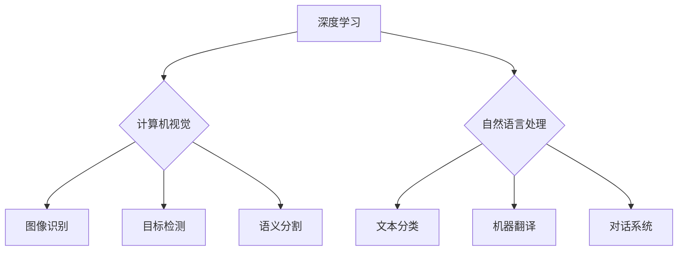

## Andrej Karpathy：人工智能的未来趋势

> 关键词：人工智能、深度学习、计算机视觉、自然语言处理、强化学习、生成模型、伦理

### 1. 背景介绍

人工智能（AI）正以惊人的速度发展，深刻地改变着我们生活和工作的方式。作为AI领域的领军人物之一，Andrej Karpathy 在过去十年中做出了许多开创性的贡献，他的研究和见解对AI的未来发展具有重要意义。本文将探讨Andrej Karpathy对AI未来趋势的看法，并分析其背后的核心概念、算法原理、数学模型以及实际应用场景。

### 2. 核心概念与联系

Andrej Karpathy 的研究主要集中在深度学习、计算机视觉和自然语言处理等领域。他强调了以下几个核心概念：

* **深度学习:** 深度学习是机器学习的一个子领域，它利用多层神经网络来学习复杂的模式和特征。深度学习算法在图像识别、语音识别、机器翻译等领域取得了突破性的进展。
* **计算机视觉:** 计算机视觉旨在使计算机能够“看”和理解图像和视频。Andrej Karpathy 在计算机视觉领域做出了重要贡献，例如开发了用于图像分类、目标检测和语义分割的深度学习模型。
* **自然语言处理:** 自然语言处理旨在使计算机能够理解和生成人类语言。Andrej Karpathy 的研究也涵盖了自然语言处理，例如开发用于文本分类、机器翻译和对话系统的深度学习模型。

**Mermaid 流程图:**



### 3. 核心算法原理 & 具体操作步骤

#### 3.1  算法原理概述

Andrej Karpathy 的研究主要基于卷积神经网络（CNN）和循环神经网络（RNN）等深度学习算法。

* **卷积神经网络 (CNN):** CNN 擅长处理图像数据，它利用卷积操作来提取图像特征，并通过多个卷积层和池化层来学习更高级的特征表示。
* **循环神经网络 (RNN):** RNN 擅长处理序列数据，例如文本和语音。它利用循环结构来记忆过去的输入信息，从而能够理解序列中的上下文关系。

#### 3.2  算法步骤详解

**CNN 算法步骤:**

1. **输入图像:** 将图像数据作为输入。
2. **卷积层:** 使用卷积核对图像进行卷积操作，提取图像特征。
3. **池化层:** 对卷积层的输出进行池化操作，降低特征图的维度，提高计算效率。
4. **全连接层:** 将池化层的输出连接到全连接层，进行分类或回归。

**RNN 算法步骤:**

1. **输入序列:** 将序列数据作为输入。
2. **循环层:** 使用循环结构来记忆过去的输入信息。
3. **输出层:** 根据当前输入和记忆信息，生成输出。

#### 3.3  算法优缺点

**CNN 优点:**

* 擅长处理图像数据。
* 可以自动学习图像特征。
* 具有较高的准确率。

**CNN 缺点:**

* 对于长序列数据处理能力有限。
* 计算量较大。

**RNN 优点:**

* 擅长处理序列数据。
* 可以理解序列中的上下文关系。

**RNN 缺点:**

* 训练难度较大。
* 容易出现梯度消失或爆炸问题。

#### 3.4  算法应用领域

* **计算机视觉:** 图像分类、目标检测、语义分割、图像生成。
* **自然语言处理:** 文本分类、机器翻译、情感分析、对话系统。
* **语音识别:** 语音转文本、语音合成。
* **推荐系统:** 商品推荐、内容推荐。

### 4. 数学模型和公式 & 详细讲解 & 举例说明

#### 4.1  数学模型构建

深度学习模型通常由多个神经网络层组成，每个层包含多个神经元。神经元之间通过权重连接，权重决定了神经元之间的传递强度。

**神经网络层:**

* **输入层:** 将原始数据输入到神经网络。
* **隐藏层:** 对输入数据进行特征提取和表示学习。
* **输出层:** 生成最终的预测结果。

**激活函数:**

激活函数用于引入非线性，使神经网络能够学习复杂的模式。常见的激活函数包括 sigmoid 函数、ReLU 函数和 tanh 函数。

#### 4.2  公式推导过程

**损失函数:**

损失函数用于衡量模型预测结果与真实值的差异。常见的损失函数包括均方误差（MSE）和交叉熵损失（Cross-Entropy Loss）。

**梯度下降:**

梯度下降是一种优化算法，用于更新神经网络的权重，使模型的损失函数最小化。

**学习率:**

学习率控制着权重更新的步长。

#### 4.3  案例分析与讲解

**图像分类:**

假设我们有一个图像分类任务，目标是将图像分类为不同的类别，例如猫、狗和鸟。我们可以使用 CNN 模型来解决这个问题。

CNN 模型会首先提取图像的特征，然后将这些特征输入到全连接层进行分类。损失函数可以是交叉熵损失，梯度下降算法可以用来更新模型的权重。

### 5. 项目实践：代码实例和详细解释说明

#### 5.1  开发环境搭建

* Python 3.x
* TensorFlow 或 PyTorch 深度学习框架
* CUDA 和 cuDNN (可选，用于 GPU 加速)

#### 5.2  源代码详细实现

```python
# 使用 TensorFlow 实现一个简单的 CNN 模型

import tensorflow as tf

# 定义模型结构
model = tf.keras.models.Sequential([
    tf.keras.layers.Conv2D(32, (3, 3), activation='relu', input_shape=(28, 28, 1)),
    tf.keras.layers.MaxPooling2D((2, 2)),
    tf.keras.layers.Conv2D(64, (3, 3), activation='relu'),
    tf.keras.layers.MaxPooling2D((2, 2)),
    tf.keras.layers.Flatten(),
    tf.keras.layers.Dense(10, activation='softmax')
])

# 编译模型
model.compile(optimizer='adam',
              loss='sparse_categorical_crossentropy',
              metrics=['accuracy'])

# 训练模型
model.fit(x_train, y_train, epochs=5)

# 评估模型
loss, accuracy = model.evaluate(x_test, y_test)
print('Test loss:', loss)
print('Test accuracy:', accuracy)
```

#### 5.3  代码解读与分析

* **模型结构:** 模型由两个卷积层、两个池化层、一个 Flatten 层和一个全连接层组成。
* **激活函数:** 使用 ReLU 函数作为激活函数，可以提高模型的训练效率。
* **损失函数:** 使用交叉熵损失函数，适合多分类任务。
* **优化器:** 使用 Adam 优化器，可以快速收敛。

#### 5.4  运行结果展示

训练完成后，可以评估模型的性能，例如在测试集上的准确率。

### 6. 实际应用场景

* **图像识别:** 自动识别物体、场景和人物。
* **医疗诊断:** 辅助医生诊断疾病，例如癌症检测。
* **自动驾驶:** 帮助车辆识别道路、交通信号和行人。
* **语音助手:** 理解用户的语音指令，并执行相应的操作。

### 6.4  未来应用展望

* **更智能的机器人:** AI 可以赋予机器人更强的感知能力和决策能力。
* **个性化教育:** AI 可以根据学生的学习进度和风格提供个性化的学习方案。
* **更精准的医疗:** AI 可以帮助医生制定更精准的治疗方案，提高患者的生存率。

### 7. 工具和资源推荐

#### 7.1  学习资源推荐

* **课程:**
    * 深度学习 Specialization (Coursera)
    * fast.ai
* **书籍:**
    * Deep Learning (Ian Goodfellow, Yoshua Bengio, Aaron Courville)
    * Hands-On Machine Learning with Scikit-Learn, Keras & TensorFlow (Aurélien Géron)
* **博客:**
    * Andrej Karpathy's Blog
    * Distill.pub

#### 7.2  开发工具推荐

* **TensorFlow:** 开源深度学习框架，支持 CPU 和 GPU 加速。
* **PyTorch:** 开源深度学习框架，以其灵活性和易用性而闻名。
* **Keras:** 高级深度学习 API，可以运行在 TensorFlow、Theano 或 CNTK 后端。

#### 7.3  相关论文推荐

* **ImageNet Classification with Deep Convolutional Neural Networks (AlexNet)**
* **Deep Residual Learning for Image Recognition (ResNet)**
* **Attention Is All You Need (Transformer)**

### 8. 总结：未来发展趋势与挑战

#### 8.1  研究成果总结

Andrej Karpathy 的研究成果对深度学习和人工智能的发展做出了重要贡献。他的工作推动了计算机视觉和自然语言处理领域的进步，并为未来的 AI 应用奠定了基础。

#### 8.2  未来发展趋势

* **更强大的模型:** 研究人员将继续开发更强大的深度学习模型，例如 Transformer 和 GPT-3 等，以提高 AI 的性能和能力。
* **更广泛的应用:** AI 将应用于更多领域，例如医疗、教育、金融和交通等。
* **更安全的 AI:** 研究人员将致力于开发更安全、更可靠的 AI 系统，以防止 AI 被恶意利用。

#### 8.3  面临的挑战

* **数据隐私:** AI 模型的训练需要大量数据，如何保护数据隐私是一个重要的挑战。
* **算法解释性:** 深度学习模型的决策过程往往难以解释，如何提高 AI 的透明度和可解释性是一个重要的研究方向。
* **伦理问题:** AI 的发展引发了许多伦理问题，例如 AI 偏见、AI 责任和 AI 控制等，需要社会各界共同探讨和解决。

#### 8.4  研究展望

未来，AI 研究将继续朝着更智能、更安全、更可解释的方向发展。Andrej Karpathy 的研究成果将继续为 AI 的发展提供重要的启示。

### 9. 附录：常见问题与解答

* **什么是深度学习？**

深度学习是一种机器学习的子领域，它利用多层神经网络来学习复杂的模式和特征。

* **什么是卷积神经网络 (CNN)？**

CNN 是一种专门用于处理图像数据的深度学习模型，它利用卷积操作来提取图像特征。

* **什么是循环神经网络 (RNN)？**

RNN 是一种专门用于处理序列数据的深度学习模型，它利用循环结构来记忆过去的输入信息。


作者：禅与计算机程序设计艺术 / Zen and the Art of Computer Programming 
