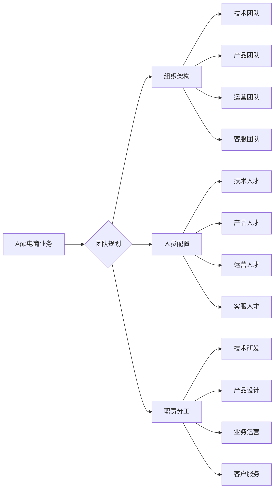

# App电商业务团队规划和人员规划与人员培养计划

> 关键词：App电商，团队规划，人员规划，人员培养，业务增长，组织架构，技能提升

## 1. 背景介绍

随着移动互联网的普及和用户习惯的改变，App电商成为了电商行业的重要组成部分。一个高效的App电商团队不仅需要具备优秀的业务能力，还需要具备强大的技术实力和良好的团队协作精神。本文将深入探讨App电商业务团队规划和人员规划，并制定一套完整的人员培养计划，以助力电商业务的持续增长。

### 1.1 问题的由来

App电商业务的发展面临着诸多挑战，如市场竞争激烈、用户需求多变、技术更新迭代快等。为了应对这些挑战，构建一支高素质、高效率的团队至关重要。

### 1.2 研究现状

目前，国内外众多电商企业已经形成了较为完善的App电商团队架构和人员培养体系。这些成功的案例为我们的研究提供了宝贵的参考。

### 1.3 研究意义

通过对App电商业务团队规划和人员规划的深入研究，我们可以：

- 提升团队整体素质，增强团队凝聚力。
- 提高业务运营效率，实现业绩增长。
- 为电商企业的可持续发展提供人才保障。

### 1.4 本文结构

本文将从以下几个方面展开论述：

- 核心概念与联系
- 团队规划与人员规划
- 人员培养计划
- 项目实践与案例分析
- 工具和资源推荐
- 未来发展趋势与挑战

## 2. 核心概念与联系

### 2.1 核心概念

#### App电商

App电商是指通过移动应用（App）为用户提供商品展示、购买、支付、售后服务等一系列电商服务。

#### 团队规划

团队规划是指根据企业发展战略和业务需求，对团队的组织架构、人员配置、职责分工等进行合理规划。

#### 人员规划

人员规划是指根据团队规划，对团队成员进行招聘、培养、考核、激励等管理。

#### 人员培养

人员培养是指通过各种培训、实践、交流等方式，提升团队成员的专业技能和综合素质。

### 2.2 架构图

以下为App电商业务团队核心概念架构图：



## 3. 团队规划与人员规划

### 3.1 团队规划

#### 组织架构

App电商业务团队的组织架构应根据企业规模、业务模式和发展战略进行调整。以下是一个典型的App电商业务组织架构：

- 技术团队：负责App的研发、维护、优化等工作。
- 产品团队：负责App的产品设计、功能迭代、用户体验等工作。
- 运营团队：负责App的市场推广、用户运营、数据分析等工作。
- 客服团队：负责App的用户咨询、投诉处理、售后服务等工作。

#### 人员配置

根据组织架构，App电商业务团队的人员配置如下：

- 技术团队：后端开发、前端开发、UI/UX设计师、测试工程师等。
- 产品团队：产品经理、UI设计师、交互设计师、运营设计师等。
- 运营团队：市场运营、用户运营、数据分析、内容运营等。
- 客服团队：客服专员、售后服务人员等。

#### 职责分工

各团队和岗位的职责分工如下：

- 技术团队：负责App的技术研发、功能实现、性能优化等工作。
- 产品团队：负责App的产品规划、需求分析、原型设计、交互设计等工作。
- 运营团队：负责App的市场推广、用户运营、活动策划、数据分析等工作。
- 客服团队：负责App的用户咨询、投诉处理、售后服务等工作。

### 3.2 人员规划

#### 招聘

招聘是人员规划的第一步，应根据团队规划制定招聘计划。招聘渠道包括：

- 校园招聘：招聘应届毕业生，为公司注入新鲜血液。
- 社会招聘：招聘有经验的人才，提升团队整体水平。
- 内部晋升：选拔内部优秀人才，激发员工积极性。

#### 培养与激励

人员培养是持续提升团队整体素质的关键。以下为人员培养方案：

- 基础培训：为新员工提供公司文化、业务知识、技能培训等。
- 进阶培训：针对不同岗位需求，提供专业技能、管理技能等培训。
- 轮岗机制：鼓励员工跨部门轮岗，拓宽视野，提升综合素质。
- 激励机制：设立绩效考核、晋升机制等，激发员工工作积极性。

#### 考核与淘汰

定期对团队成员进行绩效考核，根据考核结果进行奖惩和淘汰。考核指标包括：

- 工作态度：责任心、团队合作、学习意愿等。
- 工作能力：专业技能、问题解决能力、创新意识等。
- 工作成果：完成工作量、项目质量、个人成长等。

## 4. 人员培养计划

### 4.1 培训体系

建立健全的培训体系，包括：

- 新员工培训：帮助新员工快速融入团队，了解公司文化和业务。
- 专业技能培训：提升员工的专业技能，满足岗位需求。
- 管理技能培训：提升管理人员的领导力、团队协作能力等。
- 跨部门交流：促进跨部门沟通与合作，拓宽员工视野。

### 4.2 培训内容

培训内容应涵盖以下几个方面：

- 公司文化、业务知识
- 产品设计、开发、测试
- 市场推广、用户运营、数据分析
- 客户服务、投诉处理、售后服务
- 管理技能、团队建设、沟通技巧

### 4.3 培训方式

培训方式包括：

- 内部培训：邀请内部优秀员工分享经验，或组织内部培训课程。
- 外部培训：参加行业会议、培训课程等，学习行业最新动态。
- 在岗实践：通过实际项目实践，提升员工解决问题的能力。
- 在线学习：利用网络资源，进行自主学习。

## 5. 项目实践：代码实例和详细解释说明

### 5.1 开发环境搭建

以App电商业务中的订单管理系统为例，以下是开发环境搭建步骤：

1. 选择合适的开发框架，如Spring Boot、Django等。
2. 安装开发工具，如IDE、数据库、版本控制工具等。
3. 配置开发环境，如数据库连接、框架配置等。

### 5.2 源代码详细实现

以下为订单管理系统部分代码实现：

```java
@RestController
@RequestMapping("/orders")
public class OrderController {

    @Autowired
    private OrderService orderService;

    @GetMapping("/list")
    public ResponseEntity<List<Order>> list() {
        return ResponseEntity.ok(orderService.findAll());
    }

    @PostMapping("/create")
    public ResponseEntity<Order> create(@RequestBody Order order) {
        return ResponseEntity.ok(orderService.createOrder(order));
    }

    @GetMapping("/detail/{id}")
    public ResponseEntity<Order> detail(@PathVariable("id") Long id) {
        return ResponseEntity.ok(orderService.findById(id));
    }

    @PutMapping("/update/{id}")
    public ResponseEntity<Order> update(@PathVariable("id") Long id, @RequestBody Order order) {
        return ResponseEntity.ok(orderService.updateOrder(id, order));
    }

    @DeleteMapping("/delete/{id}")
    public ResponseEntity<Void> delete(@PathVariable("id") Long id) {
        orderService.deleteOrder(id);
        return ResponseEntity.noContent().build();
    }
}
```

### 5.3 代码解读与分析

以上代码为App电商订单管理系统的Controller层实现。主要功能包括：

- 获取订单列表
- 创建新订单
- 查询订单详情
- 更新订单信息
- 删除订单

代码中使用了Spring Boot框架的注解和RestTemplate进行RESTful API开发，实现了订单管理的基本功能。

### 5.4 运行结果展示

在开发环境中运行以上代码，可以成功访问订单管理API，实现订单的增删改查功能。

## 6. 实际应用场景

### 6.1 市场推广

App电商团队可以通过以下方式进行市场推广：

- 社交媒体营销：利用微博、微信、抖音等平台进行推广。
- 搜索引擎优化：优化网站和App在搜索引擎中的排名。
- 线上线下活动：举办线上活动、线下活动，吸引潜在用户。
- 合作推广：与相关企业、网红等进行合作推广。

### 6.2 用户运营

App电商团队可以通过以下方式进行用户运营：

- 用户画像：分析用户行为数据，构建用户画像。
- 用户分层：根据用户画像，将用户分层，进行差异化运营。
- 用户活跃度提升：通过活动、优惠券等方式，提升用户活跃度。
- 用户流失预防：分析用户流失原因，制定针对性策略。

### 6.3 数据分析

App电商团队可以通过以下方式进行数据分析：

- 用户行为分析：分析用户行为数据，了解用户需求。
- 业务数据分析：分析业务数据，评估业务效果。
- 营销数据分析：分析营销数据，优化营销策略。
- 客服数据分析：分析客服数据，提升服务质量。

### 6.4 未来应用展望

随着人工智能、大数据等技术的不断发展，App电商业务将呈现出以下趋势：

- 智能化：利用人工智能技术，实现个性化推荐、智能客服等。
- 数据驱动：通过数据分析，实现精准营销、精细化运营。
- 社交化：利用社交网络，促进用户互动、口碑传播。
- 物联网：将App电商与物联网结合，拓展应用场景。

## 7. 工具和资源推荐

### 7.1 学习资源推荐

- 《App电商运营与管理》：介绍App电商的运营策略和管理方法。
- 《数据分析实战》：讲解数据分析的基本原理和实战技巧。
- 《Python数据分析》：Python数据分析入门与实践。

### 7.2 开发工具推荐

- Spring Boot：Java开发的快速开发框架。
- Django：Python开发的快速开发框架。
- MySQL：开源的关系型数据库。

### 7.3 相关论文推荐

- 《App电商用户行为分析与个性化推荐》：介绍App电商用户行为分析和个性化推荐技术。
- 《基于大数据的App电商运营策略研究》：研究基于大数据的App电商运营策略。

## 8. 总结：未来发展趋势与挑战

### 8.1 研究成果总结

本文对App电商业务团队规划和人员规划进行了深入研究，从团队规划、人员规划、人员培养等方面提出了具体的实施方案。通过项目实践，展示了团队规划和人员培养在实际应用中的价值。

### 8.2 未来发展趋势

随着移动互联网和技术的不断发展，App电商业务将呈现出以下发展趋势：

- 智能化：利用人工智能技术，实现个性化推荐、智能客服等。
- 数据驱动：通过数据分析，实现精准营销、精细化运营。
- 社交化：利用社交网络，促进用户互动、口碑传播。
- 物联网：将App电商与物联网结合，拓展应用场景。

### 8.3 面临的挑战

App电商业务在发展过程中也面临着以下挑战：

- 市场竞争激烈：电商行业竞争激烈，App电商需要不断创新，才能在市场中立足。
- 用户需求多变：用户需求多变，App电商需要快速响应市场变化。
- 技术更新迭代快：技术更新迭代快，App电商需要不断学习新技术，保持技术领先。

### 8.4 研究展望

未来，App电商业务团队规划和人员规划将朝着以下方向发展：

- 个性化：根据团队成员的特点和优势，制定个性化的培养方案。
- 持续化：将人员培养融入到团队运营的各个环节，实现持续化的人才培养。
- 数据化：利用数据分析，优化人员培养方案，提高人才培养效果。

## 9. 附录：常见问题与解答

**Q1：App电商团队的组织架构应该怎么设置？**

A：App电商团队的组织架构应根据企业规模、业务模式和发展战略进行调整。一般建议设置技术团队、产品团队、运营团队和客服团队。

**Q2：如何制定人员培养计划？**

A：制定人员培养计划需要考虑以下几个方面：

- 培训体系：建立健全的培训体系，包括新员工培训、专业技能培训、管理技能培训等。
- 培训内容：根据岗位需求，制定相应的培训内容。
- 培训方式：采用多样化的培训方式，如内部培训、外部培训、在岗实践、在线学习等。

**Q3：如何评估人员培养效果？**

A：评估人员培养效果可以从以下几个方面进行：

- 培训满意度：调查培训效果满意度，了解培训效果。
- 工作绩效：分析培训后员工的工作绩效，评估培训效果。
- 成长轨迹：观察培训后员工的成长轨迹，评估培训效果。

**Q4：如何激励员工参与培训？**

A：激励员工参与培训可以通过以下方式：

- 建立激励机制：设立培训奖励，激发员工参与培训的积极性。
- 营造学习氛围：鼓励员工主动学习，营造良好的学习氛围。
- 职业发展规划：为员工提供职业发展规划，让员工看到参与培训的价值。

**Q5：如何应对App电商业务面临的挑战？**

A：应对App电商业务面临的挑战，可以从以下几个方面入手：

- 持续创新：不断进行技术创新、模式创新，保持竞争优势。
- 优化用户体验：关注用户需求，提供优质的用户体验。
- 加强团队建设：提升团队整体素质，增强团队凝聚力。
- 深耕细分市场：专注于细分市场，打造专业优势。

作者：禅与计算机程序设计艺术 / Zen and the Art of Computer Programming