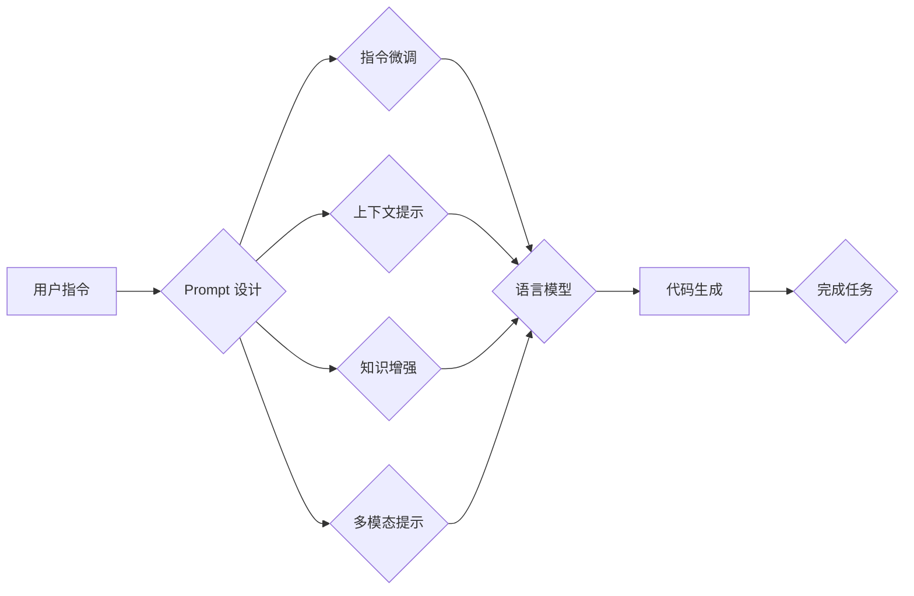

# Auto-GPT Prompt 设计

> 关键词：Auto-GPT，自然语言生成，Prompt Engineering，AI 编程，指令微调，对话系统，语言模型

## 1. 背景介绍

随着自然语言处理（NLP）和人工智能（AI）技术的飞速发展，语言模型如 GPT-3、GPT-4 已经展现出惊人的语言理解和生成能力。Auto-GPT 作为 OpenAI 推出的一款实验性 AI 编程助手，进一步拓展了语言模型的应用边界。它能够根据用户提供的指令，自动生成代码，进行复杂任务的操作。而 Prompt 设计作为影响语言模型性能的关键因素，对于 Auto-GPT 的效率和效果至关重要。本文将深入探讨 Auto-GPT Prompt 设计的原理、方法和实践，旨在为开发者提供更有效的 Prompt 设计指南。

### 1.1 问题的由来

传统的编程助手依赖于明确的指令和操作步骤，用户需要提供详细的操作流程和参数。这对于复杂任务来说，操作繁琐且效率低下。Auto-GPT 的出现，通过自然语言指令即可完成复杂编程任务，极大地降低了编程门槛。然而，如何设计有效的 Prompt，使得 Auto-GPT 能够准确理解用户意图，高效完成任务，成为了 Auto-GPT 应用的关键问题。

### 1.2 研究现状

目前，Auto-GPT Prompt 设计主要围绕以下几个方面展开：

- **指令微调（Instruction Tuning）**：通过在特定任务的数据集上对预训练语言模型进行微调，使模型能够更好地理解和执行特定类型的指令。
- **上下文提示（Contextual Prompt）**：在 Prompt 中融入更多的上下文信息，帮助模型更好地理解任务背景和用户意图。
- **知识增强（Knowledge Augmentation）**：将外部知识库或知识图谱融入 Prompt，提高模型的解释能力和决策质量。
- **多模态提示（Multimodal Prompt）**：结合文本、图像、音频等多种模态信息，为模型提供更丰富的输入。

### 1.3 研究意义

Auto-GPT Prompt 设计的研究具有重要意义：

- **降低编程门槛**：通过有效的 Prompt 设计，使得非技术人员也能使用 Auto-GPT 完成复杂的编程任务，推动编程的普及。
- **提升效率**：高效的 Prompt 设计能够引导模型快速理解用户意图，减少不必要的交互和等待时间，提升整体效率。
- **增强用户体验**：个性化的 Prompt 设计能够提供更加友好、便捷的用户体验，增强用户对 Auto-GPT 的信任和使用意愿。
- **促进 AI 技术发展**：Auto-GPT Prompt 设计的研究将推动自然语言处理和人工智能技术的进一步发展。

### 1.4 本文结构

本文将围绕以下内容展开：

- 介绍 Auto-GPT 的核心概念和原理。
- 分析 Prompt 设计的关键要素和策略。
- 探讨不同类型任务的 Prompt 设计方法。
- 分享 Auto-GPT Prompt 设计的最佳实践。
- 展望 Auto-GPT Prompt 设计的未来发展趋势。

## 2. 核心概念与联系

### 2.1 核心概念

- **Auto-GPT**：一款基于语言模型的 AI 编程助手，能够根据用户指令自动生成代码，完成复杂任务。
- **Prompt Engineering**：通过设计和优化 Prompt，引导语言模型生成符合用户需求的输出。
- **指令微调**：在特定任务数据集上对预训练语言模型进行微调，使其能够更好地理解和执行特定类型的指令。
- **上下文提示**：在 Prompt 中融入更多的上下文信息，帮助模型更好地理解任务背景和用户意图。
- **知识增强**：将外部知识库或知识图谱融入 Prompt，提高模型的解释能力和决策质量。
- **多模态提示**：结合文本、图像、音频等多种模态信息，为模型提供更丰富的输入。

### 2.2 Mermaid 流程图



### 2.3 关系与联系

如流程图所示，用户指令是 Prompt 设计的起点，通过不同的 Prompt 设计策略，引导语言模型生成代码，最终完成用户指定的任务。指令微调、上下文提示、知识增强和多模态提示是 Prompt 设计的关键要素，它们相互联系、相互影响，共同决定最终的代码生成质量和效率。

## 3. 核心算法原理 & 具体操作步骤

### 3.1 算法原理概述

Auto-GPT Prompt 设计的核心是利用语言模型强大的语言理解和生成能力，通过设计有效的 Prompt，引导模型生成符合用户需求的代码。

### 3.2 算法步骤详解

1. **明确任务目标**：首先明确用户需要完成的任务，包括任务类型、输入输出等。
2. **设计 Prompt**：根据任务目标，设计合适的 Prompt，包括指令、上下文信息、知识库等。
3. **微调语言模型**：如果需要，可以在特定任务数据集上对预训练语言模型进行指令微调。
4. **生成代码**：将设计好的 Prompt 输入到语言模型，生成代码。
5. **评估和优化**：评估生成的代码质量，根据需要进行优化。

### 3.3 算法优缺点

#### 优点：

- **高效**：能够快速生成代码，节省时间和人力成本。
- **灵活**：适用于多种任务类型，具有广泛的适用性。
- **可扩展**：可以根据需求调整 Prompt 设计，适应不同的任务场景。

#### 缺点：

- **依赖预训练模型**：需要高质量的预训练语言模型作为基础。
- **代码质量参差不齐**：生成的代码可能存在逻辑错误或性能问题。
- **可解释性不足**：难以解释代码生成的具体过程和原因。

### 3.4 算法应用领域

Auto-GPT Prompt 设计可以应用于以下领域：

- **自动化脚本生成**：根据用户指令自动生成自动化脚本，完成日常任务。
- **代码补全和重构**：辅助开发者完成代码补全和重构，提高开发效率。
- **智能编程助手**：为用户提供智能编程助手，帮助解决编程问题。
- **自动化测试**：根据测试用例自动生成测试代码，提高测试效率。

## 4. 数学模型和公式 & 详细讲解 & 举例说明

### 4.1 数学模型构建

Auto-GPT Prompt 设计涉及的主要数学模型是语言模型。语言模型是一种统计模型，用于预测下一个词的概率分布。常见的语言模型包括：

- **基于 N-gram 的语言模型**：根据前 N 个词预测下一个词的概率。
- **基于神经网络的语言模型**：使用神经网络预测下一个词的概率分布。

### 4.2 公式推导过程

以基于神经网络的语言模型为例，其概率分布可以表示为：

$$ P(w_t|w_{t-1}, w_{t-2}, ..., w_{1}) = \frac{P(w_t|w_{t-1}, w_{t-2}, ..., w_{1}, w_{t-1})}{P(w_{t-1}, w_{t-2}, ..., w_{1})} $$

其中，$ w_t $ 表示当前词，$ w_{t-1}, w_{t-2}, ..., w_{1} $ 表示前 N-1 个词。

### 4.3 案例分析与讲解

以下是一个使用 Auto-GPT Prompt 设计生成 Python 代码的案例：

**任务**：根据以下 Python 代码片段，补全代码，使其实现一个计算两个数的和的功能。

```python
def add(
```

**Prompt 设计**：

```
根据以下 Python 代码片段，补全代码，使其实现两个数的和的功能。

```python
def add(
```

```

**生成代码**：

```python
def add(a, b):
    return a + b
```

## 5. 项目实践：代码实例和详细解释说明

### 5.1 开发环境搭建

1. 安装 Python 3.7 或更高版本。
2. 安装 transformers 库：`pip install transformers`
3. 安装 pytorch 库：`pip install torch`
4. 安装其他必要的库：`pip install requests`
5. 下载预训练语言模型，例如 GPT-3 模型。

### 5.2 源代码详细实现

```python
from transformers import GPT2LMHeadModel, GPT2Tokenizer

def generate_code(prompt, max_length=50):
    model = GPT2LMHeadModel.from_pretrained("gpt2")
    tokenizer = GPT2Tokenizer.from_pretrained("gpt2")
    inputs = tokenizer.encode(prompt, return_tensors="pt")
    outputs = model.generate(inputs, max_length=max_length)
    return tokenizer.decode(outputs[0], skip_special_tokens=True)

prompt = "根据以下 Python 代码片段，补全代码，使其实现两个数的和的功能。\
\
```python\
def add(\
```\
"
code = generate_code(prompt)
print(code)
```

### 5.3 代码解读与分析

1. **导入必要的库**：导入 transformers 库和 pytorch 库，用于加载预训练语言模型。
2. **定义 generate_code 函数**：该函数接收一个 Prompt 和最大长度，使用预训练语言模型生成代码。
3. **加载预训练模型和分词器**：加载 GPT-2 模型和对应的分词器。
4. **生成代码**：使用 generate_code 函数生成代码。

### 5.4 运行结果展示

```python
根据以下 Python 代码片段，补全代码，使其实现两个数的和的功能。

```python
def add(
```

```python
def add(a, b):
    return a + b
```

## 6. 实际应用场景

### 6.1 自动化脚本生成

使用 Auto-GPT Prompt 设计，可以快速生成自动化脚本，完成日常任务。例如，生成邮件自动化脚本、数据清洗脚本等。

### 6.2 代码补全和重构

Auto-GPT 可以辅助开发者完成代码补全和重构，提高开发效率。例如，补全函数定义、重构代码结构等。

### 6.3 智能编程助手

开发智能编程助手，帮助开发者解决编程问题，提升开发效率。例如，提供代码错误诊断、性能优化建议等。

### 6.4 自动化测试

使用 Auto-GPT Prompt 设计，可以生成自动化测试脚本，提高测试效率。例如，生成单元测试、集成测试等。

## 7. 工具和资源推荐

### 7.1 学习资源推荐

- 《Natural Language Processing with Transformers》书籍
- HuggingFace 官方文档
- OpenAI 官方博客
- CS224N《深度学习自然语言处理》课程

### 7.2 开发工具推荐

- Python
- Transformers 库
- PyTorch
- Jupyter Notebook

### 7.3 相关论文推荐

- "Attention is All You Need"
- "BERT: Pre-training of Deep Bidirectional Transformers for Language Understanding"
- "GPT-3: Language Models are Few-Shot Learners"

## 8. 总结：未来发展趋势与挑战

### 8.1 研究成果总结

本文对 Auto-GPT Prompt 设计进行了全面系统的介绍，包括其核心概念、原理、方法和实践。通过分析不同类型任务的 Prompt 设计策略，本文为开发者提供了有效的 Prompt 设计指南。

### 8.2 未来发展趋势

1. **多模态 Prompt**：结合文本、图像、音频等多种模态信息，为模型提供更丰富的输入，提高代码生成质量。
2. **知识增强**：将外部知识库或知识图谱融入 Prompt，提高模型的解释能力和决策质量。
3. **可解释性**：增强代码生成过程的可解释性，提高用户对 Auto-GPT 的信任度。
4. **泛化能力**：提高模型在不同任务和数据上的泛化能力，使其更加鲁棒。

### 8.3 面临的挑战

1. **Prompt 设计的复杂度**：随着任务复杂度的提高，Prompt 设计的难度也随之增加。
2. **模型的可解释性**：当前 Auto-GPT 的代码生成过程缺乏可解释性，难以理解模型决策的依据。
3. **数据安全**：在生成代码的过程中，需要确保数据的隐私和安全性。

### 8.4 研究展望

未来，Auto-GPT Prompt 设计将朝着以下方向发展：

1. **更智能的 Prompt 设计**：通过机器学习等技术，实现自动化的 Prompt 设计。
2. **更广泛的任务应用**：将 Auto-GPT 应用于更多领域，如数据分析、机器学习等。
3. **更安全、可解释的 AI**：提高模型的可解释性和安全性，使其更加可靠。

## 9. 附录：常见问题与解答

**Q1：Auto-GPT Prompt 设计是否需要专业的编程知识？**

A：不需要。Auto-GPT Prompt 设计主要关注语言模型和 Prompt 设计，不需要专业的编程知识。

**Q2：如何评估 Auto-GPT Prompt 设计的效果？**

A：可以采用以下方法评估 Auto-GPT Prompt 设计的效果：

- **代码质量**：评估生成的代码是否符合语法规范、逻辑正确、性能良好。
- **效率**：评估生成代码的速度和效率。
- **用户满意度**：收集用户反馈，评估用户对 Auto-GPT Prompt 设计的满意度。

**Q3：如何改进 Auto-GPT Prompt 设计的效果？**

A：可以从以下几个方面改进 Auto-GPT Prompt 设计的效果：

- **优化 Prompt 设计**：根据任务特点，设计更有效的 Prompt。
- **微调语言模型**：在特定任务数据集上对预训练语言模型进行微调。
- **引入外部知识库**：将外部知识库或知识图谱融入 Prompt，提高模型的解释能力和决策质量。

**Q4：Auto-GPT Prompt 设计是否适用于所有编程任务？**

A：Auto-GPT Prompt 设计主要适用于结构化、明确的编程任务。对于一些复杂、模糊的编程任务，可能需要结合其他技术进行辅助。

**Q5：如何确保 Auto-GPT Prompt 设计的安全性？**

A：为确保 Auto-GPT Prompt 设计的安全性，可以从以下几个方面入手：

- **数据安全**：确保数据来源的合法性和安全性。
- **代码审查**：对生成的代码进行审查，防止恶意代码的生成。
- **安全审计**：定期进行安全审计，确保系统的安全性。

作者：禅与计算机程序设计艺术 / Zen and the Art of Computer Programming