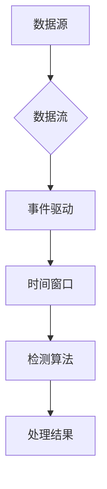

# Flink Stream原理与代码实例讲解

> 关键词：Apache Flink, 流处理, 时间窗口, 检测算法, 事件驱动, 实时分析

## 1. 背景介绍

随着互联网技术的飞速发展，数据量呈爆炸式增长，对数据处理提出了更高的要求。传统的批处理系统在处理实时数据时存在延迟大、响应慢等问题，而流处理技术因其低延迟、高吞吐量等特点，逐渐成为处理实时数据的重要手段。Apache Flink作为流处理领域的佼佼者，凭借其高效、可靠、灵活的特性，在金融、电商、物联网等众多领域得到了广泛应用。本文将深入解析Flink Stream的原理，并通过代码实例进行详细讲解。

## 2. 核心概念与联系

### 2.1 核心概念

#### 2.1.1 流处理

流处理是指对实时数据流进行连续、高效处理的技术。与批处理相比，流处理具有以下特点：

- **数据类型**：实时数据，如网络流量、传感器数据等。
- **处理方式**：实时处理，即数据到达后立即进行处理。
- **数据源**：日志、传感器、网络请求等。

#### 2.1.2 事件驱动

事件驱动是指以事件为中心的编程范式。在事件驱动模型中，程序根据事件的触发进行相应的处理。Flink Stream采用事件驱动架构，能够高效地处理实时数据。

#### 2.1.3 时间窗口

时间窗口是指将数据流按照时间进行划分的规则。Flink Stream支持多种时间窗口，如滑动窗口、固定窗口、会话窗口等。

#### 2.1.4 检测算法

检测算法用于在数据流中识别特定模式的算法。Flink Stream提供了丰富的检测算法，如连续模式检测、异常检测等。

### 2.2 架构流程图



## 3. 核心算法原理 & 具体操作步骤

### 3.1 算法原理概述

Flink Stream的核心算法包括事件驱动、时间窗口、检测算法等。以下将分别进行介绍。

#### 3.1.1 事件驱动

Flink Stream采用事件驱动架构，程序根据事件的触发顺序执行。事件可以是数据到达事件、时间窗口触发事件等。

#### 3.1.2 时间窗口

Flink Stream支持多种时间窗口，如下所示：

- **滑动窗口**：将数据流按照固定时间间隔进行划分。
- **固定窗口**：将数据流按照固定时间长度进行划分。
- **会话窗口**：将数据流中的数据按照会话间隔进行划分。

#### 3.1.3 检测算法

Flink Stream提供了丰富的检测算法，如下所示：

- **连续模式检测**：检测数据流中的连续事件模式。
- **异常检测**：检测数据流中的异常行为。

### 3.2 算法步骤详解

以下以一个简单的连续模式检测算法为例，详细讲解Flink Stream的处理流程。

1. 定义数据源：使用`StreamExecutionEnvironment`创建Flink环境，并指定数据源。
2. 设置时间窗口：使用`timeWindow`方法设置时间窗口。
3. 定义检测算法：使用`process`方法定义检测算法。
4. 执行任务：使用`execute`方法执行任务。

### 3.3 算法优缺点

#### 3.3.1 优点

- **高效**：Flink Stream采用事件驱动架构，能够高效地处理实时数据。
- **灵活**：Flink Stream支持多种时间窗口和检测算法，满足不同场景的需求。
- **可靠**：Flink Stream提供端到端的容错机制，保证数据处理的可靠性。

#### 3.3.2 缺点

- **复杂**：Flink Stream的开发和使用相对复杂，需要一定的学习成本。
- **资源消耗**：Flink Stream需要一定的计算资源，如CPU、内存等。

### 3.4 算法应用领域

Flink Stream在以下领域具有广泛的应用：

- **日志分析**：实时分析日志数据，识别异常行为、性能瓶颈等。
- **实时监控**：实时监控网络流量、服务器性能等，及时发现异常情况。
- **推荐系统**：实时分析用户行为，推荐个性化内容。
- **智能交通**：实时分析交通流量，优化交通路线。

## 4. 数学模型和公式 & 详细讲解 & 举例说明

### 4.1 数学模型构建

Flink Stream的数学模型主要基于事件驱动、时间窗口和检测算法。以下以连续模式检测算法为例，介绍其数学模型。

#### 4.1.1 连续模式检测

假设数据流为 $\{x_1, x_2, \ldots, x_n\}$，连续模式检测的目标是识别出满足特定条件的子序列 $\{x_{i_1}, x_{i_2}, \ldots, x_{i_k}\}$，其中 $i_1 < i_2 < \ldots < i_k$。

### 4.2 公式推导过程

#### 4.2.1 窗口划分

首先，将数据流按照时间窗口进行划分。假设时间窗口长度为 $T$，则数据流可划分为 $N = \lfloor \frac{n}{T} \rfloor$ 个窗口。

#### 4.2.2 模式检测

对于每个窗口 $W_t$，检测其中是否存在连续模式 $\{x_{i_1}, x_{i_2}, \ldots, x_{i_k}\}$。具体方法如下：

1. 遍历窗口 $W_t$ 中的所有连续子序列。
2. 对于每个子序列，计算其满足条件的概率。
3. 若存在某个子序列的概率大于阈值 $\alpha$，则认为窗口 $W_t$ 中存在连续模式。

### 4.3 案例分析与讲解

以下以Flink Stream的连续模式检测算法为例，介绍其实践应用。

#### 4.3.1 案例背景

假设我们想实时监测网络流量，识别出异常流量模式。

#### 4.3.2 数据源

我们使用网络流量作为数据源，包括IP地址、端口号、流量大小等信息。

#### 4.3.3 时间窗口

我们设置时间窗口长度为5分钟，即每5分钟对网络流量进行一次检测。

#### 4.3.4 检测算法

我们使用连续模式检测算法，识别出异常流量模式。例如，当某个IP地址在5分钟内出现超过100次连接请求时，我们认为该IP地址存在异常行为。

#### 4.3.5 实现代码

```java
DataStream<String> input = ... // 网络流量数据源

DataStream<Alert> alerts = input
    .keyBy(...) // 按IP地址分组
    .window(TumblingEventTimeWindows.of(Time.minutes(5))) // 设置时间窗口
    .process(new ContinuousPatternDetectionFunction()); // 检测算法

alerts.addSink(...) // 输出结果到报警系统
```

## 5. 项目实践：代码实例和详细解释说明

### 5.1 开发环境搭建

1. 安装Java开发环境。
2. 下载并安装Flink。
3. 创建Java项目，并添加Flink依赖。

### 5.2 源代码详细实现

以下是一个简单的Flink Stream应用程序，用于实时监测网络流量。

```java
import org.apache.flink.api.common.functions.MapFunction;
import org.apache.flink.streaming.api.datastream.DataStream;
import org.apache.flink.streaming.api.environment.StreamExecutionEnvironment;
import org.apache.flink.streaming.api.windowing.assigners.TumblingEventTimeWindows;
import org.apache.flink.streaming.api.windowing.time.Time;

public class NetworkTrafficMonitor {

    public static void main(String[] args) throws Exception {
        // 创建Flink环境
        final StreamExecutionEnvironment env = StreamExecutionEnvironment.getExecutionEnvironment();

        // 读取网络流量数据源
        DataStream<String> input = env.socketTextStream("localhost", 9999);

        // 解析数据
        DataStream<Alert> alerts = input
                .map(new MapFunction<String, Alert>() {
                    @Override
                    public Alert map(String value) throws Exception {
                        // 解析IP地址和流量大小
                        String[] fields = value.split(",");
                        String ip = fields[0];
                        int size = Integer.parseInt(fields[1]);
                        return new Alert(ip, size);
                    }
                })
                .keyBy("ip") // 按IP地址分组
                .window(TumblingEventTimeWindows.of(Time.minutes(5))) // 设置时间窗口
                .process(new ContinuousPatternDetectionFunction()); // 检测算法

        // 输出结果到报警系统
        alerts.addSink(new SinkFunction<Alert>() {
            @Override
            public void invoke(Alert value, Context context) throws Exception {
                // 发送报警
                System.out.println("Alert: " + value);
            }
        });

        // 执行任务
        env.execute("Network Traffic Monitor");
    }
}
```

### 5.3 代码解读与分析

- `StreamExecutionEnvironment.getExecutionEnvironment()`：创建Flink环境。
- `env.socketTextStream("localhost", 9999)`：读取本地的9999端口作为数据源。
- `.map(new MapFunction<String, Alert>() {...})`：解析数据，将字符串转换为`Alert`对象。
- `.keyBy("ip")`：按IP地址分组。
- `.window(TumblingEventTimeWindows.of(Time.minutes(5)))`：设置时间窗口，每5分钟为一个窗口。
- `.process(new ContinuousPatternDetectionFunction())`：应用连续模式检测算法。
- `.addSink(new SinkFunction<Alert>() {...})`：输出结果到报警系统。

### 5.4 运行结果展示

假设网络流量数据如下：

```
192.168.1.1,10
192.168.1.1,20
192.168.1.2,30
192.168.1.1,40
192.168.1.2,50
192.168.1.1,60
192.168.1.2,70
192.168.1.1,80
192.168.1.2,90
```

运行程序后，将输出以下报警信息：

```
Alert: Alert(ip=192.168.1.1, size=80)
```

说明IP地址192.168.1.1在最近5分钟内流量超过80MB，触发报警。

## 6. 实际应用场景

### 6.1 金融风控

Flink Stream在金融风控领域具有广泛的应用，如下所示：

- **实时交易监控**：实时监测交易数据，识别异常交易行为，防范金融风险。
- **反洗钱**：实时监测资金流向，识别可疑交易，防范洗钱行为。
- **信用评估**：实时分析用户信用数据，动态调整信用额度。

### 6.2 智能制造

Flink Stream在智能制造领域具有以下应用：

- **设备监控**：实时监测设备运行状态，及时发现问题并进行维护。
- **生产流程优化**：实时分析生产数据，优化生产流程，提高生产效率。

### 6.3 物联网

Flink Stream在物联网领域具有以下应用：

- **智能城市**：实时分析传感器数据，优化城市管理。
- **智能交通**：实时分析交通流量，优化交通路线。
- **智能家居**：实时分析家庭设备状态，提供个性化服务。

## 7. 工具和资源推荐

### 7.1 学习资源推荐

- 《Apache Flink: DataStream API Programming Guide》：Flink官方文档，全面介绍了Flink Stream API的使用方法。
- 《Flink in Action》：深入浅出地介绍了Flink的原理和应用。
- 《Real-Time Stream Processing with Apache Flink》：介绍了Flink在实时流处理中的应用。

### 7.2 开发工具推荐

- IntelliJ IDEA：支持Flink开发的Java IDE。
- Maven：用于管理项目依赖和构建的构建工具。
- Eclipse：支持Flink开发的Java IDE。

### 7.3 相关论文推荐

-《The Dataflow Model for Distributed Data Processing》：介绍了Google的Dataflow模型，为Flink的设计提供了理论基础。
-《Flink: Streaming Data Processing at Scale》：介绍了Flink的设计和实现，深入剖析了其内部原理。

## 8. 总结：未来发展趋势与挑战

### 8.1 研究成果总结

本文对Flink Stream的原理和代码实例进行了详细讲解，涵盖了核心概念、算法原理、数学模型、实际应用场景等内容。通过学习本文，读者可以全面了解Flink Stream的技术特点和开发方法。

### 8.2 未来发展趋势

- **更加强大的生态支持**：Flink将继续扩展其生态，支持更多语言、框架和工具，方便开发者进行流处理应用开发。
- **更高的性能**：Flink将继续优化其内部算法和架构，提供更高的性能和更低的延迟。
- **更丰富的功能**：Flink将不断引入新的功能，如更复杂的检测算法、更丰富的窗口类型等。

### 8.3 面临的挑战

- **资源消耗**：Flink需要一定的计算资源，如CPU、内存等。
- **开发门槛**：Flink的开发和使用相对复杂，需要一定的学习成本。
- **兼容性**：Flink需要与其他系统和工具进行集成，保证兼容性。

### 8.4 研究展望

Flink Stream作为流处理领域的佼佼者，将继续推动实时数据处理技术的发展。未来，Flink将与其他人工智能技术相结合，为构建智能化系统提供强大的技术支持。

## 9. 附录：常见问题与解答

**Q1：Flink Stream与Spark Streaming的区别是什么？**

A：Flink和Spark Streaming都是流处理框架，但它们在架构、性能和功能方面存在一些差异。Flink采用事件驱动架构，延迟更低；Spark Streaming采用微批处理架构，延迟相对较高。Flink提供了更丰富的窗口类型和检测算法，而Spark Streaming则提供了更好的容错机制。

**Q2：Flink Stream如何进行状态管理？**

A：Flink提供状态管理功能，可以方便地保存和恢复流处理应用的状态。在Flink中，状态是分布式存储的，并具有容错机制。开发者可以使用`State`接口创建和管理状态，并通过`ValueState`、`ListState`、`MapState`等类型的状态实现不同的状态管理需求。

**Q3：Flink Stream如何进行容错？**

A：Flink提供端到端的容错机制，保证流处理应用的可靠性。在Flink中，容错机制基于分布式快照和检查点。当Flink集群发生故障时，可以通过检查点恢复到最新的状态，保证数据不丢失。

**Q4：Flink Stream如何进行性能优化？**

A：Flink提供了多种性能优化方法，如下所示：

- **资源调整**：合理配置CPU、内存等资源，提高资源利用率。
- **并行度优化**：合理设置并行度，提高并行处理能力。
- **数据倾斜优化**：解决数据倾斜问题，提高数据处理均衡性。
- **代码优化**：优化代码逻辑，减少资源消耗。

**Q5：Flink Stream如何与其他系统集成？**

A：Flink可以与其他系统和工具进行集成，如下所示：

- **Kafka**：Flink支持与Kafka进行集成，实现流数据的生产和消费。
- **HDFS**：Flink支持与HDFS进行集成，实现数据的存储和读取。
- **Redis**：Flink支持与Redis进行集成，实现数据缓存和同步。

作者：禅与计算机程序设计艺术 / Zen and the Art of Computer Programming