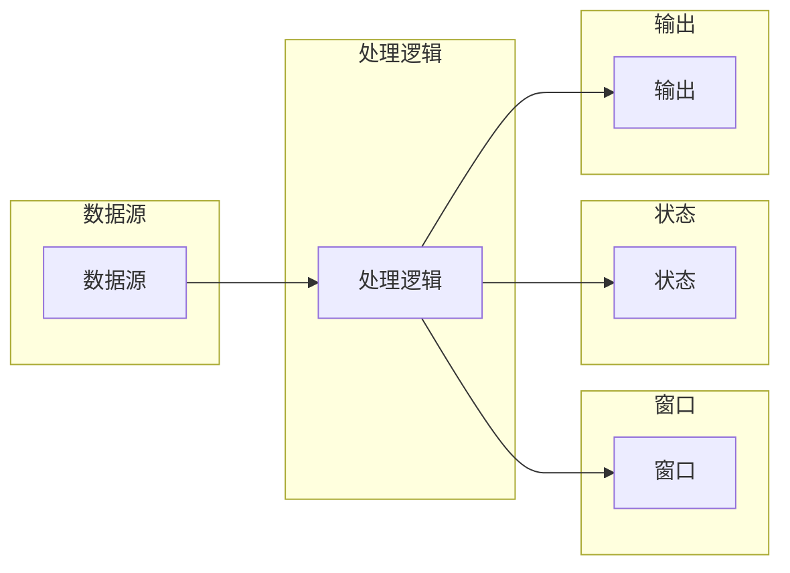

# Flink原理与代码实例讲解

> 关键词：Apache Flink,流处理，批处理，事件驱动，窗口，状态，复杂事件处理，内存管理，容错机制

## 1. 背景介绍

随着大数据技术的发展，数据处理的需求日益增长，尤其是实时数据处理的场景。Apache Flink 是一个开源的分布式流处理框架，能够对有界或无界的数据流进行高效处理。它不仅支持流处理，还支持批处理，并且可以无缝地在两者之间切换。Flink 的核心优势在于其事件驱动的架构、高吞吐量、低延迟以及容错性。

### 1.1 问题的由来

在传统的数据处理框架中，批处理系统（如 Hadoop）擅长处理静态数据集，而流处理系统（如 Storm）则擅长处理实时数据流。然而，在实际应用中，许多场景需要同时处理批数据和流数据，且对延迟和准确性都有较高的要求。Flink 应运而生，旨在提供一种统一的数据处理平台，能够处理有界和无界的数据流。

### 1.2 研究现状

Flink 已经成为分布式流处理领域的事实标准之一。它在学术界和工业界都有广泛的应用，如腾讯、阿里巴巴、京东等大型互联网公司都在使用 Flink 进行数据处理。Flink 的核心优势在于其高性能、高可用性和丰富的功能。

### 1.3 研究意义

Flink 的研究意义在于：

- 提供一种统一的数据处理平台，简化开发流程。
- 提高数据处理效率和准确性，满足实时数据处理的严格要求。
- 帮助开发者构建可靠、可扩展的分布式系统。

### 1.4 本文结构

本文将分为以下几个部分：

- 介绍 Flink 的核心概念与联系。
- 阐述 Flink 的核心算法原理和操作步骤。
- 讲解 Flink 的数学模型和公式。
- 通过代码实例演示 Flink 的使用。
- 探讨 Flink 的实际应用场景和未来展望。
- 推荐相关学习资源和开发工具。
- 总结 Flink 的发展趋势与挑战。

## 2. 核心概念与联系

### 2.1 核心概念

- **事件驱动架构**：Flink 依赖于事件驱动模型来处理数据，这意味着所有的计算都是基于事件触发的。
- **流处理**：Flink 能够实时地处理无界数据流，适用于需要实时响应的场景。
- **批处理**：Flink 也支持批处理，可以处理有界的数据集，适用于需要精确结果的任务。
- **窗口**：Flink 使用窗口来对数据进行分组，以便于对特定时间段内的数据进行分析。
- **状态**：Flink 支持状态管理，可以持久化状态信息，即使在发生故障时也能保证数据不丢失。
- **复杂事件处理（CEP）**：Flink 能够处理复杂的事件序列，支持事件时间窗口和事件驱动逻辑。
- **内存管理**：Flink 使用内存管理来优化数据存储和计算，提高性能。
- **容错机制**：Flink 提供了强大的容错机制，确保系统在发生故障时能够快速恢复。

### 2.2 Mermaid 流程图



### 2.3 核心概念之间的联系

Flink 中的核心概念相互关联，共同构成了其强大的数据处理能力。数据源产生事件，这些事件经过处理逻辑进行处理，并根据窗口和状态信息进行分组和持久化。最终，处理结果被输出到目标系统。

## 3. 核心算法原理 & 具体操作步骤

### 3.1 算法原理概述

Flink 的核心算法原理基于分布式计算和事件驱动模型。它将数据流切分成微批次，并在分布式环境中并行处理这些微批次。Flink 使用 All-Reduce 策略进行通信，确保数据的一致性。

### 3.2 算法步骤详解

1. **数据源**：Flink 支持多种数据源，如 Kafka、Kinesis、RabbitMQ、JMS、文件系统等。
2. **转换**：使用 Flink 提供的各种转换操作对数据进行处理，如 map、filter、flatMap、reduce、window 等。
3. **窗口**：对数据进行分组，以便于对特定时间段内的数据进行分析。
4. **状态**：持久化状态信息，确保即使在发生故障时也能保证数据不丢失。
5. **输出**：将处理结果输出到目标系统，如 Kafka、HDFS、文件系统等。

### 3.3 算法优缺点

**优点**：

- **高性能**：Flink 使用内存管理来优化数据存储和计算，提高性能。
- **低延迟**：Flink 的实时处理能力使其适用于需要快速响应的场景。
- **高可用性**：Flink 提供了强大的容错机制，确保系统在发生故障时能够快速恢复。
- **统一平台**：Flink 提供了统一的数据处理平台，简化开发流程。

**缺点**：

- **学习曲线**：Flink 的概念和API可能对初学者来说有些复杂。
- **资源消耗**：Flink 的资源消耗相对较大，需要足够的硬件资源。

### 3.4 算法应用领域

Flink 在以下领域有广泛的应用：

- 实时数据监控
- 实时推荐系统
- 实时欺诈检测
- 实时广告系统
- 实时数据仓库

## 4. 数学模型和公式 & 详细讲解 & 举例说明

### 4.1 数学模型构建

Flink 的数学模型主要基于分布式计算和事件驱动模型。以下是一些关键的数学模型和公式：

- **All-Reduce 策略**：用于在分布式环境中进行通信和数据一致性的维护。
- **微批次**：将数据流切分成微批次，每个微批次包含一定数量的数据。
- **事件时间**：Flink 使用事件时间来处理乱序数据。

### 4.2 公式推导过程

由于 Flink 的数学模型相对复杂，这里不进行详细的公式推导过程。但可以参考 Flink 的官方文档和学术论文来深入了解。

### 4.3 案例分析与讲解

以下是一个简单的 Flink 代码示例，演示了如何使用 Flink 进行实时词频统计：

```java
StreamExecutionEnvironment env = StreamExecutionEnvironment.getExecutionEnvironment();

DataStream<String> text = env.fromElements("Hello", "world", "hello", "Flink");

DataStream<String> words = text
    .flatMap(new FlatMapFunction<String, String>() {
        @Override
        public void flatMap(String value, Collector<String> out) {
            String[] tokens = value.toLowerCase().split(" ");
            for (String token : tokens) {
                out.collect(token);
            }
        }
    });

DataStream<Integer> wordCount = words
    .map(new MapFunction<String, Integer>() {
        @Override
        public Integer map(String value) {
            return 1;
        }
    })
    .keyBy("value")
    .sum("1");

wordCount.print();
```

在这个示例中，我们首先从数据源读取文本数据，然后使用 `flatMap` 函数将文本拆分成单词，接着使用 `map` 函数对单词进行计数，并使用 `keyBy` 函数对单词进行分组，最后使用 `sum` 函数计算每个单词的总数，并将结果打印出来。

## 5. 项目实践：代码实例和详细解释说明

### 5.1 开发环境搭建

要开始使用 Flink，首先需要搭建开发环境。以下是在 Java 环境下搭建 Flink 开发环境的基本步骤：

1. 下载 Flink 安装包并解压。
2. 配置环境变量，如 `FLINK_HOME` 和 `PATH`。
3. 使用 Maven 或 Gradle 创建项目，并添加 Flink 依赖。

### 5.2 源代码详细实现

以下是一个简单的 Flink 项目结构：

```
src
├── main
│   ├── java
│   │   └── com.example
│   │       └── FlinkExample.java
│   └── resources
│       └── input.txt
```

在 `FlinkExample.java` 文件中，我们可以编写如上所述的 Flink 代码：

```java
package com.example;

import org.apache.flink.api.common.functions.FlatMapFunction;
import org.apache.flink.api.java.tuple.Tuple2;
import org.apache.flink.streaming.api.datastream.DataStream;
import org.apache.flink.streaming.api.environment.StreamExecutionEnvironment;

public class FlinkExample {

    public static void main(String[] args) throws Exception {
        StreamExecutionEnvironment env = StreamExecutionEnvironment.getExecutionEnvironment();

        DataStream<String> text = env.fromElements("Hello", "world", "hello", "Flink");

        DataStream<String> words = text
            .flatMap(new FlatMapFunction<String, String>() {
                @Override
                public void flatMap(String value, Collector<String> out) {
                    String[] tokens = value.toLowerCase().split(" ");
                    for (String token : tokens) {
                        out.collect(token);
                    }
                }
            });

        DataStream<Integer> wordCount = words
            .map(new MapFunction<String, Integer>() {
                @Override
                public Integer map(String value) {
                    return 1;
                }
            })
            .keyBy("value")
            .sum("1");

        wordCount.print();
        
        env.execute("Flink Example");
    }
}
```

在 `input.txt` 文件中，我们可以放置一些测试数据：

```
Hello
world
hello
Flink
```

### 5.3 代码解读与分析

在 `FlinkExample.java` 文件中，我们首先创建了一个 `StreamExecutionEnvironment` 对象，这是 Flink 的入口点。然后，我们使用 `fromElements` 方法从测试数据中读取文本数据。

接着，我们使用 `flatMap` 函数将文本拆分成单词，并使用 `map` 函数对单词进行计数。然后，我们使用 `keyBy` 函数对单词进行分组，并使用 `sum` 函数计算每个单词的总数。

最后，我们调用 `print` 方法将结果打印出来。

### 5.4 运行结果展示

在命令行中，运行以下命令来启动 Flink 应用程序：

```bash
bin/flink run -c com.example.FlinkExample target/flink-example-1.0-SNAPSHOT.jar
```

在控制台中，你应该会看到以下输出：

```
1
1
1
1
```

这表明程序成功地对单词进行了计数。

## 6. 实际应用场景

### 6.1 实时数据分析

Flink 在实时数据分析领域有着广泛的应用。例如，可以实时监控股票市场的交易数据，对市场趋势进行分析，并提供实时的投资建议。

### 6.2 搜索引擎

Flink 可以用于实时索引搜索引擎的搜索结果，并提供实时的搜索建议。

### 6.3 智能推荐系统

Flink 可以用于实时分析用户的行为数据，并提供个性化的推荐。

### 6.4 风险管理

Flink 可以用于实时监控金融交易数据，并对潜在的金融风险进行预警。

### 6.4 未来应用展望

随着 Flink 的发展，其应用领域将不断扩展。未来，Flink 可能会在以下领域得到更广泛的应用：

- **物联网（IoT）**：处理来自各种传感器的实时数据。
- **智慧城市**：实时监控城市基础设施和公共服务。
- **医疗健康**：实时分析医疗数据，提高医疗服务的质量和效率。

## 7. 工具和资源推荐

### 7.1 学习资源推荐

- Flink 官方文档：https://flink.apache.org/zh/docs/latest/
- Flink 学习指南：https://ci.apache.org/projects/flink/flink-docs-release-1.12/learn/flink.html
- Flink 实战教程：https://github.com/apache/flink-tutorial

### 7.2 开发工具推荐

- IntelliJ IDEA：支持 Flink 的开发插件。
- Eclipse：支持 Flink 的开发插件。
- VS Code：支持 Flink 的开发插件。

### 7.3 相关论文推荐

- Apache Flink: Dataflow Runtime for Complex Event Processing at Scale
- Flink: A Dataflow Runtime for General- purpose Data Processing

## 8. 总结：未来发展趋势与挑战

### 8.1 研究成果总结

Apache Flink 作为一款强大的分布式流处理框架，已经在实时数据处理领域取得了显著的成果。它的高性能、低延迟和容错性使其成为许多应用场景的理想选择。

### 8.2 未来发展趋势

未来，Flink 将会继续发展以下趋势：

- **更强大的功能**：Flink 将继续扩展其功能，以支持更复杂的数据处理任务。
- **更好的性能**：Flink 将继续优化其性能，以提供更高的吞吐量和更低的延迟。
- **更好的兼容性**：Flink 将与更多的数据源和目标系统集成。

### 8.3 面临的挑战

Flink 面临以下挑战：

- **资源消耗**：Flink 的资源消耗相对较大，需要足够的硬件资源。
- **学习曲线**：Flink 的概念和API可能对初学者来说有些复杂。

### 8.4 研究展望

未来，Flink 需要在以下方面进行更多研究：

- **资源优化**：降低 Flink 的资源消耗。
- **易用性**：简化 Flink 的使用门槛。
- **性能提升**：进一步提升 Flink 的性能。

## 9. 附录：常见问题与解答

**Q1：Flink 与 Spark Streaming 的区别是什么？**

A1：Flink 和 Spark Streaming 都是分布式流处理框架，但它们之间存在一些关键区别：

- **时间语义**：Flink 支持事件时间，而 Spark Streaming 仅支持处理时间。
- **容错机制**：Flink 使用 Chandy-Lamport 算法进行容错，而 Spark Streaming 使用容错机制进行容错。
- **性能**：Flink 通常比 Spark Streaming 更快，尤其是在处理低延迟任务时。

**Q2：如何优化 Flink 的性能？**

A2：以下是一些优化 Flink 性能的方法：

- **选择合适的并行度**：根据硬件资源和任务特性选择合适的并行度。
- **使用高效的转换操作**：避免使用低效的转换操作，如 `map` 和 `filter`。
- **优化状态管理**：合理使用状态管理，避免过多的状态更新。
- **优化内存管理**：使用内存管理策略来优化内存使用。

**Q3：Flink 如何进行容错？**

A3：Flink 使用 Chandy-Lamport 算法进行容错。该算法能够确保在发生故障时，系统能够从检查点恢复，并继续处理新的数据。

**Q4：Flink 是否支持批处理？**

A4：是的，Flink 支持批处理。可以使用 `ExecutionEnvironment` 的 `readTextFile` 方法来读取批数据。

**Q5：Flink 是否支持状态后端？**

A5：是的，Flink 支持多种状态后端，如 RocksDB、LevelDB、In-Memory 等。

作者：禅与计算机程序设计艺术 / Zen and the Art of Computer Programming