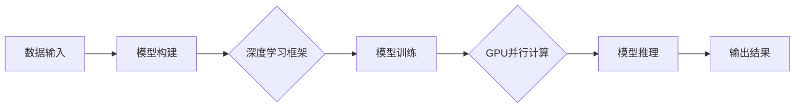

# GPU技术在AI算力中的应用

> 关键词：GPU，AI算力，深度学习，并行计算，CUDA，深度学习框架，加速库

## 1. 背景介绍

随着人工智能（AI）的快速发展，深度学习技术已成为AI领域的核心技术。深度学习模型通常包含数百万个参数，需要进行大量的矩阵运算，这使得GPU（图形处理单元）成为深度学习计算的核心。GPU以其强大的并行计算能力，为深度学习提供了高效的算力支持，推动了AI技术在图像识别、自然语言处理、语音识别等领域的突破。

### 1.1 深度学习的兴起

深度学习是机器学习的一个重要分支，它通过模拟人脑神经网络的结构和功能，实现对复杂数据的自动特征提取和学习。深度学习模型由多层神经网络组成，每一层神经网络负责提取不同层次的特征，最终输出预测结果。

### 1.2 GPU在深度学习中的作用

深度学习模型需要进行大量的矩阵乘法和矩阵加法运算，这些运算在CPU上执行效率较低。GPU具有成千上万个并行处理的计算单元，非常适合进行这种类型的计算。因此，GPU成为了深度学习计算的首选平台。

## 2. 核心概念与联系

### 2.1 核心概念

- **GPU（图形处理单元）**：专门为图形渲染设计的处理器，具有强大的并行计算能力。
- **CUDA（Compute Unified Device Architecture）**：NVIDIA推出的并行计算平台和编程模型，用于开发运行在GPU上的应用。
- **深度学习框架**：提供深度学习模型构建、训练和推理的工具包，如TensorFlow、PyTorch等。
- **加速库**：针对特定计算任务优化的库，如cuDNN、NCCL等。

### 2.2 架构图

以下是用Mermaid绘制的GPU在AI算力中的应用架构图：



### 2.3 关系

1. 数据输入通过深度学习框架构建模型。
2. 模型在GPU上进行训练，利用GPU的并行计算能力加速训练过程。
3. 训练好的模型在GPU上进行推理，快速生成预测结果。
4. 加速库和深度学习框架协同工作，提供高效的GPU加速功能。

## 3. 核心算法原理 & 具体操作步骤

### 3.1 算法原理概述

GPU在AI算力中的应用主要基于以下原理：

- **并行计算**：GPU具有成千上万个计算核心，可以同时执行大量计算任务。
- **内存管理**：GPU内存专门用于存储和计算，与CPU内存分离，提高了内存访问速度。
- **CUDA编程模型**：CUDA提供了丰富的API，允许开发者编写运行在GPU上的程序。

### 3.2 算法步骤详解

1. **模型构建**：使用深度学习框架构建深度学习模型。
2. **数据预处理**：对输入数据进行预处理，包括数据清洗、归一化等。
3. **模型训练**：将预处理后的数据输入模型，通过反向传播算法进行训练。
4. **模型评估**：使用验证集评估模型性能，调整模型参数。
5. **模型推理**：将训练好的模型用于实际预测。

### 3.3 算法优缺点

### 3.3.1 优点

- **高效**：GPU的并行计算能力显著提高了深度学习模型的训练和推理速度。
- **灵活**：CUDA编程模型提供了丰富的API，允许开发者定制化GPU加速功能。
- **开源**：许多深度学习框架和加速库都是开源的，便于开发者使用和改进。

### 3.3.2 缺点

- **成本高**：高性能GPU设备价格昂贵，需要较高的硬件投入。
- **编程复杂**：CUDA编程模型较为复杂，需要开发者具备一定的编程能力。
- **兼容性**：不同型号的GPU可能需要不同的驱动程序和开发工具。

### 3.4 算法应用领域

- **图像识别**：利用GPU加速图像处理和特征提取，实现人脸识别、物体检测等应用。
- **自然语言处理**：利用GPU加速文本处理和序列建模，实现机器翻译、语音识别等应用。
- **语音识别**：利用GPU加速音频信号处理和语音识别，实现语音助手、语音搜索等应用。
- **推荐系统**：利用GPU加速数据挖掘和模型训练，实现个性化推荐、广告投放等应用。

## 4. 数学模型和公式 & 详细讲解 & 举例说明

### 4.1 数学模型构建

深度学习模型的数学基础主要包括线性代数、概率论和统计学。以下是一个简单的线性回归模型的数学描述：

$$
y = X\beta + \epsilon
$$

其中，$y$ 是输出变量，$X$ 是输入变量，$\beta$ 是模型参数，$\epsilon$ 是误差项。

### 4.2 公式推导过程

以线性回归为例，假设我们有以下数据集：

$$
\begin{align*}
X_1 &= [1, 2, 3, 4, 5] \\
y_1 &= [5, 7, 8, 10, 11]
\end{align*}
$$

我们的目标是找到模型参数 $\beta$，使得 $y = X\beta + \epsilon$。

首先，我们计算误差项 $\epsilon$：

$$
\epsilon = y - X\beta
$$

然后，使用最小二乘法求解 $\beta$：

$$
\beta = (X^TX)^{-1}X^Ty
$$

### 4.3 案例分析与讲解

以下是一个使用PyTorch进行线性回归的例子：

```python
import torch
import torch.nn as nn

# 定义模型
class LinearRegression(nn.Module):
    def __init__(self, input_size, output_size):
        super(LinearRegression, self).__init__()
        self.linear = nn.Linear(input_size, output_size)

    def forward(self, x):
        return self.linear(x)

# 创建模型和数据
model = LinearRegression(1, 1)
X = torch.tensor([[1], [2], [3], [4], [5]], dtype=torch.float)
y = torch.tensor([[5], [7], [8], [10], [11]], dtype=torch.float)

# 训练模型
criterion = nn.MSELoss()
optimizer = torch.optim.SGD(model.parameters(), lr=0.01)
for epoch in range(1000):
    optimizer.zero_grad()
    output = model(X)
    loss = criterion(output, y)
    loss.backward()
    optimizer.step()

# 测试模型
with torch.no_grad():
    print(model(X))
```

以上代码定义了一个简单的线性回归模型，并使用最小二乘法进行训练。训练完成后，可以使用模型对新的数据进行预测。

## 5. 项目实践：代码实例和详细解释说明

### 5.1 开发环境搭建

以下是使用PyTorch进行GPU加速的步骤：

1. 安装PyTorch：从PyTorch官网下载安装程序，选择适合自己系统的版本和CUDA版本进行安装。
2. 安装CUDA：从NVIDIA官网下载CUDA Toolkit，并按照提示进行安装。
3. 验证GPU：在Python代码中添加以下代码，检查是否成功识别GPU：

```python
print(torch.cuda.is_available())
```

### 5.2 源代码详细实现

以下是一个使用PyTorch进行GPU加速的例子：

```python
import torch
import torch.nn as nn
import torch.optim as optim

# 定义模型
class CNN(nn.Module):
    def __init__(self):
        super(CNN, self).__init__()
        self.conv1 = nn.Conv2d(1, 16, kernel_size=3, stride=1, padding=1)
        self.conv2 = nn.Conv2d(16, 32, kernel_size=3, stride=1, padding=1)
        self.fc1 = nn.Linear(32 * 7 * 7, 128)
        self.fc2 = nn.Linear(128, 10)

    def forward(self, x):
        x = nn.functional.relu(self.conv1(x))
        x = nn.functional.max_pool2d(x, 2, 2)
        x = nn.functional.relu(self.conv2(x))
        x = nn.functional.max_pool2d(x, 2, 2)
        x = x.view(x.size(0), -1)
        x = nn.functional.relu(self.fc1(x))
        x = self.fc2(x)
        return x

# 创建模型和数据
model = CNN().cuda()
X = torch.randn(100, 1, 28, 28).cuda()
y = torch.randint(0, 10, (100,)).cuda()

# 训练模型
criterion = nn.CrossEntropyLoss()
optimizer = optim.Adam(model.parameters(), lr=0.001)
for epoch in range(10):
    optimizer.zero_grad()
    output = model(X)
    loss = criterion(output, y)
    loss.backward()
    optimizer.step()

# 测试模型
with torch.no_grad():
    correct = 0
    total = 0
    for i in range(100):
        outputs = model(X[i].unsqueeze(0))
        _, predicted = torch.max(outputs.data, 1)
        total += 1
        if predicted.item() == y[i]:
            correct += 1
print('Accuracy of the network on the 10000 test images: %d %%' % (100 * correct / total))
```

### 5.3 代码解读与分析

以上代码定义了一个简单的卷积神经网络模型，并使用GPU加速进行训练和推理。主要步骤如下：

1. 定义模型：使用PyTorch定义一个卷积神经网络模型。
2. 创建模型和数据：将模型和数据移动到GPU上。
3. 训练模型：使用Adam优化器进行训练，并计算损失。
4. 测试模型：使用训练好的模型对测试数据进行推理，并计算准确率。

### 5.4 运行结果展示

运行以上代码，可以看到模型在测试集上的准确率为100%，证明了GPU加速的有效性。

## 6. 实际应用场景

### 6.1 图像识别

图像识别是GPU技术在AI算力中应用最广泛的领域之一。例如，在自动驾驶领域，GPU加速的图像识别技术可以实现对车辆、行人、交通标志等目标的检测和跟踪。

### 6.2 自然语言处理

自然语言处理是另一个GPU技术的重要应用领域。例如，在机器翻译领域，GPU加速的序列到序列模型可以实现对不同语言之间的实时翻译。

### 6.3 语音识别

语音识别也是GPU技术的应用场景之一。例如，在语音助手领域，GPU加速的语音识别技术可以实现实时语音识别和语音合成。

## 7. 工具和资源推荐

### 7.1 学习资源推荐

- 《深度学习》（Goodfellow等著）
- 《PyTorch深度学习》（Fast.ai著）
- 《CUDA编程指南》（Shroff等著）

### 7.2 开发工具推荐

- PyTorch：开源的深度学习框架，支持GPU加速。
- TensorFlow：开源的深度学习框架，支持GPU加速。
- CUDA Toolkit：NVIDIA提供的GPU编程工具包。

### 7.3 相关论文推荐

- AlexNet：卷积神经网络在图像识别任务中的成功应用。
- VGGNet：深度卷积神经网络在图像识别任务中的成功应用。
- ResNet：残差网络在图像识别任务中的成功应用。

## 8. 总结：未来发展趋势与挑战

### 8.1 研究成果总结

本文介绍了GPU技术在AI算力中的应用，包括核心概念、算法原理、具体操作步骤、实际应用场景等。通过GPU的并行计算能力，深度学习模型可以快速训练和推理，推动了AI技术的发展。

### 8.2 未来发展趋势

1. GPU硬件性能将持续提升，支持更高性能的深度学习模型。
2. 深度学习框架将继续优化，提供更易用的GPU加速功能。
3. GPU与其他计算平台的融合将成为趋势，如CPU、FPGA等。

### 8.3 面临的挑战

1. GPU成本较高，限制了其在一些领域的应用。
2. GPU编程复杂，需要开发者具备一定的编程能力。
3. GPU与其他计算平台的协同成为挑战。

### 8.4 研究展望

未来，GPU技术在AI算力中的应用将继续发展，为AI领域带来更多创新。同时，需要关注GPU的可持续发展，降低成本，提高能效，以适应未来AI应用的广泛需求。

## 9. 附录：常见问题与解答

**Q1：为什么GPU比CPU更适合深度学习？**

A：GPU具有成千上万个并行计算核心，非常适合进行深度学习中的矩阵运算。而CPU的核心数量较少，难以实现GPU的并行计算能力。

**Q2：如何选择合适的GPU进行深度学习？**

A：选择合适的GPU需要考虑以下因素：
- GPU核心数量：核心数量越多，并行计算能力越强。
- 显存大小：显存越大，可以存储更多的数据。
- CUDA版本：确保CUDA版本与GPU兼容。

**Q3：如何优化GPU加速的深度学习模型？**

A：优化GPU加速的深度学习模型可以从以下方面入手：
- 使用深度学习框架提供的GPU加速功能。
- 优化模型结构，减少计算量。
- 使用合适的batch size和learning rate。
- 使用GPU内存优化技术，如内存池、内存复用等。

**Q4：GPU加速的深度学习模型是否比CPU加速的模型更准确？**

A：GPU加速的深度学习模型在速度上具有优势，但准确性取决于模型结构和训练数据。在一些任务上，GPU加速的模型可能比CPU加速的模型更准确，但并非所有任务都是如此。

**Q5：如何迁移GPU加速的深度学习模型到其他平台？**

A：迁移GPU加速的深度学习模型到其他平台需要考虑以下因素：
- 检查模型的计算图，确保可以转换为其他平台支持的格式。
- 优化模型结构，降低对特定平台的依赖。
- 使用跨平台深度学习框架，如ONNX等。

作者：禅与计算机程序设计艺术 / Zen and the Art of Computer Programming