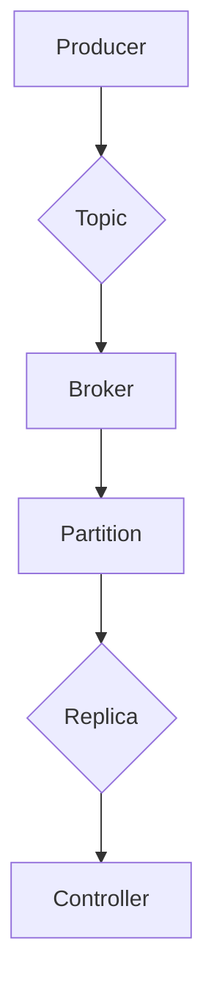

# Kafka原理与代码实例讲解

> 关键词：Apache Kafka, 消息队列, 分布式系统, 发布-订阅模式, 日志收集, 数据流处理

## 1. 背景介绍

Apache Kafka 是一个开源的高吞吐量分布式流处理平台，由LinkedIn开发并于2011年开源。Kafka 以其高吞吐量、可扩展性和可靠性，成为当今最流行的消息队列和流处理系统之一。本文将深入探讨Kafka的原理，并通过代码实例讲解其使用方法。

### 1.1 问题的由来

随着互联网的快速发展，企业对数据处理的需求日益增长。传统的消息队列系统在处理大量数据时往往遇到性能瓶颈。Kafka的出现，正是为了解决这些挑战，提供一种能够处理海量数据的分布式消息队列系统。

### 1.2 研究现状

Kafka自开源以来，已经发展成为一个功能丰富、性能卓越的分布式系统。它广泛应用于日志收集、事件源、流处理、实时分析等场景。许多知名公司，如Netflix、Twitter、Uber等，都在使用Kafka进行数据处理。

### 1.3 研究意义

理解Kafka的原理对于开发者和架构师来说至关重要。它可以帮助我们：

- 设计高吞吐量的数据处理系统
- 构建可靠的数据流处理平台
- 理解分布式系统的设计模式

### 1.4 本文结构

本文将分为以下章节：

- 核心概念与联系
- 核心算法原理 & 具体操作步骤
- 数学模型和公式 & 详细讲解 & 举例说明
- 项目实践：代码实例和详细解释说明
- 实际应用场景
- 工具和资源推荐
- 总结：未来发展趋势与挑战
- 附录：常见问题与解答

## 2. 核心概念与联系

Kafka的核心概念包括：

- **生产者（Producer）**：负责发布消息到Kafka集群的节点。
- **消费者（Consumer）**：从Kafka集群的节点中订阅并消费消息。
- **主题（Topic）**：Kafka中的消息分类，生产者将消息发布到特定的主题。
- **分区（Partition）**：每个主题被分割成多个分区，用于并行处理消息。
- **副本（Replica）**：每个分区有多个副本，用于提供数据的冗余和故障恢复。
- **控制器（Controller）**：负责管理Kafka集群，如分区分配、副本管理等。
- **经纪人（Broker）**：Kafka集群中的服务器，负责存储数据、处理请求等。

Kafka架构的Mermaid流程图如下：



## 3. 核心算法原理 & 具体操作步骤

### 3.1 算法原理概述

Kafka的核心原理是分布式发布-订阅模式。生产者将消息发布到特定的主题，消费者从主题中订阅消息。Kafka通过分区和副本机制，实现高吞吐量和可靠性。

### 3.2 算法步骤详解

1. **生产者发布消息**：生产者将消息序列化后，发送到指定的主题和分区。
2. **经纪人路由消息**：经纪人根据主题和分区的配置，将消息路由到对应的副本。
3. **副本同步数据**：副本之间通过同步协议保持数据一致性。
4. **消费者消费消息**：消费者从副本中拉取消息进行消费。

### 3.3 算法优缺点

**优点**：

- 高吞吐量：Kafka能够处理海量数据，支持高并发的消息生产和消费。
- 分布式：Kafka是分布式系统，具有高可用性和容错性。
- 可扩展：Kafka能够通过增加broker和分区来水平扩展。

**缺点**：

- 集群管理复杂：Kafka集群的管理比较复杂，需要专业人员进行维护。
- 代码复杂：Kafka的客户端库代码相对复杂，需要一定的学习成本。

### 3.4 算法应用领域

- 日志收集：Kafka可以将来自不同系统的日志数据收集到一个中心位置，便于分析和监控。
- 事件源：Kafka可以存储系统中的事件，用于构建事件驱动架构。
- 流处理：Kafka可以与流处理框架（如Apache Flink、Spark Streaming）结合，实现实时数据流处理。

## 4. 数学模型和公式 & 详细讲解 & 举例说明

Kafka中的数学模型主要包括：

- **吞吐量模型**：描述Kafka处理消息的能力。
- **延迟模型**：描述消息从生产者到消费者所需的时间。
- **可靠性模型**：描述Kafka数据的持久性和一致性。

以下是一个简单的吞吐量模型：

$$
\text{吞吐量} = \frac{\text{消息大小}}{\text{处理时间}}
$$

假设每条消息大小为100字节，每秒处理1000条消息，则吞吐量为100000字节/秒。

## 5. 项目实践：代码实例和详细解释说明

### 5.1 开发环境搭建

1. 安装Java环境。
2. 下载Kafka安装包并解压。
3. 修改配置文件`server.properties`。
4. 启动Kafka服务。

### 5.2 源代码详细实现

以下是一个简单的Kafka生产者和消费者示例：

```java
// 生产者
Properties props = new Properties();
props.put("bootstrap.servers", "localhost:9092");
props.put("key.serializer", "org.apache.kafka.common.serialization.StringSerializer");
props.put("value.serializer", "org.apache.kafka.common.serialization.StringSerializer");

KafkaProducer<String, String> producer = new KafkaProducer<>(props);

String topic = "test";
String data = "Hello, Kafka!";
producer.send(new ProducerRecord<>(topic, data));
producer.close();
```

```java
// 消费者
Properties props = new Properties();
props.put("bootstrap.servers", "localhost:9092");
props.put("group.id", "test-group");
props.put("key.deserializer", "org.apache.kafka.common.serialization.StringDeserializer");
props.put("value.deserializer", "org.apache.kafka.common.serialization.StringDeserializer");

KafkaConsumer<String, String> consumer = new KafkaConsumer<>(props);
consumer.subscribe(Collections.singletonList("test"));

while (true) {
    ConsumerRecords<String, String> records = consumer.poll(Duration.ofMillis(100));
    for (ConsumerRecord<String, String> record : records) {
        System.out.printf("offset = %d, key = %s, value = %s%n", record.offset(), record.key(), record.value());
    }
}
consumer.close();
```

### 5.3 代码解读与分析

以上代码展示了如何使用Java客户端库创建Kafka生产者和消费者。生产者将一条消息发送到指定的主题，消费者从该主题中消费消息。

### 5.4 运行结果展示

运行生产者代码后，消费者会打印出收到的消息内容。

## 6. 实际应用场景

Kafka在实际应用中非常广泛，以下是一些常见的应用场景：

- **日志收集**：Kafka可以收集来自不同系统的日志数据，便于分析和监控。
- **事件源**：Kafka可以存储系统中的事件，用于构建事件驱动架构。
- **流处理**：Kafka可以与流处理框架结合，实现实时数据流处理。

## 7. 工具和资源推荐

### 7.1 学习资源推荐

- Kafka官方文档：[https://kafka.apache.org/documentation/](https://kafka.apache.org/documentation/)
- 《Kafka: The Definitive Guide》：[https://www.manning.com/books/kafka-the-definitive-guide](https://www.manning.com/books/kafka-the-definitive-guide)
- Apache Kafka社区：[https://kafka.apache.org/communities.html](https://kafka.apache.org/communities.html)

### 7.2 开发工具推荐

- Eclipse Kafka Tools：[https://www.eclipsesource.com/kafka-tools/](https://www.eclipsesource.com/kafka-tools/)
- Apache Kafka Manager：[https://github.com/yahoo/kafka-manager](https://github.com/yahoo/kafka-manager)

### 7.3 相关论文推荐

- The Lambda Architecture：[https://www.seas.upenn.edu/~zives/papers/lambda-arch.pdf](https://www.seas.upenn.edu/~zives/papers/lambda-arch.pdf)
- Kafka: A Distributed Streaming Platform：[https://www.usenix.org/conference/nsdi15/technical-sessions/presentation/abadi](https://www.usenix.org/conference/nsdi15/technical-sessions/presentation/abadi)

## 8. 总结：未来发展趋势与挑战

### 8.1 研究成果总结

本文深入探讨了Kafka的原理和应用，通过代码实例展示了如何使用Kafka进行消息处理。Kafka作为一种高性能的分布式消息队列系统，在数据收集、流处理等领域具有广泛的应用前景。

### 8.2 未来发展趋势

- **更高效的存储引擎**：Kafka可能会引入更高效的存储引擎，以进一步提高性能。
- **更丰富的生态**：Kafka的生态可能会更加丰富，出现更多与Kafka相关的工具和框架。
- **云原生支持**：Kafka可能会更好地支持云原生环境，如Kubernetes。

### 8.3 面临的挑战

- **复杂度**：Kafka的配置和运维相对复杂，需要专业人员进行管理。
- **安全性**：Kafka的安全性需要进一步加强，以防止数据泄露和恶意攻击。

### 8.4 研究展望

- **跨语言客户端**：开发跨语言的Kafka客户端，降低使用门槛。
- **混合存储**：结合多种存储技术，提高数据持久性和可靠性。
- **智能化管理**：利用人工智能技术，实现Kafka集群的自动运维和优化。

## 9. 附录：常见问题与解答

**Q1：Kafka和消息队列有什么区别？**

A：Kafka是一种消息队列系统，但它具有更高的吞吐量和更复杂的架构。Kafka支持分布式、可扩展性和可靠性，而传统的消息队列系统往往只关注性能。

**Q2：Kafka如何保证消息的顺序性？**

A：Kafka通过分区和副本机制保证消息的顺序性。每个分区中的消息是有序的，副本之间通过同步协议保持数据一致性。

**Q3：Kafka适用于哪些场景？**

A：Kafka适用于日志收集、事件源、流处理、实时分析等场景。

**Q4：如何优化Kafka的性能？**

A：可以通过以下方法优化Kafka的性能：

- 使用合适的分区数。
- 选择合适的副本因子。
- 优化生产者和消费者的配置。
- 使用更高效的存储引擎。

作者：禅与计算机程序设计艺术 / Zen and the Art of Computer Programming