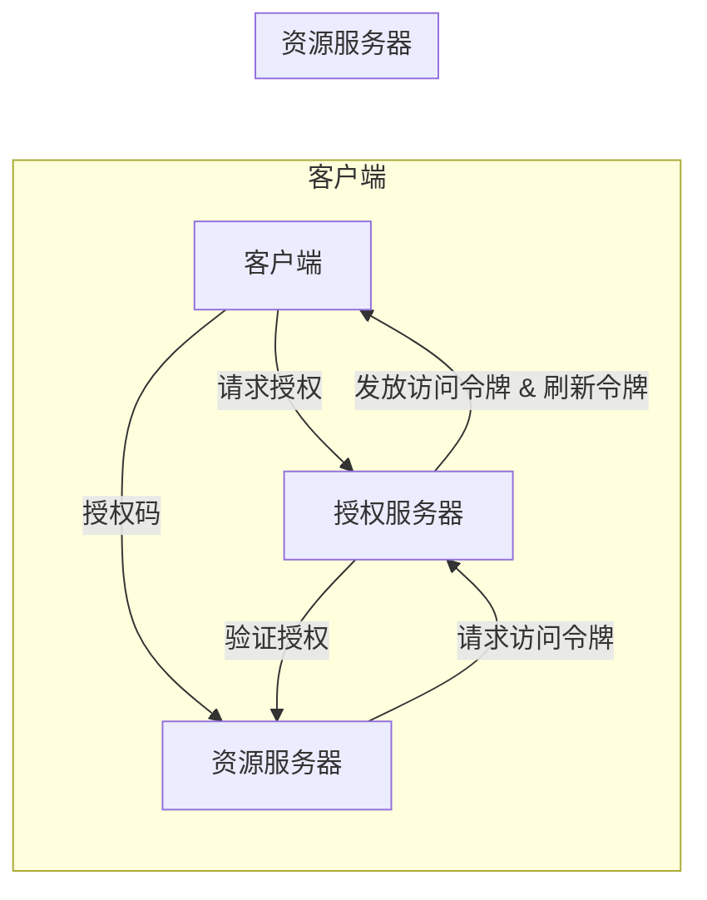

# OAuth 2.0 的实现细节

> 关键词：OAuth 2.0, 授权, 访问令牌, 客户端, 资源服务器, 服务器端, 安全性, 标准化, 开放授权

## 1. 背景介绍

随着互联网的快速发展和信息服务的日益丰富，用户需要登录多个服务提供商进行操作，每次都需要输入用户名和密码，这不仅给用户带来了不便，也增加了信息泄露的风险。OAuth 2.0 应运而生，它提供了一种更加安全、灵活的授权机制，允许用户授权第三方应用访问他们存储在另一个服务提供者上的信息，而不需要将用户名和密码暴露给第三方应用。

OAuth 2.0 旨在为第三方应用提供一种机制，允许它们访问受保护资源，同时不暴露用户认证信息。它广泛应用于社交网络、云服务等场景，是现代互联网安全架构的重要组成部分。

## 2. 核心概念与联系

### 2.1 核心概念

OAuth 2.0 定义了以下核心概念：

- **客户端 (Client)**: 请求资源的服务端应用程序。
- **资源所有者 (Resource Owner)**: 拥有资源并提供授权的用户。
- **资源服务器 (Resource Server)**: 存储和保护用户资源的服务器。
- **授权服务器 (Authorization Server)**: 处理授权请求并发放令牌的服务器。
- **访问令牌 (Access Token)**: 授权服务器发放给客户端的用于访问受保护资源的令牌。
- **刷新令牌 (Refresh Token)**: 用于更新访问令牌的有效期。
- **授权码 (Authorization Code)**: 用于在客户端和授权服务器之间传递的授权信息。

### 2.2 核心概念原理和架构的 Mermaid 流程图



## 3. 核心算法原理 & 具体操作步骤

### 3.1 算法原理概述

OAuth 2.0 的核心原理是授权码模式，它通过以下步骤实现：

1. 客户端请求授权码。
2. 授权服务器验证用户的身份，并询问用户是否同意授权。
3. 用户同意授权，授权服务器将授权码返回给客户端。
4. 客户端使用授权码请求访问令牌。
5. 授权服务器验证授权码，并发放访问令牌和可选的刷新令牌。
6. 客户端使用访问令牌请求资源。
7. 资源服务器验证访问令牌，并返回请求的资源。

### 3.2 算法步骤详解

1. **注册客户端**：客户端需要向授权服务器注册，以获取客户端ID和客户端密钥。
2. **用户授权**：客户端引导用户到授权服务器进行身份验证，并请求授权码。
3. **获取访问令牌**：客户端使用授权码请求访问令牌。
4. **访问资源**：客户端使用访问令牌请求资源服务器上的资源。
5. **刷新访问令牌**：访问令牌过期后，客户端可以使用刷新令牌请求新的访问令牌。

### 3.3 算法优缺点

**优点**：

- **安全性**：用户不需要将用户名和密码直接提供给第三方应用，从而提高了安全性。
- **灵活性**：OAuth 2.0 支持多种授权流程，可以根据实际需求灵活选择。
- **易于实现**：OAuth 2.0 提供了详细的规范和实现指南，易于开发者理解和实现。

**缺点**：

- **复杂性**：OAuth 2.0 的规范较为复杂，对于初学者可能有一定的门槛。
- **安全性风险**：如果授权码泄露，攻击者可能会获取访问令牌，进而访问用户资源。

### 3.4 算法应用领域

OAuth 2.0 在以下领域得到了广泛应用：

- **社交网络**：允许第三方应用访问用户的社交网络数据。
- **云服务**：允许第三方应用访问用户存储在云服务上的数据。
- **移动应用**：允许移动应用访问其他服务提供的数据和功能。

## 4. 数学模型和公式 & 详细讲解 & 举例说明

### 4.1 数学模型构建

OAuth 2.0 的数学模型可以表示为：

```
Client -> AuthorizationServer: 请求授权码
AuthorizationServer -> Client: 授权码
Client -> AuthorizationServer: 请求访问令牌
AuthorizationServer -> Client: 访问令牌
Client -> ResourceServer: 请求资源
ResourceServer -> Client: 资源
```

### 4.2 公式推导过程

OAuth 2.0 的公式推导过程如下：

1. **请求授权码**：客户端向授权服务器发送授权请求，包括客户端ID、重定向URI、请求的权限等。

2. **授权码发放**：授权服务器验证客户端身份，并询问用户是否同意授权。如果用户同意，授权服务器将授权码和状态码返回给客户端。

3. **请求访问令牌**：客户端使用授权码和客户端密钥向授权服务器发送访问令牌请求。

4. **访问令牌发放**：授权服务器验证授权码，并发放访问令牌和可选的刷新令牌。

5. **请求资源**：客户端使用访问令牌向资源服务器发送资源请求。

6. **资源返回**：资源服务器验证访问令牌，并返回请求的资源。

### 4.3 案例分析与讲解

假设用户 Alice 想使用客户端 AppA 访问她的社交网络数据。以下是OAuth 2.0 在这个场景下的应用流程：

1. Alice 使用 AppA 登录社交网络平台。
2. AppA 请求 Alice 授权访问她的数据。
3. Alice 同意授权，授权服务器发放授权码给 AppA。
4. AppA 使用授权码请求访问令牌。
5. 授权服务器验证授权码，并发放访问令牌给 AppA。
6. AppA 使用访问令牌请求 Alice 的社交网络数据。
7. 社交网络平台验证访问令牌，并返回 Alice 的社交网络数据给 AppA。

## 5. 项目实践：代码实例和详细解释说明

### 5.1 开发环境搭建

为了演示OAuth 2.0 的实现，我们需要搭建一个简单的开发环境。以下是使用Python的Flask框架实现的示例：

1. 安装Flask：
```bash
pip install flask
```

2. 创建 Flask 应用：
```python
from flask import Flask, request, jsonify

app = Flask(__name__)

@app.route('/authorize', methods=['GET'])
def authorize():
    # 验证客户端身份
    client_id = request.args.get('client_id')
    client_secret = request.args.get('client_secret')
    if client_id == 'valid_client_id' and client_secret == 'valid_client_secret':
        # 返回授权码
        auth_code = '授权码12345'
        return jsonify({'code': auth_code})
    else:
        return '无效的客户端', 401

@app.route('/token', methods=['POST'])
def token():
    # 验证授权码
    auth_code = request.form.get('code')
    if auth_code == '授权码12345':
        # 发放访问令牌
        access_token = '访问令牌abcdef'
        return jsonify({'access_token': access_token})
    else:
        return '无效的授权码', 401

if __name__ == '__main__':
    app.run(debug=True)
```

### 5.2 源代码详细实现

上述代码中，我们定义了两个路由：

- `/authorize`：用于处理授权请求，验证客户端身份，并发放授权码。
- `/token`：用于处理访问令牌请求，验证授权码，并发放访问令牌。

### 5.3 代码解读与分析

- `authorize` 函数：验证客户端的ID和密钥，如果验证通过，则生成授权码并返回。
- `token` 函数：验证授权码，如果验证通过，则生成访问令牌并返回。

### 5.4 运行结果展示

1. 启动 Flask 应用：
```bash
python app.py
```

2. 在浏览器中访问 `http://localhost:5000/authorize?client_id=valid_client_id&client_secret=valid_client_secret`，将返回授权码。

3. 使用 Postman 或 curl 工具发送 POST 请求到 `http://localhost:5000/token`，带上授权码，将返回访问令牌。

## 6. 实际应用场景

OAuth 2.0 在以下实际应用场景中发挥着重要作用：

- **社交登录**：用户可以使用第三方社交平台账号登录网站或应用程序。
- **API 调用**：应用程序可以访问其他服务提供者的API，获取数据或功能。
- **移动应用**：移动应用可以访问用户的设备信息或服务提供者的数据。

## 7. 工具和资源推荐

### 7.1 学习资源推荐

- OAuth 2.0 规范：[OAuth 2.0 Authorization Framework](https://tools.ietf.org/html/rfc6749)
- OAuth 2.0 演示：[OAuth 2.0 Playground](https://developer.okta.com/docs/reference/api/authorization-playground)
- OAuth 2.0 实现指南：[OAuth 2.0 Implementer's Guide](https://oauth.net/2/discovery/)

### 7.2 开发工具推荐

- **库**：
  - [Python OAuth 2.0 客户端库](https://oauthlib.readthedocs.io/en/latest/)
  - [Java OAuth 2.0 客户端库](https://github.com/square/oauth2-jetty9)
- **工具**：
  - [OAuth 2.0 授权服务器](https://github.com/oauthlib/oauthlib)
  - [OAuth 2.0 资源服务器](https://github.com/oauthlib/oauthlib)

### 7.3 相关论文推荐

- [OAuth 2.0: The New Major Version of OAuth](https://tools.ietf.org/html/draft-ietf-oauth-dialogue-12)

## 8. 总结：未来发展趋势与挑战

### 8.1 研究成果总结

OAuth 2.0 是一种广泛应用的授权框架，它提供了一种安全、灵活的机制，允许第三方应用访问用户资源。随着互联网的不断发展，OAuth 2.0 将继续在各个领域发挥重要作用。

### 8.2 未来发展趋势

- **标准化**：OAuth 2.0 将继续发展和完善，以适应不断变化的互联网环境。
- **安全性**：随着安全威胁的增加，OAuth 2.0 将更加注重安全性，提供更加强大的安全机制。
- **易用性**：OAuth 2.0 将更加注重易用性，降低使用门槛，让更多人能够理解和应用。

### 8.3 面临的挑战

- **安全风险**：OAuth 2.0 在使用过程中可能会面临安全风险，需要不断改进和加强安全机制。
- **兼容性问题**：OAuth 2.0 的实施可能会遇到兼容性问题，需要开发者不断优化和改进。

### 8.4 研究展望

OAuth 2.0 的未来研究方向包括：

- **安全性增强**：研究新的安全机制，提高OAuth 2.0 的安全性。
- **标准化**：推动OAuth 2.0 的标准化工作，提高其在不同平台上的兼容性。
- **易用性提升**：研究如何简化OAuth 2.0 的使用流程，降低使用门槛。

## 9. 附录：常见问题与解答

**Q1：OAuth 2.0 与 OpenID Connect 有什么区别？**

A: OAuth 2.0 是一个授权框架，而 OpenID Connect 是一个身份提供者协议，它基于OAuth 2.0 实现用户认证。

**Q2：OAuth 2.0 如何保证安全性？**

A: OAuth 2.0 通过以下方式保证安全性：
- 使用HTTPS协议进行通信。
- 使用客户端密钥进行认证。
- 使用访问令牌进行资源访问。

**Q3：OAuth 2.0 可以用于哪些场景？**

A: OAuth 2.0 可以用于以下场景：
- 社交登录。
- API 调用。
- 移动应用。

**Q4：OAuth 2.0 的实现是否复杂？**

A: OAuth 2.0 的实现相对复杂，但对于熟悉HTTP协议和OAuth 2.0 规范的开发者来说，可以按照规范进行实现。

**Q5：OAuth 2.0 是否可以防止CSRF攻击？**

A: OAuth 2.0 本身不能直接防止CSRF攻击，但可以通过其他手段进行防范，如使用状态参数等。

作者：禅与计算机程序设计艺术 / Zen and the Art of Computer Programming