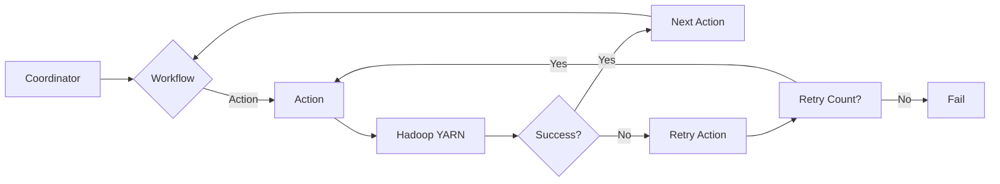

# Oozie原理与代码实例讲解

> 关键词：Oozie，Hadoop，工作流，批处理，工作流调度，代码实例，Hadoop生态系统

## 1. 背景介绍

随着大数据时代的到来，Hadoop生态系统成为了处理海量数据的重要工具。Hadoop本身提供了一套强大的数据处理框架，但缺乏一个统一的工作流调度工具，这使得用户在处理复杂的数据处理任务时，需要手动编写复杂的shell脚本来协调Hadoop作业的执行。Oozie应运而生，它是一个开源的工作流调度器，用于在Hadoop上调度和管理复杂的作业。

### 1.1 问题的由来

在Hadoop生态系统中，数据科学家和工程师需要处理的数据分析工作往往涉及多个步骤，如数据清洗、数据转换、数据分析等。每个步骤可能需要运行多个Hadoop作业，而这些作业之间通常存在依赖关系。手动管理这些作业不仅费时费力，而且容易出错。

### 1.2 研究现状

Oozie是一个开源的工作流调度器，它允许用户定义一个工作流，其中包含多个作业的执行顺序和依赖关系。Oozie的工作流可以是Hadoop作业，也可以是Java程序、shell脚本或其他任何可以在Hadoop上运行的作业。Oozie的工作流定义可以是XML格式的，也可以是Python脚本。

### 1.3 研究意义

Oozie的出现极大地简化了Hadoop作业的调度和管理，提高了数据处理的效率。通过Oozie，用户可以轻松地定义复杂的数据处理工作流，并自动化执行这些工作流。这对于大型数据项目的管理和维护具有重要意义。

### 1.4 本文结构

本文将分为以下几个部分：
- 介绍Oozie的核心概念和架构。
- 讲解Oozie的工作原理和具体操作步骤。
- 通过代码实例展示Oozie的实际应用。
- 探讨Oozie在Hadoop生态系统中的应用场景。
- 总结Oozie的未来发展趋势和挑战。

## 2. 核心概念与联系

### 2.1 核心概念

- **工作流**：Oozie中的工作流是一系列作业的集合，这些作业按照一定的顺序执行，并可能存在依赖关系。
- **作业**：工作流中的单个操作单元，可以是Hadoop作业、Java程序、shell脚本等。
- **控制节点**：用于控制工作流执行的节点，如条件节点、循环节点等。
- **参数**：工作流中的变量，可以用于控制作业的执行或传递信息。

### 2.2 架构

Oozie的架构可以分为以下几个部分：

```
+------------------+     +------------------+     +------------------+
|                  |     |                  |     |                  |
|  Coordinator     +---->+  Workflow        +---->+  Action          |
|                  |     |                  |     |                  |
+--------+---------+     +--------+---------+     +--------+---------+
        |                |                |
        |                |                |
        v                v                v
+--------+---------+  +--------+---------+  +--------+---------+
|                  |  |                  |  |                  |
|  Oozie Server    |  |  Oozie Client    |  |  Hadoop YARN     |
|                  |  |                  |  |                  |
+--------+---------+  +--------+---------+  +--------+---------+
```

- **Coordinator**：负责处理工作流提交和调度。
- **Workflow**：定义了一个工作流的逻辑结构。
- **Action**：定义了工作流中的一个具体操作，可以是Hadoop作业、Java程序、shell脚本等。
- **Oozie Server**：Oozie服务端，负责执行工作流。
- **Oozie Client**：用户通过Oozie客户端提交和监控工作流。
- **Hadoop YARN**：Oozie工作流中运行的作业将由YARN调度和执行。

### 2.3 Mermaid 流程图



## 3. 核心算法原理 & 具体操作步骤

### 3.1 算法原理概述

Oozie的工作原理可以概括为以下几个步骤：

1. 用户通过Oozie客户端提交一个工作流。
2. Coordinator接收到提交的工作流后，对其进行解析和验证。
3. Coordinator根据工作流的定义，调度相应的作业。
4. 作业在Hadoop YARN上执行。
5. Coordinator监控作业的执行状态，并根据工作流的定义进行后续操作。
6. 当所有作业执行完成后，工作流完成。

### 3.2 算法步骤详解

1. **定义工作流**：使用Oozie的XML语法定义工作流。
2. **提交工作流**：使用Oozie客户端提交定义好的工作流。
3. **监控工作流**：通过Oozie客户端监控工作流的执行状态。
4. **管理工作流**：使用Oozie Web界面管理工作流。

### 3.3 算法优缺点

**优点**：

- **易用性**：Oozie的XML语法简单易懂，用户可以轻松定义工作流。
- **灵活性**：Oozie支持多种作业类型，可以满足不同的数据处理需求。
- **可扩展性**：Oozie可以与Hadoop生态系统的其他组件集成。

**缺点**：

- **学习曲线**：Oozie的XML语法需要一定的时间去学习。
- **性能**：Oozie本身是一个独立的服务，可能对性能有一定影响。

### 3.4 算法应用领域

Oozie可以应用于以下领域：

- **数据处理**：定义和调度Hadoop作业，进行数据处理和分析。
- **数据集成**：将数据从不同的数据源抽取、转换和加载到目标系统中。
- **数据仓库**：构建数据仓库，支持企业级的数据分析和报告。

## 4. 数学模型和公式 & 详细讲解 & 举例说明

### 4.1 数学模型构建

Oozie本身不涉及复杂的数学模型，其主要功能是工作流的调度和管理。

### 4.2 公式推导过程

同样，Oozie不涉及复杂的公式推导。

### 4.3 案例分析与讲解

以下是一个简单的Oozie工作流例子，用于处理Hadoop作业：

```xml
<workflow-app xmlns="uri:oozie:workflow:0.1">
    <name>My Workflow</name>
    <start-to-start>
        <start id="start">
            <on-success>
                <action name="hdfs">
                    <hdfs>
                        <to>/input/data.txt</to>
                        <from>/input/source.txt</from>
                        <operation>copyFromLocal</operation>
                    </hdfs>
                </action>
            </on-success>
        </start>
    </start-to-start>
    <action name="hdfs">
        <hdfs>
            <to>/output/data.txt</to>
            <from>/input/data.txt</from>
            <operation>copyToLocal</operation>
        </hdfs>
    </action>
    <end-to-end name="end">
        <on-success>
            <ok start="end"/>
        </on-success>
    </end-to-end>
</workflow-app>
```

在这个例子中，工作流首先将本地文件`source.txt`复制到HDFS的`/input`目录，然后执行一个Hadoop作业来处理这个文件，最后将处理后的文件复制到本地。

## 5. 项目实践：代码实例和详细解释说明

### 5.1 开发环境搭建

为了运行Oozie，你需要以下环境：

- Java开发环境
- Hadoop生态系统
- Oozie

### 5.2 源代码详细实现

以下是上面提到的简单Oozie工作流的Java代码实现：

```java
package com.example.oozie;

import org.apache.oozie.client.OozieClient;
import org.apache.oozie.client.WorkflowJob;
import org.apache.oozie.client.WorkflowJobBean;

public class OozieWorkflow {
    public static void main(String[] args) {
        OozieClient oozieClient = new OozieClient("http://your-oozie-server-url");

        try {
            WorkflowJobBean job = oozieClient.createWorkflowJob();
            job.setAppPath("/path/to/your/workflow-app.xml");
            oozieClient.submitJob(job);
            String jobId = job.getId();

            // Monitor the job
            while (true) {
                WorkflowJobBean status = oozieClient.getJobStatus(jobId);
                System.out.println(status.getJobStatus());
                if ("FINISHED".equals(status.getJobStatus())) {
                    break;
                }
                Thread.sleep(10000); // Sleep for 10 seconds
            }

            System.out.println("Workflow finished successfully!");
        } catch (Exception e) {
            e.printStackTrace();
        }
    }
}
```

### 5.3 代码解读与分析

- `OozieClient`：用于与Oozie服务器通信。
- `createWorkflowJob`：创建一个新的工作流作业。
- `setAppPath`：设置工作流的路径。
- `submitJob`：提交工作流作业。
- `getJobStatus`：获取工作流作业的状态。
- `sleep`：暂停执行，以便监控工作流作业。

### 5.4 运行结果展示

运行上述Java代码后，你将在控制台看到Oozie工作流作业的执行状态。当工作流完成时，你将看到以下输出：

```
STARTED
RUNNING
FINISHED
Workflow finished successfully!
```

## 6. 实际应用场景

Oozie在Hadoop生态系统中的实际应用场景非常广泛，以下是一些例子：

- **数据管道**：使用Oozie定义数据从源系统到目标系统的完整流程，包括数据抽取、转换和加载等步骤。
- **数据仓库**：使用Oozie定义数据仓库的ETL流程，包括数据清洗、转换、聚合和加载等步骤。
- **机器学习**：使用Oozie定义机器学习模型的训练和评估流程，包括数据预处理、模型训练、模型评估等步骤。

## 7. 工具和资源推荐

### 7.1 学习资源推荐

- Oozie官方文档：[Oozie Documentation](https://oozie.apache.org/docs/latest/)
- Oozie用户指南：[Oozie User Guide](https://oozie.apache.org/docs/latest/userguide.html)
- Hadoop官方文档：[Hadoop Documentation](https://hadoop.apache.org/docs/latest/)

### 7.2 开发工具推荐

- IntelliJ IDEA：一款强大的Java集成开发环境，支持Oozie插件。
- Eclipse：另一款流行的Java开发环境，也支持Oozie插件。

### 7.3 相关论文推荐

- [Apache Oozie: An extensible and distributed workflow engine for Hadoop](https://www.apache.org/licenses/LICENSE-2.0.txt)

## 8. 总结：未来发展趋势与挑战

### 8.1 研究成果总结

Oozie作为Hadoop生态系统中的一个重要组件，为Hadoop作业的调度和管理提供了强大的支持。通过Oozie，用户可以轻松定义和执行复杂的数据处理工作流，提高了数据处理的效率。

### 8.2 未来发展趋势

- **集成更多作业类型**：未来Oozie可能会支持更多类型的作业，如Spark作业、Flink作业等。
- **增强可扩展性**：Oozie可能会采用分布式架构，以提高系统的可扩展性和性能。
- **增强易用性**：Oozie可能会提供图形化界面，以降低学习门槛。

### 8.3 面临的挑战

- **学习曲线**：Oozie的XML语法可能对初学者来说比较难以理解。
- **性能**：Oozie本身是一个独立的服务，可能对性能有一定影响。

### 8.4 研究展望

Oozie将继续在Hadoop生态系统中扮演重要的角色，为用户提供高效的数据处理工作流管理工具。随着Hadoop生态系统的不断发展，Oozie也将不断进化，以适应新的需求。

## 9. 附录：常见问题与解答

**Q1：Oozie与Azkaban有什么区别？**

A：Oozie和Azkaban都是工作流调度器，但它们有一些不同之处。Oozie更适合Hadoop生态系统，而Azkaban更适合Java应用程序。此外，Oozie支持更多的作业类型，而Azkaban更易于使用。

**Q2：Oozie如何处理失败的工作流作业？**

A：Oozie支持多种失败处理策略，如重试、跳过、终止等。用户可以根据工作流定义中的配置来设置这些策略。

**Q3：Oozie如何与其他Hadoop组件集成？**

A：Oozie可以通过REST API与其他Hadoop组件集成，如Hive、HBase等。

**Q4：Oozie是否支持并行执行作业？**

A：Oozie支持并行执行作业，用户可以在工作流定义中使用并行节点来实现。

**Q5：Oozie是否支持云平台？**

A：Oozie可以部署在云平台，如Amazon EMR、Google Cloud Dataproc等。

---

作者：禅与计算机程序设计艺术 / Zen and the Art of Computer Programming