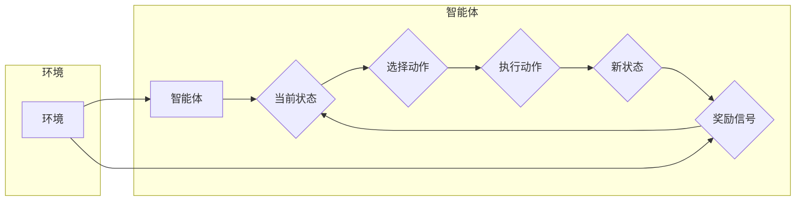

> 关键词：强化学习，游戏AI，Q-learning，深度强化学习，Python，游戏开发，人工智能，蒙特卡洛方法

# Python机器学习实战：强化学习在游戏AI中的实际应用

强化学习（Reinforcement Learning，RL）是机器学习的一个分支，它通过奖励信号和决策来训练智能体（Agent）在复杂环境中做出最优决策。近年来，随着深度学习技术的发展，深度强化学习（Deep Reinforcement Learning，DRL）在游戏AI领域的应用取得了显著的成果。本文将深入探讨强化学习在游戏AI中的实际应用，通过Python实战案例，展示如何使用强化学习技术构建智能的AI游戏玩家。

## 1. 背景介绍

### 1.1 游戏AI的挑战

游戏AI需要具备以下能力：

- **决策能力**：在游戏中根据当前状态做出正确的决策。
- **学习能力**：通过游戏经验不断优化决策策略。
- **适应性**：在不同游戏环境和规则下都能表现出色。
- **探索与利用**：在探索新策略的同时，有效利用已知策略。

强化学习为解决上述挑战提供了一种有效的框架。

### 1.2 强化学习简介

强化学习是一种使智能体在环境中学习如何做出最优决策的机器学习方法。它包含以下关键元素：

- **智能体（Agent）**：执行动作并从环境中获取奖励的学习实体。
- **环境（Environment）**：智能体行动的场所，提供状态、动作空间和奖励信号。
- **策略（Policy）**：智能体在给定状态下选择动作的规则。
- **价值函数（Value Function）**：估计在给定状态下采取某个动作的未来期望奖励。
- **模型（Model）**：智能体对环境的理解，包括状态空间、动作空间和奖励函数。

### 1.3 本文结构

本文将分为以下几个部分：

- 核心概念与联系
- 核心算法原理与具体操作步骤
- 数学模型与公式
- 项目实践
- 实际应用场景
- 工具和资源推荐
- 总结：未来发展趋势与挑战

## 2. 核心概念与联系

### 2.1 强化学习架构图



### 2.2 强化学习与其他机器学习方法的联系

- **监督学习**：强化学习和监督学习都是通过学习数据来进行预测或决策，但强化学习更加动态和交互式。
- **无监督学习**：无监督学习关注于从无标签数据中提取模式，而强化学习关注于从奖励信号中学习。
- **深度学习**：深度学习可以与强化学习结合，形成深度强化学习，通过神经网络来学习复杂的策略和价值函数。

## 3. 核心算法原理与具体操作步骤

### 3.1 算法原理概述

强化学习算法通过以下步骤进行：

1. 初始化智能体、环境和策略。
2. 智能体在环境中选择动作。
3. 环境根据动作提供新状态和奖励信号。
4. 智能体根据奖励信号更新策略。
5. 重复步骤2-4，直到达到终止条件。

### 3.2 算法步骤详解

1. **初始化**：选择合适的强化学习算法，如Q-learning、深度Q网络（DQN）或策略梯度方法。
2. **探索与利用**：智能体在环境中探索不同的动作，并利用已学到的知识进行决策。
3. **状态-动作值函数**：通过学习状态-动作值函数来评估不同动作的预期收益。
4. **策略迭代**：根据状态-动作值函数更新策略，选择最优动作。
5. **评估与优化**：评估智能体的性能，并优化策略以获得更好的结果。

### 3.3 算法优缺点

**Q-learning**：

- **优点**：实现简单，易于理解。
- **缺点**：收敛速度慢，易陷入局部最优。

**DQN**：

- **优点**：可以处理高维状态空间和动作空间。
- **缺点**：需要大量的探索和大量的计算资源。

**策略梯度方法**：

- **优点**：不需要显式地计算状态-动作值函数。
- **缺点**：对高维状态空间和动作空间的处理效果不佳。

### 3.4 算法应用领域

强化学习在游戏AI中的应用非常广泛，包括：

- **棋类游戏**：如国际象棋、围棋等。
- **平台游戏**：如Super Mario、Pac-Man等。
- **体育游戏**：如足球、篮球等。
- **模拟游戏**：如无人驾驶、机器人等。

## 4. 数学模型与公式

### 4.1 数学模型构建

强化学习的主要数学模型包括：

- **状态空间（State Space）**：所有可能状态集合，通常用 $S$ 表示。
- **动作空间（Action Space）**：所有可能动作集合，通常用 $A$ 表示。
- **奖励函数（Reward Function）**：描述智能体在每个状态获得的奖励，通常用 $R(s, a)$ 表示。
- **策略（Policy）**：智能体在给定状态下选择动作的规则，通常用 $\pi(a|s)$ 表示。

### 4.2 公式推导过程

**Q-learning**：

$$
Q(s, a) \leftarrow Q(s, a) + \alpha [R(s, a) + \gamma \max_{a'} Q(s', a') - Q(s, a)]
$$

其中，$Q(s, a)$ 为状态-动作值函数，$\alpha$ 为学习率，$\gamma$ 为折扣因子。

**DQN**：

$$
Q(s, a) \leftarrow Q(s, a) + \alpha [R(s, a) + \gamma \max_{a'} Q(s', a') - Q(s, a)]
$$

其中，$Q(s, a)$ 为状态-动作值函数，$\alpha$ 为学习率，$\gamma$ 为折扣因子。

### 4.3 案例分析与讲解

以DQN为例，解释其工作原理：

1. 初始化神经网络 $Q(s, a)$，用于估计状态-动作值函数。
2. 从初始状态 $s_0$ 开始，智能体选择动作 $a_0$。
3. 环境根据动作 $a_0$ 返回新状态 $s_1$ 和奖励 $R(s_0, a_0)$。
4. 将 $s_1$ 和 $R(s_0, a_0)$ 输入神经网络，得到 $Q(s_1, a_1)$ 的估计值。
5. 更新 $Q(s_0, a_0)$：
   $$
Q(s_0, a_0) \leftarrow Q(s_0, a_0) + \alpha [R(s_0, a_0) + \gamma \max_{a'} Q(s_1, a') - Q(s_0, a_0)]
$$
6. 重复步骤2-5，直到达到终止条件。

## 5. 项目实践：代码实例和详细解释说明

### 5.1 开发环境搭建

1. 安装Python环境（Python 3.6及以上）。
2. 安装TensorFlow或PyTorch等深度学习框架。
3. 安装OpenAI Gym环境，用于测试强化学习算法。

### 5.2 源代码详细实现

以下是一个使用DQN算法实现游戏AI的Python代码示例：

```python
import gym
import numpy as np
import tensorflow as tf

# 创建环境
env = gym.make("CartPole-v1")

# 创建DQN模型
class DQNNetwork(tf.keras.Model):
    def __init__(self, state_size, action_size):
        super(DQNNetwork, self).__init__()
        self.fc1 = tf.keras.layers.Dense(24, activation='relu')
        self.fc2 = tf.keras.layers.Dense(24, activation='relu')
        self.fc3 = tf.keras.layers.Dense(action_size, activation='linear')
    
    def call(self, x):
        x = self.fc1(x)
        x = self.fc2(x)
        return self.fc3(x)

# 创建DQN代理
class DQNAgent:
    def __init__(self, state_size, action_size):
        self.model = DQNNetwork(state_size, action_size)
        self.memory = []
        self.gamma = 0.95
        self.epsilon = 1.0
        self.epsilon_min = 0.01
        self.epsilon_decay = 0.995
        self.learning_rate = 0.001
        self.update_freq = 4
    
    def act(self, state):
        if np.random.rand() <= self.epsilon:
            return np.random.randint(0, self.model.output_size)
        act_values = self.model(state).numpy()
        return np.argmax(act_values[0])
    
    def replay(self, batch_size):
        minibatch = random.sample(self.memory, batch_size)
        for state, action, reward, next_state, done in minibatch:
            target = reward
            if not done:
                target = (reward + self.gamma * np.amax(self.model(next_state).numpy()))
            target_f = self.model(state)
            target_f[np.argmax(target_f)] = target
            self.model.fit(state, target_f, epochs=1, verbose=0)
    
    def remember(self, state, action, reward, next_state, done):
        self.memory.append((state, action, reward, next_state, done))
        if len(self.memory) > 5000:
            self.memory.pop(0)
    
    def update_epsilon(self):
        self.epsilon *= self.epsilon_decay
        self.epsilon = max(self.epsilon, self.epsilon_min)

# 实例化DQN代理
agent = DQNAgent(state_size=4, action_size=2)

# 训练DQN代理
episodes = 2000
for e in range(episodes):
    state = env.reset()
    state = np.reshape(state, (1, state_size))
    for time in range(500):
        action = agent.act(state)
        next_state, reward, done, _ = env.step(action)
        next_state = np.reshape(next_state, (1, state_size))
        agent.remember(state, action, reward, next_state, done)
        state = next_state
        if done:
            break
    agent.update_epsilon()
```

### 5.3 代码解读与分析

- `DQNNetwork` 类定义了DQN模型的神经网络结构。
- `DQNAgent` 类实现了DQN代理的接口，包括选择动作、记忆、回放和更新epsilon值等功能。
- 在训练过程中，代理通过与环境交互学习策略，并通过回放机制来优化策略。

### 5.4 运行结果展示

运行上述代码后，代理将在CartPole游戏中学习到稳定的策略，能够使游戏持续更长时间。

## 6. 实际应用场景

强化学习在游戏AI中的应用场景包括：

- **电子竞技**：如《星际争霸II》、《Dota 2》等。
- **在线游戏**：如《英雄联盟》、《王者荣耀》等。
- **模拟游戏**：如无人驾驶、机器人控制等。

## 7. 工具和资源推荐

### 7.1 学习资源推荐

- 《Reinforcement Learning: An Introduction》
- 《Reinforcement Learning: Policies, Values, and Models》
- 《Deep Reinforcement Learning for Games》

### 7.2 开发工具推荐

- OpenAI Gym：提供多种预定义游戏环境，方便进行强化学习实验。
- TensorFlow：开源的深度学习框架，支持强化学习算法的实现。
- PyTorch：开源的深度学习框架，具有灵活的动态计算图，适合强化学习研究。

### 7.3 相关论文推荐

- Deep Q-Networks (DQN)
- Human-Level Control through Deep Reinforcement Learning
- Asynchronous Methods for Deep Reinforcement Learning

## 8. 总结：未来发展趋势与挑战

### 8.1 研究成果总结

本文介绍了强化学习在游戏AI中的应用，通过Python实战案例展示了如何使用强化学习技术构建智能的AI游戏玩家。强化学习在游戏AI领域取得了显著的成果，为游戏开发提供了新的思路和可能性。

### 8.2 未来发展趋势

未来，强化学习在游戏AI领域的应用将呈现以下发展趋势：

- **更复杂的游戏环境**：随着强化学习算法的不断发展，智能体将能够适应更复杂的游戏环境，如多智能体游戏、多人游戏等。
- **更高效的算法**：新的强化学习算法将进一步提高学习效率，减少训练时间。
- **更灵活的架构**：结合深度学习、强化学习和其他人工智能技术，构建更灵活、可扩展的AI游戏架构。

### 8.3 面临的挑战

强化学习在游戏AI领域也面临着以下挑战：

- **收敛速度**：强化学习算法通常需要大量的训练时间才能收敛到稳定策略。
- **样本效率**：需要大量的样本来训练智能体，这在某些情况下可能难以实现。
- **可解释性**：强化学习算法的决策过程通常缺乏可解释性，难以理解智能体的行为。

### 8.4 研究展望

为了应对上述挑战，未来的研究需要在以下方面进行探索：

- **更高效的算法**：开发更高效的强化学习算法，提高学习效率和样本效率。
- **数据效率**：探索新的数据高效学习方法，减少对大量样本的依赖。
- **可解释性**：提高强化学习算法的可解释性，使其决策过程更加透明。

通过不断的研究和探索，相信强化学习将在游戏AI领域取得更大的突破，为游戏开发带来更多创新和可能性。

## 9. 附录：常见问题与解答

**Q1：强化学习在游戏AI中的应用有哪些优势？**

A：强化学习在游戏AI中的应用优势包括：

- 能够学习复杂的决策策略。
- 能够适应不同的游戏环境和规则。
- 能够从交互中学习，无需大量标注数据。
- 能够与其他人工智能技术结合，构建更强大的AI游戏玩家。

**Q2：如何评估强化学习模型的性能？**

A：评估强化学习模型的性能可以从以下几个方面进行：

- 学习效率：评估模型收敛到稳定策略所需的时间。
- 样本效率：评估模型在有限样本下的学习效果。
- 稳定性：评估模型在不同初始状态下的表现。
- 灵活性：评估模型在不同游戏环境和规则下的适应性。

**Q3：如何解决强化学习中的过拟合问题？**

A：解决强化学习中的过拟合问题可以采取以下措施：

- 使用正则化技术，如L2正则化。
- 使用数据增强技术，如经验回放。
- 使用早停机制，防止模型在验证集上过拟合。
- 使用不同的网络结构，避免过度依赖特定网络。

**Q4：如何解决强化学习中的样本效率问题？**

A：解决强化学习中的样本效率问题可以采取以下措施：

- 使用经验回放技术，重复使用已有经验。
- 使用迁移学习技术，利用预训练模型的知识。
- 使用多智能体强化学习技术，共享经验。
- 使用模拟环境，生成更多样本。

**Q5：如何提高强化学习算法的可解释性？**

A：提高强化学习算法的可解释性可以采取以下措施：

- 使用可解释的强化学习算法，如基于策略梯度方法。
- 使用可视化技术，如决策树、注意力机制等。
- 使用分析工具，如决策树、特征重要性等。
- 使用可解释的神经网络结构，如LSTM、GRU等。

通过解决这些常见问题，可以帮助开发者更好地理解和应用强化学习技术，为游戏AI的发展贡献力量。